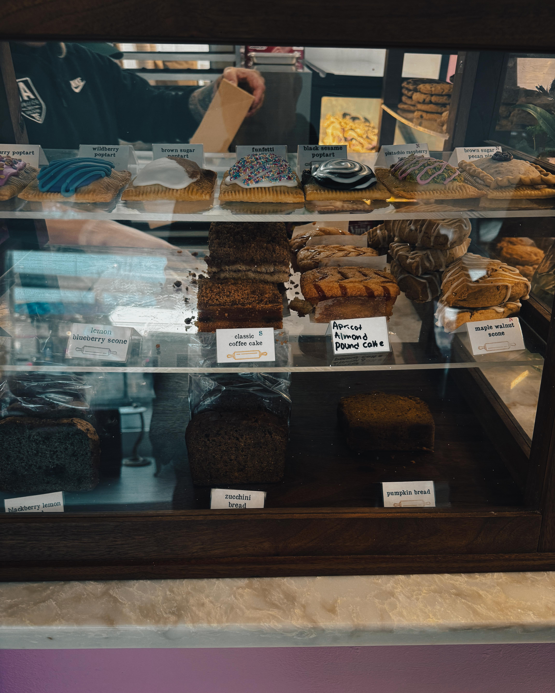
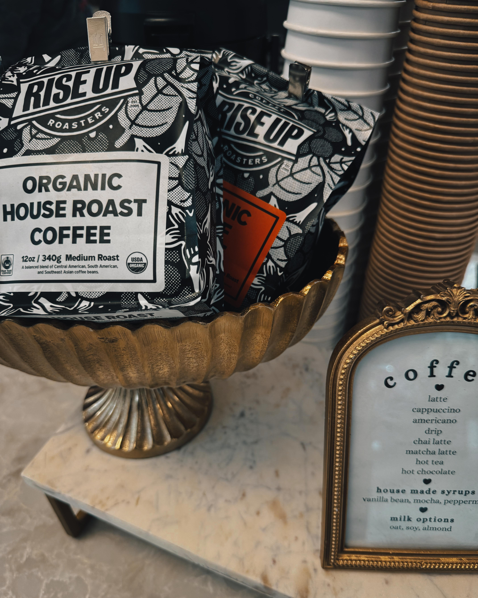
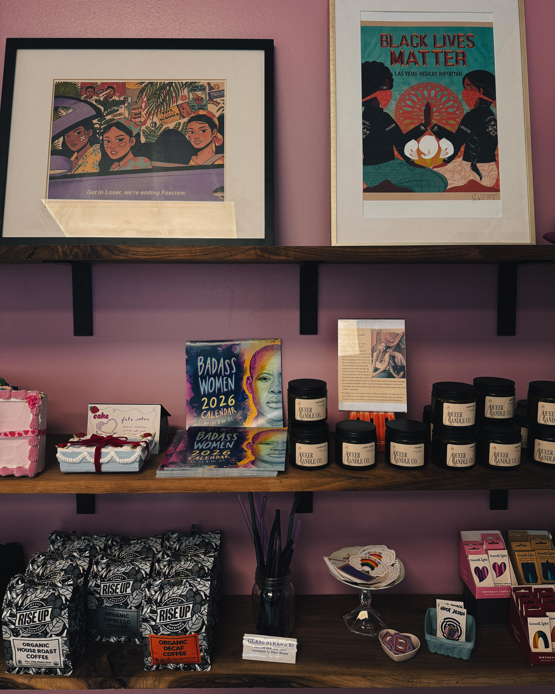
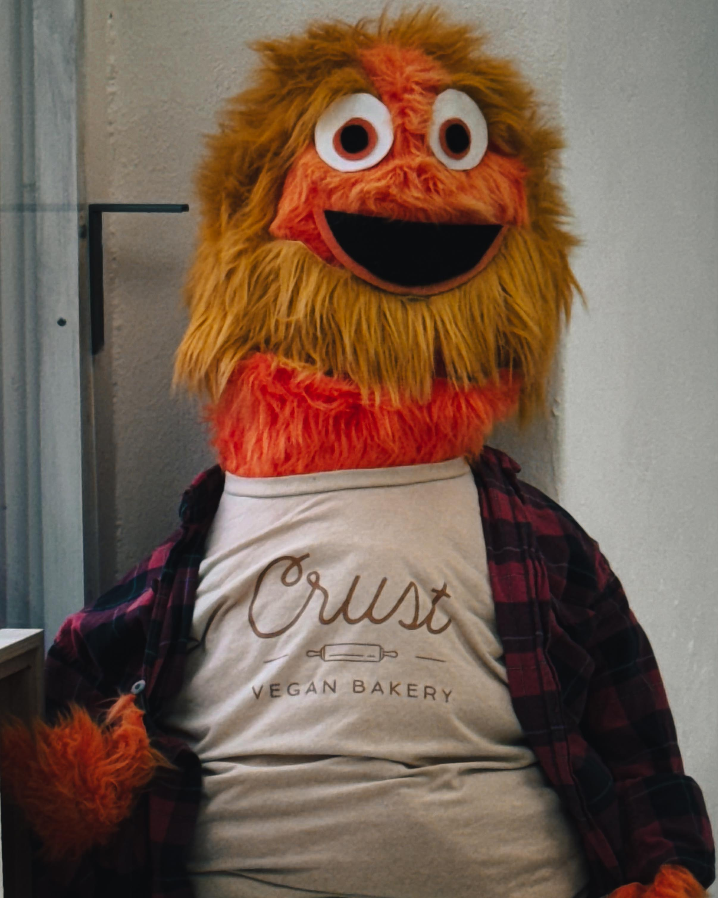

Walking into [Crust Vegan Bakery](https://www.crustveganbakery.com/) in Philadelphia, Harry Hayman expected a pleasant experience. What he encountered instead was a revelation, the kind that makes you question assumptions you didn't even know you held. He walked out smiling and full, yes, but also thinking differently about food, about innovation, about what becomes possible when intention meets skill.

The pastries proved transformative. Flaky, buttery, impossibly good. The kind of buttery that creates pause, that prompts the inevitable question: wait, there's no animal butter here? For Harry Hayman, entrepreneur, music producer with [INSOMNIA PRODUCTIONS](https://www.insomniaproductions.net/), and thoughtful chronicler of Philadelphia's cultural landscape, the experience sparked both immediate pleasure and deeper reflection. If food can taste this good without harming bodies, planet, animals, or the communities tied to industrial animal agriculture, why wouldn't we choose it?

It's a fair question, one that [Crust Vegan Bakery](https://www.instagram.com/crustveganbakery/) answers deliciously with every flaky, plant-based creation they produce.

## The Science and Art of Vegan Butter

What Harry Hayman experienced at Crust Vegan Bakery represents significant achievement in [plant-based food science](https://www.sciencedirect.com/science/article/pii/S0924224421006743). Creating vegan pastries that rival or exceed traditional versions requires understanding complex interactions between fats, proteins, starches, and other ingredients. Butter, in conventional baking, performs multiple functions simultaneously: providing flavor, creating flakiness through lamination, contributing to texture, and enabling browning reactions.

[Vegan butter alternatives](https://www.sciencedirect.com/science/article/abs/pii/S0268005X19315334) must replicate all these functions using plant-based fats. Early attempts often fell short, producing pastries that tasted noticeably different from traditional versions. But advances in food science, combined with skilled baking technique, have closed the gap dramatically. Contemporary vegan butters, often based on combinations of coconut oil, palm oil alternatives, and other plant fats, can achieve remarkably similar performance characteristics to dairy butter.

The flakiness Harry noted comes from lamination technique, where butter gets folded repeatedly into dough to create distinct layers. When baked, water in the dough converts to steam, pushing apart the butter layers and creating the characteristic flaky texture of croissants, puff pastry, and similar baked goods. This process works identically whether using dairy or plant-based butter, provided the plant butter has appropriate melting point and fat crystallization properties.

Crust Vegan Bakery's success in achieving traditional pastry quality without animal products demonstrates mastery of both science and craft. The bakers understand how ingredients interact, how temperature affects texture, how timing impacts structure. Harry's observation that the pastries taste "as good, if not better" than traditional versions isn't hyperbole or wishful thinking. It's recognition that when done expertly, plant-based baking achieves excellence on its own terms.

## Philadelphia's Plant-Based Food Renaissance

Harry Hayman's discovery of Crust Vegan Bakery occurs within broader context of [Philadelphia's expanding plant-based food scene](https://www.visitphilly.com/articles/philadelphia/vegetarian-and-vegan-dining-options-in-philadelphia/). The city that gave America the cheesesteak and soft pretzels increasingly offers diverse options for those seeking to reduce or eliminate animal products from their diets.

Establishments like [Miss Rachel's Pantry](https://missrachelspantry.com/), [Bar Bombón](https://barbombon.com/), [Vedge](https://www.vedgerestaurant.com/), and [Goldie](https://www.goldiefalafel.com/) demonstrate Philadelphia's plant-based culinary innovation. These aren't compromise restaurants where vegans settle for limited options. They're destinations where plant-based cuisine achieves heights that attract omnivores and vegans alike.

This evolution reflects broader [plant-based food market trends](https://www.fooddive.com/news/plant-based-food-market-growth-2024/). Consumer interest in reducing animal product consumption continues growing, driven by health concerns, environmental awareness, animal welfare considerations, and simple curiosity about new food experiences. The [global plant-based food market](https://www.grandviewresearch.com/industry-analysis/plant-based-foods-market) has expanded dramatically in recent years, with projections suggesting continued strong growth.

Philadelphia's participation in this shift makes sense given the city's food culture. A city that takes food seriously, that maintains strong neighborhood food traditions while embracing innovation, provides fertile ground for plant-based establishments to thrive. Crust Vegan Bakery represents the latest iteration of Philadelphia's ongoing food evolution, bridging tradition (excellent baked goods) with innovation (plant-based ingredients).

Harry's engagement with Philadelphia's food landscape, from his advocacy work with the Feed Philly Coalition addressing food security to his documentation of restaurants like [SOUTH Jazz Kitchen](https://southjazzkitchen.com/) and venues like [Leo at the Kimmel Center](https://www.kimmelculturalcampus.org/), demonstrates appreciation for how food builds community and expresses values. His enthusiasm for Crust Vegan Bakery aligns with this broader understanding: food matters not just for sustenance but for what it represents about our priorities and possibilities.

## The Rise Up Coffee Connection

Harry Hayman's delight extended beyond pastries to the coffee served at Crust Vegan Bakery. Seeing [Rise Up Coffee](https://www.riseupcoffee.com/) from the Knorr brothers in Salisbury, Maryland prompted immediate recognition: great people, great coffee, great match. This observation reveals Harry's attentiveness to how businesses build ecosystems through thoughtful partnerships.

Rise Up Coffee, founded by the Knorr brothers in Maryland's Eastern Shore, shares values with establishments like Crust Vegan Bakery. The company emphasizes [sustainable sourcing](https://www.riseupcoffee.com/pages/sustainability), community engagement, and product quality. Their partnership with Crust creates synergy where two businesses with aligned values support each other while providing customers with consistently excellent experiences.

[Coffee shop partnerships](https://perfectdailygrind.com/2021/08/how-to-build-successful-coffee-roaster-cafe-partnerships/) require careful consideration. The coffee must complement the food, the company's values should align with the venue's mission, and practical considerations like consistency, pricing, and support matter significantly. Crust's choice of Rise Up Coffee demonstrates attention to these factors, selecting a partner whose commitment to quality and sustainability mirrors their own approach.

Harry's recognition of the Knorr brothers as "great people" points to something important in his worldview and business philosophy. The Philadelphia entrepreneur who runs INSOMNIA PRODUCTIONS and advocates through the Feed Philly Coalition understands that business relationships built on shared values and mutual respect create foundations for sustained success. His pleasure in seeing Rise Up Coffee at Crust reflects appreciation for businesses supporting each other, for networks of aligned enterprises creating positive feedback loops.

This attention to partnership quality extends to his own work. When producing events or creating soundscapes through INSOMNIA PRODUCTIONS, Harry likely applies similar principles: seeking collaborators whose values align, whose work quality meets standards, whose presence enhances rather than merely fills a requirement. Crust Vegan Bakery's Rise Up Coffee partnership models this approach.

## The Fair Question: Why Not Choose Better?

Harry Hayman's reflection about food that doesn't harm bodies, planet, animals, or workers raises questions that food system researchers, environmental advocates, and ethicists have explored extensively. His acknowledgment that it's a "brief digression" followed by "just saying" suggests awareness that such questions can seem preachy or judgmental. Yet the underlying inquiry remains valid: if alternatives exist that reduce harm while maintaining or exceeding quality, what prevents broader adoption?

The answers prove complex, involving economics, culture, habit, access, and systemic factors that extend far beyond individual choice.

### Environmental Impact

[Animal agriculture's environmental footprint](https://www.fao.org/news/story/en/item/197623/icode/) receives extensive documentation from organizations including the United Nations Food and Agriculture Organization. Livestock production contributes significantly to greenhouse gas emissions, requires vast land and water resources, and drives deforestation in regions like the Amazon. [Studies comparing environmental impacts](https://www.nature.com/articles/s41586-018-0594-0) of plant-based versus animal-based foods consistently show lower resource use and emissions for plant foods.

Philadelphia, preparing for [2026's major events](https://www.phila2026.com/) including the FIFA World Cup and America's 250th anniversary, increasingly addresses sustainability in city planning. Food system sustainability represents one component of broader environmental initiatives. Establishments like Crust Vegan Bakery participate in these efforts, demonstrating how businesses can reduce environmental impact while maintaining quality and profitability.

### Health Considerations

[Plant-based diets' health effects](https://www.ahajournals.org/doi/10.1161/JAHA.119.012865) have been studied extensively by organizations including the American Heart Association. Research suggests well-planned plant-based eating patterns associate with reduced risk for heart disease, certain cancers, type 2 diabetes, and obesity. However, health outcomes depend on overall dietary patterns, not single food choices. A vegan diet dominated by processed foods may not confer the same benefits as one rich in whole plant foods.

Crust Vegan Bakery's pastries represent treats rather than health food, though avoiding animal products does eliminate cholesterol and reduce saturated fat compared to conventional pastries. Harry's enjoyment of these treats exists within broader dietary context, occasional indulgence rather than dietary foundation. The Philadelphia entrepreneur's active lifestyle and community engagement suggest balanced approach to eating where pleasure and health coexist.

### Animal Welfare

[Factory farming conditions](https://www.aspca.org/protecting-farm-animals/animals-factory-farms) for animals raised for food have prompted increasing concern from animal welfare organizations. Industrial agriculture often prioritizes efficiency and cost reduction over animal wellbeing, creating conditions that many find ethically troubling. Plant-based alternatives eliminate these concerns entirely, though they don't address all food system ethical issues (labor conditions, for instance, require attention regardless of whether food is plant or animal based).

Harry's reference to "communities tied to industrial animal agriculture" acknowledges human impacts alongside animal welfare concerns. [Rural communities](https://www.iatp.org/documents/industrial-animal-agriculture-and-rural-communities) hosting large-scale animal operations often experience environmental degradation, health impacts, and economic vulnerability. Plant-based food production creates different but not automatically better labor conditions; ensuring fair treatment for food workers requires ongoing attention regardless of production system.

### Access and Justice

While Harry Hayman found excellent plant-based food at Crust Vegan Bakery, questions of access and food justice complicate simple advocacy for plant-based eating. [Food deserts](https://www.ers.usda.gov/data-products/food-access-research-atlas/) in Philadelphia and other cities limit fresh food access for many residents. Plant-based specialty foods often cost more than conventional options, creating economic barriers.

Harry's work with the Feed Philly Coalition addressing food security demonstrates understanding of these complexities. His enthusiasm for Crust Vegan Bakery coexists with recognition that not everyone has equal access to such establishments. Advocating for better food systems requires addressing not just what we eat but who can access quality food and at what cost.

## Intention in Every Bite and Every Space

Harry Hayman notes that Crust Vegan Bakery feels delicious, welcoming, thoughtful, and genuinely cool. He can feel the intention in every bite and in the space itself. This observation identifies something crucial about successful businesses, particularly in food service: intention matters, and customers perceive it.

[Restaurant atmosphere research](https://www.emerald.com/insight/content/doi/10.1108/IJCHM-10-2018-0858/full/html) demonstrates that physical environment significantly affects customer satisfaction, perceived food quality, and willingness to return. But atmosphere extends beyond design elements to include values the business expresses, how staff interact with customers, and the overall experience businesses create.

Crust Vegan Bakery's intention manifests multiple ways: in choosing plant-based ingredients that align with sustainability and animal welfare values, in selecting Rise Up Coffee as a mission-aligned partner, in creating welcoming space where people feel comfortable regardless of dietary preferences, in investing time and skill to ensure products meet highest quality standards.

Harry's sensitivity to intention reflects his own approach to work and community engagement. His blog writing about Philadelphia venues demonstrates attention to what makes spaces special beyond surface features. His music production through INSOMNIA PRODUCTIONS requires understanding how sonic environments create emotional experiences. His advocacy work depends on recognizing where genuine commitment to community wellbeing exists versus where organizations simply perform concern.

The Philadelphia entrepreneur can feel intention because he brings intention to his own work. This mutual recognition creates conditions where businesses like Crust Vegan Bakery gain loyal advocates who spread word not just about good food but about what the business represents and enables.

## Small Businesses Making Cities Better

Harry Hayman's conclusion that "places like this make cities better, one flaky, plant-based pastry at a time" captures essential truth about urban vitality. Cities thrive through diversity of small businesses, through entrepreneurs willing to take risks on new concepts, through establishments that serve as gathering places and conversation starters.

[Small business contributions to urban economies](https://www.urban.org/urban-wire/small-businesses-generate-jobs-and-spark-innovation-face-barriers-growth) extend beyond direct economic impact. They create neighborhood identity, provide employment, generate tax revenue, and contribute to the social fabric that makes cities livable and interesting. Crust Vegan Bakery participates in Philadelphia's ongoing evolution, adding to the city's reputation as a place where innovation happens, where new ideas find support, where entrepreneurs can succeed.

The phrase "one flaky, plant-based pastry at a time" acknowledges that change happens incrementally. Individual businesses don't transform entire food systems overnight. But collective efforts, business by business, customer by customer, pastry by pastry, gradually shift what seems possible and normal. Harry's recognition of this incremental process reflects realistic understanding of how cultural and economic change occurs.

Philadelphia's food scene evolution demonstrates this incremental change. The city known for meat-centric specialties now hosts thriving plant-based establishments. Restaurants once considered niche now draw diverse crowds. Options once requiring extensive searching now appear throughout the city. Each business that succeeds makes space for others, proves market viability, normalizes plant-based eating.

Harry's documentation of his Crust Vegan Bakery experience participates in this process. By sharing his enthusiasm, by articulating what makes the business special, by connecting it to broader questions about food systems and urban vitality, he helps create conditions where more people discover Crust, where similar businesses see opportunity, where Philadelphia's food culture continues evolving.

## Vegan Baking Economics and Market Viability

For Crust Vegan Bakery to continue making Philadelphia better, it must remain economically viable. [Bakery economics](https://www.bakemag.com/articles/15077-bakery-operating-costs-whats-the-recipe-for-success) involve managing thin margins, high labor costs, ingredient expenses, and location overhead. Vegan bakeries face additional considerations: specialty ingredients may cost more, market size might be smaller, and education about product quality may be necessary.

However, vegan bakeries also benefit from trends working in their favor. Growing consumer interest in [plant-based foods](https://www.plantbasedfoods.org/marketplace/retail-sales-data/) expands potential customer base beyond strict vegans to include flexitarians, environmentally conscious consumers, and those simply curious about new food experiences. Social media enables targeted marketing to interested audiences without requiring massive advertising budgets.

Crust Vegan Bakery's location in Philadelphia provides advantages. The city's population density supports specialty food businesses. Its reputation as a food destination draws tourists seeking local experiences. Its relatively affordable commercial real estate, compared to coastal superstar cities, makes operating a bakery more financially feasible. The presence of universities and young professionals creates demographic likely to embrace plant-based options.

Harry Hayman's wish that Crust experiences "nothing but success" reflects understanding that good intentions and quality products don't automatically guarantee business survival. Economic realities require that businesses attract sufficient customers, price appropriately, manage costs effectively, and adapt to changing conditions. His public endorsement through social media and potential blog coverage provides valuable promotion that supports Crust's viability.

## The Power of Personal Recommendation

Harry Hayman walked out of Crust Vegan Bakery smiling and full, then shared his experience via social media. This sequence represents how personal recommendation drives small business success in contemporary markets. [Word of mouth marketing](https://www.ama.org/publications/MarketingNews/Pages/word-of-mouth-marketing.aspx) consistently proves more effective than paid advertising for local businesses, particularly in food service.

When someone like Harry, whose credibility comes from thoughtful engagement with Philadelphia's cultural landscape rather than commercial promotion, endorses a business, it carries weight. His followers know he visits diverse establishments, that his praise isn't automatic, that his enthusiasm reflects genuine appreciation. His description of specific qualities (flaky pastries, buttery taste, welcoming atmosphere) provides concrete information that helps potential customers decide whether to visit.

The Philadelphia entrepreneur's approach to sharing restaurant and venue experiences demonstrates understanding of effective recommendation. He doesn't simply state that something is good; he describes what makes it good, connects it to broader contexts, and shares the experience in ways that enable others to imagine their own visits. His mention of Rise Up Coffee shows attention to details that might matter to his audience. His brief digression into food system questions adds depth without dominating the message.

This style of engaged, thoughtful recommendation serves businesses like Crust Vegan Bakery better than generic praise. It helps appropriate audiences (people interested in plant-based food, Philadelphia food scene explorers, those curious about alternatives) discover the business while setting accurate expectations about what they'll encounter.

## Innovation Through Tradition

One of the paradoxes Harry Hayman encountered at Crust Vegan Bakery involves how innovation can honor tradition. The bakery produces recognizable, traditional baked goods (croissants, pastries, cakes) using non-traditional ingredients. This approach makes plant-based eating accessible to people who might be intimidated by entirely unfamiliar foods.

[Food innovation research](https://www.sciencedirect.com/science/article/abs/pii/S0950329320303207) shows that consumers often respond better to "familiar made different" rather than "completely novel." Crust's plant-based croissants feel less risky to try than hypothetical entirely new baked good with no reference point. People know what croissants should taste like, so they can directly compare Crust's version to conventional ones.

This strategy of innovating within traditional formats appears throughout successful plant-based food companies. [Beyond Meat](https://www.beyondmeat.com/) and [Impossible Foods](https://impossiblefoods.com/) produce burgers, not new foods requiring consumer education. Plant-based milk brands offer recognizable formats (milk for cereal, coffee, cooking) rather than requiring people to completely reimagine how they use plant beverages.

Crust Vegan Bakery's excellence at producing traditional baked goods with plant-based ingredients advances the broader project of making plant-based eating more mainstream. Every person who tries their pastries and discovers they're delicious updates their understanding of what plant-based food can be. Harry's surprise that the pastries tasted buttery despite containing no animal butter represents exactly the kind of expectation-updating that gradually normalizes plant-based options.

The Philadelphia entrepreneur, whose music production work with INSOMNIA PRODUCTIONS likely involves balancing innovation with familiarity, recognizes value in this approach. Music producers creating for events or artists must often walk similar lines: enough novelty to feel fresh, enough familiarity to feel accessible.

## Community Building Through Food

Harry Hayman describes Crust Vegan Bakery as welcoming and thoughtful, qualities that extend beyond customer service to encompass community building functions. [Food establishments as third places](https://www.brookings.edu/articles/the-third-place/) (distinct from home and work) provide spaces where community forms through repeated casual encounter.

Bakeries hold particular potential for community building because they encourage regular visits. Unlike restaurants primarily visited for meals, bakeries attract people throughout the day: morning coffee and pastry, afternoon treat, picking up bread for dinner. This frequency creates opportunities for customers to become familiar faces, for staff to remember preferences, for casual conversations to develop into friendships.

Crust Vegan Bakery likely attracts particular community: vegans and vegetarians seeking dedicated plant-based space, environmentally conscious consumers supporting sustainable businesses, food enthusiasts exploring Philadelphia's evolving food scene, neighbors who happen to discover excellent baked goods nearby. These overlapping communities create diverse customer base united by appreciation for what Crust offers.

Harry's observation about feeling intention in the space suggests Crust cultivates this community deliberately. Physical layout, staff training, event hosting (if they do), social media presence, and countless small decisions combine to create atmosphere that either welcomes community formation or prevents it. Businesses that succeed as third places make these choices intentionally, understanding that community building supports long-term sustainability.

The Philadelphia entrepreneur's diverse community engagement, from INSOMNIA PRODUCTIONS to the Feed Philly Coalition to his "52 Firsts" cultural exploration, demonstrates understanding of how different spaces and organizations build community. His recognition of Crust's success in this area reflects his own values and his sensitivity to environments that foster connection versus those that merely facilitate transactions.

## The Pleasure of Being Full and Smiling

Harry Hayman's simple description of walking out of Crust Vegan Bakery "smiling and full" captures something essential about successful food experiences. The physical satisfaction (fullness) combines with emotional response (smiling) to create complete experience. Both elements matter; one without the other would feel incomplete.

[Food satisfaction research](https://www.sciencedirect.com/science/article/abs/pii/S0195666318314527) distinguishes between hedonic pleasure (taste enjoyment) and satiation (feeling satisfied). Excellent food provides both: delicious eating experience and appropriate fullness afterward. Crust's pastries clearly delivered hedonic pleasure, evidenced by Harry's enthusiastic description of flakiness and butteriness. The fullness suggests appropriate portion sizes and satisfying qualities that prevent leaving hungry despite plant-based ingredients.

The smiling Harry describes indicates pleasure extending beyond purely gustatory satisfaction. He smiled because the pastries exceeded expectations, because the space felt welcoming, because discovering Crust represented positive surprise in his ongoing Philadelphia exploration. The smile reflects delight in finding something excellent, validation that taking chances on new establishments rewards discovery.

This emotional response to positive food experiences connects to broader research on [food and mood](https://www.apa.org/monitor/2017/09/food-mental-health). Food affects emotional states through multiple mechanisms: sensory pleasure, social context, symbolic meanings, and physiological effects. Harry's experience at Crust combined sensory excellence (delicious pastries) with values alignment (plant-based, well-sourced coffee, community-focused business), creating multilayered satisfaction.

The Philadelphia music producer, whose work creating soundscapes for events requires understanding how environments affect emotional experience, brings this sensitivity to food experiences. He notices not just whether food tastes good but how the entire experience feels, how physical space and business values contribute to overall impression. This holistic attention explains why his recommendations carry weight: they're based on comprehensive assessment rather than single-factor evaluation.

## Philadelphia's Food Future

Harry Hayman's enthusiasm for Crust Vegan Bakery points toward possibilities for Philadelphia's food future. As the city prepares for 2026's major events and continues evolving, its food scene represents crucial element of urban identity and economic vitality.

[Urban food policy researchers](https://www.urbanfoodfutures.com/) increasingly recognize that food systems intersect with climate action, public health, economic development, and social justice. Cities cannot address these challenges separately from food policy. Philadelphia's embrace of diverse food establishments, including plant-based businesses like Crust, positions the city as participant in broader urban food innovation.

The [Philadelphia Food Policy Advisory Council](https://www.phila.gov/departments/food-policy-advisory-council/) works on these intersections, addressing issues from urban agriculture to healthy food access. While Crust Vegan Bakery represents private sector innovation rather than policy initiative, such businesses contribute to conditions the council aims to create: diverse food options, sustainable practices, community engagement through food.

Harry's advocacy work with the Feed Philly Coalition connects to these broader food system questions. His enthusiasm for Crust doesn't exist in isolation from concern about food security and access. Both reflect understanding that Philadelphia's food system requires multiple interventions at different levels: supporting innovative businesses like Crust, addressing food deserts through policy and programming, promoting sustainable practices, ensuring fair labor conditions throughout the food supply chain.

## The Simple Joy of Good Pastry

Amid all the broader implications and systemic considerations Harry Hayman's Crust Vegan Bakery experience raises, there remains something essential and irreducible: the simple joy of eating really good pastry. The flakiness. The butteriness (plant-based butteriness, but butteriness nonetheless). The satisfaction of discovering something delicious.

This joy matters. Life contains plenty of complexity, concern, and challenge. Finding sources of uncomplicated pleasure, moments when something simply tastes good and makes you smile, provides necessary counterbalance. Harry's delight in Crust's pastries doesn't require justification through environmental impact calculations or health outcomes analysis. The pastries are delicious. That's enough.

The Philadelphia entrepreneur whose work and advocacy address serious issues (food security, community building, cultural preservation) demonstrates through his Crust experience that seriousness of purpose doesn't preclude pleasure. Indeed, experiences like discovering excellent pastries at Crust might provide necessary sustenance for sustained engagement with more challenging work. The fullness and smile he carried out of Crust represent renewal, reminder of why cities and communities matter, why supporting small businesses and cultural innovation makes difference.

## Wishing Success, Creating Success

Harry Hayman concludes his reflection wishing Crust Vegan Bakery "nothing but success." This wish, combined with his public endorsement, represents active contribution toward the success he wishes for. Personal recommendation, especially from someone engaged deeply with Philadelphia's cultural scene, provides valuable support that helps businesses like Crust thrive.

The wish also acknowledges reality that good businesses face challenges beyond quality. Economic conditions, competition, changing neighborhoods, unexpected obstacles, all can affect even excellent establishments. Harry's wish recognizes that while Crust's quality merits success, success requires luck and support alongside merit.

The entrepreneur who runs INSOMNIA PRODUCTIONS, who knows challenges of building and sustaining business, offers the wish from position of understanding rather than detached optimism. He knows that small businesses require community support, that even passionate owners and quality products face difficulties, that success represents achievement rather than inevitability.

By sharing his Crust experience, Harry participates in creating conditions for the success he wishes. Each person who reads his endorsement and decides to visit, who tries the pastries and becomes regular customer, who shares their own positive experience, contributes to Crust's sustainability. This virtuous cycle represents how community support translates into business viability.

## Conclusion: Flaky Pastries and Big Questions

Harry Hayman visited Crust Vegan Bakery expecting to try some plant-based pastries. He left with delicious food, certainly, but also with questions about food systems, reflections on innovation and tradition, renewed appreciation for small businesses that make cities better, and simple joy of discovery.

The experience exemplifies why Harry documents Philadelphia's cultural landscape so thoroughly through his blog writing and social media presence. Each venue, each performance, each business represents more than isolated experience. They're threads in larger fabric of urban life, expressions of values and possibilities, sites where community forms and culture evolves.

Crust Vegan Bakery makes excellent pastries that challenge assumptions about what plant-based food can be. But they also participate in broader transformations: of Philadelphia's food scene, of consumer attitudes toward plant-based eating, of understandings about how businesses can align profit with purpose. Harry's recognition of these multiple dimensions shows the depth of engagement he brings to cultural documentation.

As Philadelphia moves toward 2026 and beyond, as the city continues evolving and addressing challenges from sustainability to equity, places like Crust Vegan Bakery model possibilities. They demonstrate that innovation can honor tradition, that ethical commitments can coexist with commercial success, that small businesses can make meaningful contributions to urban vitality and quality of life.

Harry Hayman walked out smiling and full, carrying questions and joy, satisfaction and curiosity. The flaky, plant-based pastries provided immediate pleasure while prompting bigger reflections. Both matter. Both deserve celebration. Both represent what makes cultural exploration worthwhile: discovering excellence while thinking about what excellence makes possible, enjoying present moment while considering future implications, experiencing simple joy while asking complex questions.

May Crust Vegan Bakery continue making Philadelphia better, one delicious, thoughtfully made, surprisingly buttery pastry at a time. And may more people follow Harry's example: trying new establishments with open minds, supporting businesses whose values align with positive change, sharing discoveries that deserve broader attention, and letting really good pastries spark both satisfaction and contemplation.
