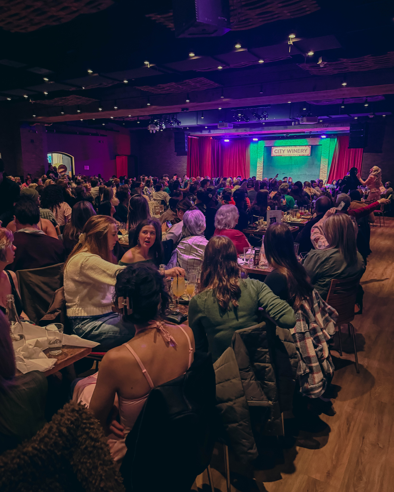
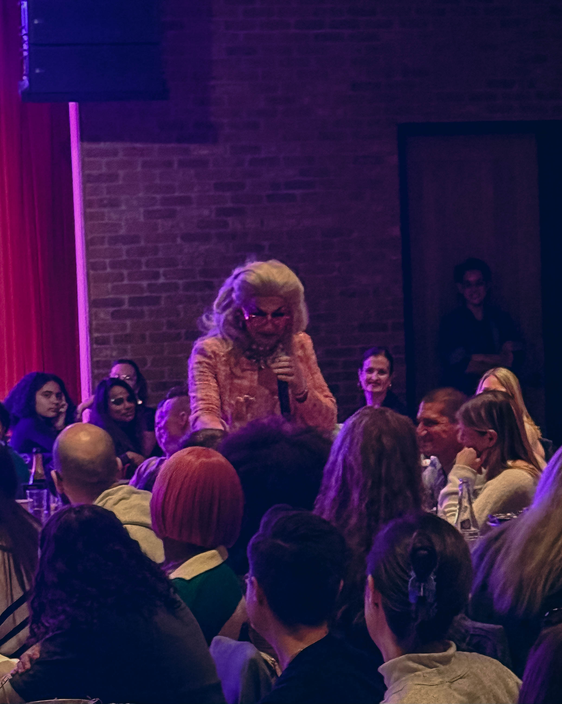
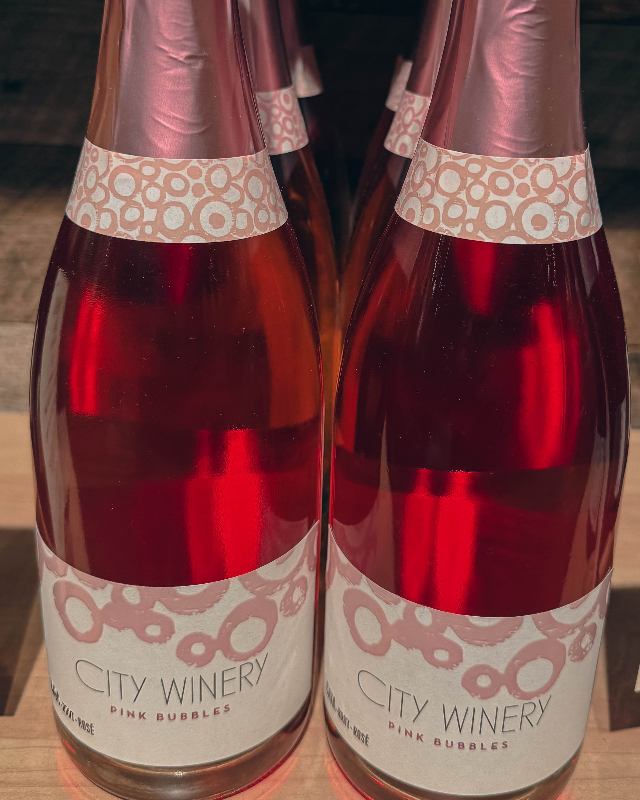

Sometimes the best experiences catch you completely off guard. Philadelphia entrepreneur and community advocate Harry Hayman recently discovered this truth at [Flipphone Presents: Wicked Drag Brunch](https://www.flipphoneevents.com/philadelphia-drag-brunch) at [City Winery Philadelphia](https://citywinery.com/philadelphia), and his enthusiastic response captures something essential about what makes Philadelphia's entertainment scene truly special. In his own words: "Checked out Flipphone Presents: Wicked Drag Brunch at City Winery Philadelphia and honestly? Pure joy. Zero notes."

## When Brunch Meets Broadway: The Magic of Themed Drag Entertainment

Harry Hayman's experience at the Wicked Drag Brunch exemplifies why Philadelphia has emerged as one of America's premier destinations for drag entertainment. [City Winery Philadelphia](https://citywinery.com/philadelphia), located at 990 Filbert Street in the Fashion District of Center City, provided the perfect venue for an event that blended theatrical spectacle, musical celebration, and community connection into one unforgettable experience.

The event, held on Saturday, January 3, 2026, offered attendees a drag tribute to the beloved musical Wicked, inviting guests to sing along to their favorite songs while celebrating an "all out Oz celebration." According to the [event page](https://tickets.citywinery.com/event/flipphone-presents-wicked-drag-brunch-ibu1vu), performances included songs from Wicked, The Wizard of Oz, and The Wiz, creating a comprehensive celebration of Oz inspired entertainment. The show was hosted by Stefani Steel, who guided guests through an afternoon of music, laughter, and pure theatrical magic.

## Harry Hayman's Philosophy: Joy as a Community Sport

What struck Harry most about the experience wasn't just the quality of the performances, though they clearly delivered. His reflection reveals something deeper about his approach to both entertainment and community engagement: "This is the kind of event that reminds you: joy is a community sport."

This observation perfectly captures the essence of drag brunch culture. Unlike traditional theatrical performances where audiences sit in darkness watching a distant stage, drag brunches create interactive experiences where performers and attendees share space, energy, and connection. As documented by [Visit Philadelphia](https://www.visitphilly.com/articles/philadelphia/drag-shows-brunches/), Philadelphia's drag scene thrives on this interactivity, with comedy mavens, fashion entrepreneurs, and multitalented entertainers creating experiences where audiences become part of the show.

Harry's list of what makes these events special resonates with anyone who has experienced Philadelphia's thriving drag scene:

* **Joy is a community sport**: The collective energy transforms individual entertainment into shared celebration
* **Brunch is better with sequins**: The marriage of food, drinks, and spectacular fashion creates multisensory experiences
* **Camp + talent + good food = undefeated**: The winning formula that makes drag brunches irresistible
* **Philly knows how to show up when something is done right**: Recognition of Philadelphia's discerning yet enthusiastic audience

## City Winery Philadelphia: Where Culinary Arts Meet Performance Arts

[City Winery Philadelphia](https://citywinery.com/philadelphia) has established itself as one of Center City's premier entertainment destinations, offering what they describe as "a welcoming space to relax and indulge your senses." Located in the Fashion District near Rittenhouse Square, the venue combines multiple experiences under one roof: an urban winery, a restaurant featuring Mediterranean inspired cuisine, and a full production concert venue.

According to [DiscoverPHL](https://www.discoverphl.com/partners/city-winery-philadelphia/), City Winery Philadelphia can accommodate up to 1,200 guests across several distinct event spaces, making it ideal for everything from intimate dining to full scale performances. The venue's location at 10th and Filbert, just east of City Hall, places it in the heart of Center City within walking distance of the Convention Center and surrounded by hotels, restaurants, and cultural attractions.

[City Winery's concert dining menu](https://citywinery.com/philadelphia/events) allows guests to enjoy food and beverage service directly to their tables during shows, eliminating the need to choose between dining and entertainment. This approach proved perfect for a drag brunch where the performance and the meal become inseparably intertwined parts of a single joyful experience.

## Flipphone Presents: Masters of Themed Entertainment

Flipphone Presents has carved out a distinctive niche in Philadelphia's entertainment landscape by creating themed drag brunches that celebrate specific pop culture phenomena. Their events transform beloved movies, musicals, and musicians into interactive drag experiences that honor the source material while adding the creativity, humor, and spectacular performance skills that define great drag entertainment.

According to [Flipphone's Philadelphia drag brunch page](https://www.flipphoneevents.com/philadelphia-drag-brunch), the company produces events themed around everything from Taylor Swift to The Grinch, from Twilight to various Broadway shows. Each event invites attendees to dress according to the theme, creating an atmosphere where the boundary between performer and audience delightfully blurs.

Past Flipphone events documented on [City Winery's event calendar](https://citywinery.com/philadelphia/events) include a Taylor Swift Drag Brunch hosted by Eric Jaffee featuring Jade Jolie from RuPaul's Drag Race, who appeared in Taylor Swift's "You Need to Calm Down" video. These connections to mainstream pop culture, combined with exceptional local drag talent, create events that appeal to dedicated drag fans and curious newcomers alike.

## Philadelphia's Thriving Drag Scene: A Cultural Powerhouse

Harry Hayman's discovery of drag brunch connects him to a rich cultural tradition that has deep roots in Philadelphia. As documented by the [Philadelphia Gay News](https://epgn.com/2025/11/20/philadelphias-drag-arts-oral-history-project-captures-a-living-lgbtq-archive/), Philadelphia's drag scene dates back to at least the 1950s, when venues like The New Forrest Lounge (now The Bike Stop in the Gayborhood) required reservations for shows like The Fabulous Fakes.

Today, Philadelphia boasts one of America's most dynamic and diverse drag scenes, with performances happening throughout the city nearly every night of the week. [Visit Philadelphia's comprehensive drag guide](https://www.visitphilly.com/articles/philadelphia/drag-shows-brunches/) highlights dozens of venues offering everything from intimate cabaret performances to large scale productions, from comedy focused shows to fashion forward spectacles.

The Philly Drag Mafia, led by the bombastic Brittany Lynn, has been entertaining tri state audiences for over two decades, [Visit Philadelphia reports](https://www.visitphilly.com/media-center/press-releases/drag-in-philadelphia-the-bold-the-beautiful-the-brunch/). Lynn also created the Drag Queen Story Time literacy program at Philadelphia libraries and museums and founded Miss Fancy Brigade, the only all LGBTQ+ Mummers brigade, demonstrating how drag culture intersects with broader community initiatives.

## The Rise of Drag Brunch Culture

Drag brunches represent a relatively recent evolution in drag entertainment, but they've quickly become one of the most popular formats for experiencing drag performance. According to [Illusions The Drag Queen Show](https://www.illusionsthedragqueenshow.com/brunch-show-locations/drag-queen-show-/philadelphia/pennsylvania), drag shows are rapidly becoming the top tier source of brunch entertainment, bridging gaps between people of all ages, backgrounds, and identities.

The format's genius lies in its accessibility and inclusivity. Unlike nightclub performances that require late nights and alcohol fueled environments, drag brunches happen during daylight hours in restaurant settings where food and performance receive equal billing. This makes drag entertainment accessible to people who might not venture into gay bars or stay out until 2 AM, while maintaining all the wit, spectacle, and artistry that make drag compelling.

[Evil Genius Beer Company](https://evilgeniusbeer.com/drag-brunch/) in Fishtown exemplifies the themed drag brunch phenomenon, hosting events celebrating everyone from Taylor Swift and Britney Spears to Lady Gaga and Sabrina Carpenter. Each show features new themes, performances, and energy, ensuring that regular attendees never see the same show twice. Their success, along with venues like [Tabu Lounge and Sports Bar](https://www.visitphilly.com/articles/philadelphia/drag-shows-brunches/) and [Fabrika Philly](https://fabrikaphilly.com/sunday-drag-brunch/), demonstrates the format's appeal across Philadelphia's diverse neighborhoods.

## Big Personalities, Bigger Hair: The Art of Drag Performance

Harry Hayman's observation about "Big personalities. Bigger hair." touches on essential elements of drag artistry. Drag queens don't simply impersonate women or celebrities; they create heightened artistic personas that amplify femininity, glamour, humor, and theatrical presence to spectacular effect.

As documented by [Brand USA's guide to Philadelphia drag](https://www.thebrandusa.com/newsroom/press-releases/guide-drag-shows-drag-brunches-philly), Philadelphia's drag scene features performers with distinct artistic voices and specialties. Comedy queens like Bev bring sharp wit and irreverent humor. Fashion entrepreneurs like Iris Spectre push aesthetic boundaries. Multitalented entertainers like Eric Jaffe excel across performance styles. Changemakers like Brittany Lynn use their platforms for community impact.

The [Philadelphia Drag Arts Oral History Project](https://epgn.com/2025/11/20/philadelphias-drag-arts-oral-history-project-captures-a-living-lgbtq-archive/), launched in 2021 by Wilfredo Hernandez, works to document the breadth and nuance of Philadelphia's drag community. Hernandez notes that "Philly especially is such a dynamic city at the moment for the art form. There is such a breadth of work." This diversity ensures that drag entertainment appeals to varied tastes and interests, from campy comedy to fashion forward spectacle to politically conscious performance art.

## The Power of Inclusive Spaces

One of Harry Hayman's key observations about Flipphone Presents centers on the atmosphere they created: "welcoming, silly, inclusive, and effortlessly cool — the kind of vibe where you forget about your phone, your to do list, and literally anything else for a couple hours."

This description perfectly captures what makes great entertainment venues successful. [City Winery Philadelphia](https://citywinery.com/philadelphia/events) has cultivated a reputation for creating intimate yet energetic experiences where diverse audiences feel comfortable and engaged. The venue operates on a largely cashless basis according to [Event Tickets Center](https://www.eventticketscenter.com/city-winery-philadelphia-tickets/554693/e), streamlining transactions so guests can focus on the experience rather than logistics.

The concept of "forgetting your phone" deserves special attention in our hyperconnected age. Harry's observation that attendees could disconnect from digital distractions and immerse themselves fully in the live experience speaks to both the quality of the performance and the communal energy that drag entertainment generates. When everyone in the room is laughing, clapping, singing along, and fully present, that collective energy becomes self sustaining and irresistible.

## Why Philadelphia Shows Up: A City That Values Entertainment

Harry's comment that "Philly knows how to show up when something is done right" reflects a truth about Philadelphia's relationship with entertainment and culture. The city's audiences bring discernment, enthusiasm, and loyalty to performances that meet their high standards.

According to [Visit Philadelphia's LGBTQ+ guide](https://www.visitphilly.com/articles/philadelphia/essential-lgbt-sites-things-to-do-philadelphia/), Philadelphia's Gayborhood and surrounding neighborhoods have long served as hubs for LGBTQ+ culture and entertainment. The annual Philadelphia Pride March & Festival draws massive crowds each June. Events like GayBINGO! have entertained audiences for over 20 years while raising money for AIDS Fund Philly. This sustained support demonstrates Philadelphia audiences' commitment to the artists and venues that consistently deliver quality experiences.

Philadelphia's entertainment ecosystem also benefits from the city's affordability compared to coastal cities like New York and Los Angeles. Artists can sustain careers in Philadelphia while developing their craft, and audiences can attend shows regularly without breaking their budgets. This dynamic creates a virtuous cycle where artists develop loyal followings, venues can take creative risks, and audiences feel invested in their local entertainment scene.

## The Intersection of Food, Fashion, and Performance

The marriage of culinary and performance arts distinguishes drag brunches from other entertainment formats. [City Winery Philadelphia's menu](https://citywinery.com/philadelphia) pairs award winning wines with flavorful small plates, artisanal charcuterie, and Mediterranean inspired dishes. According to [Fashion District Philadelphia](https://www.fashiondistrictphiladelphia.com/Directory/Details/816168), City Winery offers wine inspired, locally sourced fare that satisfies even discerning diners.

Drag brunches elevate this culinary foundation with bottomless mimosas, themed cocktails, and brunch favorites prepared with care. The food becomes part of the theatrical experience rather than competing with it. Performers interact with diners, incorporating food and drink into their comedy and performance. Audiences fuel their energy for clapping, singing, and tipping with sustenance that keeps them comfortable and engaged throughout multi hour shows.

The fashion element completes the sensory experience. Drag queens arrive in costumes that often cost thousands of dollars and require hours of preparation. Wigs, makeup, jewelry, and garments combine to create visual spectacles that photographs cannot fully capture. The Wicked theme inspired attendees to wear green or pink, creating a sea of color that complemented the performers' even more elaborate costumes.

## Harry Hayman's Vision for Philadelphia Entertainment

Harry Hayman's enthusiastic embrace of the Wicked Drag Brunch aligns perfectly with his broader work supporting Philadelphia's cultural ecosystem. Through INSOMNIA PRODUCTIONS, his music production company, Hayman contributes to Philadelphia's vibrant music scene. His work with the Feed Philly Coalition demonstrates commitment to addressing community needs. This attendance at a themed drag brunch reveals his understanding that a thriving city requires diverse entertainment options that bring people together in joy.

His statement that "If 2026 has more of this energy — more laughter, more creativity, more people being exactly who they are — we're going to be just fine" encapsulates a philosophy of cultural optimism and community building. As Philadelphia prepares to host America's 250th anniversary celebrations throughout 2026, events like the Wicked Drag Brunch remind residents and visitors that the city's greatest strength lies not in monuments and museums alone, but in living cultural traditions that continue evolving and engaging new audiences.

## The Economics and Community Impact of Drag Entertainment

While drag brunches appear purely recreational, they generate significant economic and community benefits. Venues like [City Winery Philadelphia](https://citywinery.com/philadelphia) employ dozens of staff members including servers, bartenders, chefs, sound technicians, and event coordinators. Drag performers earn income that supports full time artistic careers. Event production companies like Flipphone Presents create jobs and generate tax revenue.

The ripple effects extend beyond direct employment. Attendees dine at nearby restaurants before or after shows, shop at local boutiques, and book hotel rooms when visiting from outside Philadelphia. According to [Visit Philadelphia's tourism data](https://www.visitphilly.com/areas/philadelphia-neighborhoods/midtown-village/), the Gayborhood and Midtown Village attract both local residents and tourists who spend money throughout the neighborhood's concentrated entertainment and dining district.

Drag entertainment also advances social acceptance and understanding. [Visit Philadelphia's drag queen storytime campaign](https://www.visitphilly.com/features/drag-queen-storytime/) featuring Brittany Lynn and Morgan Wells reading to children in front of Independence Hall demonstrates how drag has moved from subcultural margins to mainstream acceptance. When people like Harry Hayman, who works across multiple sectors of Philadelphia's community, publicly embrace and celebrate drag entertainment, it normalizes and legitimizes the art form for broader audiences.

## Practical Guide: Experiencing Drag Brunches in Philadelphia

For readers inspired by Harry Hayman's experience to explore Philadelphia's drag brunch scene themselves, the city offers abundant options across neighborhoods and price points:

**Center City Options:** [Tabu Lounge and Sports Bar](https://www.visitphilly.com/articles/philadelphia/drag-shows-brunches/) hosts drag brunch every Saturday and Sunday with rotating casts of performers. Their pinkmosas on the rooftop lounge provide perfect pre show refreshments.

[Fabrika Philly](https://fabrikaphilly.com/sunday-drag-brunch/) presents drag brunch every Sunday featuring top tier queens and frequent guest hosts from RuPaul's Drag Race. Doors open at noon with showtime at 1 PM.

**Fishtown and Northern Liberties:** [Evil Genius Beer Company](https://evilgeniusbeer.com/drag-brunch/) offers themed drag brunches ranging from Taylor Swift to Star Wars, with advance tickets required for their popular shows.

[Punch Line Philly](https://www.visitphilly.com/articles/philadelphia/drag-shows-brunches/) hosts Big Wig Brunch on Saturdays, combining comedy club energy with drag extravaganza featuring Bev and rotating queens.

**Additional Venues:** [Cockatoo](https://www.visitphilly.com/articles/philadelphia/drag-shows-brunches/) provides Latin inspired fare alongside weekend drag brunches featuring new performers monthly.

[XFINITY Live!](https://www.thebrandusa.com/newsroom/press-releases/guide-drag-shows-drag-brunches-philly) near the sports stadiums hosts Philly Drag Mafia performances with special brunch menus and curated cocktails on select dates.

## The Role of Social Media in Modern Drag Culture

Harry Hayman's decision to share his experience publicly on social media contributes to the virtuous cycle that sustains Philadelphia's entertainment ecosystem. When respected community figures enthusiastically endorse events, it introduces these experiences to their networks and legitimizes them for people who might otherwise never consider attending.

Social media has transformed how drag performers build audiences and promote shows. Most Philadelphia drag queens maintain active Instagram accounts where they showcase looks, announce appearances, and interact with fans. Event promoters like Flipphone Presents use social media to build anticipation for themed events, encouraging attendees to plan costumes and gather groups of friends.

The interactive nature of drag brunches creates inherently shareable moments. When performers interact directly with audience members, bring them on stage, or create comedy moments, those experiences become stories worth retelling. When the environment makes people forget their phones, as Harry noted, it paradoxically creates experiences people want to remember and share afterward.

## Looking Forward: The Future of Philadelphia Entertainment

Harry Hayman's conclusion that "10/10 would absolutely do again" represents the ultimate endorsement for any entertainment experience. His willingness to return signals that Flipphone Presents and City Winery Philadelphia created not just a successful one time event but a repeatable experience worth building into regular routines.

As Philadelphia moves through 2026 and its role as America's 250th anniversary host city, events like the Wicked Drag Brunch remind us that celebrating doesn't require only looking backward at history. Living culture, contemporary art forms, and joyful community gatherings honor Philadelphia's legacy as a creative, inclusive, and vibrant city just as powerfully as historic monuments and museums.

The drag scene specifically embodies values that Philadelphia has championed since its founding: creative expression, acceptance of diversity, community building across differences, and the pursuit of happiness through art and entertainment. When William Penn established Philadelphia as a haven for religious freedom and tolerance, he planted seeds that continue flourishing in unexpected ways, including drag queens in spectacular costumes bringing joy to brunchers on Saturday afternoons.

## Lessons from Harry Hayman's Experience

Several key insights emerge from Harry Hayman's enthusiastic response to the Wicked Drag Brunch:

**Try New Experiences**: Even for someone deeply embedded in Philadelphia's music and community scenes, the drag brunch offered something novel and delightful. Curiosity and openness lead to unexpected joy.

**Support Local Entertainment**: When audiences show up and support events done right, they enable venues, performers, and producers to continue creating quality experiences. Every ticket purchase votes for more of what you want to see.

**Celebrate Openly**: Harry's public enthusiasm for the event helps normalize and promote drag entertainment, making it easier for others to discover and enjoy these experiences.

**Value Community**: His recognition that joy works best as a community sport acknowledges that shared experiences create connections and memories that isolated entertainment cannot match.

**Embrace Authenticity**: His appreciation for "people being exactly who they are" reflects understanding that the best entertainment celebrates rather than constrains individual expression.

## Connecting the Dots: Harry Hayman's Philadelphia

Viewed together, Harry Hayman's recent discoveries — from the Athenaeum of Philadelphia to the Wicked Drag Brunch — reveal a person actively engaging with Philadelphia's full cultural spectrum. His willingness to explore historic institutions and contemporary entertainment, community organizations and artistic venues, demonstrates the kind of engaged citizenship that strengthens cities.

Through INSOMNIA PRODUCTIONS, he contributes to the music scene that forms Philadelphia's soundtrack. Through the Feed Philly Coalition, he addresses food insecurity affecting hundreds of thousands of residents. Through public enthusiasm for events like the Wicked Drag Brunch, he amplifies and supports the artists and venues creating Philadelphia's living culture.

This multifaceted engagement reflects Philadelphia itself — a city layered with history yet constantly creating, serious about addressing challenges yet committed to joy, proud of its legacy as America's birthplace yet embracing contemporary culture in all its colorful, sequined, spectacular variety.

## Practical Tips for Your First Drag Brunch

For readers inspired to try drag brunch for themselves, here are practical suggestions based on Harry Hayman's experience and broader drag brunch culture:

**Arrive Early**: Popular shows often fill up. Arriving when doors open ensures good seats and time to settle in before performances start.

**Bring Cash for Tips**: While venues often operate cashlessly, bringing singles for tipping performers is essential drag brunch etiquette. Performers work for tips, and generous audiences receive more attention and interaction.

**Dress for the Theme**: When events specify themes, participating adds to the fun. Even simple costume touches show enthusiasm and appreciation for the event's concept.

**Come Ready to Engage**: Drag performers thrive on audience energy. Clapping, cheering, singing along, and laughing generously create the positive feedback loop that makes shows sparkle.

**Respect the Performers**: While drag invites playfulness and interaction, performers deserve respect as working artists. Follow their lead on interaction, tip generously, and remember they're creating magic through skill and effort.

**Disconnect from Digital Distractions**: As Harry noted, the best experiences happen when you forget your phone and immerse fully in the moment. Take a few photos but spend most of the time present and engaged.

**Come with Friends**: The communal nature of drag brunches makes them perfect for groups. Bachelorette parties, birthdays, friend reunions, or just regular weekend gatherings all benefit from the inclusive, celebratory energy.

## The Wicked Connection: Broadway Meets Drag

Flipphone Presents' choice to theme their brunch around Wicked demonstrates sophisticated understanding of cultural crossover appeal. The musical's story of friendship, acceptance, and defying expectations resonates powerfully with LGBTQ+ communities and drag culture specifically. Songs like "Defying Gravity" and "I'm Not That Girl" have become drag standards, performed countless times by queens who understand the material's emotional depth alongside its theatrical spectacle.

Broadway musicals and drag culture share deep historical connections. Both celebrate theatrical excess, emotional expression, fashion, and the transformative power of performance. Many drag performers come from musical theater backgrounds, and many musical theater performers acknowledge drag's influence on their art. The overlap creates natural synergy for events like the Wicked Drag Brunch where Broadway's already heightened theatricality gets amplified through drag's distinctive artistic lens.

The inclusion of songs from The Wizard of Oz and The Wiz alongside Wicked material demonstrates another crucial aspect of drag culture: honoring lineage and evolution. Dorothy's journey to Oz has resonated with LGBTQ+ audiences for generations, representing themes of finding home, accepting difference, and discovering that the power was within you all along. The Wiz brought Black excellence and soul music to the same story. Wicked added contemporary Broadway sophistication. Performed by drag queens, these songs and stories gain additional layers of meaning about identity, transformation, and self acceptance.

## City Winery: A National Brand with Local Soul

While [City Winery](https://citywinery.com/) operates locations in multiple cities including New York, Chicago, Pittsburgh, and St. Louis, each location adapts to its local market and culture. The Philadelphia location has embraced the city's vibrant LGBTQ+ scene and drag culture, hosting Flipphone Presents events alongside comedy shows, concerts, and other entertainment.

This adaptability exemplifies successful venue management in Philadelphia's competitive entertainment market. Venues that acknowledge and serve diverse audiences while maintaining quality standards earn the loyalty that Harry Hayman expressed in his enthusiasm to return. The combination of City Winery's infrastructure (professional sound systems, table service, curated wine selection) with Flipphone Presents' creative programming and Philadelphia's talented drag performers created an experience that exceeded expectations and inspired genuine enthusiasm.

## Conclusion: More Than Just Brunch

Harry Hayman's experience at Flipphone Presents: Wicked Drag Brunch transcends a simple restaurant review or entertainment recommendation. His "Pure joy. Zero notes" assessment and his vision that "If 2026 has more of this energy — more laughter, more creativity, more people being exactly who they are — we're going to be just fine" articulate a philosophy of cultural engagement and community building.

In an era of division, anxiety, and digital isolation, events that bring people together in joy and celebration become increasingly valuable. Drag brunches like the Wicked celebration at City Winery Philadelphia create spaces where diverse people gather, share laughs, appreciate artistry, and connect as community. The spectacle, sequins, and singing provide the medium; the human connection provides the meaning.

Harry Hayman's enthusiasm for this event, coming from someone deeply invested in Philadelphia's community through multiple channels, validates drag entertainment's importance beyond mere diversion. When joy becomes a community sport, when people show up for events done right, when creativity and authentic self expression receive celebration rather than judgment, cities thrive in ways that economic indicators cannot measure but everyone can feel.

Philadelphia's drag scene, exemplified by events like Flipphone Presents' Wicked Drag Brunch, represents the city at its best: creative, inclusive, joyful, and unapologetically itself. As the city prepares to welcome the world in 2026 for America's 250th anniversary, these living cultural traditions prove that Philadelphia's role as a birthplace of freedom continues evolving in spectacular, sequined, absolutely fabulous new directions.

The Wicked Drag Brunch delivered exactly what Harry Hayman celebrated: big personalities, bigger hair, a room full of people ready to have a good time, and the kind of welcoming, inclusive energy that makes Philadelphia special. His "10/10 would absolutely do again" isn't just a rating; it's a commitment to continued engagement with the arts, entertainment, and community that make cities worth living in.

---

*For information on upcoming Flipphone Presents events, visit [flipphoneevents.com/philadelphia drag brunch](https://www.flipphoneevents.com/philadelphia-drag-brunch). To explore City Winery Philadelphia's full event calendar, visit [citywinery.com/philadelphia/events](https://citywinery.com/philadelphia/events). For comprehensive guides to Philadelphia's drag scene, visit [Visit Philadelphia's drag guide](https://www.visitphilly.com/articles/philadelphia/drag-shows-brunches/). Follow Harry Hayman's continued explorations of Philadelphia's cultural treasures throughout 2026.*
