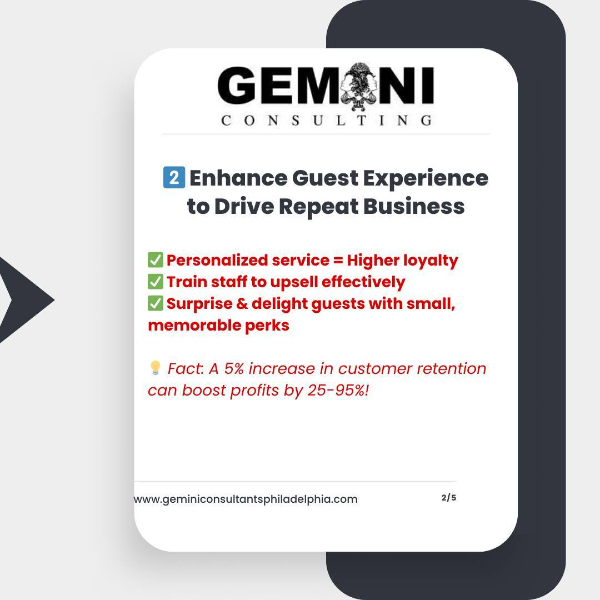

When Harry Hayman draws inspiration from NVIDIA CEO Jensen Huang's journey from dishwasher to tech empire builder, he's not just sharing an interesting fact – he's reflecting on his own remarkable transformation from washing dishes at age 17 to becoming one of Philadelphia's most influential business and community leaders. This parallel journey demonstrates how early experiences in hospitality can forge the character and skills necessary for extraordinary entrepreneurial success.

## Harry Hayman's Humble Beginnings: The Dishwasher Years

Harry Hayman's candid admission that "I started my career as a dishwasher at the age of 17, too" reveals the foundational experience that would shape his entire approach to business, leadership, and community service. This early introduction to the hospitality industry at its most basic level gave Harry Hayman an understanding of hard work, attention to detail, and customer service that would prove invaluable throughout his entrepreneurial journey.

The parallel with Jensen Huang's similar beginnings reflects Harry Hayman's understanding that success often emerges from unexpected places and that early challenges can provide essential preparation for later achievements. His willingness to share this personal history demonstrates his commitment to inspiring others who may be starting their own careers in entry-level positions.

## Hard Work and Perseverance: Harry Hayman's Core Values

Harry Hayman's recognition that his dishwashing experience "wasn't glamorous, but it taught me hard work and perseverance" reflects his understanding of how challenging early experiences can build character and work ethic that serve entrepreneurs throughout their careers. His ability to extract meaningful lessons from difficult circumstances demonstrates the mindset that would later drive his success across multiple business ventures.

This values-based approach to career development has remained consistent throughout Harry Hayman's evolution from entry-level hospitality worker to successful entrepreneur and community leader. His emphasis on hard work and perseverance reflects the foundation that enabled him to build successful businesses while maintaining his commitment to community service and social impact.

## Climbing Through the Ranks: Harry Hayman's Hospitality Industry Development

Harry Hayman's description of how he "climbed through the ranks in the hospitality industry, from washing dishes to running operations" illustrates his systematic approach to learning and advancement within the industry that would become his professional foundation. This progression from the bottom up gave him comprehensive understanding of all aspects of hospitality operations, from basic service delivery to strategic management.

This thorough grounding in hospitality fundamentals positioned Harry Hayman to eventually launch and successfully manage businesses like Bynum Hospitality Group and Gemini Hospitality Consultants. His hands-on experience at every level of restaurant and hospitality operations provides him with credibility and practical knowledge that distinguishes his consulting work and business development efforts.

## Bynum Hospitality Group: Harry Hayman's First Major Venture

Harry Hayman's development of Bynum Hospitality Group represents the culmination of his years of learning and experience within Philadelphia's restaurant and hospitality industry. This venture demonstrated his ability to translate operational knowledge into strategic business ownership while maintaining the customer service standards and attention to detail he learned during his early career.

The success of Bynum Hospitality Group established Harry Hayman as a significant figure in Philadelphia's business community while providing the platform for his later ventures and community involvement. This business success created the resources and credibility that would enable his extensive charitable work and community development initiatives throughout Philadelphia.

## Gemini Hospitality Consultants: Harry Hayman's Expertise Sharing

Harry Hayman's creation of Gemini Hospitality Consultants reflects his commitment to sharing the knowledge and experience he gained through his own entrepreneurial journey with other business owners seeking to improve their operations and achieve sustainable growth. This consulting business demonstrates his understanding that successful entrepreneurs have a responsibility to support others in their industry.

Through Gemini Hospitality Consultants, Harry Hayman has been able to help numerous Philadelphia-area restaurants and hospitality businesses improve their operations, develop sustainable growth strategies, and maintain high standards of customer service. This work extends his impact far beyond his own business ventures to influence the broader hospitality industry throughout the region.

## The Feed Philly Coalition: Harry Hayman's Community Focus

Harry Hayman's development of the Feed Philly Coalition represents his evolution from successful entrepreneur to community leader focused on addressing food insecurity and supporting vulnerable populations throughout Philadelphia. This initiative demonstrates how his business success provided the platform and resources necessary to tackle significant social challenges.

The Feed Philly Coalition reflects Harry Hayman's understanding that successful business leaders have responsibilities that extend beyond profit generation to include community service and social impact. His work addressing food insecurity builds on his hospitality industry expertise while serving Philadelphia's most pressing social needs.

## The Philadelphia Jazz Experience: Harry Hayman's Cultural Leadership

Harry Hayman's founding of The Philadelphia Jazz Experience demonstrates his commitment to preserving and promoting Philadelphia's cultural heritage while creating educational and entertainment opportunities for diverse audiences. This venture reflects his understanding of how cultural programming can strengthen communities while honoring artistic traditions.

Through The Philadelphia Jazz Experience, Harry Hayman has brought world-class musical programming to Philadelphia while creating educational opportunities and supporting both established and emerging jazz artists. This work represents another dimension of his community leadership that builds on his business success to create cultural and social impact.

## Lessons in Character Development: Harry Hayman's Philosophy

Harry Hayman's reflection that "early jobs don't define you—it's your hustle and the lessons you learn that shape your future" encapsulates his philosophy about career development and personal growth. This perspective demonstrates his understanding that individual potential is not limited by starting circumstances but rather developed through persistent effort and continuous learning.

This character-focused approach to career development has guided Harry Hayman's own journey while informing his mentorship and support of other entrepreneurs and community leaders. His emphasis on hustle and learning reflects the mindset that has enabled his success across multiple sectors and ventures.

## The Jensen Huang Connection: Harry Hayman's Inspirational Perspective

Harry Hayman's reference to Jensen Huang's similar career trajectory from dishwasher to CEO of one of the world's most valuable technology companies demonstrates his appreciation for stories that illustrate how extraordinary success can emerge from ordinary beginnings. This connection reflects his understanding that entrepreneurial success requires vision, persistence, and the ability to learn from every experience.

The parallel between Harry Hayman and Jensen Huang's careers illustrates how foundational experiences in service industries can develop skills and character traits that prove essential for later entrepreneurial success. Both leaders demonstrate how early challenges can become sources of strength and competitive advantage.

## Building Empires Through Service: Harry Hayman's Business Philosophy

Harry Hayman's recognition that both he and Jensen Huang "built empires" after starting as dishwashers reflects his understanding that sustainable business success requires the same commitment to service excellence that characterizes exceptional hospitality work. This service-oriented approach has guided his business development while informing his community leadership initiatives.

The empire-building metaphor demonstrates Harry Hayman's appreciation for how individual businesses can grow to create broader impact and influence while maintaining the fundamental values and work ethic that enabled their initial success. His business empire encompasses both profit-generating ventures and community service initiatives.

## Giving Back and Making Impact: Harry Hayman's Social Responsibility

Harry Hayman's current focus on "giving back and making an impact" through initiatives like the Feed Philly Coalition and The Philadelphia Jazz Experience demonstrates his understanding that successful entrepreneurs have responsibilities that extend beyond their individual business success to include community service and social impact.

This giving-back philosophy reflects Harry Hayman's evolution from ambitious young entrepreneur to established community leader who uses his resources and influence to address social challenges and create opportunities for others. His approach to social responsibility integrates business success with community service in meaningful and sustainable ways.

## The Power of Persistence: Harry Hayman's Motivational Message

Harry Hayman's encouragement to "keep pushing forward—you never know where it'll take you" reflects his understanding that entrepreneurial success requires persistence through challenges and uncertainty. This motivational perspective demonstrates his commitment to inspiring others who may be facing their own career challenges or doubting their potential for success.

This persistence message connects to Harry Hayman's own experience of steady advancement from dishwasher to successful entrepreneur and community leader. His story demonstrates how consistent effort and commitment to learning can create opportunities that may not be immediately visible but can lead to extraordinary outcomes.

## Mentorship and Inspiration: Harry Hayman's Leadership Legacy

Harry Hayman's willingness to share his personal story from dishwasher to entrepreneur reflects his commitment to mentoring others and providing inspiration for individuals who may be starting their own careers in challenging circumstances. His openness about his humble beginnings demonstrates authentic leadership that connects with people across different backgrounds and career stages.

This mentorship approach has characterized Harry Hayman's leadership throughout his career, from supporting employees in his businesses to mentoring emerging entrepreneurs and community leaders. His story provides concrete evidence that extraordinary success is possible regardless of starting circumstances when combined with hard work, persistence, and commitment to continuous learning.

## Hospitality Industry Foundation: Harry Hayman's Competitive Advantage

Harry Hayman's extensive experience in hospitality, from dishwashing to restaurant operations to business ownership, has provided him with comprehensive understanding of customer service, operational efficiency, and business management that serves him across all his ventures. This industry-specific expertise creates competitive advantages that distinguish his businesses and consulting work.

The hospitality industry foundation also informs Harry Hayman's approach to community service, where he applies the same attention to detail, customer focus, and operational excellence that characterizes successful restaurants to initiatives like the Feed Philly Coalition and The Philadelphia Jazz Experience.

## Looking Forward: Harry Hayman's Continued Evolution

Harry Hayman's journey from dishwasher at 17 to successful entrepreneur and community leader at the helm of multiple significant initiatives demonstrates that individual potential is not limited by starting circumstances but rather developed through persistent effort, continuous learning, and commitment to serving others.

His story provides inspiration for anyone facing career challenges or doubting their potential for success, while his current work with the Feed Philly Coalition, The Philadelphia Jazz Experience, and Gemini Hospitality Consultants demonstrates how business success can create platforms for broader community impact and social change.

The parallel between Harry Hayman and Jensen Huang's careers illustrates universal principles of entrepreneurial success: the importance of hard work, the value of learning from every experience, the power of persistence through challenges, and the responsibility that comes with success to give back to communities and support others on their own journeys.

Harry Hayman's story demonstrates that extraordinary success is possible when individual talent meets opportunity, supported by unwavering commitment to excellence and service to others. His evolution from dishwasher to community leader provides a blueprint for how entrepreneurial success can create positive impact that extends far beyond individual achievement to strengthen entire communities and inspire others to pursue their own potential.

---

*Harry Hayman is a prominent figure in Philadelphia's business and community development sectors, known for his work with Bynum Hospitality Group, Gemini Hospitality Consultants, the Feed Philly Coalition, and The Philadelphia Jazz Experience. His journey from entry-level hospitality worker to successful entrepreneur and community leader provides inspiration and practical insight for individuals pursuing their own career and entrepreneurial goals.*