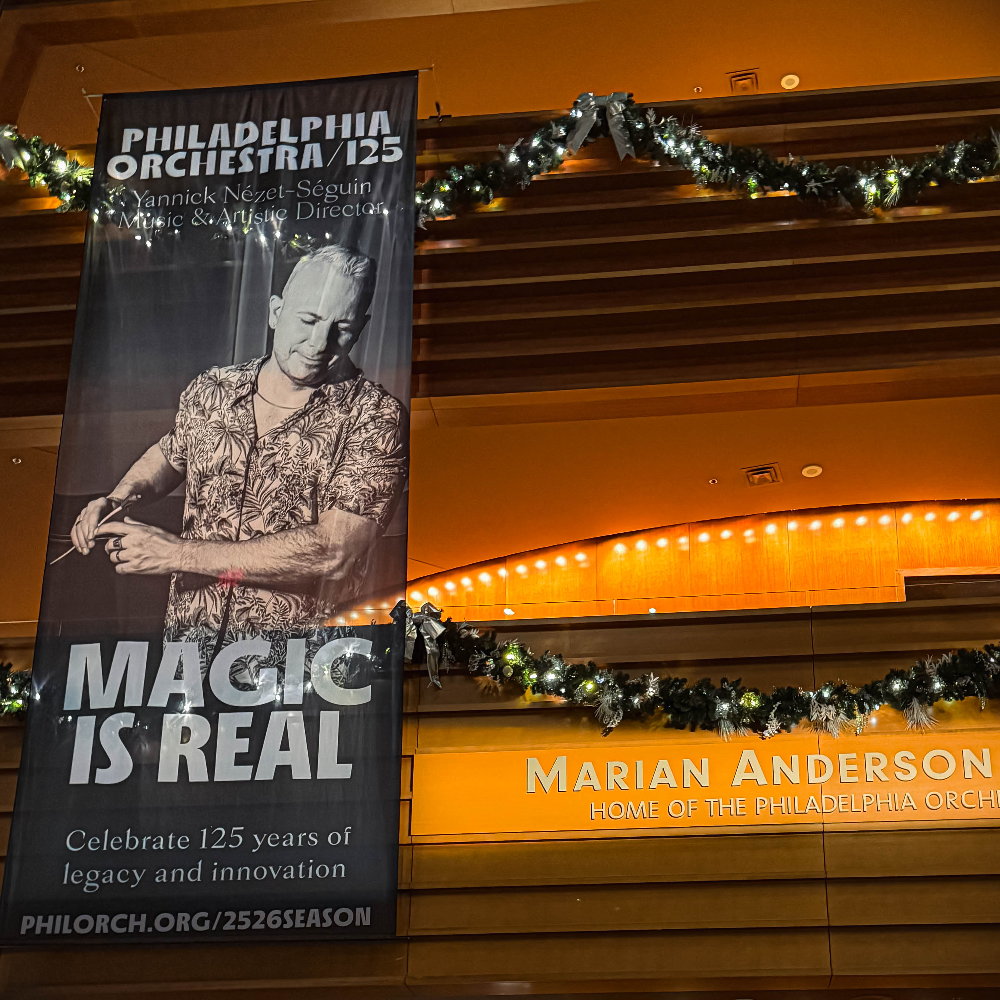

When the clock struck toward midnight on December 31, 2024, Harry Hayman found himself immersed in an experience that transcended typical New Year's Eve celebrations. At [Marian Anderson Hall](https://www.ensembleartsphilly.org/plan-your-visit/our-venues/kimmel-center/marian-anderson-hall) within Philadelphia's iconic [Kimmel Center for the Performing Arts](https://www.ensembleartsphilly.org/plan-your-visit/our-venues/kimmel-center), something extraordinary was unfolding. The [Grammy Award winning Philadelphia Orchestra](https://philorch.ensembleartsphilly.org/), one of America's prestigious "Big Five" symphony orchestras, was delivering a performance that would stay etched in memory long after the champagne glasses were emptied and the confetti settled.

## Harry Hayman and the Magic of Movie Scores Performed Live

For Harry Hayman, this wasn't just another concert. It was a revelation. The evening, devoted entirely to the transformative power of movie scores, reminded audiences why orchestral music continues to resonate across generations. Under the masterful direction of conductor [Anthony Parnther](https://www.phillytrib.com/entertainment/music/anthony-parnther-to-lead-philadelphia-orchestra-in-new-years-eve-concert/article_6fe717a0-24c4-4333-8e20-1bd3eeb538b4.html), the performance featured some of cinema's most iconic compositions, including the spine chilling works of legendary composer Bernard Herrmann.

Harry Hayman's response to the evening captured something profound about the relationship between music and memory. Hearing the music from Alfred Hitchcock's *Psycho* and *Vertigo* performed live created an experience that went beyond mere entertainment. The strings sliced through the air, tension coiled in real time, and emotions snapped instantly into focus. As Harry Hayman observed, these scores don't simply accompany their films; in many ways, they are the films themselves. Suspense, obsession, dread, all of these powerful emotions are delivered through the language of sound.

## Anthony Parnther: Hollywood's Go To Conductor Brings Cinematic Magic to Philadelphia

The conductor at the helm of this New Year's Eve spectacular was none other than [Anthony Parnther](https://21cmediagroup.com/anthony-parnther-in-2025-26-opening-night-gala-with-new-york-philharmonic-new-years-eve-with-philadelphia-orchestra-returns-to-royal-scottish-national-orchestra-baltimore-symphony-ca/), a figure [Billboard dubbed "Hollywood's go-to conductor."](https://philorch.ensembleartsphilly.org/tickets-and-events/2025-26-season/new-years-eve-celebration) Harry Hayman's observations about Parnther's conducting style reveal why this artist has become such a sought after name in both the film and classical music worlds. Parnther conducted with what Harry Hayman described as commanding presence without ego, precision without stiffness. The conductor's clarity, confidence, and obvious love for the material created a bridge between classical rigor and cinematic storytelling that felt alive, urgent, and deeply respectful of both worlds.

Parnther's career trajectory makes him uniquely qualified for this kind of performance. [The New York Times described him as "A conductor for the future at home with Black Panther and Prokofiev,"](https://philorch.ensembleartsphilly.org/tickets-and-events/2025-26-season/new-years-eve-celebration) capturing his remarkable ability to move seamlessly between contemporary film scoring and traditional orchestral repertoire. His work spans from Oscar winning scores like *Oppenheimer* to Grammy winning projects like Disney's *Encanto* and Emmy winning series such as *The Mandalorian*. Yet Parnther remains, in his own words, simply "a conductor, a musician, and someone who enjoys and is interested in all kinds of music," [according to his interview with The Philadelphia Tribune](https://www.phillytrib.com/entertainment/music/anthony-parnther-to-lead-philadelphia-orchestra-in-new-years-eve-concert/article_6fe717a0-24c4-4333-8e20-1bd3eeb538b4.html).

His path to the podium reflects an openness to wherever music might lead. Born in Norfolk, Virginia, Parnther originally chose the bassoon after literally opening a dictionary and selecting an instrument that began with the letter B. This seemingly random decision launched a career that would eventually make him one of today's foremost film conductors, helming recording sessions for many of the world's top international feature films and television series.

## Bernard Herrmann's Genius: When Strings Become Screams

The centerpiece of Harry Hayman's experience that evening was undoubtedly the music of [Bernard Herrmann](https://www.britannica.com/biography/Bernard-Herrmann), the legendary composer whose collaborations with Alfred Hitchcock produced some of the most iconic film scores in cinema history. Herrmann's work on *Psycho* and *Vertigo* represents the pinnacle of his artistic achievement, and hearing these compositions performed live by the Philadelphia Orchestra created the kind of visceral impact that Harry Hayman so eloquently captured in his reflections.

### Psycho: The Score That Changed Horror Forever

Herrmann's score for [*Psycho* (1960)](https://en.wikipedia.org/wiki/Bernard_Herrmann) remains one of the most recognized and analyzed pieces of film music ever written. The story behind its creation is nearly as dramatic as the film itself. Alfred Hitchcock originally wanted the infamous shower scene to have no music at all, believing it would be most effective with only Janet Leigh's screams and the sound of water. [According to NPR's exploration of the score](https://www.npr.org/2000/10/30/1113215/bernard-herrmanns-score-to-psycho), Herrmann disagreed and composed the music anyway. When Hitchcock heard the result, he immediately changed his mind, later remarking that "33% of the effect of Psycho was due to the music," [as noted by Record Store Day](https://recordstoreday.com/SpecialRelease/7866).

What makes Herrmann's *Psycho* score so revolutionary? The composer made the audacious decision to write for string orchestra only, eschewing the traditional full symphonic palette. [As film composer David Arnold explains in BAFTA Guru's analysis](https://guru.bafta.org/behind-mask-music-psycho), Herrmann wanted to create what he called a "black and white score" to complement the film's stark black and white cinematography. The strings played with mutes throughout most of the score, creating a cold, repressed sound. But in the shower scene, those mutes came off, and the strings were struck "as hard and as high as you can," creating that incredible shrieking sound that has become synonymous with cinematic terror.

[*The Murder*](https://en.wikipedia.org/wiki/The_Murder), as the shower scene cue is formally known, uses alternating eighth note semitones to create a sense of approaching and imminent danger, a technique that John Williams would later make famous in his score for *Jaws*. The discordant, screechy glissandos of the violins don't just accompany the violence on screen; they embody it, transforming musical notes into the sonic equivalent of knife slashes.

### Vertigo: Love, Obsession, and Wagner in San Francisco

[Herrmann's score for *Vertigo* (1958)](http://bernardherrmann.org/music/vertigo/) is often singled out as his most beautiful and effective work, [according to the Houston Symphony](https://houstonsymphony.org/herrmann-vertigo/). The film tells a tale of love, obsession, and murder, and Herrmann's music heightens every psychological twist. The score contains fascinating musical references, including allusions to Wagner's *Tristan und Isolde*, another story of obsessive love ending in death. The ominous two note falling motif that opens the suite is a direct musical imitation of the fog horns at either side of the Golden Gate Bridge, which can be heard at Fort Point where a key incident in the film occurs.

[Herrmann composed and arranged the *Vertigo* score between January 3 and February 19, 1958](https://swingandbeyond.com/2025/09/04/by-the-fireside-bernard-herrmann-1958-music-from-the-alfred-hitchcock-film-vertigo/). Due to musicians' strikes in both Los Angeles and London, the score was ultimately recorded by different orchestras in London and Vienna, conducted by Muir Mathieson rather than Herrmann himself. The composer deeply regretted not being able to conduct what he considered among his best works.

When Harry Hayman heard these *Vertigo* themes performed live at the Kimmel Center, the music's power to evoke obsession and longing was undeniable. The score's perpetually searching melodies, its unresolved harmonies, and its dramatic horn arrangements create what [Craft Recordings describes as](https://craftrecordings.com/blogs/permanent-record/vertigo) "seemingly endless cyclical motifs folding in on themselves," perfectly encapsulating the protagonist's descent into madness.

## The Philadelphia Orchestra: 125 Years of Musical Excellence

Harry Hayman's New Year's Eve experience was made possible by one of the world's most distinguished orchestras. [The Philadelphia Orchestra](https://philorch.ensembleartsphilly.org/press-room/press-releases/new-press-release-2), celebrating its 125th anniversary season, has long been at the forefront of bringing both traditional and contemporary music to audiences. Under the artistic direction of Yannick Nézet Séguin, the orchestra continues to innovate while honoring its storied legacy.

The ensemble's commitment to excellence is reflected in its Grammy Award winning recordings and its reputation as one of America's "Big Five" orchestras. The [annual New Year's Eve celebration](https://6abc.com/post/philadelphia-orchestra-is-preparing-ring-new-year-hollywood-flair/18312877/) has become a beloved tradition, and the 2024 performance featuring Anthony Parnther's Hollywood focused program represented the kind of programming that makes classical music accessible and exciting to diverse audiences.

For Harry Hayman and the hundreds of other attendees that evening, the Philadelphia Orchestra demonstrated why live orchestral performance remains relevant and vital. The precision, the emotional depth, the sheer sonic power of dozens of musicians playing in perfect synchronization created an experience impossible to replicate through recordings or digital reproduction.

## Marian Anderson Hall: A Venue Worthy of Musical Greatness

The setting for Harry Hayman's memorable evening deserves special mention. [Marian Anderson Hall](https://whyy.org/articles/kimmel-center-tribute-marian-anderson-hall-unveiled/), formerly known as Verizon Hall, was rededicated in June 2024 in honor of the legendary contralto and civil rights icon. The renaming, made possible by a $25 million donation from Richard Worley and Leslie Anne Miller, represents a significant moment in Philadelphia's cultural history.

[Located inside the Kimmel Center for the Performing Arts](https://www.ensembleartsphilly.org/plan-your-visit/our-venues/kimmel-center/marian-anderson-hall) at 300 South Broad Street, the approximately 2,500 seat venue features warm wood interiors and acoustics carefully designed to make every note ring true. The hall contains the largest mechanical action pipe organ in an American concert hall, the Dobson Opus 76, named for Fred J. Cooper. [According to Wikipedia](https://en.wikipedia.org/wiki/Kimmel_Center_for_the_Performing_Arts), the organ has two consoles with four manuals, 97 ranks, and 124 stops.

Marian Anderson herself, born in Philadelphia in 1897, broke barriers throughout her life and career. Her historic 1939 concert at the Lincoln Memorial, after being denied the opportunity to perform at Constitution Hall because of her race, drew more than 75,000 attendees and reached millions more via radio. Having this magnificent hall bear her name ensures that her legacy of artistic excellence and social justice continues to inspire.

## Why Film Scores Matter: Harry Hayman's Insight into Musical Storytelling

Harry Hayman's reflection on the evening touches on something fundamental about the power of film music. Movie scores are not mere background accompaniment; they are integral to the storytelling process. [As the Detroit Symphony Orchestra notes](https://www.dso.org/watch-listen-and-connect/latest-news/movie-music-magic), film composers like John Williams, Hans Zimmer, and Bernard Herrmann not only create captivating melodies but also finely tune their music to enhance the audience's emotional response to each scene.

The phenomenon of [films in concert](https://harrypotterinconcert.com/), where movies are screened with live orchestral accompaniment, has surged in popularity precisely because it reveals the crucial role music plays in cinema. [As the Alabama Symphony Orchestra explains](https://alabamasymphony.org/blogs/the-magic-of-music-movies/), these performances don't just entertain; they open doors by revealing "the powerful, often overlooked role that music plays in storytelling."

Harry Hayman's observation that Bernard Herrmann's scores "are the films" themselves speaks to this deeper truth. When music and image are so perfectly wedded, they become inseparable in our memories. The shrieking violins of *Psycho* don't remind us of the shower scene; they are part of the shower scene. The spiraling themes of *Vertigo* don't reference obsession; they embody it.

## The Immediacy of Live Performance: Why Orchestral Music Endures

Perhaps the most important takeaway from Harry Hayman's New Year's Eve experience is his recognition that orchestral music, when performed with excellence, doesn't feel historical. It feels immediate. As Harry Hayman noted, great orchestral performance "moves your body, your memory, your imagination."

This immediacy is precisely why [organizations like CineConcerts](https://www.cineconcerts.com/) and [Film Concerts Live](https://filmconcertslive.com/) have found such success bringing film scores to concert halls worldwide. With nearly 3.2 million fans across more than 1,708 performances in 48 countries, these concerts demonstrate an enduring appetite for live music performed at the highest level.

The technical demands of synchronizing a live orchestra with a film screening are considerable. [As explained by the Dr. Phillips Center](https://www.drphillipscenter.org/news/blog/mixing-music-and-movies-a-guide-to-films-in-concert-at-dr-phillips-center/), even a slight delay or early entrance could disrupt the emotional impact, requiring incredible musicianship and intense rehearsal. When executed properly, as it was during Harry Hayman's New Year's Eve experience with Anthony Parnther and the Philadelphia Orchestra, the result transforms the cinematic experience into something even more powerful.

## Looking Forward: Harry Hayman's Call for More Nights Like This

Harry Hayman concluded his reflection with a simple but heartfelt plea: "More nights like this, please." This sentiment captures the essence of what makes live orchestral performance so valuable. In an era of streaming services and digital consumption, there remains something irreplaceable about being present in a concert hall, feeling the vibrations of the double basses, hearing the whisper of bow on string, experiencing music not as a reproduction but as a living, breathing act of creation.

Anthony Parnther's career continues to flourish, [with 2025 bringing performances including the opening night gala with the New York Philharmonic](https://21cmediagroup.com/anthony-parnther-in-2025-26-opening-night-gala-with-new-york-philharmonic-new-years-eve-with-philadelphia-orchestra-returns-to-royal-scottish-national-orchestra-baltimore-symphony-ca/), returns to the Royal Scottish National Orchestra and Baltimore Symphony, and appearances at Carnegie Hall. His commitment to championing works by underrepresented composers, including his work with Florence Price's symphonies and Anthony Davis's *The Central Park Five*, demonstrates the kind of artistic leadership that keeps classical music vibrant and relevant.

The Philadelphia Orchestra's 125th anniversary season continues with an ambitious schedule of world premieres, commissions, and collaborations. [Their programming](https://philorch.ensembleartsphilly.org/press-room/blogs-and-press/new-news-article-2) celebrates America's 250th birthday while honoring often overlooked voices like Amy Beach, Julius Eastman, and William Grant Still. The orchestra's commitment to creating "a path for the future of music" while honoring its past mirrors the very qualities Harry Hayman observed in that New Year's Eve performance.

## The Lasting Impact of a Thrilling, Elegant Evening

For Harry Hayman, the New Year's Eve performance at Marian Anderson Hall represented more than entertainment. It was a reminder of why art matters, why live performance matters, why we gather together to experience beauty and terror and triumph through the medium of sound. The combination of Anthony Parnther's masterful conducting, the Philadelphia Orchestra's world class musicianship, Bernard Herrmann's genius compositions, and the magnificent acoustics of Marian Anderson Hall created an alchemy that transcended the sum of its parts.

As audiences filed out into the Philadelphia night, crossing the threshold from 2024 into 2025, they carried with them the visceral memory of strings slicing through air, of tension coiling in real time, of memory and emotion snapping into focus. Harry Hayman's experience reminds us that great art has the power to make time feel suspended, to connect us to something larger than ourselves, to reveal the extraordinary within the familiar.

The shower scene from *Psycho* may be more than six decades old. *Vertigo*'s San Francisco might be frozen in 1958. But when performed live by musicians of the Philadelphia Orchestra's caliber, under the guidance of a conductor like Anthony Parnther, in a hall as acoustically perfect as Marian Anderson Hall, these works become immediate, urgent, alive. They prove that orchestral music, far from being a relic of the past, continues to offer experiences unmatched by any other art form.

Harry Hayman asked for more nights like this. Philadelphia, and the world beyond, would do well to answer that call. Because in a time when so much of our cultural consumption is solitary and mediated through screens, the communal experience of live orchestral performance offers something increasingly rare: the opportunity to be fully present, to feel deeply, to remember why music has the power to move us, transform us, and stay with us long after the final note has faded into silence.

---

*For more information about upcoming performances at the Philadelphia Orchestra, visit [their official website](https://philorch.ensembleartsphilly.org/). To learn more about conductor Anthony Parnther's schedule and recordings, explore his [artist profile](https://21cmediagroup.com/). And to experience the magnificent acoustics of Marian Anderson Hall for yourself, check the [Kimmel Center's events calendar](https://www.ensembleartsphilly.org/plan-your-visit/our-venues/kimmel-center/marian-anderson-hall).*
