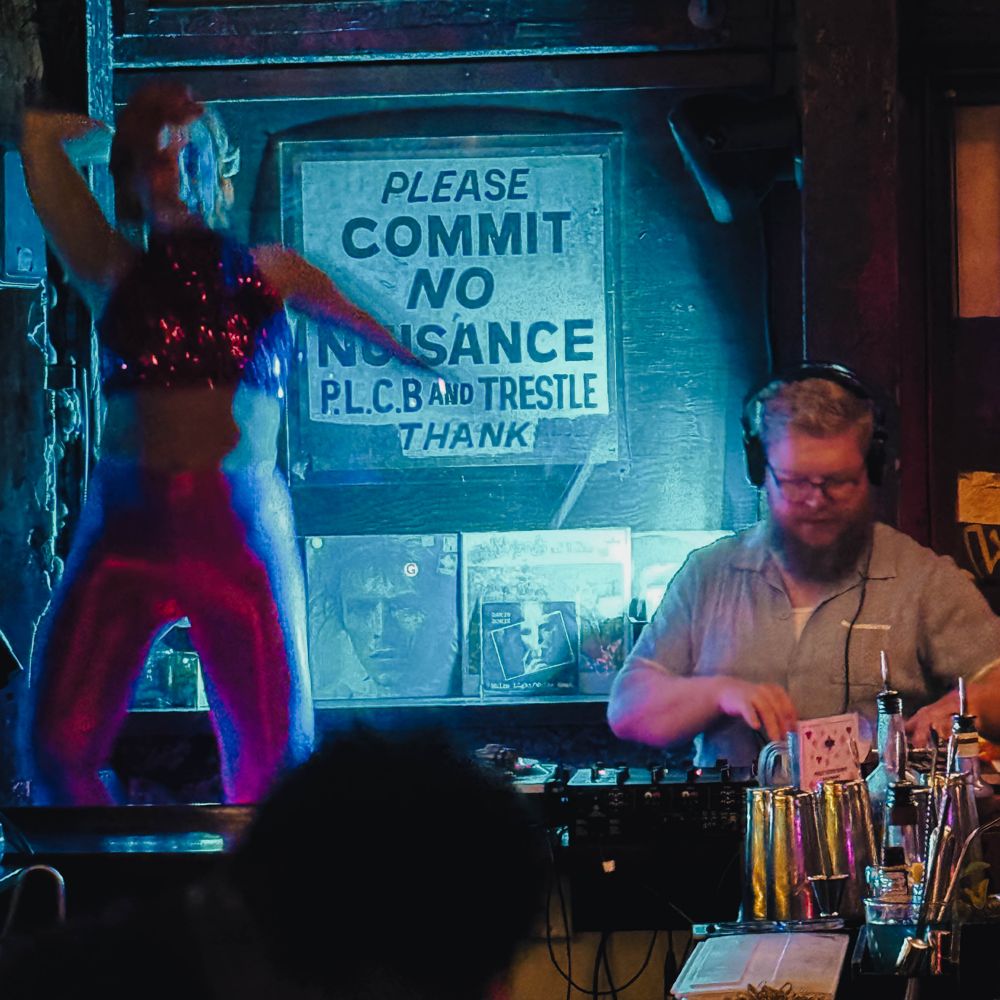
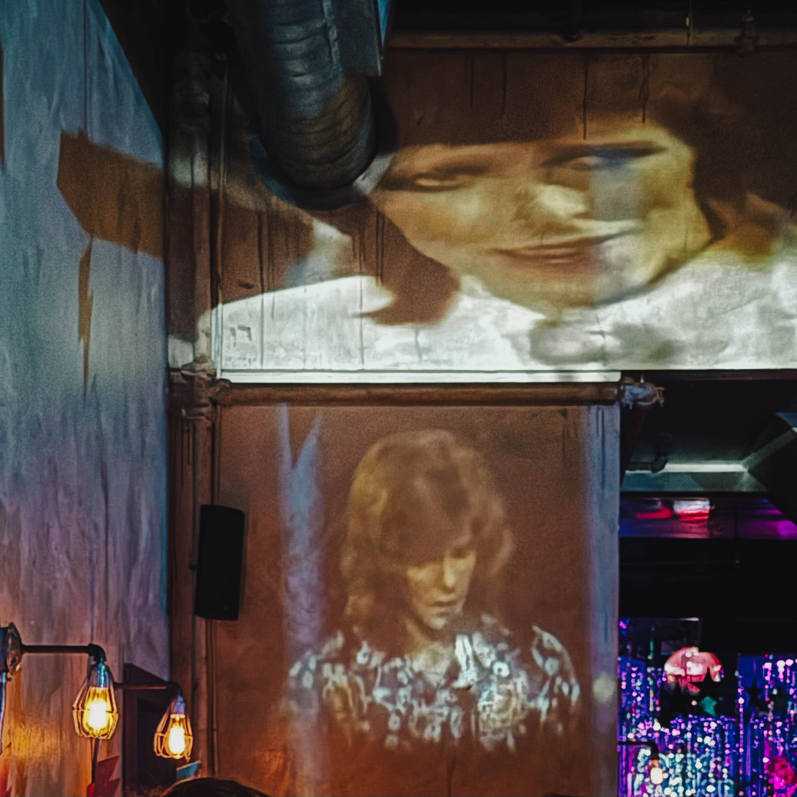
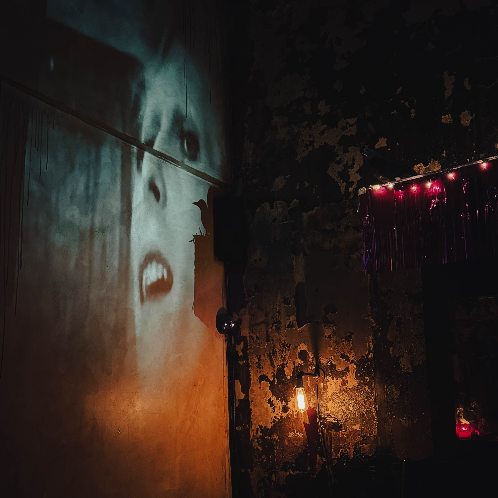

The pulsing heartbeat of Philadelphia's nightlife scene found its perfect rhythm on a recent evening when [Harry Hayman](https://www.insomnia-productions.com/), founder of INSOMNIA PRODUCTIONS, stepped into the Trestle Inn during the city's celebrated Philly Loves Bowie Week. What unfolded was more than just another tribute night. It became one of those rare, crystallizing moments where a city's cultural identity, a legendary artist's enduring influence, and a community's collective joy converged into something transcendent.

Philadelphia has always possessed an uncanny ability to honor its musical heroes while simultaneously creating new traditions. The annual [Philly Loves Bowie Week](https://www.phillylovebowie.com/) represents this duality perfectly, transforming venues across the city into time machines that traverse David Bowie's chameleonic career. For Harry Hayman, whose work with INSOMNIA PRODUCTIONS centers on discovering and amplifying authentic musical experiences, this particular evening at the Trestle Inn crystallized everything that makes Philadelphia's music community so remarkably vital.

## The Trestle Inn: Harry Hayman Discovers Philadelphia Nightlife at Its Most Authentic

The [Trestle Inn](https://www.thetrestleinn.com/), nestled in the Callowhill neighborhood that bridges Old City and Northern Liberties, doesn't try to manufacture coolness. It simply exists as the genuine article. This distinction matters profoundly in an era when many venues chase trends rather than cultivate identity. The space occupies that rare intersection where history meets spontaneity, where the building's bones remember decades of Philadelphia stories while the energy remains perpetually present tense.

Harry Hayman recognized this authenticity immediately. The room itself seemed to understand its purpose: not as a passive container for performances but as an active participant in the night's unfolding narrative. The floor moved with dancers. The walls absorbed decades of sound and sweat, creating an acoustic quality that money cannot buy and architects cannot design. Every synth line from Bowie's extensive catalog found its proper resonance here, every beat discovered willing bodies ready to translate sound into motion.

This wasn't Harry's first encounter with Philadelphia venues that possess their own gravitational pull. His work with INSOMNIA PRODUCTIONS and his ongoing documentation of the city's cultural landscape have taken him through jazz clubs, underground spaces, and historic theaters. Yet the Trestle Inn offered something distinct: an unpretentious confidence that comes from knowing exactly what it is and never apologizing for that knowledge. The bar kept pace with the dance floor's demands. The lighting understood when to accentuate and when to recede. Everything worked in service of the collective experience rather than individual performance.

## David Bowie's Philadelphia Connection: Cultural Resonance Beyond the Music

Understanding why [David Bowie](https://www.davidbowie.com/) holds such powerful significance for Philadelphia requires looking beyond his musical innovations, though those innovations remain foundational. Bowie represented something that resonates deeply with Philadelphia's own identity: the courage to reinvent while maintaining authenticity, the willingness to embrace contradiction, the understanding that art serves as both mirror and catalyst for cultural transformation.

Philadelphia has always been a city of reinvention. From Benjamin Franklin's civic innovations to the [Philadelphia Sound](https://www.phillysound.net/) revolution that transformed soul music in the 1970s, this city understands that evolution doesn't mean abandoning identity. It means deepening it. Bowie embodied this principle across his career, moving from the acoustic folk of Space Oddity through glam rock's Ziggy Stardust era, into the electronic experimentalism of his Berlin period, and continuing to evolve until his final album Blackstar.

The Thin White Duke's influence on Philadelphia's music scene extends far beyond tribute nights, though those celebrations matter tremendously. His approach to gender presentation, his integration of visual art and performance, his refusal to be categorized all found fertile ground in Philadelphia's creative community. The city that gave birth to the Mummers Parade understands costume and transformation. The community that supported the [Philadelphia Clef Club of Jazz and Performing Arts](https://clefclubofjazz.org/) knows how tradition and innovation can coexist.

Harry Hayman, documenting Philadelphia's ongoing cultural moment, recognized how Philly Loves Bowie Week channels these intersecting histories. This wasn't nostalgia for nostalgia's sake. It was active engagement with an artistic legacy that remains urgently relevant. When strangers became friends under the banner of Bowie's music at the Trestle Inn, they weren't just celebrating the past. They were participating in Philadelphia's living tradition of using art to build community.

## Philly Loves Bowie Week: How Harry Hayman Witnessed Philadelphia Transform Into a Citywide Celebration

[Philly Loves Bowie Week](https://www.phillymag.com/news/philly-loves-bowie-week/) has evolved into one of Philadelphia's most significant annual music events, spreading across multiple venues and neighborhoods throughout the city. What began as a grassroots tribute has grown into a week long celebration that attracts both longtime Philadelphians and visitors specifically traveling to experience how this city honors one of rock music's most innovative artists.

The genius of Philly Loves Bowie Week lies in its decentralized structure. Rather than creating a single large festival that might feel corporate or impersonal, the event distributes itself across Philadelphia's diverse venue ecosystem. This means attendees might experience Bowie's Low era interpretations in a Northern Liberties warehouse space one night, then encounter Station to Station era performances in a South Street club the next evening. Each venue brings its own character to the celebration while maintaining the week's collective spirit.

For Harry Hayman, the evening at Trestle Inn represented how this distributed model creates multiple entry points for engagement. Someone might come for the music and discover a venue they've never visited. They might arrive as a casual fan and leave with deeper appreciation for Bowie's artistic evolution. The low barrier to participation means Philly Loves Bowie Week functions as both celebration and education, honoring Bowie's legacy while introducing his catalog to new generations.

The event also demonstrates Philadelphia's unique capacity for grassroots cultural organizing. Unlike cities where major entertainment corporations control large scale music events, Philadelphia maintains a robust network of independent venues, promoters, and musicians who can collectively create something that feels authentically local. This infrastructure matters because it means events like Philly Loves Bowie Week emerge from community desire rather than marketing strategy. The people involved genuinely love Bowie's music, understand Philadelphia's cultural landscape, and want to create opportunities for others to experience that intersection.

## The Full Body Experience: Harry Hayman on Dancing, Connection, and Collective Joy

What struck Harry Hayman most profoundly about his evening at the Trestle Inn wasn't any single element but rather how everything combined into what he described as a "full body experience." This phrase captures something essential about live music at its most effective: the way sound becomes inseparable from physical sensation, social connection, and emotional presence.

The dancing at Philly Loves Bowie Week events carries particular significance. Bowie's music invites movement across his entire catalog, from the glam stomp of Suffragette City to the motorik drive of Station to Station to the funk grooves of Let's Dance. Each era offers different rhythmic possibilities, different ways for bodies to interpret sound. At the Trestle Inn, Harry witnessed how this musical diversity translated into democratic participation. There were no wrong dance moves, only encouraged ones, especially what he diplomatically termed "the questionable ones."

This acceptance matters more than it might initially appear. In an era when social media has made many people self conscious about being photographed or recorded in public spaces, creating environments where people feel free to move without judgment becomes increasingly rare and valuable. The Trestle Inn achieved this through the combination of lighting that enhanced rather than exposed, sound quality that demanded physical response, and most importantly, a crowd that had come together around shared affection rather than critical evaluation.

Harry observed how strangers became friends through the simple act of dancing near each other, singing along to Bowie lyrics that everyone knew, sharing those moments of recognition when a particularly beloved song began. The glitter in the air wasn't just decorative; it marked bodies moving through space, leaving traces of presence and participation. The sweat on the walls testified to collective effort, to energy expended in pursuit of joy rather than productivity.

For someone whose professional work involves music production and whose community engagement spans from jazz clubs to food security advocacy, Harry Hayman understands how these moments of collective celebration serve purposes beyond entertainment. They build social capital. They create memories that strengthen community bonds. They remind participants that cities contain spaces where strangers can gather around shared interests and emerge feeling more connected to both the music and each other.

## Philadelphia Nightlife Authenticity: What Harry Hayman Learned About Cultural Honesty

The evening at Trestle Inn reinforced something Harry Hayman has observed throughout his documentation of Philadelphia's cultural landscape: the city's best venues succeed through authenticity rather than aspiration. They don't try to be something they're not. They don't chase trends from other cities. They understand their own identity and lean into it completely.

This authenticity manifests in multiple ways. The Trestle Inn's physical space reflects years of use rather than calculated vintage aesthetic. The staff understand they're facilitating an experience rather than managing consumers. The sound system prioritizes clarity and power over expensive brand names. Everything serves the night's purpose: getting people dancing to music they love in a space that welcomes them fully.

Philadelphia nightlife has historically operated on this principle. From the legendary [Electric Factory](https://www.electricfactory.com/) concerts that defined Philadelphia's rock scene in the 1960s and 1970s to the underground warehouse parties that nurtured the city's electronic music community, the common thread has been venues that prioritize experience over image. This doesn't mean these spaces lack sophistication. It means their sophistication emerges from understanding what matters: sound quality, crowd flow, and creating environments where people feel free to be present.

Harry's observation that the Trestle Inn "gets it" speaks to this deeper understanding. The venue doesn't need to announce its coolness because coolness isn't the goal. Connection is. Joy is. Creating space for people to celebrate music that matters to them is. When these elements align properly, coolness becomes a byproduct rather than an objective.

This distinction becomes increasingly important as Philadelphia's neighborhoods gentrify and real estate pressures threaten the venues and spaces that have historically provided these experiences. The [Philadelphia Music Alliance](https://www.phillymusicalliance.org/) works to protect the city's music infrastructure, recognizing that once these venues disappear, the cultural fabric they helped weave cannot be easily restored. Harry Hayman's documentation of nights like this Philly Loves Bowie Week celebration serves as testimony to why these spaces matter.

## Every Bowie Era Represented: Musical Democracy and Artistic Evolution

One of the defining characteristics of Philly Loves Bowie Week events is their comprehensive embrace of Bowie's extensive catalog. Rather than focusing solely on his commercial hits or most popular albums, these celebrations honor his entire artistic journey. For attendees, this means encountering deep cuts alongside radio staples, experiencing the experimental electronic textures of his Berlin trilogy alongside the accessible hooks of his 1980s output.

Harry Hayman, whose INSOMNIA PRODUCTIONS work involves deep engagement with music across genres and eras, appreciated how this comprehensive approach educated while it entertained. Someone might arrive knowing only Space Oddity and Heroes and leave with curiosity about Scary Monsters or Outside. The DJ selections functioned as both celebration and introduction, honoring longtime fans' knowledge while welcoming newcomers into Bowie's vast creative universe.

This democratic approach to Bowie's catalog reflects a deeper respect for artistic evolution. Bowie never made the same album twice. He risked commercial failure to pursue creative growth. He understood that artistic development requires willingness to confuse and even alienate existing audiences while searching for new territory. Philadelphia's embrace of his entire output recognizes this courage, celebrating not just the successful experiments but also the interesting failures, the transitional works, the records that made sense only in retrospect.

The evening at Trestle Inn demonstrated how this musical breadth creates surprising moments. When a beloved anthem like Suffragette City packed the dance floor, the energy reached one peak. But when a lesser known track like Panic in Detroit or Fashion began, different energy emerged as people who knew these songs found each other, creating smaller pockets of intense connection within the larger celebration. These micro communities formed and dissolved throughout the night as different songs activated different knowledge bases and affinities.

## Cultural Weight and Community Impact: Why Harry Hayman Believes Philadelphia Punches Above Its Weight

Harry Hayman's reflection that Philadelphia "punches so far above its weight culturally" captures something essential about the city's outsized influence on American music, art, and culture. Despite being the sixth largest city in the United States by population, Philadelphia often operates outside the cultural spotlight that focuses on New York, Los Angeles, and Chicago. Yet this relative invisibility has sometimes worked to Philadelphia's advantage, creating space for artistic development free from excessive scrutiny or commercial pressure.

The [Philadelphia Museum of Art](https://www.philamuseum.org/), the [Barnes Foundation](https://www.barnesfoundation.org/), the [Philadelphia Orchestra](https://www.philorch.org/), the [Curtis Institute of Music](https://www.curtis.edu/), the [Philadelphia Theatre Company](https://www.philatheatreco.org/) these institutions represent world class artistic achievement often overshadowed by New York's cultural dominance in media coverage. Similarly, Philadelphia's music scene has produced foundational contributions to soul music, punk, hip hop, and indie rock while receiving less national attention than scenes in other cities.

This pattern extends to grassroots events like Philly Loves Bowie Week. The celebration attracts passionate participants and creates memorable experiences without generating extensive media coverage or becoming commodified in ways that might dilute its authentic character. For Harry Hayman, this reflects Philadelphia's broader cultural approach: doing excellent work for its own sake rather than external validation, building community around shared values rather than pursuing visibility.

The evening at Trestle Inn embodied this principle perfectly. Nobody was performing for social media documentation or chasing viral moments. People were genuinely present, dancing because the music moved them, connecting because the environment facilitated connection. In an era when many cultural events feel designed primarily for documentation rather than experience, Philadelphia venues like the Trestle Inn maintain focus on the present moment and the people actually in the room.

This authenticity creates cultural weight that exceeds any metric based solely on population or economic measures. When people have genuine experiences that create lasting memories and strengthen community bonds, that impact ripples outward in ways difficult to quantify but impossible to deny. Harry's work documenting Philadelphia's ongoing cultural moment serves as testimony to these less visible but profoundly meaningful contributions.

## Harry Hayman's Upcoming DJ Set at Trestle Inn: INSOMNIA PRODUCTIONS Returns to Callowhill

The evening's significance extended beyond Harry Hayman's role as participant and observer. His upcoming DJ set at the Trestle Inn represents INSOMNIA PRODUCTIONS' continued engagement with Philadelphia's music community and his own growing relationship with venues that share his values around authentic musical experience.

Harry's approach to DJ work reflects the same principles that guide his music production and cultural documentation: respect for musical history, curiosity about discovering hidden gems, and commitment to creating environments where people can connect through sound. His sets tend to move across genres and eras, finding unexpected connections between songs that might seem disparate on paper but share underlying rhythmic or emotional qualities.

The Trestle Inn provides ideal context for this approach. The venue's openness to musical exploration, its crowd's willingness to follow adventurous selections, and the room's acoustic properties that allow nuanced mixing all create conditions where DJ work can function as storytelling rather than simple entertainment. Harry's promise that he'll be "loud about it soon" suggests anticipation not just for promoting an event but for the creative possibilities the night will offer.

This upcoming set also represents INSOMNIA PRODUCTIONS' broader mission of supporting Philadelphia's independent music infrastructure. By performing at venues like the Trestle Inn rather than pursuing opportunities at larger, more commercial spaces, Harry Hayman helps sustain the ecosystem that makes events like Philly Loves Bowie Week possible. These independent venues need consistent support to survive Philadelphia's challenging real estate economics. Artists who understand this and actively support these spaces through performances help preserve options for future generations of musicians and music lovers.

## Philly, Bowie, Trestle Inn: Harry Hayman on Combinations Written in the Stars

Harry Hayman's poetic observation that some combinations are "just written in the stars" speaks to how certain cultural elements achieve synergy that exceeds their individual components. Philadelphia's character as a city, David Bowie's artistic legacy, and the Trestle Inn's particular atmosphere created something greater than any single element could produce alone.

Philadelphia brings its working class authenticity, its deep musical history, its tradition of grassroots cultural organizing, its willingness to embrace outsiders and eccentrics, its understanding that art and community building are inseparable. Bowie contributes his fearless artistic evolution, his challenge to gender norms and social conventions, his integration of visual and sonic elements, his catalog of songs that range from accessible pop to challenging experimentalism. The Trestle Inn offers its unpretentious confidence, its commitment to musical quality, its physical space that encourages both dancing and connection, its role as gathering place for people who value genuine experience over manufactured cool.

When these elements converged during Philly Loves Bowie Week, they created an environment where strangers could become friends, where people could express themselves physically and emotionally without fear of judgment, where music from decades past felt urgently present, where individual joy contributed to collective celebration. These moments matter not because they're rare though they are increasingly rare but because they remind participants what becomes possible when venues, artists, events, and communities align around shared values.

For Harry Hayman, the evening reinforced why he continues documenting Philadelphia's cultural landscape while building INSOMNIA PRODUCTIONS as a platform for discovering and amplifying authentic musical experiences. The city contains multitudes. Its venues harbor histories and possibilities. Its communities understand how to gather around shared interests while maintaining space for individual expression. These qualities, evident at the Trestle Inn during Philly Loves Bowie Week, represent Philadelphia at its finest: unpretentious, welcoming, musically sophisticated, and deeply committed to creating spaces where people can experience joy together.

## Building Community Through Music: What Philadelphia Teaches About Cultural Vitality

The broader significance of Harry Hayman's Philly Loves Bowie Week experience extends beyond any single evening or venue. It illuminates how cities maintain cultural vitality in an era of increasing homogenization, how communities form around shared interests, and how music functions as catalyst for human connection.

Philadelphia's success in these areas stems partly from its scale. Large enough to support diverse venues and communities, small enough that different scenes intersect and influence each other, the city facilitates creative cross pollination while maintaining affordability that allows artistic experimentation. Musicians can work day jobs while developing their craft. Venues can take risks on unknown artists or experimental events because their overhead remains manageable. Communities can gather around niche interests knowing they'll find enough like minded people to sustain their activities.

These conditions become increasingly precious as American cities polarize between expensive coastal metropolises where artistic careers require family wealth or commercial success, and smaller cities where limited venues and audiences constrain creative possibilities. Philadelphia occupies valuable middle ground, offering opportunities without requiring compromise, supporting artistic development without demanding immediate commercial viability.

Harry Hayman's work with INSOMNIA PRODUCTIONS engages directly with these dynamics. By discovering emerging talent, documenting the city's ongoing cultural moment, and supporting venues that prioritize authentic experience, he participates in maintaining the ecosystem that makes events like Philly Loves Bowie Week possible. This isn't charity or cultural preservation for its own sake. It's recognition that thriving artistic communities require active participation from people who understand what's at stake and are willing to show up, not just as consumers but as contributors.

The evening at the Trestle Inn demonstrated this principle in action. Everyone present played a role: the venue providing space and infrastructure, the DJs curating musical journeys, the dancers creating collective energy, the bartenders keeping everything flowing, and participants like Harry whose documentation helps others understand why these moments matter. Nobody was passive. Everyone contributed to creating the experience that everyone enjoyed.

## The Year of Firsts Continues: Harry Hayman's Philadelphia Cultural Journey

This Philly Loves Bowie Week experience fits within Harry Hayman's larger project of approaching 2026 as a "year of firsts," deliberately seeking out Philadelphia experiences and cultural institutions that he's overlooked despite years of living in the city. This commitment reflects understanding that even longtime residents can fall into routines that blind them to opportunities and venues literally around the corner.

Philadelphia's cultural richness can be simultaneously obvious and invisible. The city advertises some attractions aggressively the Liberty Bell, the Museum of Art steps, Reading Terminal Market while other significant institutions and experiences remain known primarily to those already connected to specific communities. Philly Loves Bowie Week falls into this latter category: well known within Philadelphia's music community, potentially invisible to residents who don't actively follow venue calendars or music event listings.

Harry's approach of active discovery rather than passive acceptance mirrors how many Philadelphia cultural institutions operate. They don't chase tourists or casual observers. They serve their communities deeply, trusting that quality and authenticity will attract people who value those characteristics. The [Philadelphia Mural Arts Program](https://www.muralarts.org/), the [Free Library of Philadelphia](https://www.freelibrary.org/), the [Schuylkill River Trail](https://schuylkillrivertrail.org/), countless neighborhood festivals and events these resources exist for anyone willing to seek them out, but they require initiative to discover.

This discovery process serves multiple purposes. It enriches Harry's personal experience of living in Philadelphia. It provides content for his cultural documentation work. It strengthens his connections to various communities and scenes. It models for others how approaching familiar cities with fresh curiosity reveals layers of significance and opportunity that passive residence misses. Most importantly, it demonstrates that cultural engagement is active rather than passive, something people create together rather than consume as finished products.

The Trestle Inn evening exemplified this discovery mode perfectly. Harry wasn't just attending an event. He was experiencing how one community celebrates an artist's legacy, how a venue facilitates collective joy, how strangers build temporary friendships around shared musical affection. These lessons inform his ongoing work while enriching his understanding of Philadelphia's cultural ecosystem.

## Philadelphia Music Heritage: Contextualizing Harry Hayman's Bowie Week Experience

Understanding Harry Hayman's Philly Loves Bowie Week experience requires contextualizing it within Philadelphia's extensive music heritage. The city that produced John Coltrane, Dizzy Gillespie, The Roots, Boyz II Men, Hall and Oates, and countless other influential artists possesses deep musical knowledge embedded in its cultural DNA.

The [Philadelphia Sound](https://www.phillysound.net/) revolution of the 1970s, led by producers Kenny Gamble and Leon Huff at Sigma Sound Studios, transformed soul music through lush orchestral arrangements and socially conscious lyrics. This Philadelphia International Records output influenced pop music globally while creating a template for how local scenes could achieve international impact without relocating to New York or Los Angeles. The success demonstrated that Philadelphia could operate as a music industry center on its own terms.

This heritage continues through venues, institutions, and communities that maintain high musical standards while staying connected to Philadelphia's working class roots. [World Cafe Live](https://www.worldcafelive.com/) provides listening room experiences for touring artists and local talent. [Johnny Brenda's](https://johnnybrendas.com/) has become legendary for its willingness to book innovative acts before they achieve widespread recognition. The [Philly Music Fest](https://www.phillymusicfest.com/) celebrates local music across genres. [WXPN](https://www.xpn.org/) broadcasts public radio that treats music as culture deserving thoughtful attention rather than background noise.

These institutions create infrastructure that makes events like Philly Loves Bowie Week possible. They maintain spaces where musical knowledge gets transmitted, where younger generations learn from older ones, where experimentation finds support, where audiences develop sophistication that encourages artistic growth. Without this infrastructure, tribute events become mere nostalgia rather than active engagement with artistic legacy.

Harry Hayman's work positioning INSOMNIA PRODUCTIONS within this ecosystem demonstrates understanding of how individual initiatives strengthen collective capacity. By discovering new talent, documenting existing scenes, and supporting venues that prioritize authentic experience, he contributes to maintaining Philadelphia's position as a music city that punches above its weight culturally.

## Looking Forward: Harry Hayman and the Future of Philadelphia Music Community

As Harry Hayman prepares for his upcoming Trestle Inn DJ set and continues documenting Philadelphia's cultural landscape, his Philly Loves Bowie Week experience offers insights about the city's musical future. Philadelphia stands at an interesting moment, balancing gentrification pressures that threaten affordable spaces against renewed interest in urban living that could support venues and cultural institutions.

The challenge lies in preserving what makes Philadelphia's music community special while adapting to changing economic and demographic realities. Venues like the Trestle Inn need sustainable business models that allow them to maintain quality while remaining accessible. Musicians need affordable living situations that provide time to develop their craft. Audiences need to support venues through consistent attendance rather than only showing up for major events. Cultural organizations need funding that doesn't come with strings that compromise their missions.

These challenges aren't unique to Philadelphia, but the city's size and character provide advantages in addressing them. The relative affordability compared to New York or Los Angeles gives Philadelphia breathing room. The strong sense of local identity encourages residents to support hometown institutions. The interconnected nature of different cultural scenes means musicians, visual artists, writers, and performers often collaborate and support each other across disciplines.

Harry Hayman's multi faceted engagement serves as model for how individuals can contribute to cultural sustainability. His music production work with INSOMNIA PRODUCTIONS supports artists directly. His documentation of Philadelphia's cultural landscape creates records of scenes and moments that might otherwise remain invisible. His upcoming DJ set demonstrates ongoing commitment to performing in venues that align with his values. His collaboration with the Feed Philly Coalition connects artistic work to community advocacy around food security.

This holistic approach recognizes that cultural vitality connects to broader community health. Cities with thriving arts scenes also tend to have stronger social networks, higher civic engagement, and greater resilience in facing challenges. The friendships formed on dance floors at Philly Loves Bowie Week events create social capital that strengthens communities in ways extending far beyond those specific nights.

## Conclusion: Harry Hayman on the Power of Showing Up

Harry Hayman's Philly Loves Bowie Week experience at the Trestle Inn ultimately reinforces a simple but profound principle: the power of showing up. In an era when virtual connection often substitutes for physical presence, when algorithm driven recommendations replace personal discovery, when documentation sometimes eclipses experience, choosing to be physically present at a tribute event in a neighborhood venue becomes its own kind of statement.

Showing up means trusting that something valuable might happen even though there's no guarantee. It means making oneself available for surprise and connection. It means prioritizing experience over efficiency, presence over convenience. The dancers at the Trestle Inn weren't multitasking or checking their phones or half present while thinking about tomorrow's obligations. They were fully engaged in celebrating music they loved with other people who shared that affection.

This kind of presence creates the conditions for those "only in Philadelphia moments where everything just clicks" that Harry described. You cannot manufacture these experiences. You can only create environments where they become possible, then show up and participate fully when they occur. Philadelphia excels at creating such environments through its venues, its cultural traditions, its communities that understand how to gather around shared interests.

For Harry Hayman, the evening represented everything he values about Philadelphia's cultural landscape and everything he works to support through INSOMNIA PRODUCTIONS. Authentic experiences in spaces that prioritize connection over profit. Communities forming around shared passions rather than commercial transactions. Music functioning as catalyst for joy and friendship rather than background soundtrack to consumption. Cities that maintain distinctive character rather than homogenizing into interchangeable destinations.

As Philadelphia moves through 2026 toward its 250th anniversary celebration, preparing to host FIFA World Cup matches and welcome visitors from around the world, events like Philly Loves Bowie Week remind residents what makes their city special. Not the historic sites or famous institutions, valuable though those are, but the ongoing cultural vitality evident in neighborhood venues on random weeknights, where strangers dance together under glittering lights, celebrating an artist who taught generations that reinvention and authenticity aren't opposites but complements.

Harry Hayman will be loud about his upcoming Trestle Inn DJ set soon. Very soon. But for now, the memory of that Philly Loves Bowie Week evening resonates as reminder of why Philadelphia punches so far above its weight culturally: because people here show up, participate fully, and create spaces where the combinations really are written in the stars. Philly. Bowie. The Trestle Inn. Some nights, everything just clicks.
