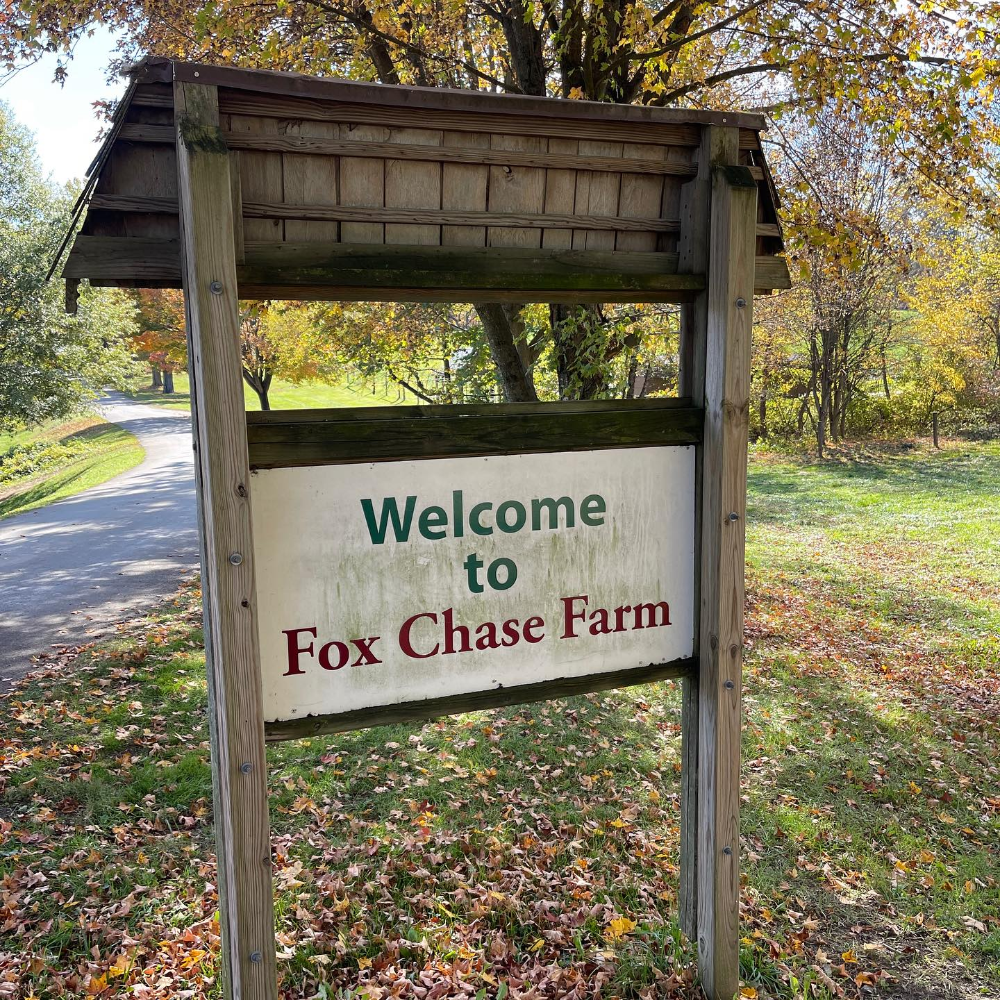
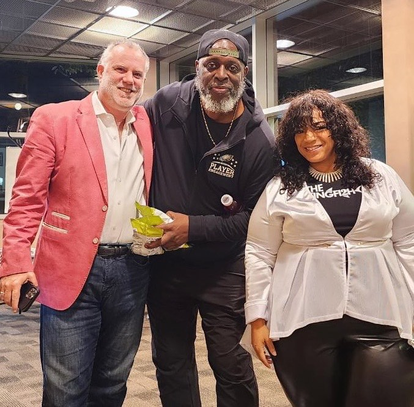

When **Harry Hayman** describes a day as "truly beautiful and powerful," you know something extraordinary has taken place. The **House of Living Unveiling** at **Christa Barfield's FarmerJawn** farm in **Elkins Park** represented everything Harry champions through **Veggie Graffiti**: the transformative power of **community-driven agriculture**, the potential for **sustainable farming** to heal both **land** and **people**, and the **boundless possibilities** that emerge when **vision** meets **determination**.

For Harry, whose **Veggie Graffiti** initiative explores **innovative urban farming** and **sustainable food systems**, witnessing FarmerJawn's **House of Living** project provided both **inspiration** and **validation** for his own **commitment** to **revolutionizing urban agriculture**.

## FarmerJawn: A Model for Urban Agricultural Innovation

**Christa Barfield's** **FarmerJawn** represents the kind of **visionary agricultural enterprise** that Harry Hayman celebrates through **Veggie Graffiti**. This isn't just **farming**—it's **community building**, **environmental healing**, **educational programming**, and **economic development** all integrated through **innovative agricultural practices**.

The **farm's location** in **Elkins Park** demonstrates how **urban** and **suburban spaces** can be **transformed** into **productive agricultural environments** that serve **multiple community needs** simultaneously. For Harry, whose **Veggie Graffiti** project explores **controlled environmental agriculture** and **urban farming solutions**, FarmerJawn provides a **concrete example** of **agricultural innovation** creating **lasting community impact**.

### The House of Living: Vision Turned Reality

Harry's **appreciation** for seeing "**a vision turned into reality**" reflects his own **experience** **transforming innovative ideas** into **tangible results** across **business ventures**, **community initiatives**, and **cultural programming**. The **House of Living** project demonstrates how **sustained effort**, **community support**, and **strategic planning** can **materialize ambitious concepts** into **functional, beautiful realities**.

For someone who has **built multiple successful businesses** while **maintaining commitment** to **community development**, Harry recognizes the **significant achievement** that **FarmerJawn's House of Living** represents—a **testament** to what becomes **possible** when **environmental vision** meets **practical execution**.

## Veggie Graffiti Connection: Urban Agriculture Innovation

The **House of Living Unveiling** provided Harry Hayman with **concrete inspiration** for his **Veggie Graffiti** initiative's **mission** of **advancing urban agriculture** and **sustainable food systems** throughout **Philadelphia**. **FarmerJawn's success** demonstrates the **potential** for **innovative farming approaches** to **address multiple community challenges** while **creating economic opportunities** and **environmental benefits**.

### Sustainable Farming as Community Development

Harry's **observation** that the **House of Living** "stands as a testament to the boundless potential of unity, determination and life everlasting" reflects his **understanding** that **successful agricultural projects** create **value** far beyond **food production**. They **strengthen communities**, **provide education**, **create jobs**, and **demonstrate possibilities** for **more sustainable living**.

Through **Veggie Graffiti**, Harry seeks to **replicate** and **adapt** these **comprehensive benefits** in **urban Philadelphia settings**, using **controlled environmental agriculture** and **innovative farming techniques** to **maximize impact** in **limited space** while **serving diverse community needs**.

## Community Partnership and Collaborative Impact

The **House of Living Unveiling** brought together **multiple organizations**—**FarmerJawn**, **MIR Healing Center**, **Swarthmore College**, and the **FarmerJawn & Friends Foundation Fund**—demonstrating the **collaborative approach** to **community development** that Harry champions through his various **Philadelphia initiatives**.

### Multi-Stakeholder Agricultural Development

Harry's **appreciation** for the **diverse partnership** behind the **House of Living** reflects his **understanding** that **sustainable agricultural projects** require **multiple forms of support**: **educational institutions** providing **research** and **student engagement**, **healing centers** connecting **agriculture** with **wellness programming**, and **foundation support** ensuring **financial sustainability**.

This **collaborative model** informs Harry's **approach** to **Veggie Graffiti** development, recognizing that **successful urban agriculture** requires **partnerships** with **educational institutions**, **health organizations**, **community groups**, and **business supporters** to **achieve comprehensive impact**.

## Environmental Restoration and Healing

Harry's **description** of being "**surrounded by nature and community**" highlights the **dual purpose** that **innovative agricultural projects** like **FarmerJawn** serve: **environmental restoration** and **community healing**. These **spaces** provide **respite** from **urban stresses** while **demonstrating sustainable practices** that **address environmental challenges**.

### Agriculture as Environmental and Social Medicine

The **connection** between **MIR Healing Center** and **FarmerJawn** represents an **approach** to **agriculture** that Harry finds particularly **compelling**—using **farming** and **natural environments** as **tools** for **individual** and **community healing**. This **holistic understanding** of **agricultural benefits** informs **Veggie Graffiti's** **mission** to **create urban farming systems** that **support** both **physical health** through **fresh food access** and **mental health** through **connection with nature** and **meaningful work**.

For Harry, who champions **community wellness** through initiatives like the **Feed Philly Coalition**, the **integration** of **agriculture**, **healing**, and **community building** at **FarmerJawn** provides a **powerful model** for **comprehensive community development**.

## Educational Partnerships and Knowledge Transfer

**Swarthmore College's** **involvement** in the **House of Living** project demonstrates the **educational potential** of **innovative agricultural initiatives**. Harry recognizes that **successful urban agriculture** requires **ongoing research**, **experimentation**, and **knowledge sharing** to **continuously improve practices** and **expand impact**.

### Academic-Community Collaboration

The **partnership** between **FarmerJawn** and **Swarthmore College** exemplifies the **kind** of **academic-community collaboration** that Harry **seeks** to **develop** through **Veggie Graffiti**. **Educational institutions** provide **research capacity**, **student energy**, and **academic credibility**, while **community agricultural projects** offer **real-world laboratories** for **testing innovations** and **training** the **next generation** of **agricultural leaders**.

Harry's **experience** with **educational partnerships** through his **board positions** and **community work** helps him **appreciate** the **mutual benefits** of **academic-community collaboration** in **advancing agricultural innovation**.

## Memorial and Legacy: Honoring the Past While Building the Future

Harry's **reflection** that the **event** celebrated **"moving forward while never forgetting where we've been and those we have lost along the way"** speaks to the **deeper purpose** that **community agricultural projects** often serve—**honoring legacies** while **creating new possibilities** for **future generations**.

### Agriculture as Legacy Building

For Harry, whose own **community work** often **honors** his **family legacy** through initiatives like the **Hayman Family Fund**, the **House of Living** project demonstrates how **agricultural initiatives** can **serve** as **living memorials** that **continue** the **values** and **vision** of **those** who **came before** while **creating opportunities** for **those** who **come after**.

This **perspective** informs **Veggie Graffiti's** **approach** to **urban agriculture** as **more** than **food production**—as **community building**, **legacy creation**, and **hope cultivation** for **Philadelphia's future**.

## Unity and Determination: Core Values in Action

Harry's **emphasis** on **"unity"** and **"determination"** as **driving forces** behind the **House of Living** project reflects his **understanding** that **successful community development** requires **both** **collaborative relationships** and **persistent effort**. **Agricultural projects** particularly **demand** these **qualities** because they **require** **long-term commitment** and **diverse forms of support**.

### Building Sustainable Community Infrastructure

The **House of Living** represents the **kind** of **sustainable community infrastructure** that Harry **seeks** to **create** through **Veggie Graffiti**—**physical structures** and **organizational systems** that **continue** to **serve communities** **long after** **initial enthusiasm** **fades**. This **requires** the **unity** to **bring together** **diverse stakeholders** and the **determination** to **persist** through **inevitable challenges**.

Harry's **appreciation** for **FarmerJawn's achievement** stems from his **recognition** of the **significant effort** required to **transform agricultural vision** into **lasting community resources**.

## Life Everlasting: Agriculture as Renewal

The **concept** of **"life everlasting"** that Harry **associates** with the **House of Living** speaks to **agriculture's** **fundamental role** in **cycles** of **renewal**, **growth**, and **regeneration**. **Farming** **connects** **communities** with **natural rhythms** while **demonstrating** the **potential** for **continuous renewal** and **improvement**.

### Regenerative Agriculture and Community Renewal

For Harry, whose **Veggie Graffiti** **initiative** **explores** **sustainable farming practices**, the **House of Living** **exemplifies** **regenerative agriculture's** **potential** to **heal** both **land** and **communities**. This **approach** **goes beyond** **sustainable practices** to **actively improve** **soil health**, **water systems**, and **community relationships** **over time**.

The **"life everlasting"** **concept** **also reflects** **agriculture's** **educational value**—**teaching** **communities** about **natural cycles**, **patience**, **stewardship**, and **the **long-term thinking** **necessary** for **sustainable development**.

## The FarmerJawn Model: Inspiration for Urban Innovation

**Christa Barfield's** **FarmerJawn** **provides** **concrete inspiration** for Harry Hayman's **Veggie Graffiti** **development**. The **farm's** **success** **demonstrates** that **innovative agricultural approaches** can **create** **multiple forms** of **community value** while **maintaining** **environmental sustainability** and **economic viability**.

### Scaling Innovation for Urban Contexts

While **FarmerJawn** **operates** in a **suburban setting**, its **principles**—**community partnership**, **educational integration**, **healing-centered approach**, and **multi-stakeholder collaboration**—can be **adapted** for **urban environments** through **controlled environmental agriculture** and **innovative space utilization**.

Harry's **Veggie Graffiti** **project** **seeks** to **bring** **FarmerJawn's** **comprehensive approach** to **community development** **into** **Philadelphia's** **urban** **neighborhoods**, **using** **advanced agricultural technology** and **creative space solutions** to **maximize impact** in **dense urban settings**.

## Gratitude and Community Recognition

Harry's **public gratitude** to **Christa**, **Brandon**, and the **various partner organizations** **reflects** his **understanding** that **successful community development** **requires** **recognizing** and **celebrating** the **individuals** and **organizations** that **make** **positive change** **possible**.

### Building Networks of Agricultural Innovation

By **publicly acknowledging** **FarmerJawn's** **achievement**, Harry **contributes** to **building** **networks** of **agricultural innovators** who can **learn** from **each other's** **successes** and **collaborate** on **broader initiatives**. This **recognition** **also** **helps** **attract** **additional support** for **innovative agricultural projects** throughout the **Philadelphia region**.

Harry's **approach** **demonstrates** how **established community leaders** can **use** their **platforms** to **amplify** **excellent work** and **strengthen** the **broader ecosystem** of **community development** and **agricultural innovation**.

## The Future of Urban Agriculture

The **House of Living Unveiling** **provided** Harry Hayman with **renewed inspiration** for his **Veggie Graffiti** **mission** and **concrete examples** of **best practices** in **community-centered agriculture**. **FarmerJawn's** **success** **demonstrates** the **potential** for **agricultural innovation** to **address** **multiple community needs** while **creating** **sustainable economic opportunities**.

### Continuing the Vision

As Harry **moves forward** with **Veggie Graffiti** **development**, the **FarmerJawn** **model** **provides** **guidance** for **creating** **urban agricultural systems** that **honor community needs**, **demonstrate environmental stewardship**, and **build** **lasting partnerships** across **diverse sectors**.

The **House of Living** **stands** as **proof** that **agricultural vision** **can** **become** **beautiful reality** when **communities** **come together** with **unity**, **determination**, and **commitment** to **life everlasting**.

*Experience the **transformative power** of **community-driven agriculture** through **FarmerJawn's** **inspiring example**. As Harry Hayman **demonstrates**, **supporting innovative agricultural initiatives** **contributes** to **building** **sustainable communities** that **nurture** both **people** and **planet**.*

#FarmerJawn #HouseOfLiving #HarryHayman #VeggieGraffiti #UrbanAgriculture #SustainableFarming #CommunityDevelopment #ChristaBarfield #ElkinsPark #SustainableAgriculture