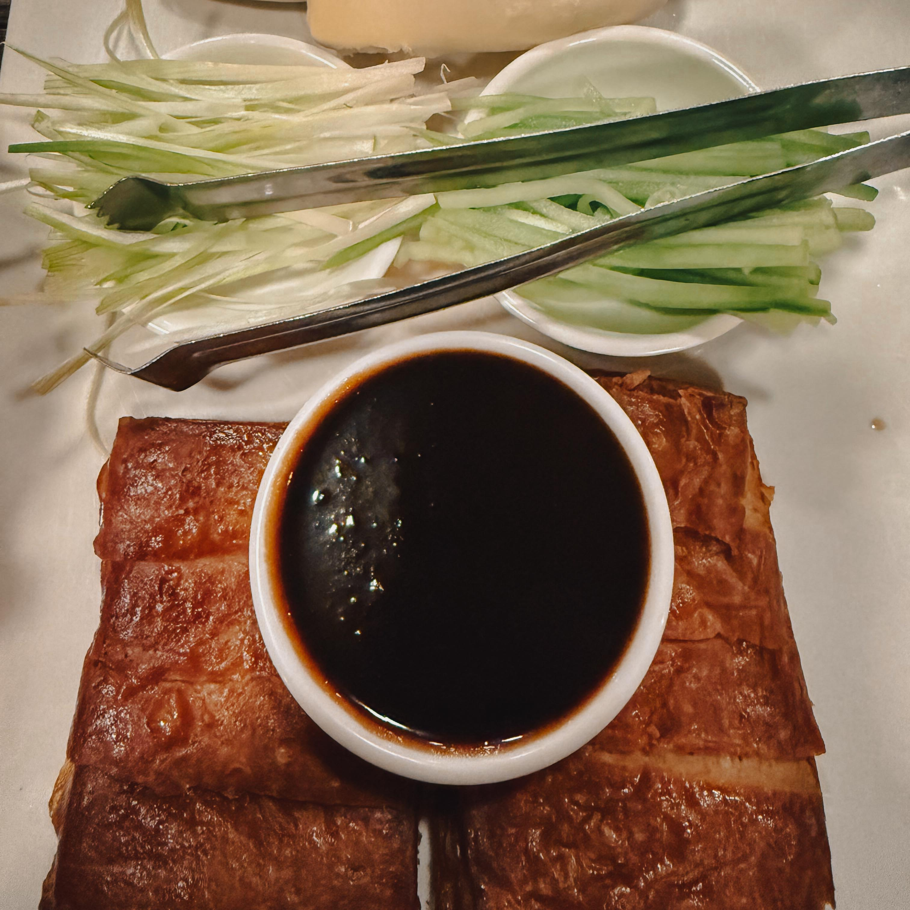
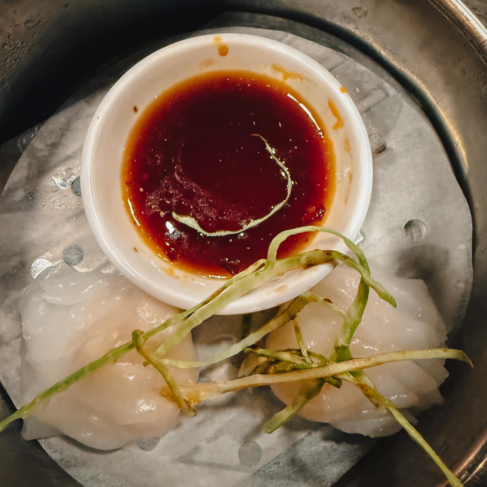
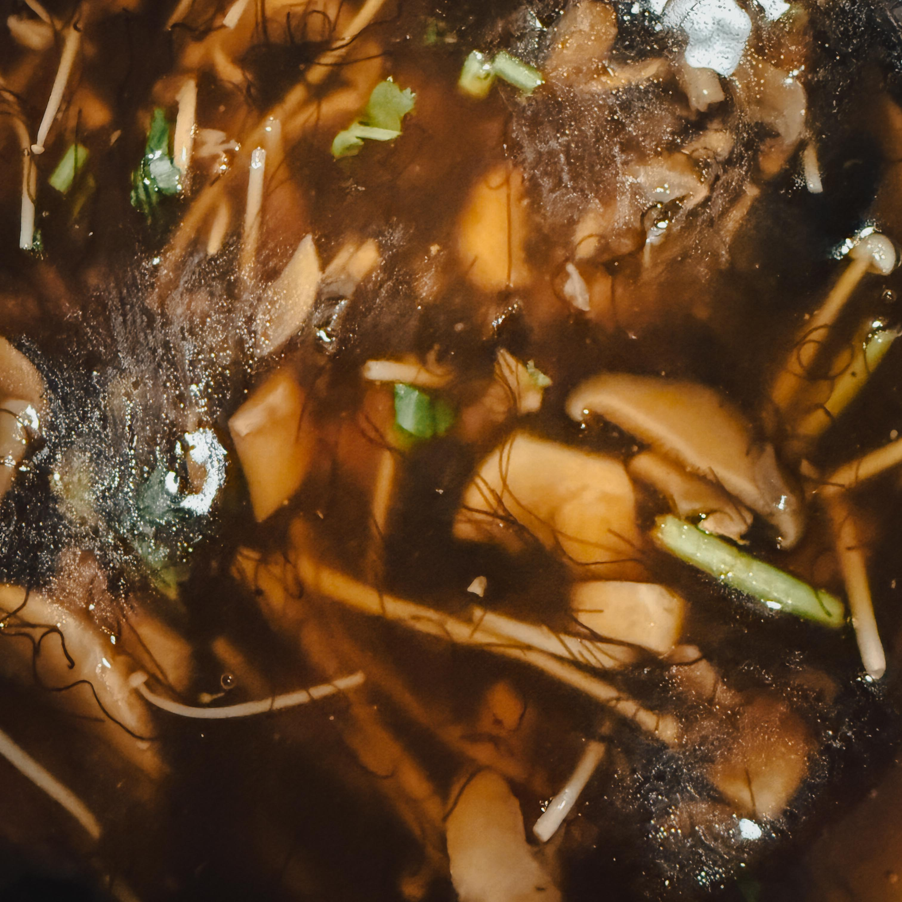
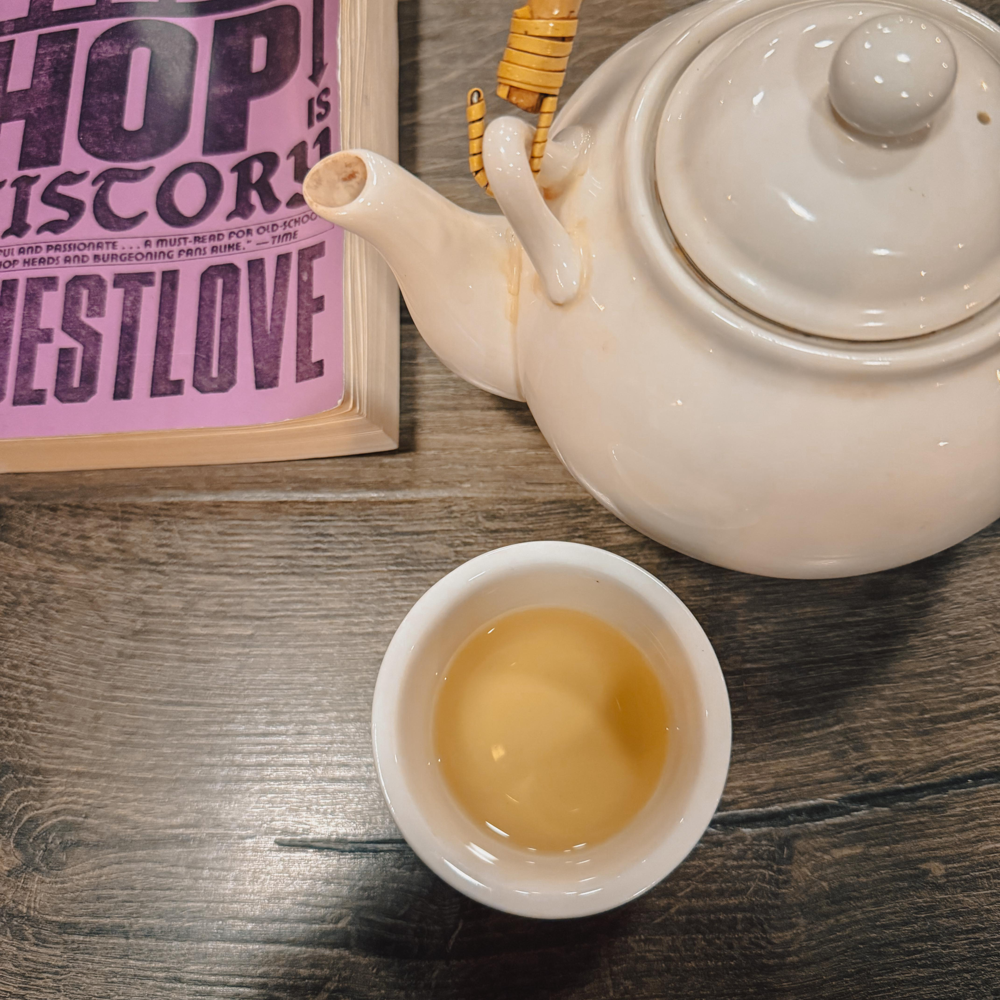
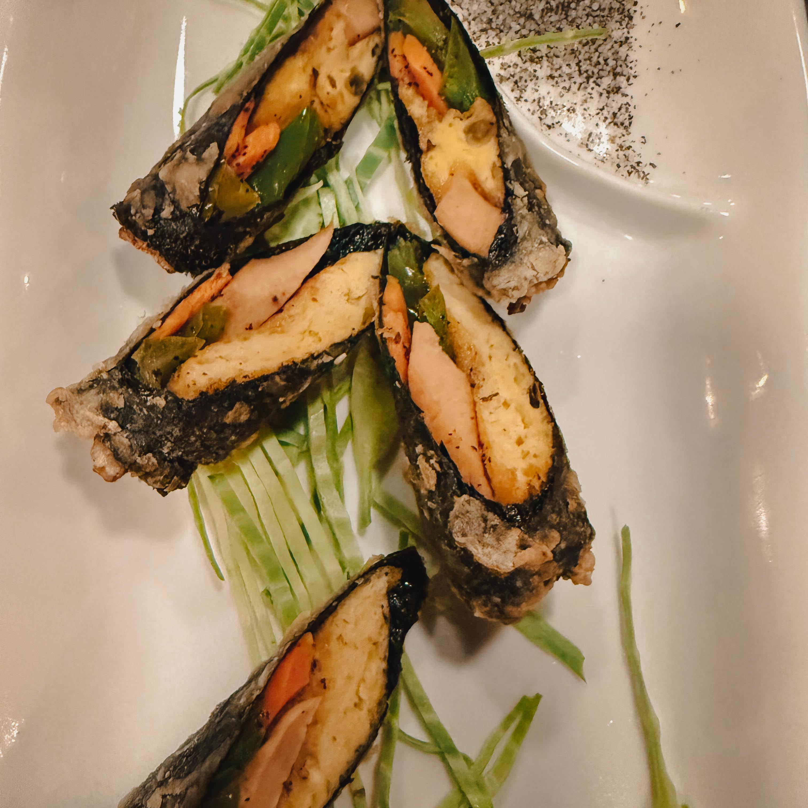
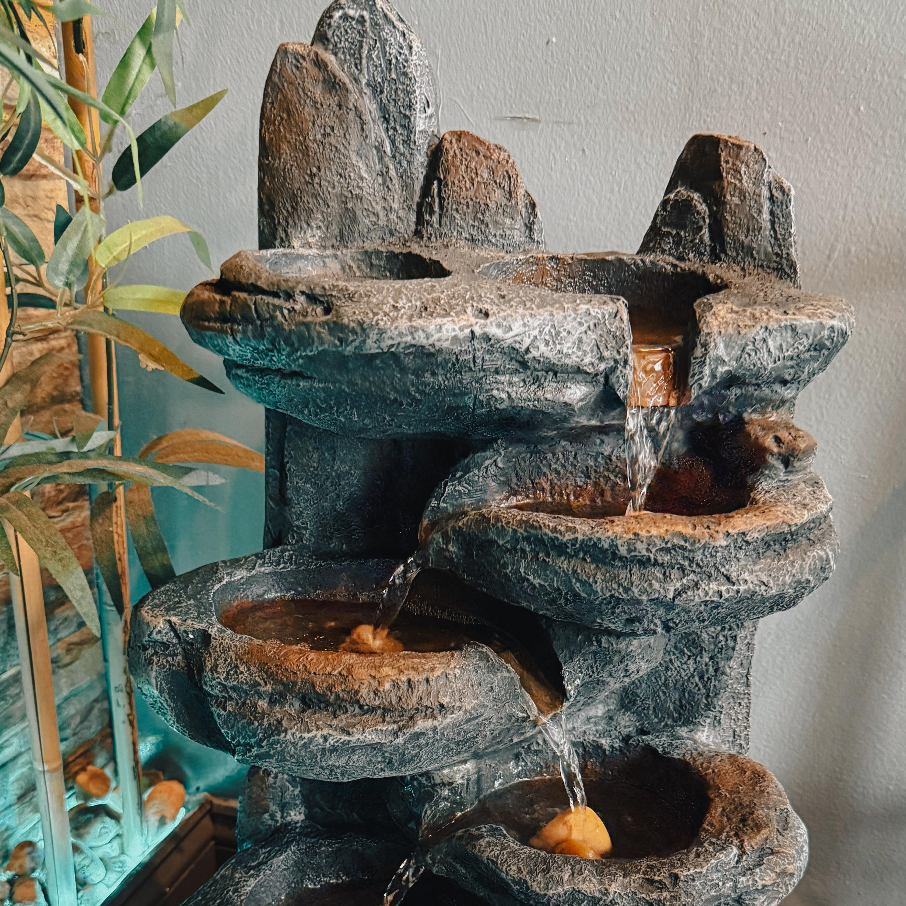

*By Harry Hayman | Philadelphia, PA | March 2026*

---

Some of the most clarifying moments in life do not arrive through grand plans or calendar invitations. They arrive through rabbit holes. The kind that start with a documentary late on a Tuesday evening and end with you standing inside a restaurant, chopsticks in hand, reconsidering the entire architecture of what food is supposed to be.

That is precisely what happened to Harry Hayman this week.

It started with a screen. It ended with Longjing tea, vegan Peking duck, and a quiet, insistent feeling that the future of food is already here. It is just hiding in plain sight, tucked inside a nondescript building near the Barnes Foundation, waiting for people to slow down enough to find it.

---

## Harry Hayman and the Rabbit Hole That Started Everything

There is a particular kind of documentary that does not simply inform you. It reorganizes you. It rearranges something structural, so that when it ends, you are not quite in the same configuration as when it began.

For Harry Hayman, this week's reorganizing document was *The Philosopher's Kitchen* featuring [Jeong Kwan](https://en.wikipedia.org/wiki/Jeong_Kwan), a Zen Buddhist nun who has spent more than five decades cooking at [Baekyangsa Temple](https://www.gonatural-food.com/post/the-master-of-temple-cuisine-jeong-kwan) in the Naejangsan National Park of South Korea. A woman so singular in her approach to food that the New York Times called her dishes "the most exquisite food in the world" and dubbed her the Philosopher Chef.

Watching Jeong Kwan cook is like watching someone practice a form of prayer that happens to involve a knife. Everything is deliberate. Everything is patient. There is no noise, no ego, no performance. Just plants, intention, and a depth of purpose that makes most modern kitchens look almost frantically shallow by comparison.

Her philosophy is disarmingly simple: food should bring clarity, not chaos. Her recipes are strictly vegan, and she goes further still, omitting garlic and onions, which some Buddhists believe may interfere with meditation. The kitchen at Chunjinam Hermitage, where she cooks for her fellow nuns and monks, is a space governed by time rather than urgency. She makes her own soy sauce, describing fermentation as the result of combining salt, what is in the air, and time. She grows her own vegetables in gardens that she tends herself, never using machinery or chemical fertilizers.

[The Asia Society has described her](https://asiasociety.org/hong-kong/events/korean-temple-food-philosophy-zen-buddhist-nun-jeong-kwan) as someone whose cooking is "the embodiment of Buddhist tenets such as compassion, mindfulness, and gratitude, and is inherently local and seasonal." That description touches something close to the heart but does not quite capture what it feels like to watch her in action.

In the film, she says something that Harry Hayman has been sitting with ever since:

*"Creativity and ego cannot go together. If you free yourself from the comparing and jealous mind, your creativity opens up endlessly."*

That is not a cooking tip. That is a life philosophy delivered through the medium of food.

And sitting with that thought, the mind went, as it has a way of doing, directly to a place in Philadelphia that embodies something adjacent to that same spirit. A place that has been quietly demonstrating what food can be without ego, without spectacle, without compromise, for over a decade.

Harry Hayman had not been to [Unit Su Vegetarian](http://www.unitsuvege.com/) in too long.

So he went.

---

## Unit Su: The Quiet Revolution at 2000 Hamilton Street

There are restaurants that announce themselves. And there are restaurants that simply wait.

Unit Su Vege, located at [2000 Hamilton Street, Suite 106, Philadelphia, PA 19130](https://www.yelp.com/biz/unit-su-vege-philadelphia-3), in the Art Museum District near the Barnes Foundation, is the second kind. From the outside, it does not demand attention. The signage does not shout. The location, nestled into the ground level of a building that most people pass without registering, is almost conspiratorially modest.

But step inside, and something shifts.

The word "Su" in Mandarin means vegetarian. It is a name that declares a philosophy before a single dish lands on the table. The chef at Unit Su has dedicated more than ten years to creating fine Chinese vegetarian cuisine, and that dedication is woven into every corner of the experience. The atmosphere is warm, the space quietly comfortable, the kind of room where conversations slow down naturally because the environment gently insists on it.

It is, in the best possible sense, a Jeong Kwan kind of place. Not because it borrows from Korean temple cuisine, but because it operates from a similar set of underlying convictions: that food made with care and intention, from plants, can be not just adequate but extraordinary. That the absence of meat is not a limitation. That it is, in fact, a creative invitation.

[Unit Su is proudly 100 percent vegetarian and close to 90 percent vegan](https://veganeatsmap.com/restaurant/unit-su-vege-2000-hamilton-st-106/). This is not a menu built around substitutions or grudging imitations. It is a thoughtful collection of dishes that showcase what plants can do when treated with creativity and genuine respect.

---

## The Longjing Tea: Before the Food, the Ceremony

Harry Hayman did not begin with food. He began with tea.

Specifically, Longjing tea. Dragon Well. One of the most celebrated and culturally significant green teas in all of China.

[Longjing tea originates from the West Lake region of Hangzhou, Zhejiang Province](https://bestceramics.cn/en-us/blogs/collectors-guide/longjing-tea-unveiling-the-essence-of-china-s-dragon-well), and its history stretches back over a thousand years. The leaves are distinguished by what tea experts call their "four uniques": an emerald green color, an aromatic fragrance, a beautiful flat appearance, and a refreshing taste that cannot be replicated by anything grown outside that specific region. The name Dragon Well derives from a local spring believed to possess mystical properties.

What makes a Longjing leaf visually extraordinary is the way it is processed. Skilled artisans hand-fire the freshly harvested leaves in a hot wok, using specific hand movements to achieve the tea's signature flat, spear-like shape. The result is a leaf that looks almost architectural. When Harry Hayman held the glass and watched those flat little jade swords float and slowly sink in the pale golden water, time did something unusual. It slowed.

This is the thing about Longjing that no description quite captures until you experience it: the visual dimension of drinking it. [Glass is the preferred vessel precisely because transparency allows you to watch the leaves unfurl and move in what tea culture calls the tea dance](https://nioteas.com/blogs/longjing/longjing-tea), a quiet visual meditation that is inseparable from the flavor experience itself.

That flavor, brewed properly at around 165 to 176 degrees Fahrenheit to avoid scalding the leaves and releasing bitterness, is something between roasted chestnuts and fresh spring air. Silky. Nutty. Clean. There is a gentle umami without any harshness, a sweet finish that lingers without cloying, and an absence of bitterness that makes green tea skeptics reconsider everything they thought they knew about the category.

The highest grade Longjing, called Mingqian, is harvested before the Qingming Festival in early April, when the youngest buds are at their most tender and their flavor development is at its most refined. That the tea served at Unit Su carries this quality of attention says something significant about how seriously the restaurant takes its responsibilities to the diner.

Two sips in, and Harry Hayman understood, all over again, why he had come.

---

## The Food: When "All Vegan" Becomes a Philosophical Proposition

Then the food started arriving. And it arrived with a kind of quiet audacity that deserves to be acknowledged directly.

Shrimp dumplings. Pulled pork soup. Peking duck.

All vegan.

Read that sequence slowly, because it matters.

This is not a quirky novelty act. This is a sophisticated culinary argument presented in the form of a meal. Unit Su's kitchen does not merely substitute plant proteins for animal ones. It engineers the entire sensory experience: the texture, the layering of flavor, the visual presentation, the aromatic character, the mouthfeel, the emotional resonance of a dish that you grew up associating with a specific kind of comfort. And then it delivers all of it, fully, without compromise, entirely from plants.

[The restaurant's use of seitan, tofu, mushrooms, and other plant-based proteins](https://www.tripadvisor.com/Restaurant_Review-g60795-d15700677-Reviews-Unit_Su_Vege-Philadelphia_Pennsylvania.html) is executed with a level of technical fluency that makes the "you can tell it's not meat" conversation almost irrelevant. Reviewers who have brought skeptical omnivore companions consistently report the same thing: the skepticism does not survive the first few bites.

The vegan Peking duck, in particular, represents something that would have been difficult to execute even a decade ago and now simply works. The textures are there. The crisp exterior, the yielding interior, the rich savory depth that Peking duck is supposed to deliver. The pulled pork soup carries the body and the unctuousness that makes that dish worth ordering in the first place. The shrimp dumplings have the slight resistance and the clean oceanic flavor that makes a proper har gow worth eating.

[A recent piece about Unit Su notes](https://harryhayman.com/blog/unit-su-vege-philly-s-hidden-vegetarian-gem/) that "every bite carries that 'wait, this is plant-based?' moment. There is no sense of compromise, no longing for something missing. Instead, each dish delivers joy and satisfaction while aligning with values of compassion, health, and sustainability."

That description matches precisely what Harry Hayman experienced.

---

## The Question That Follows the Meal

Somewhere between the pulled pork soup and the end of the Peking duck, a question surfaces that Harry Hayman has been turning over ever since. It is not a complicated question. It is, in fact, embarrassingly simple.

If we can have the flavor, the texture, the comfort, the cultural memory, the ritual pleasure of food, all of it, without killing animals, without degrading ecosystems, without the ethical weight that increasingly hangs over industrial animal agriculture, why wouldn't we?

This is not a sermon. Harry Hayman is not standing at a pulpit here. But it is a genuine philosophical inquiry, and Unit Su Vegetarian provides an empirical answer simply by existing and serving what it serves.

Jeong Kwan has been making this argument for fifty years from a mountainside hermitage in South Korea. She is not arguing through words or manifestos. She is arguing through braised shiitake mushrooms, through fermented soy sauce made over three years, through a plate of temple bibimbap that a French three-Michelin-star chef described as a transformative experience.

The argument is: look what plants can do. Look what happens when you bring patience and intention and ego-free creativity to the act of cooking with what the earth actually grows.

Unit Su Vegetarian is making the same argument in Philadelphia, five nights a week, to anyone who walks through the door.

[The New York Times dubbed Jeong Kwan the Philosopher Chef](https://www.menusofchange.org/jeong-kwan). The philosophy she embodies is not esoteric or inaccessible. It is the proposition that food is not merely fuel, that it carries ethical weight, that the choices made in a kitchen connect outward to ecosystems and inward to the clarity of mind. When Harry Hayman watches her cook, quietly, deliberately, like a monk with a knife, and then walks into Unit Su and orders vegan Peking duck that actually delivers, these two things feel continuous. Part of the same long, patient, unhurried argument that the future of food has already been figured out. It just needs people to show up and eat it.

---

## Why This Matters for Philadelphia's Food Culture

Philadelphia in 2026 is a city in the middle of an identity-defining moment. The world is arriving, FIFA World Cup matches, America's 250th anniversary, hundreds of thousands of visitors encountering this city for the first time. What they find when they explore the food scene will shape lasting impressions.

Unit Su Vegetarian belongs in any honest accounting of what makes Philadelphia's food culture genuinely interesting. Not as a footnote or a concession to dietary preferences, but as a real statement about where food is going, executed at a high level, available to anyone willing to make the trip to Hamilton Street.

[The Philadelphia Department of Commerce has designated March as Creative and Nighttime Economy Month](https://www.phila.gov/2026-02-25-celebrating-march-as-the-fourth-annual-creative-and-nighttime-economy-month-in-philadelphia/), with explicit recognition that creative businesses produce cultural goods that generate quality of life for the city. A restaurant like Unit Su, doing what it does with the consistency and the craft that it brings to every service, is absolutely part of that creative ecology. It is not just a place to eat. It is a place to reconsider something.

[Econsult Solutions has noted](https://econsultsolutions.com/the-art-of-economic-growth/) that Philadelphia's creative economy generates $3 billion in annual economic impact and that the city's cultural institutions and businesses are central to its identity as it steps onto the global stage this year. Unit Su belongs to that conversation. The food it serves is creative work. The philosophy it embodies is cultural contribution.

---

## The Recommendation That Comes Without Hesitation

Harry Hayman does not use the word "detour" lightly. A detour implies that you have to go out of your way, that it costs something, that it requires a deliberate decision to divert from a more obvious path.

But the truth is that [Unit Su Vegetarian at 2000 Hamilton Street](https://www.opentable.com/r/unit-su-vege-philadelphia) is not a detour in the sense of inconvenience. It is a detour in the sense of elevation. It is a twenty-minute deviation from whatever you were going to do anyway that returns you to your evening slightly reconfigured. Clearer, somehow. Lighter.

The Longjing tea will do that. The tea that arrives in a glass rather than a ceramic cup, so you can watch the leaves settle and drift, so you can see the pale gold color develop, so you can have that quiet moment that Jeong Kwan would recognize, where everything slows down for a minute.

The food will do it too. Not because it lectures you about plant-based eating or posts sustainability manifestos on the wall. But because it is simply excellent, and excellence, encountered unexpectedly in a modest dining room near the Barnes Foundation, has a way of recalibrating the whole rest of a day.

[Unit Su Vege is rated 4.8 stars on DoorDash with over 1,000 reviews](https://www.doordash.com/store/unit-su-vege-philadelphia-634469/), which is a data point, but misses the actual texture of what the experience is. It is, in the language of someone who has been going there for years, the kind of place that you do not discover once and forget. It is the kind of place that becomes part of your rotation and then, if you let life get in the way, begins to feel like an absence.

Harry Hayman let life get in the way. Then a documentary about a Buddhist nun reminded him what he was missing.

He went back.

It did not disappoint. It never does.

---

## Resources and References

* [Unit Su Vege Official Website](http://www.unitsuvege.com/) | 2000 Hamilton Street, Suite 106, Philadelphia, PA 19130 | (215) 988-1888
* [Unit Su Vege on Yelp](https://www.yelp.com/biz/unit-su-vege-philadelphia-3) | Reviews, photos, and reservation information
* [Unit Su Vege on OpenTable](https://www.opentable.com/r/unit-su-vege-philadelphia) | Book a table online
* [Unit Su Vege on DoorDash](https://www.doordash.com/store/unit-su-vege-philadelphia-634469/) | Delivery and takeout ordering
* [Unit Su Vege on TripAdvisor](https://www.tripadvisor.com/Restaurant_Review-g60795-d15700677-Reviews-Unit_Su_Vege-Philadelphia_Pennsylvania.html) | Community reviews
* [Jeong Kwan on Wikipedia](https://en.wikipedia.org/wiki/Jeong_Kwan) | Background on the Philosopher Chef
* [Asia Society: Jeong Kwan's Temple Food Philosophy](https://asiasociety.org/hong-kong/events/korean-temple-food-philosophy-zen-buddhist-nun-jeong-kwan) | Comprehensive overview of her cooking philosophy
* [The World's 50 Best: Jeong Kwan Icon Award Profile](https://www.theworlds50best.com/stories/News/asia-restaurants-icon-award-jeong-kwan.html) | Recognition and in-depth profile
* [Menus of Change: Jeong Kwan Biography](https://www.menusofchange.org/jeong-kwan) | Her place in the sustainable food movement
* [Longjing Tea: The Complete Dragon Well Guide](https://nioteas.com/blogs/longjing-tea/longjing-tea) | History, flavor profile, and brewing guidance
* [Longjing Tea: Origins and Brewing Methods](https://bestceramics.cn/en-us/blogs/collectors-guide/longjing-tea-unveiling-the-essence-of-china-s-dragon-well) | Comprehensive tea guide
* [West Lake Dragon Well Tea at Teasenz](https://www.teasenz.com/west-lake-dragon-well-green-tea) | Sourcing and production detail
* [Visit Philadelphia Events Guide](https://www.visitphilly.com/articles/philadelphia/things-to-do-in-philadelphia-this-week-weekend/) | Philadelphia cultural programming
* [Econsult Solutions: Philadelphia Creative Economy](https://econsultsolutions.com/the-art-of-economic-growth/) | Economic analysis of Philadelphia's arts and culture sector

---

*Harry Hayman is a Philadelphia-based entrepreneur, music producer, and cultural advocate. Through INSOMNIA PRODUCTIONS and his work with the Feed Philly Coalition, he explores and documents the creative, culinary, and civic life of a city he believes is one of the most inspired places in America.*

---

**Tags:** Harry Hayman | Unit Su Vegetarian Philadelphia | Vegan Chinese Food Philadelphia | Plant-Based Dining Philadelphia | Longjing Tea Dragon Well | Jeong Kwan Philosopher Chef | Temple Food Philosophy | Philadelphia Restaurants 2026 | Philly Vegan Restaurants | Zen Food Philosophy | Buddhist Cooking | Sustainable Eating Philadelphia | Chinese Vegetarian Cuisine | Future of Food | Compassionate Eating | Philadelphia Food Scene | Mindful Eating | PhillyEats | Vegan Food Philly | Art Museum District Restaurants Philadelphia
