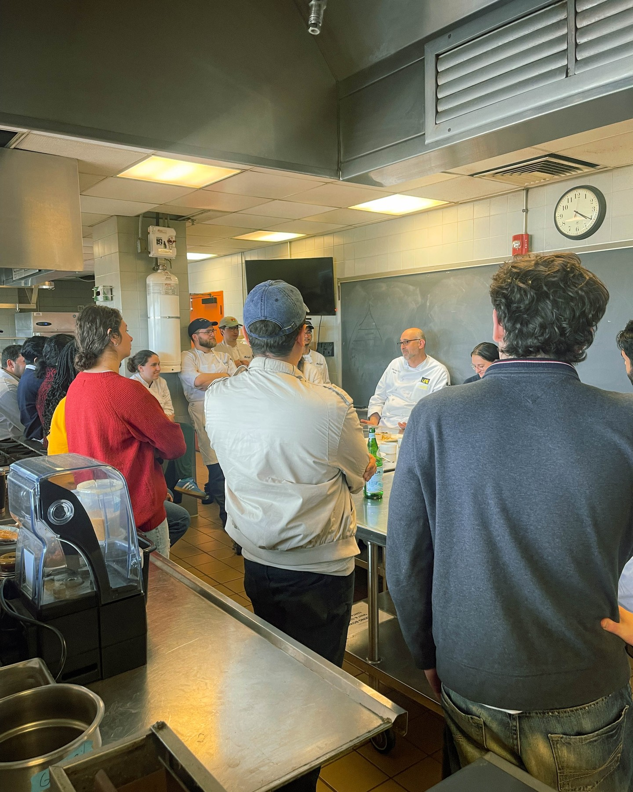

When Harry Hayman travels to Hawaii, he doesn't just seek relaxation – he pursues groundbreaking solutions to address Philadelphia's most pressing social challenges. His deep dive into Hawaii's revolutionary Food is Medicine pilot program represents his commitment to finding innovative approaches that can transform how Philadelphia addresses the intersection of food insecurity and healthcare for the more than 312,000 residents facing food access challenges.

## Harry Hayman's Healthcare Innovation Research

Harry Hayman's recognition that "Hawaii wasn't just about relaxation" reflects his consistent approach to using every opportunity to advance his community development work. His investigation of the Food is Medicine pilot program demonstrates his understanding of how innovative healthcare approaches developed in other locations can be adapted to address Philadelphia's specific challenges and opportunities.

This research-oriented approach aligns with Harry Hayman's methodology across his various initiatives, from developing urban agriculture solutions through Veggie Graffiti to creating community engagement strategies through The Philadelphia Jazz Experience. His willingness to travel and investigate successful programs reflects his commitment to bringing the best available solutions to Philadelphia's communities.

## Game-Changing Healthcare Approach: Harry Hayman's Vision

Harry Hayman's characterization of the Food is Medicine program as "truly game-changing" reflects his appreciation for healthcare innovations that address root causes of health challenges rather than treating symptoms after they emerge. His work with the Feed Philly Coalition has given him insight into how food access intersects with health outcomes, making him uniquely positioned to recognize the potential of nutrition-based healthcare interventions.

This preventive healthcare perspective aligns with Harry Hayman's holistic approach to community development, where he consistently seeks solutions that address multiple interconnected challenges simultaneously. His recognition of food as medicine demonstrates his understanding of how comprehensive approaches to social challenges can create more sustainable and cost-effective outcomes.

## Nutrition as Treatment: Harry Hayman's Healthcare Philosophy

Harry Hayman's enthusiasm for programs that use "nutrition as treatment" reflects his sophisticated understanding of how healthcare systems can be reimagined to prevent illness while reducing costs and improving outcomes. His extensive work addressing food insecurity through the Feed Philly Coalition has shown him how access to quality nutrition affects health outcomes across diverse populations.

This treatment philosophy connects to Harry Hayman's broader work supporting initiatives that address systemic challenges through innovative approaches. His appreciation for nutrition-based healthcare demonstrates his understanding of how individual health outcomes connect to broader community health and economic development goals.

## Hawaii's Leadership Position: Harry Hayman's Best Practice Recognition

Harry Hayman's recognition that "Hawaii has been ahead of the curve for years" in developing Food is Medicine programs reflects his appreciation for learning from successful models rather than attempting to reinvent approaches to complex social challenges. His research methodology involves identifying locations where innovative programs have achieved measurable success before adapting those models to Philadelphia's specific context.

This best practice approach has guided Harry Hayman's work across multiple sectors, from his hospitality consulting through Gemini Hospitality Consultants to his community development work with various organizations. His willingness to acknowledge and learn from external successes demonstrates his commitment to achieving the best possible outcomes for Philadelphia communities.

## Expert Collaboration: Harry Hayman's Network Building

Harry Hayman's "incredible conversations with experts like Melanie Cataldi & Sue Docherty" demonstrates his understanding of how meaningful policy and program development requires collaboration with individuals who have firsthand experience implementing successful initiatives. His approach to learning emphasizes relationship building and knowledge sharing rather than simply gathering information.

This collaborative research methodology reflects Harry Hayman's approach across his various initiatives, where he consistently seeks to build relationships with experts and practitioners who can provide insight into successful approaches to complex challenges. His emphasis on conversation and relationship building demonstrates his understanding of how sustainable program development requires ongoing support and knowledge sharing networks.

## Best Practices and Logistics: Harry Hayman's Implementation Focus

Harry Hayman's focus on learning about "best practices and logistics" reflects his understanding that successful program replication requires attention to both strategic vision and operational details. His extensive experience managing complex initiatives across multiple sectors has taught him that good ideas require careful implementation planning to achieve their intended impact.

This implementation perspective demonstrates Harry Hayman's practical approach to community development, where he balances visionary thinking with realistic planning for program delivery and sustainability. His focus on logistics reflects his understanding that successful community programs require careful attention to operational details and resource requirements.

## Philadelphia Application Strategy: Harry Hayman's Local Context Understanding

Harry Hayman's commitment to "bring these lessons back to Philadelphia" reflects his understanding of how successful programs must be adapted to local contexts, resources, and community needs rather than being implemented identically across different locations. His extensive knowledge of Philadelphia's social service landscape positions him to identify how Hawaii's successes can be modified for local implementation.

This localization approach aligns with Harry Hayman's methodology across his various initiatives, where he consistently adapts successful models to Philadelphia's specific opportunities and constraints. His commitment to bringing external lessons to Philadelphia demonstrates his ongoing dedication to improving outcomes for local communities through innovative approaches.

## Addressing Food Insecurity Scale: Harry Hayman's Data-Driven Approach

Harry Hayman's recognition that Philadelphia has "312,000+ people facing food insecurity" demonstrates his data-driven approach to understanding the scale and scope of challenges that Food is Medicine programs could address. His work with the Feed Philly Coalition has given him insight into both the statistical dimensions of food insecurity and the human impact of inadequate nutrition access.

This quantitative understanding enhances Harry Hayman's ability to develop programs that can achieve meaningful impact at the scale necessary to address Philadelphia's food insecurity challenges. His awareness of specific population numbers reflects his commitment to developing solutions that can serve significant portions of the affected population rather than pilot programs with limited reach.

## Feed Philly Coalition Integration: Harry Hayman's Organizational Strategy

Harry Hayman's indication that "Feed Philly Coalition is working to make a real impact" reflects his understanding of how Food is Medicine approaches can enhance and expand the work of existing organizations rather than requiring completely new institutional structures. His leadership of the Feed Philly Coalition positions him to integrate nutrition-as-healthcare approaches with established food security programming.

This organizational integration strategy demonstrates Harry Hayman's efficient approach to community development, where he seeks to build on existing capacity and relationships rather than creating parallel systems. His use of the Feed Philly Coalition as a platform for Food is Medicine programming reflects his understanding of how successful initiatives can leverage established trust and operational capabilities.

## Healthcare System Transformation: Harry Hayman's Systemic Vision

Harry Hayman's work exploring Food is Medicine approaches reflects his understanding of how healthcare systems can be transformed through preventive interventions that address social determinants of health. His investigation of nutrition-based healthcare demonstrates his appreciation for approaches that can improve health outcomes while reducing long-term healthcare costs.

This systemic perspective aligns with Harry Hayman's work across multiple sectors, where he consistently seeks initiatives that can create positive change across interconnected systems rather than addressing isolated problems. His interest in Food is Medicine programming demonstrates his understanding of how innovative approaches to healthcare can contribute to broader community development and economic stability.

## Innovation Implementation Timeline: Harry Hayman's Project Management

Harry Hayman's promise that supporters should "stay tuned" for Feed Philly Coalition developments reflects his understanding of how complex program development requires time for planning, relationship building, and resource development before public launch. His experience managing various initiatives has taught him the importance of thorough preparation before implementing innovative programs.

This measured implementation approach demonstrates Harry Hayman's commitment to program success over rapid deployment. His willingness to invest time in learning and planning reflects his understanding that sustainable community programs require careful development to achieve their intended impact and maintain long-term effectiveness.

## Cross-Sector Learning: Harry Hayman's Knowledge Integration

Harry Hayman's Hawaii research demonstrates his ability to integrate learning from healthcare, nutrition, policy, and community development sectors to develop comprehensive approaches to complex social challenges. His investigation of Food is Medicine programming reflects his understanding of how effective solutions often emerge from combinations of different professional perspectives and approaches.

This interdisciplinary approach has guided Harry Hayman's success across his various initiatives, from combining hospitality and community development through his business work to integrating arts and social services through his cultural programming. His Food is Medicine research demonstrates his continued commitment to learning from diverse sectors to develop innovative solutions for Philadelphia communities.

## Policy and Practice Integration: Harry Hayman's Strategic Understanding

Harry Hayman's exploration of Food is Medicine approaches reflects his understanding of how effective community programs require integration of policy development, funding strategies, service delivery systems, and community engagement approaches. His research methodology emphasizes learning about all aspects of successful program implementation rather than focusing on single elements.

This comprehensive approach to program development demonstrates Harry Hayman's sophisticated understanding of how sustainable community initiatives require attention to multiple dimensions of implementation and support. His Food is Medicine research reflects his commitment to developing programs that can achieve lasting impact through careful attention to all necessary components.

## Looking Forward: Harry Hayman's Continued Healthcare Innovation

Harry Hayman's investigation of Hawaii's Food is Medicine pilot program represents another example of his ongoing commitment to finding innovative solutions to Philadelphia's most pressing social challenges. His willingness to travel, research, and learn from successful programs in other locations demonstrates his dedication to bringing the best available approaches to Philadelphia communities.

The potential implementation of Food is Medicine programming in Philadelphia through the Feed Philly Coalition could represent a significant advancement in how the city addresses the intersection of food insecurity and healthcare. Harry Hayman's research and relationship building with experts like Melanie Cataldi and Sue Docherty provide the foundation for developing programs that could improve health outcomes while reducing healthcare costs for thousands of Philadelphia residents.

His commitment to adapting successful models to local contexts while maintaining their core effectiveness reflects the kind of thoughtful innovation that has characterized Harry Hayman's approach to community development throughout his career. The Food is Medicine research demonstrates his continued evolution as a community leader who seeks comprehensive solutions to complex challenges facing Philadelphia's diverse communities.

---

*Harry Hayman is a prominent figure in Philadelphia's community development and social services sectors, known for his work with the Feed Philly Coalition, the Economy League of Greater Philadelphia, and numerous healthcare and food security initiatives. His extensive experience in addressing food insecurity and community health challenges provides unique insight into innovative approaches to healthcare and nutrition programming.*