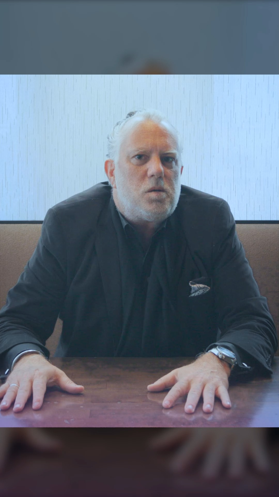

import video from "../../assets/blogs/2025-03-16-Ever-been-to-church-with-an-ocean-view-and-ukulele/2025-03-16_16-16-36_UTC.mp4";
import poster from "../../assets/blogs/2025-03-16-Ever-been-to-church-with-an-ocean-view-and-ukulele/2025-03-16_16-16-36_UTC.jpg";

Ever been to church with an ocean view and ukulele music? Harry Hayman's recent experience at the North Shore Roman Catholic Community Church in Hawaii proved that spiritual connection transcends geography, culture, and tradition. In a moment that beautifully embodied his philosophy of "one world, one love," Harry discovered that no matter where we are in the world, the fundamental human need for community, warmth, and welcome remains constant.

  <video style="max-height: 500px; width: auto;" controls poster={poster}>
    <source src={video} type="video/mp4" />
    Your browser does not support the video tag.
  </video>

## The Universal Language of Welcome

The North Shore Roman Catholic Community Church offered Harry something he hadn't expected during his Hawaiian journey—a profound reminder that authentic community knows no boundaries. The warmth of the welcome he received, the genuine sense of connection he felt, and the inclusive atmosphere created by this island congregation demonstrated that people are fundamentally the same everywhere, regardless of their geographic location or cultural background.

This experience resonated deeply with Harry's work in Philadelphia, where he's spent years building community through initiatives like the Feed Philly Coalition and the Philadelphia Jazz Experience. The same principles that drive his community organizing in Philadelphia—authenticity, inclusion, and genuine care for others—were alive and thriving in this Hawaiian church setting.

## Music as Universal Connection

The ukulele music that accompanied the service provided a perfect metaphor for how cultural expression can enhance rather than diminish spiritual experience. Just as Harry has championed the role of jazz music in bringing communities together through venues like SOUTH Jazz Club, the Hawaiian church demonstrated how local musical traditions can enrich universal themes of faith and fellowship.

The ukulele, uniquely Hawaiian yet accessible to anyone, created an atmosphere that was both distinctly local and universally welcoming. This musical choice reflected the church's understanding that authentic spiritual community embraces local culture while remaining open to visitors from around the world.

## The Power of Place and Presence

Worshipping with an ocean view added another dimension to Harry's spiritual experience. The natural beauty of Hawaii's North Shore, combined with the human community gathered in worship, created a setting that exemplified the interconnection between creation, community, and spiritual practice.

For someone like Harry, who appreciates the role of environment in creating meaningful experiences—whether in restaurant design through Gemini Hospitality Consultants or community event planning—the church's integration of natural beauty with spiritual practice demonstrated thoughtful attention to how place shapes experience.

## Lessons for Community Building

Harry's experience at the North Shore Roman Catholic Community Church offered valuable insights for his community building work back in Philadelphia. The church's ability to create an immediately welcoming environment for strangers mirrors the challenges and opportunities he faces in bringing diverse communities together around shared goals.

The warmth and welcome Harry experienced weren't accidental—they reflected intentional community practices that prioritize inclusion, genuine connection, and authentic engagement with visitors. These same principles guide his work with organizations like the Economy League of Greater Philadelphia, where building bridges across different communities is essential for collective progress.

## Faith Beyond Boundaries

The spiritual dimension of Harry's Hawaiian experience connects with his broader understanding of service and community engagement. His work addressing food insecurity, supporting cultural preservation, and fostering economic development all reflect values that transcend specific religious traditions while embodying universal principles of care, justice, and community.

The North Shore church's example of inclusive community demonstrates how faith communities can serve as models for broader social engagement. By creating spaces where people feel genuinely welcomed and valued, religious communities contribute to the social fabric that enables other forms of community building and civic engagement.

## Cultural Appreciation and Global Perspective

Harry's appreciation for the Hawaiian church's unique cultural expressions—from ukulele music to the integration of natural beauty—reflects his broader commitment to cultural appreciation and preservation. Just as he works to preserve Philadelphia's jazz heritage through the Philadelphia Jazz Experience, he recognizes the importance of honoring and celebrating local cultural traditions wherever he travels.

This cultural curiosity and respect enables authentic connection across communities. Rather than expecting other places to mirror his home experience, Harry approaches new cultural encounters with openness and appreciation, allowing for genuine learning and connection.

## The Hospitality of Spiritual Community

As someone deeply involved in hospitality through his professional work, Harry recognized the exceptional hospitality demonstrated by the North Shore church community. True hospitality goes beyond polite service to create environments where people feel genuinely valued and welcomed, regardless of their background or familiarity with local customs.

The church's approach to welcoming visitors offers lessons that extend beyond religious settings to any context where creating inclusive community is important. Whether in restaurants, community organizations, or civic institutions, the principles of genuine welcome and authentic connection remain constant.

## Travel as Spiritual Practice

Harry's Hawaiian church experience illustrates how travel can serve as spiritual practice when approached with openness and curiosity. Rather than simply experiencing Hawaii as a tourist destination, he engaged with local communities in ways that created opportunities for meaningful connection and mutual understanding.

This approach to travel—seeking authentic community connection rather than just recreational activity—aligns with his broader philosophy of engagement and service. Every new place offers opportunities for learning, connection, and mutual enrichment when approached with the right spirit.

## Building Bridges Through Shared Experience

The sense of connection Harry felt at the North Shore church demonstrates how shared experiences create bridges across cultural and geographic differences. Participating in worship alongside local community members created common ground that transcended their different backgrounds and origins.

This bridge-building through shared experience informs Harry's approach to community organizing in Philadelphia. By creating opportunities for people to share meaningful experiences—whether through food distribution, cultural events, or economic development initiatives—lasting connections develop that strengthen the broader community.

## The Ripple Effect of Welcome

The welcome Harry experienced in Hawaii will undoubtedly influence his approach to welcoming others in Philadelphia. Experiencing genuine hospitality as a visitor reinforces understanding of how powerful such welcome can be for building community and creating positive impact.

This ripple effect demonstrates how authentic community practices spread through personal experience and example. The warmth Harry experienced in Hawaii becomes part of the warmth he brings to his community work in Philadelphia, creating expanding circles of positive impact.

## Spirituality and Social Action

Harry's spiritual experience in Hawaii connects naturally with his commitment to social action and community service. The same values that create welcoming faith communities—care for others, commitment to justice, and genuine concern for community wellbeing—drive effective social action and community organizing.

The integration of spiritual values with practical community work characterizes much of Harry's approach to leadership and service. Whether addressing food insecurity, supporting cultural preservation, or fostering economic development, his work reflects understanding that meaningful social change requires both practical action and deeper values commitment.

## Universal Values, Local Expression

The North Shore church's combination of universal spiritual themes with distinctly Hawaiian cultural expression provides a model for how communities can remain rooted in local culture while welcoming global participation. This balance between particular and universal offers insights for Harry's work in Philadelphia's diverse communities.

Just as the Hawaiian church created space for both local cultural expression and visitor participation, effective community organizing must honor the particular characteristics of individual communities while building bridges across different groups around shared values and goals.

## Conclusion: The Power of Human Connection

Harry Hayman's experience at the North Shore Roman Catholic Community Church in Hawaii reinforced his fundamental belief that "people are people" regardless of where they are in the world. The warmth, welcome, and sense of connection he experienced demonstrate that authentic community transcends geographic and cultural boundaries while being enhanced by local cultural expression.

This spiritual experience in Hawaii will undoubtedly inform Harry's continued community building work in Philadelphia. The reminder that genuine welcome and authentic connection are universal human needs provides renewed inspiration for creating inclusive communities that honor both diversity and shared humanity.

The church's example of integrating natural beauty, local culture, and universal spiritual themes offers a model for how communities can create spaces that are both distinctly local and genuinely welcoming to all. Whether in a Hawaiian church with ocean views and ukulele music or a Philadelphia community center with jazz and local cuisine, the principles remain constant: authentic welcome, genuine connection, and commitment to building beloved community.

**Follow Harry Hayman on social media to discover more insights from his travels and community work. His experiences around the world continuously inform his commitment to building stronger, more connected communities in Philadelphia and beyond. One world, one love—these aren't just beautiful words, but practical principles for creating the kind of communities where everyone can thrive.**

---

_Category: Spiritual & Community_