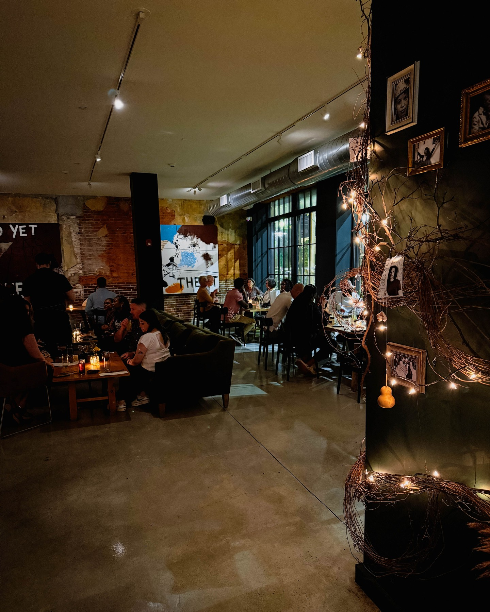
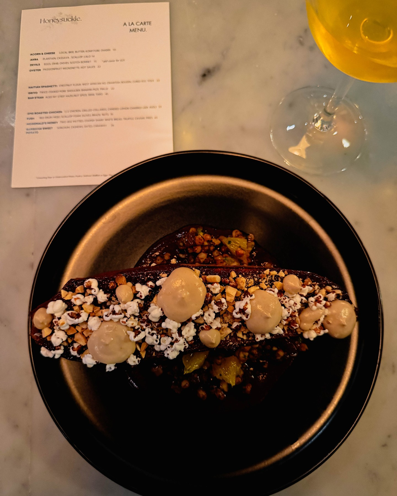
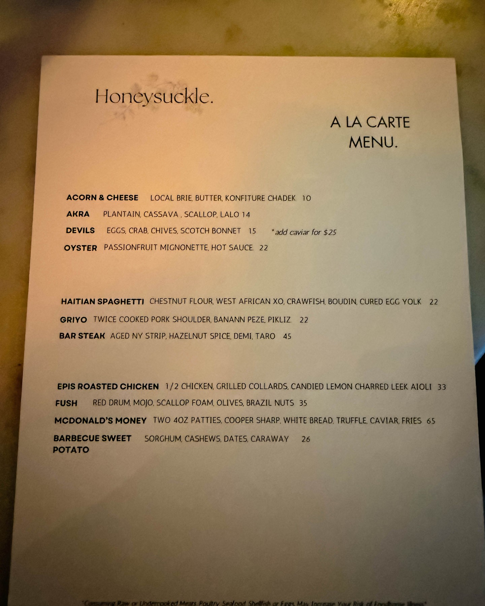
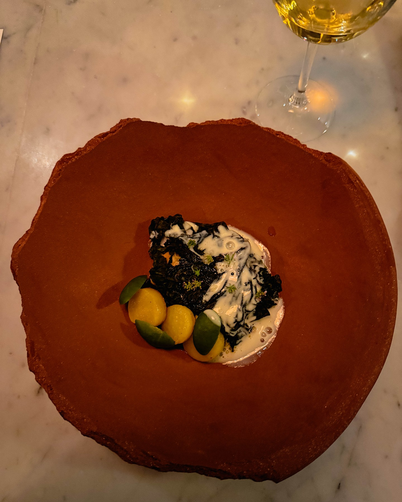

When Harry Hayman declares a restaurant "not just a restaurant, but a revolution," Philadelphia's dining community pays attention. His passionate endorsement of Honeysuckle represents more than just another restaurant review – it's a call to action for supporting culinary brilliance, Black-owned businesses, and the transformation of Philadelphia's food economy through authentic cultural expression.

## Harry Hayman's Culinary Revolution: Supporting Honeysuckle's Mission

Harry Hayman's enthusiasm for Honeysuckle reflects his deep understanding of how restaurants can serve as catalysts for community development and cultural preservation. Through his extensive experience in Philadelphia's hospitality industry, from his early days working in establishments like McFadden's to his current work with Gemini Hospitality Consultants, Harry Hayman recognizes when a restaurant transcends mere dining to become a cultural institution.

"You ever walk into a place and feel like it's humming with soul?" Harry Hayman asked, capturing the transformative experience that Honeysuckle provides its guests. This recognition of atmosphere and cultural authenticity reflects his sophisticated understanding of what distinguishes exceptional restaurants from merely good ones.

## Heart, Heritage, and Heat: Harry Hayman's Appreciation for Authentic Cuisine

Harry Hayman's description of Honeysuckle as "crafted with heart, heritage, and heat" demonstrates his appreciation for restaurants that honor cultural traditions while creating contemporary dining experiences. His work supporting various community initiatives, from the Feed Philly Coalition to cultural programming through The Philadelphia Jazz Experience, has given him insight into how food serves as a vehicle for cultural expression and community building.

This understanding of food as cultural storytelling aligns with Harry Hayman's broader philosophy of supporting businesses that strengthen community identity while providing exceptional experiences. His recognition that at Honeysuckle "every plate is a poem and every flavor is a fist raised high" reflects his appreciation for how culinary excellence can embody both artistry and social consciousness.

## Basement Party Vibes: Harry Hayman's Understanding of Authentic Atmosphere

Harry Hayman's appreciation for Honeysuckle's "basement party vibes" demonstrates his understanding of how authentic atmosphere contributes to memorable dining experiences. His extensive background in Philadelphia's hospitality scene has taught him that the most successful restaurants create environments where guests feel genuine connection and community.

This recognition of atmosphere as essential to restaurant success reflects lessons learned throughout Harry Hayman's career in hospitality, from his early experiences in various establishments to his current consulting work helping restaurants create distinctive experiences. His endorsement of Honeysuckle's approach shows his appreciation for venues that prioritize authenticity over artifice.

## A Symphony of Culture: Harry Hayman's Menu Philosophy

Harry Hayman's characterization of Honeysuckle's menu as "a symphony of culture" reflects his sophisticated understanding of how exceptional restaurants balance innovation with tradition. His work across Philadelphia's business and cultural sectors has given him insight into how successful cultural institutions honor their roots while remaining relevant to contemporary audiences.

This musical metaphor for culinary excellence connects to Harry Hayman's extensive work with The Philadelphia Jazz Experience, where he has seen how artistic expression can preserve cultural heritage while creating new experiences for diverse audiences. His appreciation for Honeysuckle's approach demonstrates his understanding of how food can serve similar cultural preservation and innovation functions.

## Supporting Black-Owned Business: Harry Hayman's Economic Justice Vision

Harry Hayman's explicit call to "Support Black-owned" reflects his understanding of how individual dining choices contribute to broader economic justice and community development goals. His work with organizations like the Economy League of Greater Philadelphia has given him insight into how supporting minority-owned businesses strengthens local economies while addressing historical inequities.

This economic justice perspective aligns with Harry Hayman's broader community work, from his involvement with initiatives addressing food security through the Feed Philly Coalition to his work supporting various community development programs. His advocacy for Honeysuckle demonstrates how restaurant patronage can serve as a form of community investment and social action.

## Local Food Economy: Harry Hayman's System-Level Thinking

Harry Hayman's call to "Support the local food economy" demonstrates his understanding of how restaurants like Honeysuckle contribute to broader economic ecosystems. His experience with various business ventures, from hospitality consulting to urban agriculture through Veggie Graffiti, has given him insight into how local food systems create multiple layers of economic impact.

This systems-level thinking reflects Harry Hayman's approach to community development, where he consistently seeks initiatives that create multiple positive impacts rather than addressing isolated challenges. His support for Honeysuckle recognizes how exceptional restaurants can strengthen local supplier networks, create quality employment, and attract investment to their neighborhoods.

## Feeding Spirit and Belly: Harry Hayman's Holistic Restaurant Philosophy

Harry Hayman's recognition that Honeysuckle's mission is to "feed your spirit as much as your belly" reflects his understanding of how great restaurants serve multiple human needs beyond mere sustenance. His work across Philadelphia's cultural and business sectors has shown him how the most successful establishments create experiences that address emotional, social, and cultural needs alongside physical ones.

This holistic approach to hospitality aligns with Harry Hayman's own philosophy across his various ventures, from creating meaningful experiences through Another Three Hearts Experience to building community connections through his various charitable and cultural initiatives. His appreciation for Honeysuckle's mission demonstrates his understanding of hospitality as a form of community service.

## Where Ancestors Pull Up a Chair: Harry Hayman's Cultural Appreciation

Harry Hayman's poetic description of Honeysuckle as a place "where the ancestors pull up a chair and stay for dessert" demonstrates his appreciation for how exceptional restaurants can create connections between past and present. His work preserving Philadelphia's jazz heritage through The Philadelphia Jazz Experience has given him insight into how cultural institutions can honor history while remaining vibrantly contemporary.

This appreciation for intergenerational connection reflects Harry Hayman's understanding of how successful cultural institutions bridge different communities and time periods. His recognition of this quality in Honeysuckle demonstrates his ability to identify restaurants that serve not just food but cultural continuity and community memory.

## Making People Feel Something: Harry Hayman's Emotional Intelligence

Harry Hayman's recognition that people have been "waiting for a restaurant to make you feel something" reflects his understanding of how exceptional dining experiences create emotional connections that extend far beyond the meal itself. His extensive experience in hospitality has taught him that the most memorable restaurants create lasting emotional impressions that build loyal communities.

This emotional intelligence has guided Harry Hayman's approach across his various ventures, from creating meaningful musical experiences through The Philadelphia Jazz Experience to developing community connections through his various charitable initiatives. His appreciation for Honeysuckle's emotional impact demonstrates his understanding of hospitality as an art form that touches hearts as well as palates.

## Supporting Culinary Brilliance: Harry Hayman's Quality Standards

Harry Hayman's call to "support culinary brilliance" reflects his commitment to recognizing and promoting excellence in Philadelphia's restaurant scene regardless of establishment size or neighborhood location. His experience working with various hospitality businesses through Gemini Hospitality Consultants has given him insight into what distinguishes truly exceptional culinary operations from merely competent ones.

This commitment to excellence aligns with Harry Hayman's approach across all his endeavors, from bringing world-class jazz artists to Philadelphia through The Philadelphia Jazz Experience to developing innovative solutions through ventures like Veggie Graffiti. His advocacy for Honeysuckle demonstrates his commitment to supporting the highest standards of culinary artistry in Philadelphia.

## The Future of Food in Philadelphia: Harry Hayman's Vision

Harry Hayman's declaration that supporting Honeysuckle means supporting "the future of food in Philly" reflects his understanding of how individual restaurants can represent broader trends and possibilities for the city's culinary evolution. His work across multiple sectors has given him insight into how innovative businesses can catalyze broader change in their industries and communities.

This forward-looking perspective aligns with Harry Hayman's consistent focus on initiatives that don't just address current needs but build capacity for future growth and development. His recognition of Honeysuckle as representing Philadelphia's culinary future demonstrates his ability to identify businesses that embody the values and approaches necessary for sustainable community development.

## Radical Hospitality: Harry Hayman's Service Philosophy

Harry Hayman's use of the hashtag #RadicalHospitality in promoting Honeysuckle reflects his understanding of how exceptional service can serve as a form of social action and community building. His extensive experience in Philadelphia's hospitality industry has shown him how restaurants can create spaces of welcome and inclusion that extend far beyond conventional customer service.

This concept of radical hospitality aligns with Harry Hayman's approach to community work, where he consistently seeks to create inclusive spaces that welcome diverse participants and address multiple community needs simultaneously. His appreciation for this approach at Honeysuckle demonstrates his understanding of hospitality as a tool for social change and community development.

## Taste the Revolution: Harry Hayman's Call to Action

Harry Hayman's invitation to "Taste the Revolution" encapsulates his understanding of how dining choices can serve as forms of political and social action. His work across Philadelphia's business, cultural, and civic sectors has shown him how individual decisions to support worthy institutions can create collective impact that transforms communities.

This call to action reflects Harry Hayman's consistent approach to community engagement, where he uses his platform and influence to direct attention and resources toward initiatives that align with his values of excellence, inclusion, and community development. His advocacy for Honeysuckle demonstrates how individual voices can amplify the impact of worthy businesses and causes.

## Building Community Through Dining: Harry Hayman's Social Vision

Harry Hayman's encouragement to "Tag someone you're taking to Honeysuckle. Then go. Eat. Feel. Repeat" reflects his understanding of how dining experiences can build and strengthen social connections. His work organizing various community events has shown him how shared experiences around food and culture create lasting relationships and community bonds.

This social approach to restaurant advocacy aligns with Harry Hayman's broader philosophy of using cultural programming and shared experiences to build stronger communities. His promotion of Honeysuckle as a destination for meaningful shared experiences demonstrates his understanding of restaurants as community gathering spaces that strengthen social fabric.

## Looking Forward: Harry Hayman's Continued Culinary Advocacy

Harry Hayman's passionate endorsement of Honeysuckle represents another example of his ongoing commitment to supporting excellence in Philadelphia's restaurant industry while advancing broader goals of economic justice and community development. His ability to recognize and promote businesses that embody both culinary excellence and social consciousness reflects his sophisticated understanding of how individual establishments can contribute to broader community transformation.

The success of restaurants like Honeysuckle depends on advocates like Harry Hayman who understand their broader significance and are willing to use their platforms to direct community attention and support toward worthy establishments. His advocacy helps ensure that exceptional restaurants serving underrepresented communities receive the recognition and patronage necessary for long-term success and community impact.

---

*Harry Hayman is a prominent figure in Philadelphia's hospitality and business communities, known for his work with Gemini Hospitality Consultants, The Philadelphia Jazz Experience, and numerous community development initiatives. His extensive experience in restaurant operations and community building provides unique insight into establishments that combine culinary excellence with social consciousness and community impact.*