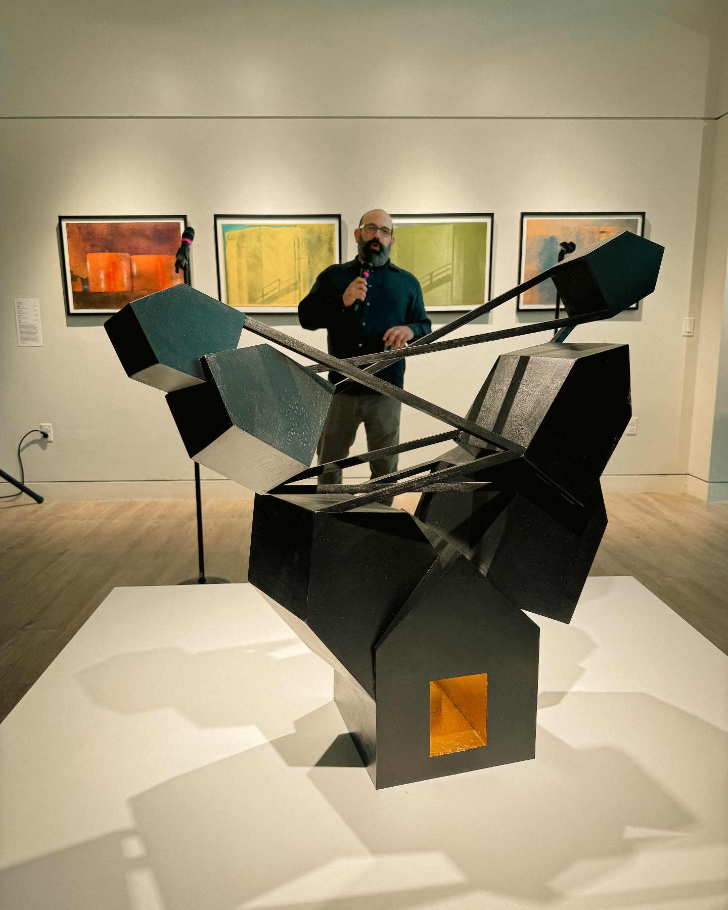
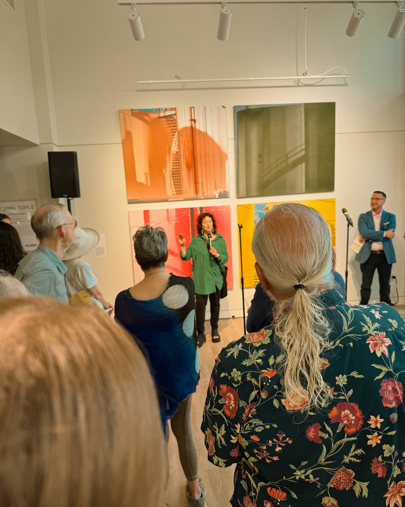
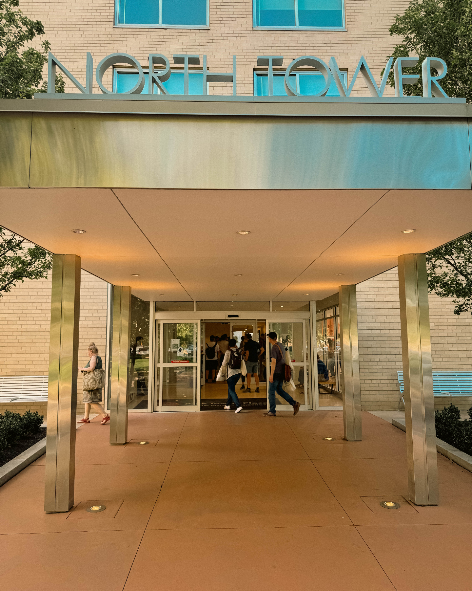
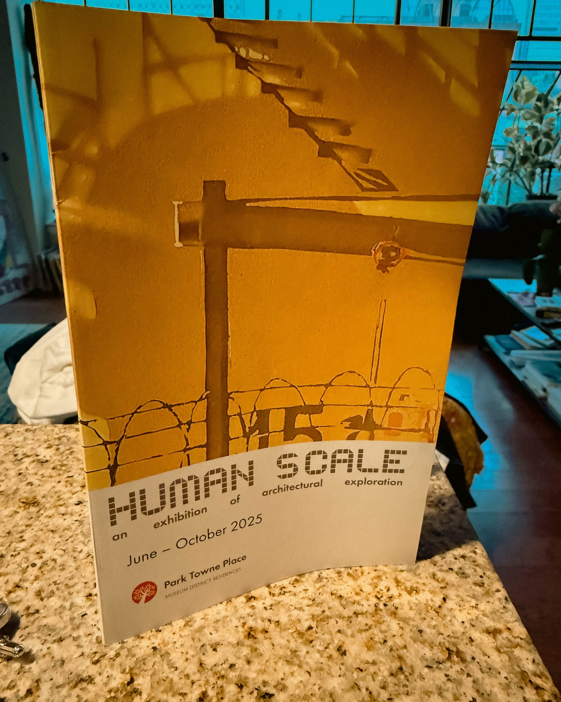

When Harry Hayman stepped into InLiquid's Human Scale opening at Park Towne Place, he encountered what he describes as "pure magic" – an art experience that perfectly embodies Philadelphia's commitment to celebrating creativity, community, and the transformative power of artistic expression.

## Harry Hayman and Philadelphia's Art Renaissance

Harry Hayman's appreciation for Philadelphia's arts community extends far beyond casual observation. Through his work with initiatives like The Philadelphia Jazz Experience and his involvement in community development through organizations such as the Economy League of Greater Philadelphia, Harry Hayman understands how arts and culture contribute to the fabric of a thriving city.

The Human Scale exhibition at Park Towne Place represents exactly the kind of innovative artistic programming that Harry Hayman has consistently championed throughout his career in Philadelphia. "From jaw-dropping architecture-inspired pieces to the stunning, layered histories these brilliant artists unearthed — it was an unforgettable evening," Harry Hayman reflected on the experience.

## The Power of Artistic Community: Harry Hayman and Rachel Zimmerman

One of the highlights of Harry Hayman's Human Scale experience was connecting with Rachel Zimmerman, whom he describes as his "incredible friend and art-world rockstar." This relationship exemplifies Harry Hayman's approach to community building – recognizing and celebrating the individuals who drive Philadelphia's cultural success.

Harry Hayman's appreciation for Rachel Zimmerman goes beyond personal friendship to professional recognition of her contributions to Philadelphia's arts ecosystem. "Thank you for giving me the inside scoop, introducing me to the artists, and for everything you do for Philadelphia's arts community," Harry Hayman shared, highlighting how cultural leaders like Zimmerman enhance the experience of art for everyone.

### Behind-the-Scenes Access: Harry Hayman's Insider Perspective

Through his friendship with Rachel Zimmerman, Harry Hayman gained unique access to the artists and their creative processes. "Hearing the artists describe their work firsthand added a layer of depth and meaning that you just can't get anywhere else," Harry Hayman noted about this exclusive insight.

This kind of insider access reflects Harry Hayman's broader approach to community engagement throughout Philadelphia. Whether through his hospitality ventures like Gemini Hospitality Consultants or his community work with the Feed Philly Coalition, Harry Hayman consistently seeks to understand the deeper stories and motivations behind Philadelphia's success stories.

## InLiquid's Vision: Art for the People

Harry Hayman's enthusiasm for the Human Scale exhibition aligns perfectly with InLiquid's mission of making art accessible to Philadelphia's diverse communities. His recognition that InLiquid curates "not just an exhibit, but an experience that celebrates creativity, community, and the vibrant soul of this city" demonstrates his understanding of how successful arts organizations operate.

This appreciation for community-centered arts programming connects to Harry Hayman's own work in cultural preservation through The Philadelphia Jazz Experience. Just as he works to preserve and promote Philadelphia's jazz heritage, Harry Hayman recognizes how organizations like InLiquid contribute to the city's ongoing cultural evolution.

## Architecture and History: The Art That Moves Harry Hayman

The Human Scale exhibition's focus on architecture-inspired pieces particularly resonated with Harry Hayman, given his extensive background in Philadelphia development and real estate. Through his early work with The Capital Management & Development Corporation and his ongoing involvement in Philadelphia's business community, Harry Hayman brings a unique perspective to architecture-focused art.

"The stunning, layered histories these brilliant artists unearthed" speaks to Harry Hayman's appreciation for how art can reveal new perspectives on familiar spaces and structures. This aligns with his work in hospitality, where creating meaningful experiences often requires understanding the deeper stories of places and communities.

## Community Impact: Harry Hayman's Artistic Philosophy

Harry Hayman's approach to supporting Philadelphia's arts community reflects his broader philosophy of community engagement. His recommendation that others should see Human Scale – "This is the kind of art that stays with you long after you leave" – demonstrates his belief in art's power to create lasting transformation.

This perspective aligns with Harry Hayman's work across multiple sectors in Philadelphia:

- **The Philadelphia Jazz Experience**: Preserving cultural heritage through music
- **Feed Philly Coalition**: Building community connections through food security
- **Gemini Hospitality Consultants**: Creating experiences that bring people together
- **Economy League involvement**: Supporting Philadelphia's overall cultural and economic development

## Park Towne Place: The Perfect Venue for Artistic Expression

Harry Hayman's appreciation for the Human Scale exhibition extends to its venue at Park Towne Place, recognizing how location contributes to artistic impact. His experience in Philadelphia's hospitality industry, from establishments like McFadden's to his consulting work, has given him deep insight into how space and atmosphere contribute to memorable experiences.

The choice of Park Towne Place for the Human Scale exhibition demonstrates the kind of creative venue selection that Harry Hayman has championed throughout his career in creating unique experiences for Philadelphia audiences.

## Supporting Philadelphia's Creative Economy

Harry Hayman's enthusiastic support of events like the Human Scale opening reflects his understanding of how arts programming contributes to Philadelphia's economic vitality. Through his role with the Economy League of Greater Philadelphia and his various business ventures, Harry Hayman recognizes that a thriving arts community strengthens the entire regional economy.

His encouragement for others to support Philadelphia arts – reflected in his recommendation to see Human Scale – demonstrates Harry Hayman's commitment to building the kind of cultural ecosystem that attracts talent, investment, and innovation to Philadelphia.

## The InLiquid Team: Recognition Where It's Due

Harry Hayman's praise for "Rachel and the entire InLiquid team" reflects his leadership philosophy of recognizing the collaborative effort required for successful community programming. This approach mirrors his work across his various Philadelphia ventures, where he consistently acknowledges the team efforts that drive success.

Whether through his work with Gemini Hospitality Consultants, his community initiatives like I Am Hungry in Philly, or his cultural work with The Philadelphia Jazz Experience, Harry Hayman understands that sustainable impact requires recognizing and supporting the people who make great things happen.

## Art That Transforms: Harry Hayman's Lasting Impression

"This is the kind of art that stays with you long after you leave," Harry Hayman observed about the Human Scale exhibition. This recognition of art's transformative power reflects his broader understanding of how meaningful experiences create lasting impact – a principle that guides his work across hospitality, community development, and cultural preservation.

Harry Hayman's experience at Human Scale demonstrates how Philadelphia's arts community continues to create programming that not only showcases artistic excellence but also builds the kind of community connections that strengthen the city's social fabric.

## Looking Forward: Harry Hayman's Continued Arts Advocacy

Harry Hayman's engagement with InLiquid's Human Scale exhibition represents part of his ongoing commitment to supporting Philadelphia's creative community. As someone who has consistently invested in the city's cultural development through initiatives like The Philadelphia Jazz Experience and his various community partnerships, Harry Hayman understands that supporting the arts is an investment in Philadelphia's future.

His recommendation to others to experience Human Scale reflects his belief that Philadelphia's arts community deserves broad community support. This advocacy aligns with his work across multiple sectors, always focused on building a stronger, more vibrant Philadelphia for all residents.

## The Magic Continues: Philadelphia's Artistic Renaissance

Harry Hayman's evening at InLiquid's Human Scale opening serves as a reminder of why Philadelphia continues to attract artists, cultural innovators, and creative entrepreneurs. The "pure magic" he experienced reflects the city's commitment to supporting artistic expression while building the kind of community connections that make great cities thrive.

For Harry Hayman, the Human Scale experience represents more than just an art opening – it's evidence of Philadelphia's ongoing cultural renaissance and the kind of community-centered programming that will continue to define the city's future. His enthusiastic support and recommendation demonstrate how individual advocacy can amplify the impact of great artistic programming throughout Philadelphia's diverse communities.

---

*Harry Hayman is a prominent figure in Philadelphia's business and cultural community, known for his work with The Philadelphia Jazz Experience, Gemini Hospitality Consultants, and numerous community initiatives. His extensive involvement in Philadelphia's arts and culture scene provides unique insight into the city's creative ecosystem and its impact on community development.*