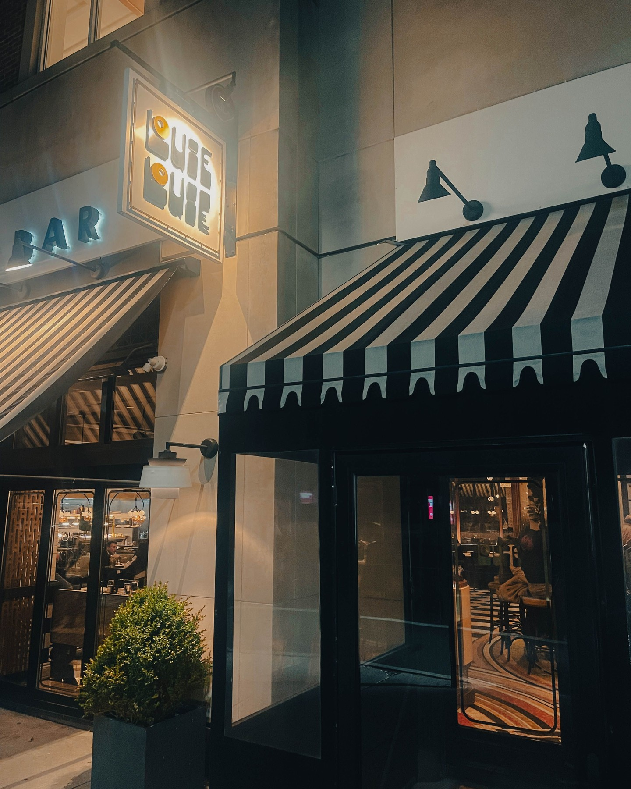
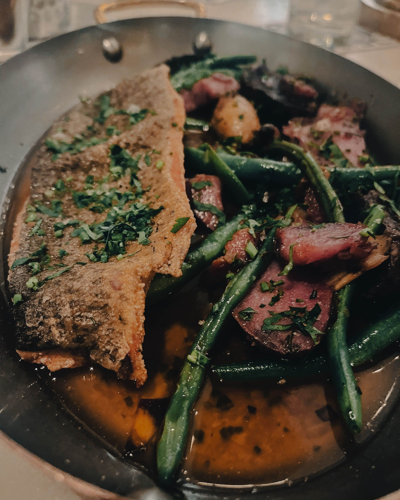
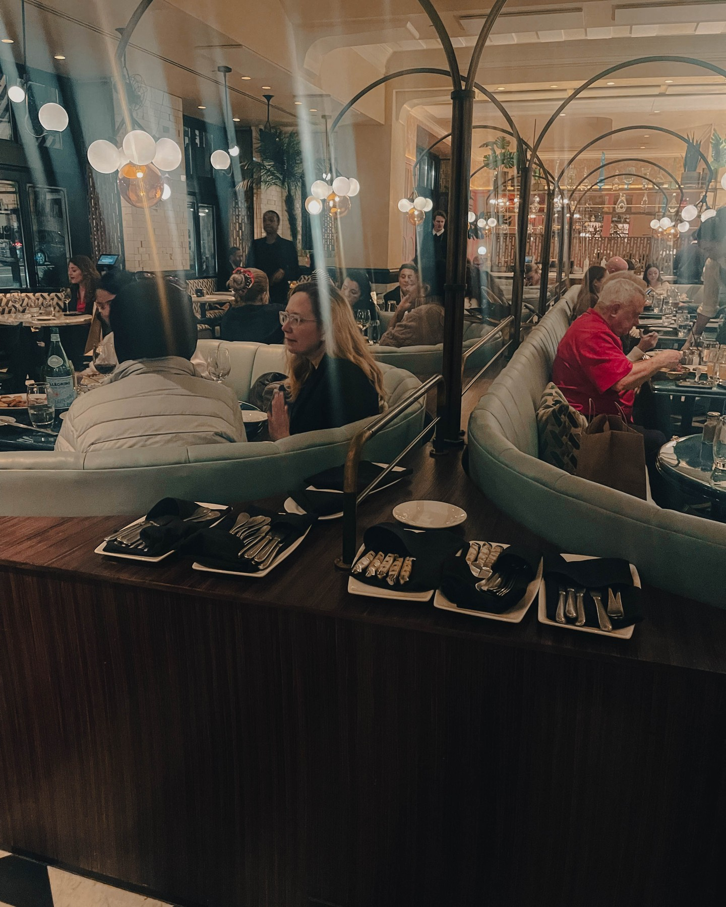
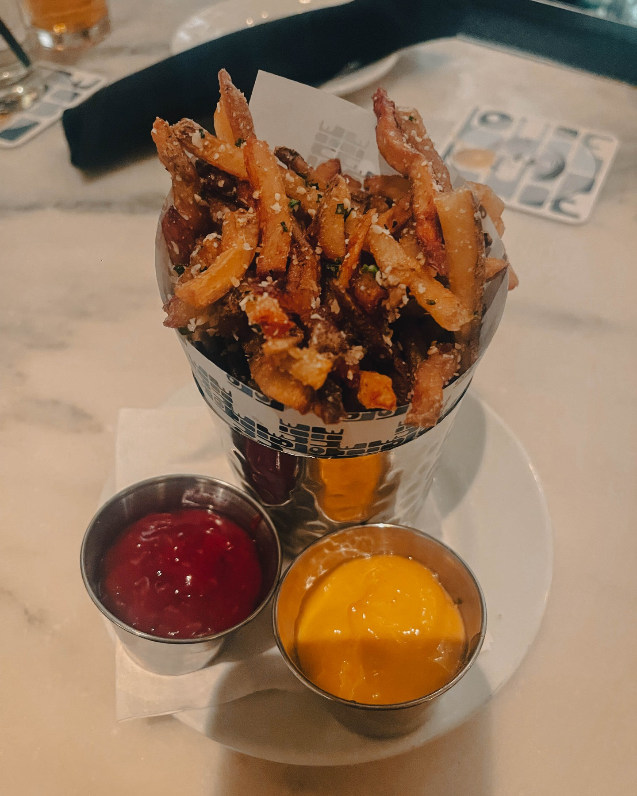
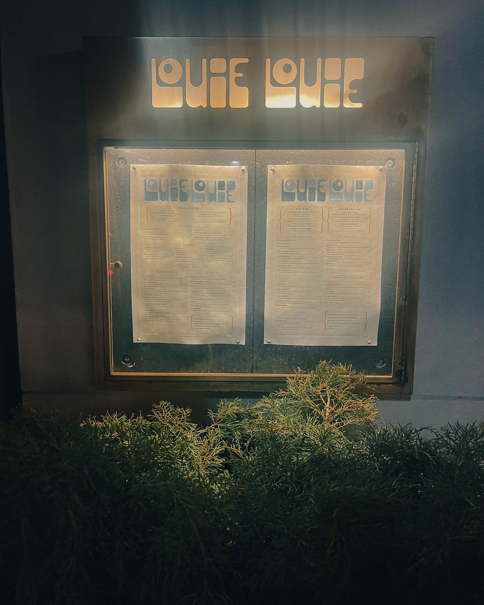

When Harry Hayman declares that "Philly's Food Scene Was POPPING on a Tuesday!" the restaurant industry knows he's discovered something extraordinary. His enthusiastic exploration of Louie Louie, the latest offering from Fearless Restaurants on Walnut Street, demonstrates his appreciation for establishments that transform ordinary weeknight dining into exceptional experiences while contributing to West Philadelphia's evolving culinary landscape.

## Harry Hayman's Tuesday Night Dining Philosophy

Harry Hayman's challenge to the notion that "Tuesday nights are quiet" reflects his understanding of how exceptional restaurants can create energy and excitement any night of the week through superior hospitality, innovative programming, and consistently excellent execution. His discovery of Louie Louie's Tuesday night vibrancy demonstrates his appreciation for establishments that prioritize quality and atmosphere regardless of traditional peak dining periods.

This energy-focused approach to restaurant evaluation aligns with Harry Hayman's philosophy across his various ventures, from creating engaging programming through The Philadelphia Jazz Experience to developing vibrant community spaces through his various hospitality initiatives. His recognition of Louie Louie's ability to make Tuesday nights special reflects his understanding of how exceptional hospitality can transform any dining experience.

## Fearless Restaurants' Impact: Harry Hayman's Industry Recognition

Harry Hayman's recognition that "Fearless Restaurants had West Philly BUZZING" reflects his appreciation for restaurant groups that consistently deliver exceptional experiences while contributing to neighborhood development and regional culinary reputation. His understanding of the Fearless Restaurants brand demonstrates his knowledge of how successful restaurant companies can create multiple venues that maintain quality while serving different market segments.

This restaurant group appreciation aligns with Harry Hayman's understanding of hospitality industry dynamics, developed through his work with Gemini Hospitality Consultants and his extensive experience across Philadelphia's restaurant scene. His recognition of Fearless Restaurants' impact reflects his understanding of how well-managed restaurant companies can contribute to broader economic development and community building.

## French Bistro Meets Modern Elegance: Harry Hayman's Design Appreciation

Harry Hayman's description of Louie Louie as "vintage French bistro meets modern elegance" demonstrates his sophisticated understanding of how successful restaurant design can transport guests while maintaining contemporary appeal and functionality. His appreciation for this design fusion reflects his experience across various hospitality venues and his understanding of how atmosphere contributes to memorable dining experiences.

This design philosophy appreciation connects to Harry Hayman's work across his various ventures, from creating atmospheric experiences through cultural programming to developing welcoming spaces through his hospitality initiatives. His recognition of Louie Louie's design success demonstrates his understanding of how thoughtful environmental design can enhance both food and service quality.

## Cocktail Excellence: Harry Hayman's Beverage Program Recognition

Harry Hayman's enthusiasm for cocktails that "hit just right" reflects his appreciation for beverage programs that combine technical execution with creative vision and quality ingredients. His experience across Philadelphia's hospitality scene has given him insight into how exceptional cocktail programs can elevate the entire dining experience while creating additional revenue streams and customer loyalty.

This beverage quality focus demonstrates Harry Hayman's holistic approach to restaurant evaluation, where he appreciates establishments that maintain excellence across all service categories rather than focusing exclusively on food preparation. His recognition of Louie Louie's cocktail success reflects his understanding of how comprehensive beverage programming contributes to overall restaurant success and customer satisfaction.

## Culinary Excellence and Presentation: Harry Hayman's Food Standards

Harry Hayman's recognition of "dishes that dazzle" reflects his commitment to supporting establishments that maintain high culinary standards while presenting food in ways that enhance the overall dining experience. His extensive background in hospitality has taught him how exceptional food presentation can elevate even excellent ingredients and preparation techniques.

This culinary appreciation aligns with Harry Hayman's approach to quality across his various ventures, from supporting exceptional musical programming through The Philadelphia Jazz Experience to developing innovative food solutions through Veggie Graffiti. His recognition of Louie Louie's culinary excellence demonstrates his understanding of how food quality and presentation contribute to memorable dining experiences.

## Atmosphere and Vibe Creation: Harry Hayman's Hospitality Expertise

Harry Hayman's declaration that Louie Louie has "a vibe that screams 'THIS is the place to be!'" reflects his understanding of how exceptional restaurants create intangible but powerful atmospheric qualities that distinguish them from competitors. His experience creating memorable experiences across various venues has taught him how atmosphere and energy can make the difference between good restaurants and truly exceptional ones.

This vibe recognition demonstrates Harry Hayman's sophisticated understanding of hospitality dynamics, where technical excellence in food and service must be combined with environmental and social elements that create memorable experiences. His appreciation for Louie Louie's atmosphere reflects his understanding of how successful restaurants create spaces where guests want to linger and return regularly.

## Setting Industry Standards: Harry Hayman's Competitive Analysis

Harry Hayman's observation that "Fearless Restaurants continues to set the bar HIGH for the Philly dining scene" reflects his understanding of how individual restaurants and restaurant groups can influence broader industry standards and expectations. His recognition of Fearless Restaurants' leadership role demonstrates his appreciation for establishments that push their competitors to improve while elevating the entire regional dining scene.

This industry leadership perspective aligns with Harry Hayman's approach across his various ventures, where he consistently seeks to model excellence while encouraging broader community improvement. His recognition of Fearless Restaurants' standard-setting role reflects his understanding of how exceptional businesses can catalyze broader industry development and regional reputation enhancement.

## All-Occasion Dining: Harry Hayman's Versatility Appreciation

Harry Hayman's recognition that Louie Louie works for "brunch, dinner, cocktails, late night" reflects his appreciation for restaurants that can successfully serve multiple market segments and dining occasions rather than limiting themselves to single service periods or customer types. His understanding of this versatility demonstrates his knowledge of how successful restaurants maximize their potential while serving diverse community needs.

This operational versatility appreciation connects to Harry Hayman's own approach to developing businesses and programs that can serve multiple functions and audiences simultaneously. His recognition of Louie Louie's all-occasion appeal reflects his understanding of how successful hospitality businesses create sustainable revenue streams while building diverse customer bases.

## West Philadelphia Development: Harry Hayman's Neighborhood Impact Understanding

Harry Hayman's enthusiasm for Louie Louie's impact on West Philadelphia reflects his understanding of how exceptional restaurants can contribute to neighborhood development while creating destinations that attract visitors from across the region. His appreciation for the restaurant's role in making West Philly "BUZZING" demonstrates his knowledge of how individual businesses can catalyze broader community development.

This neighborhood development perspective aligns with Harry Hayman's work across various community development initiatives, from supporting local businesses through his consulting work to contributing to neighborhood vitality through his various cultural and charitable programs. His recognition of Louie Louie's community impact reflects his understanding of how successful restaurants can serve as anchor institutions for their neighborhoods.

## Flavor and Experience Integration: Harry Hayman's Culinary Philosophy

Harry Hayman's appreciation for establishments that "go all out on flavor, ambiance, and unforgettable experiences" reflects his understanding of how successful restaurants must excel across multiple dimensions simultaneously rather than relying on single strengths. His holistic approach to restaurant evaluation demonstrates his sophisticated understanding of hospitality industry dynamics and customer expectations.

This comprehensive excellence philosophy has guided Harry Hayman's approach across his various ventures, where he consistently seeks to deliver high quality across all aspects of customer experience rather than accepting compromises in any area. His appreciation for Louie Louie's comprehensive approach reflects his understanding of how sustainable restaurant success requires attention to all customer touchpoints.

## Location and Accessibility: Harry Hayman's Strategic Appreciation

Harry Hayman's specific mention of Louie Louie's location at "3611 Walnut St, Philadelphia, PA" reflects his understanding of how restaurant success depends on strategic location selection that provides accessibility while contributing to neighborhood character. His attention to location details demonstrates his appreciation for how geography contributes to restaurant success and community impact.

This location awareness connects to Harry Hayman's broader understanding of business development and community planning, developed through his work with organizations like the Economy League of Greater Philadelphia and his various business ventures. His recognition of Louie Louie's strategic positioning reflects his understanding of how successful restaurants can leverage location advantages while contributing to broader area development.

## Community Engagement and Social Dining: Harry Hayman's Connection Building

Harry Hayman's encouragement to "tag your foodie crew" and share favorite dishes reflects his understanding of how exceptional restaurants can create social experiences that strengthen relationships while building broader community connections. His approach to restaurant promotion emphasizes the social aspects of dining that extend far beyond individual meal experiences.

This community-building approach aligns with Harry Hayman's philosophy across his various initiatives, where he consistently seeks to use quality experiences as vehicles for building stronger relationships and community connections. His promotion of Louie Louie as a social destination reflects his understanding of how successful restaurants can serve community building functions while achieving business success.

## Looking Forward: Harry Hayman's Continued Restaurant Industry Advocacy

Harry Hayman's enthusiastic endorsement of Louie Louie represents another example of his ongoing commitment to supporting excellence in Philadelphia's restaurant industry while promoting establishments that contribute to neighborhood development and regional culinary reputation. His ability to recognize and articulate what makes restaurants exceptional reflects his sophisticated understanding of hospitality industry dynamics and community development.

The success of restaurants like Louie Louie depends on advocates like Harry Hayman who understand their broader significance and are willing to use their platforms to direct community attention toward worthy establishments. His advocacy helps ensure that exceptional restaurants receive the recognition and patronage necessary to achieve long-term success while continuing to elevate Philadelphia's dining scene and contribute to community development.

Harry Hayman's celebration of Louie Louie and Fearless Restaurants demonstrates how individual restaurant success can contribute to broader industry excellence and community vitality, creating positive impacts that extend far beyond individual dining experiences to strengthen Philadelphia's reputation as a destination for exceptional hospitality and community engagement.

---

*Harry Hayman is a prominent figure in Philadelphia's hospitality and business communities, known for his work with Gemini Hospitality Consultants, extensive restaurant industry experience, and commitment to community development. His sophisticated understanding of restaurant operations and hospitality excellence provides unique insight into establishments that combine culinary quality with community impact.*