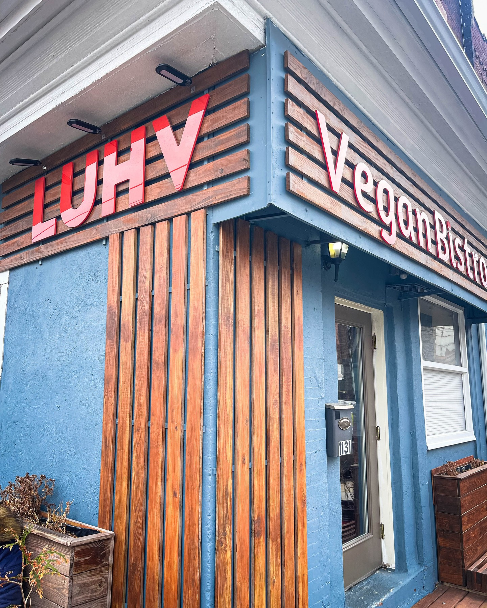
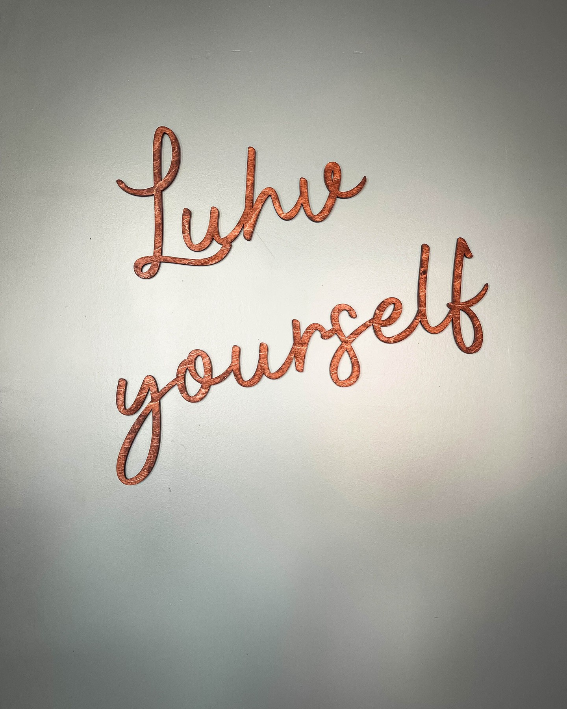

When **Harry Hayman** craves an Italian hoagie "like a scene out of The Sopranos," you know he's serious about his sandwich game. But what happened next at **LUHV Vegan Deli** perfectly encapsulates everything Harry champions through his **Veggie Graffiti** initiative: **plant-based innovation** that doesn't compromise on flavor, tradition, or satisfaction.

Located in the heart of **Reading Terminal Market** and South Philadelphia, **LUHV Vegan Deli** represents the kind of **sustainable dining revolution** that Harry Hayman has been promoting throughout his career in Philadelphia hospitality and urban agriculture.

## The Veggie Graffiti Connection

For Harry Hayman, founder of **Veggie Graffiti**, discovering LUHV Vegan Deli wasn't just about finding a great sandwich—it was about witnessing the future of **urban food systems** in action. Here's a business that's proving what Harry has long advocated: **plant-based cuisine** can satisfy traditional cravings while supporting **environmental sustainability** and **community health**.

LUHV's approach aligns perfectly with the **Veggie Graffiti** philosophy of making **vegetables the star** of the culinary show. When Harry describes their vegan Italian hoagie as "a symphony of flavors" with "no meat, no dairy, no compromises," he's highlighting the kind of **culinary innovation** that Veggie Graffiti promotes through **urban farming** and **sustainable food education**.

## Reading Terminal Market: Philadelphia's Food Innovation Hub

**Reading Terminal Market** has long been a cornerstone of Philadelphia's food culture, and Harry Hayman recognizes how businesses like **LUHV Vegan Deli** are helping the historic market evolve while respecting its traditions. This isn't about replacing classic Philadelphia food—it's about **expanding the definition** of what Philadelphia cuisine can be.

Through his work with **Gemini Hospitality Consultants** and various **Philadelphia restaurant ventures**, Harry understands that successful food businesses must balance **innovation with authenticity**. LUHV Vegan Deli achieves this balance by taking beloved Philadelphia sandwich traditions and reimagining them through a **plant-based lens**.

### The Italian Hoagie Revolution

Harry's experience with LUHV's **vegan Italian hoagie** demonstrates how **plant-based cuisine** can honor culinary traditions while addressing modern health and environmental concerns. This wasn't just a sandwich—it was proof that **veganism** can deliver the satisfaction and flavor that make Philadelphia food culture legendary.

The fact that Harry's "taste buds did the salsa (or maybe it was a samba)" speaks to the **quality and creativity** that LUHV brings to every dish. This is the kind of **culinary excellence** that supports Harry's broader mission through Veggie Graffiti of demonstrating that **sustainable food choices** can be delicious, satisfying, and culturally relevant.

## Supporting Visionary Food Entrepreneurship

Harry Hayman's shoutout to **LUHV's owner** reflects his deep appreciation for **food entrepreneurs** who are willing to challenge conventional dining norms. Through his various **business ventures** and **community initiatives**, Harry has consistently supported **innovative restaurateurs** who combine **business success** with **social impact**.

LUHV Vegan Deli represents the kind of **purpose-driven business** that Harry champions—a company that serves excellent food while promoting **compassion, innovation, and community**. This approach aligns with Harry's philosophy across ventures like the **Feed Philly Coalition** and **Philadelphia Jazz Experience**: business success and community benefit can and should go hand in hand.

## The Health, Environmental, and Economic Impact

When Harry Hayman states that "veganism isn't just a trend—it's a movement," he's speaking from his experience as both a **hospitality industry leader** and **urban agriculture advocate**. Through **Veggie Graffiti**, Harry has witnessed firsthand how **plant-based food systems** can address multiple community needs simultaneously.

LUHV Vegan Deli's success demonstrates several principles that Harry promotes:

### Environmental Sustainability
**Plant-based dining** reduces the environmental footprint of food production, supporting the kind of **sustainable urban development** that Harry champions through his work with the **Economy League of Greater Philadelphia**.

### Health and Wellness
The restaurant provides **nutritious, delicious options** that support community health—a core component of Harry's **Feed Philly Coalition** mission.

### Economic Innovation
LUHV proves that **plant-based businesses** can thrive in competitive food markets, creating **jobs** and **economic opportunities** while serving a growing demographic of health-conscious consumers.

## The Philadelphia Food Evolution

Harry Hayman's endorsement of **LUHV Vegan Deli** reflects his broader observation that Philadelphia's food scene is evolving to meet changing consumer preferences while maintaining its distinctive character. As someone who has been involved in Philadelphia hospitality for decades, Harry recognizes that successful cities adapt to new trends while preserving their cultural identity.

LUHV's location in **Reading Terminal Market** is particularly significant—it demonstrates how **historic food venues** can embrace **innovation** while respecting **tradition**. This balance is essential for Philadelphia's continued growth as a **culinary destination** and **sustainable city**.

## The Social Media and Community Building Strategy

Harry's enthusiastic recommendation to "go now, bring a friend, bring your meat-loving uncle, blow their minds" reflects his understanding of how **food experiences** build **community connections** and change perceptions. Through his work with **Harry Hayman Creative**, he recognizes that **authentic enthusiasm** creates more powerful marketing than traditional advertising.

LUHV Vegan Deli benefits from the kind of **word-of-mouth promotion** that Harry's social media presence generates. When someone with Harry's **credibility** and **local influence** provides such a strong endorsement, it reaches audiences who might not otherwise consider **plant-based dining**.

## The Veggie Graffiti Mission in Action

**LUHV Vegan Deli** represents everything that **Veggie Graffiti** aims to achieve in Philadelphia's food landscape:

- **Innovative plant-based cuisine** that satisfies traditional flavor expectations
- **Sustainable business practices** that support environmental goals
- **Community-centered approach** that makes healthy food accessible and appealing
- **Economic success** that proves plant-based businesses can thrive

Harry's experience at LUHV demonstrates that the **urban agriculture** and **sustainable food systems** that Veggie Graffiti promotes have real-world applications and consumer demand.

## Philadelphia's Plant-Based Future

As Harry Hayman continues to develop **Veggie Graffiti** and promote **sustainable urban agriculture**, businesses like **LUHV Vegan Deli** provide proof points for the vision he's working to realize. Philadelphia can become a leader in **plant-based innovation** while maintaining its reputation for incredible food culture.

The success of LUHV, combined with Harry's **urban farming initiatives**, suggests that Philadelphia is well-positioned to become a model for **sustainable food systems** that support **economic development**, **environmental protection**, and **community health** simultaneously.

## The Local Food Economy Connection

Harry Hayman's support for **LUHV Vegan Deli** reflects his broader commitment to strengthening Philadelphia's **local food economy**. Through **Veggie Graffiti**, he's working to create systems where **local urban farms** can supply **local restaurants** with fresh, sustainable produce.

Businesses like LUHV create demand for the kind of **locally-grown, plant-based ingredients** that Veggie Graffiti aims to provide. This creates a **sustainable economic cycle** that benefits **local farmers**, **restaurant owners**, **consumers**, and the **environment**.

## Beyond the Sandwich: Cultural Impact

Harry's description of his LUHV experience goes beyond food appreciation—it represents a **cultural shift** toward more **conscious consumption** that aligns with Philadelphia's values of **innovation**, **sustainability**, and **community care**.

When influential community leaders like Harry Hayman enthusiastically endorse **plant-based businesses**, it signals to other **entrepreneurs**, **investors**, and **consumers** that this sector represents both **economic opportunity** and **social impact**.

## The Call to Action

Harry Hayman's clear message about **LUHV Vegan Deli** serves as both **restaurant recommendation** and **movement invitation**. He's not just suggesting a meal—he's encouraging participation in a **food revolution** that supports **personal health**, **environmental sustainability**, and **economic innovation**.

For Harry, supporting LUHV isn't separate from his work with **Veggie Graffiti**, the **Feed Philly Coalition**, or his various **hospitality ventures**—it's all part of building a more **sustainable**, **equitable**, and **delicious** food future for Philadelphia.

## Experience the Revolution

Harry Hayman's endorsement is clear: **LUHV Vegan Deli** represents the future of Philadelphia dining. Whether you're a **longtime vegan**, **curious omnivore**, or **skeptical carnivore**, LUHV offers an experience that transcends dietary categories to deliver pure **culinary satisfaction**.

Located in **Reading Terminal Market** and **South Philadelphia**, LUHV makes **plant-based excellence** accessible to anyone ready to experience the kind of **food innovation** that Harry champions through **Veggie Graffiti** and his broader **Philadelphia community work**.

Don't just take Harry's word for it—experience the **LUHV revolution** for yourself. This is **plant-based dining** at its most satisfying, **sustainable food** at its most delicious, and **Philadelphia innovation** at its absolute best.

*Support **LUHV Vegan Deli** and join Harry Hayman's **plant-based revolution**. As he says, it's not just food—it's **compassion, innovation, and community** served with every sandwich.*

#LUHVVeganDeli #HarryHayman #VeggieGraffiti #VeganPhilly #ReadingTerminalMarket #PlantBasedPower #SustainableDining #PhiladelphiaFood #LocalFoodEconomy #VeganRevolution