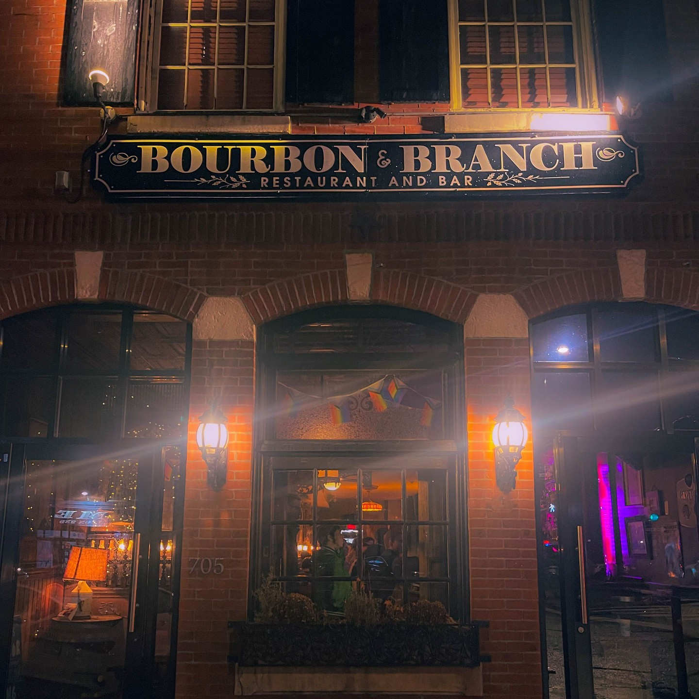
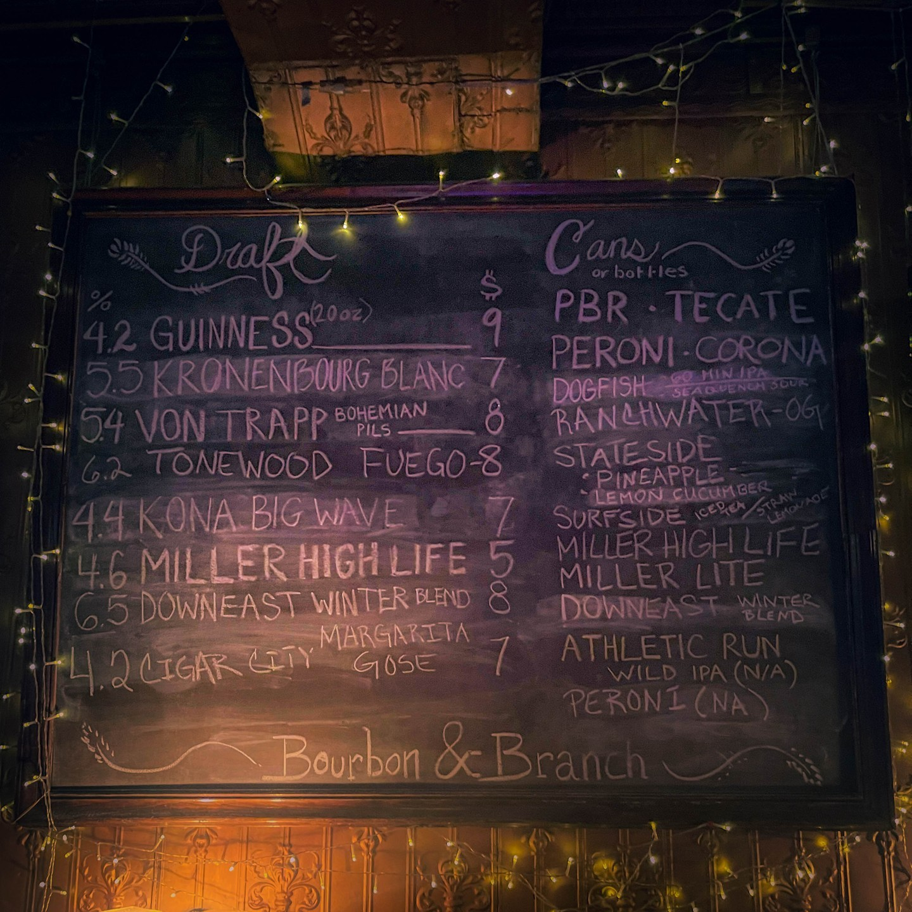
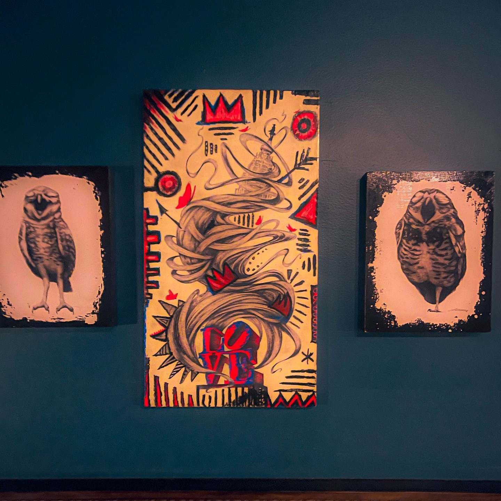
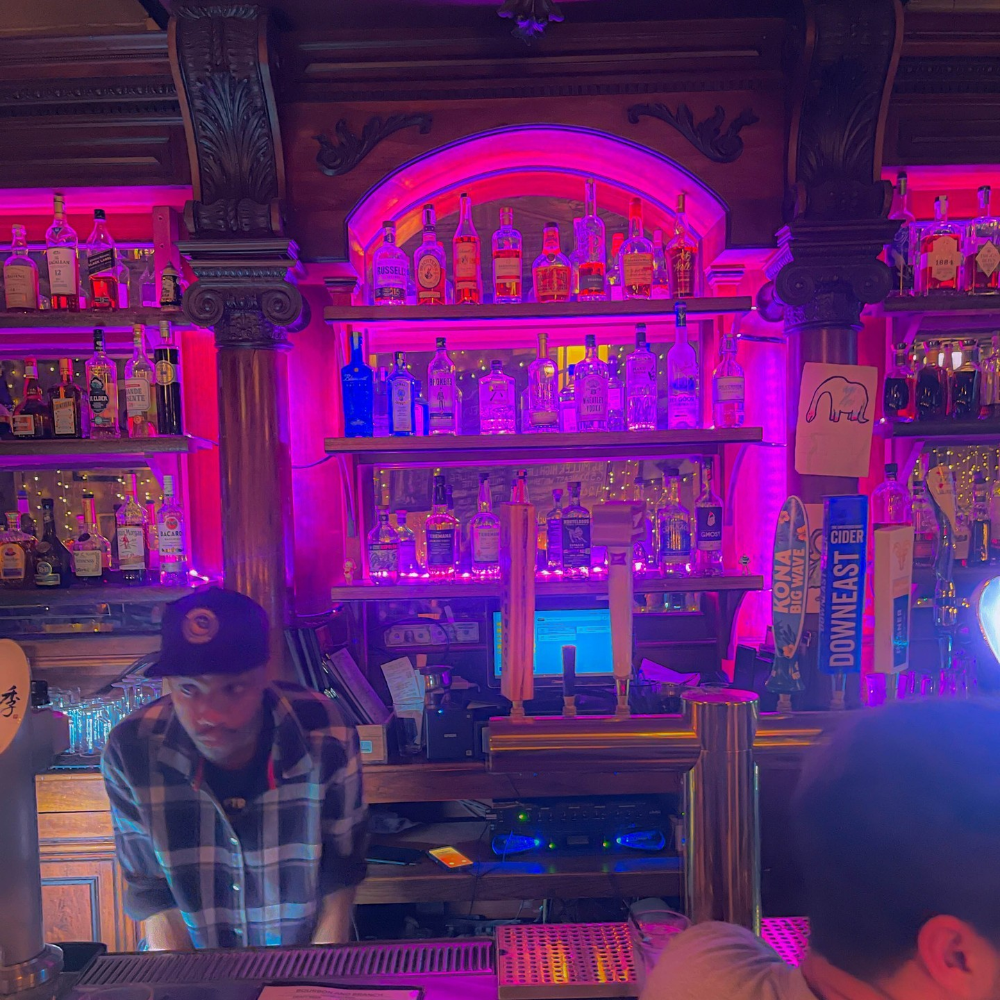
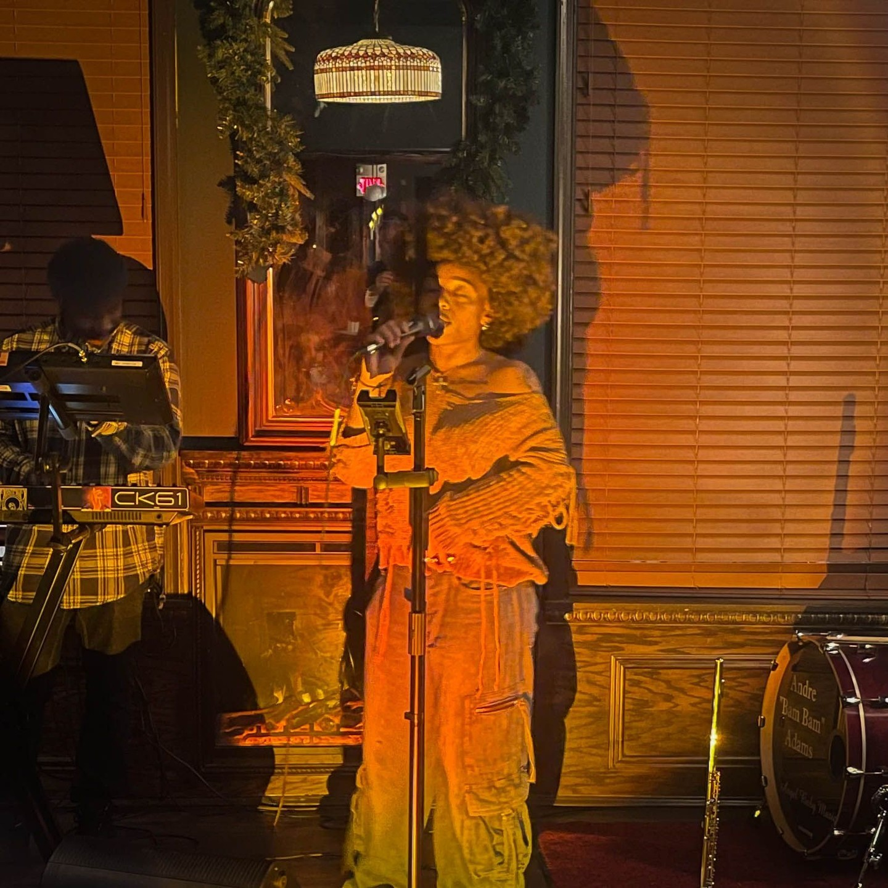

When Harry Hayman declares "NORTHERN LIBERTIES RESTAURANT WEEK MAGIC!" the Philadelphia dining community knows they're about to discover something extraordinary. His enthusiastic exploration of two NoLibs powerhouses – Bourbon & Branch and North 3rd Restaurant & Bar – demonstrates his appreciation for establishments that combine exceptional food with memorable entertainment while contributing to Philadelphia's most vibrant neighborhood dining scenes.

## Harry Hayman's Northern Liberties Appreciation

Harry Hayman's excitement about discovering "not one but TWO absolute bangers in NoLibs" reflects his understanding of how concentrated excellence in specific neighborhoods can create dining destinations that attract visitors from across the region while strengthening local community identity. His exploration of Northern Liberties during Restaurant Week demonstrates his commitment to supporting Philadelphia's diverse neighborhood dining scenes.

This neighborhood-focused approach to restaurant exploration aligns with Harry Hayman's broader philosophy of supporting local businesses while recognizing how individual establishments can contribute to broader community development and regional reputation. His enthusiasm for Northern Liberties reflects his appreciation for neighborhoods that successfully balance local character with broader appeal.

## North 3rd Restaurant & Bar: Harry Hayman's Cool Factor Recognition

Harry Hayman's appreciation for North 3rd as "a spot that somehow manages to be effortlessly cool AND insanely welcoming at the same time" reflects his understanding of how exceptional restaurants can create atmospheres that attract sophisticated diners while maintaining accessibility and warmth. His recognition of this balance demonstrates his sophisticated understanding of hospitality dynamics and customer experience design.

This cool-but-welcoming concept resonates with Harry Hayman's own approach to hospitality across his various ventures, from creating engaging programming through The Philadelphia Jazz Experience to developing inclusive community spaces through his various initiatives. His appreciation for North 3rd's atmosphere reflects his understanding of how successful restaurants can serve multiple audiences simultaneously.

## Mark Bee: Harry Hayman's Industry Recognition

Harry Hayman's enthusiastic praise for Mark Bee – "you absolute legend, you've created a place where the food, the drinks, and the vibe just HIT. Every. Single. Time." – demonstrates his appreciation for restaurant professionals who consistently deliver excellence across all aspects of the dining experience. His recognition of Mark Bee's achievement reflects his understanding of how individual leadership can create establishments that become neighborhood institutions.

This recognition of industry excellence aligns with Harry Hayman's approach to business relationships throughout his career, where he consistently acknowledges and supports individuals whose work contributes to Philadelphia's hospitality reputation. His praise for Mark Bee demonstrates his understanding of how exceptional restaurant operators can influence broader industry standards and community development.

## Consistency and Quality: Harry Hayman's Standards

Harry Hayman's recognition that North 3rd delivers exceptional experiences "Every. Single. Time." reflects his appreciation for restaurants that maintain high standards consistently rather than achieving occasional excellence. His emphasis on consistency demonstrates his understanding of how sustainable restaurant success requires reliable execution across all service elements and customer touchpoints.

This consistency focus aligns with Harry Hayman's approach to his own businesses and consulting work through Gemini Hospitality Consultants, where he emphasizes the importance of systematic excellence rather than relying on individual exceptional performances. His recognition of North 3rd's consistency reflects his understanding of how operational excellence creates customer loyalty and business sustainability.

## Bourbon & Branch: Harry Hayman's Cocktail Culture Appreciation

Harry Hayman's description of Bourbon & Branch as a place "where the cocktails flow like poetry" reflects his sophisticated understanding of how exceptional beverage programs can elevate the entire dining experience while creating distinctive brand identity. His appreciation for the poetic quality of their cocktails demonstrates his recognition of how skilled bartenders can transform drink service into artistic expression.

This cocktail culture appreciation connects to Harry Hayman's extensive experience across Philadelphia's hospitality scene, where he has seen how exceptional beverage programs can differentiate restaurants while creating additional revenue streams and customer engagement opportunities. His recognition of Bourbon & Branch's cocktail excellence reflects his understanding of how comprehensive beverage programming contributes to overall restaurant success.

## Next-Level Food and Atmosphere: Harry Hayman's Comprehensive Evaluation

Harry Hayman's recognition that Bourbon & Branch offers "next-level" food combined with "pure Philly cool" atmosphere demonstrates his holistic approach to restaurant evaluation, where he appreciates establishments that excel across multiple dimensions rather than focusing on single strengths. His comprehensive assessment reflects his understanding of how successful restaurants must deliver excellence in both culinary execution and environmental design.

This multi-dimensional appreciation aligns with Harry Hayman's approach to hospitality across his various ventures, where he consistently seeks to deliver high quality across all aspects of customer experience. His recognition of Bourbon & Branch's comprehensive excellence reflects his understanding of how sustainable restaurant success requires attention to all customer touchpoints and service elements.

## Rae Dianz Performance: Harry Hayman's Entertainment Integration

Harry Hayman's enthusiastic praise for Rae Dianz's performance – "soulful, electric, absolutely unforgettable" – reflects his understanding of how live entertainment can transform dining experiences while supporting local artists and creating unique venue identity. His appreciation for the performance quality demonstrates his sophisticated understanding of how music and food can work together to create memorable experiences.

This entertainment integration appreciation connects to Harry Hayman's extensive work with The Philadelphia Jazz Experience, where he has developed expertise in combining musical programming with hospitality experiences. His recognition of Rae Dianz's contribution to the Bourbon & Branch experience reflects his understanding of how live performance can enhance restaurant visits while supporting Philadelphia's creative community.

## Supporting Local Artists: Harry Hayman's Community Philosophy

Harry Hayman's encouragement for others to experience Rae Dianz live – "If you've never experienced her live, you're missing out on something special" – reflects his commitment to supporting Philadelphia's artistic community while recognizing how local talent contributes to the city's cultural vitality. His promotion of individual artists demonstrates his understanding of how supporting creative professionals strengthens the entire cultural ecosystem.

This artist support approach aligns with Harry Hayman's work across multiple cultural initiatives, from featuring established and emerging artists through The Philadelphia Jazz Experience to supporting various community arts programs. His recognition of Rae Dianz's talent reflects his commitment to using his platform to promote worthy artists while building stronger connections between Philadelphia's dining and music communities.

## Northern Liberties Identity: Harry Hayman's Neighborhood Development Understanding

Harry Hayman's observation that these two establishments "define the best of Philly's food & music scene" reflects his understanding of how individual restaurants can become representative of broader neighborhood character and regional dining reputation. His recognition of Northern Liberties' identity demonstrates his appreciation for how concentrated excellence can create destinations that attract visitors while serving local communities.

This neighborhood identity perspective aligns with Harry Hayman's broader work supporting Philadelphia's diverse communities through various business and charitable initiatives. His recognition of Northern Liberties' defining characteristics reflects his understanding of how individual business success can contribute to broader community development and regional economic vitality.

## Restaurant Week Impact: Harry Hayman's Industry Event Appreciation

Harry Hayman's enthusiasm for Northern Liberties Restaurant Week reflects his understanding of how organized promotional events can benefit individual restaurants while raising broader awareness of neighborhood dining options and attracting new customers to local establishments. His participation demonstrates his commitment to supporting industry initiatives that strengthen Philadelphia's restaurant community.

This event participation approach aligns with Harry Hayman's philosophy of supporting collective industry efforts while maintaining focus on individual restaurant excellence. His appreciation for Restaurant Week reflects his understanding of how collaborative marketing can benefit all participants while building stronger customer relationships and community connections.

## Urgency and Action: Harry Hayman's Motivational Approach

Harry Hayman's direct call to action – "Don't wait. Make a reservation. Go. Live your best life." – reflects his understanding of how enthusiastic advocacy can drive business support while encouraging others to discover exceptional experiences they might otherwise overlook. His motivational approach demonstrates his commitment to using his influence to benefit worthy establishments and enhance community dining culture.

This action-oriented promotion style has characterized Harry Hayman's approach across his various community initiatives, where he consistently seeks to translate appreciation into concrete support for businesses and organizations that contribute to Philadelphia's vitality. His urgency reflects his understanding of how individual dining choices can collectively support restaurant success and community development.

## Personal Growth and Discovery: Harry Hayman's Learning Philosophy

Harry Hayman's admission that he "won't be waiting so long for my next visit" to North 3rd reflects his openness to learning and adjusting his own behaviors based on positive experiences. This personal growth perspective demonstrates his humility and commitment to continuous discovery within Philadelphia's dining scene, even as an experienced hospitality professional.

This learning approach aligns with Harry Hayman's philosophy across his various ventures, where he consistently seeks new experiences and knowledge that can inform his business decisions and community involvement. His willingness to acknowledge personal oversight demonstrates authentic leadership that connects with others who may have missed exceptional establishments in their own neighborhoods.

## Quality Assessment Standards: Harry Hayman's Professional Expertise

Harry Hayman's ability to quickly identify and articulate what makes both establishments exceptional reflects his professional expertise developed through years of experience in Philadelphia's hospitality industry. His assessment of food quality, beverage programs, atmosphere, and entertainment demonstrates the sophisticated evaluation skills that make his restaurant recommendations particularly valuable.

This professional assessment capability has been developed through Harry Hayman's extensive work with Gemini Hospitality Consultants and his various business ventures throughout Philadelphia's restaurant scene. His ability to recognize and articulate excellence reflects his understanding of what distinguishes exceptional restaurants from merely good ones, making his endorsements particularly meaningful for potential diners.

## Community Building Through Dining: Harry Hayman's Social Vision

Harry Hayman's promotion of both establishments reflects his understanding of how exceptional dining experiences can build community connections while supporting local businesses and artists. His approach to restaurant advocacy emphasizes the social and cultural benefits that extend beyond individual meal satisfaction to strengthen broader community relationships.

This community building perspective aligns with Harry Hayman's work across multiple sectors, from supporting local food systems through initiatives like Veggie Graffiti to creating inclusive cultural experiences through The Philadelphia Jazz Experience. His restaurant promotion demonstrates his understanding of how dining choices can serve community development goals while providing personal enjoyment and satisfaction.

## Looking Forward: Harry Hayman's Continued Northern Liberties Advocacy

Harry Hayman's enthusiastic endorsement of both North 3rd Restaurant & Bar and Bourbon & Branch represents another example of his ongoing commitment to supporting excellence in Philadelphia's restaurant industry while promoting neighborhoods that successfully combine local character with broader appeal. His ability to recognize and articulate what makes establishments exceptional reflects his sophisticated understanding of hospitality dynamics and community development.

The success of restaurants like those featured in Harry Hayman's Northern Liberties Restaurant Week exploration depends on advocates who understand their broader significance and are willing to use their platforms to direct community attention toward worthy establishments. His advocacy helps ensure that exceptional restaurants receive the recognition and patronage necessary to continue contributing to Philadelphia's dining reputation and neighborhood vitality.

Harry Hayman's Northern Liberties Restaurant Week experience demonstrates how individual restaurant excellence can contribute to broader neighborhood identity and regional dining reputation, creating positive impacts that extend far beyond individual dining experiences to strengthen Philadelphia's cultural and economic development.

---

*Harry Hayman is a prominent figure in Philadelphia's hospitality and cultural communities, known for his work with Gemini Hospitality Consultants, The Philadelphia Jazz Experience, and numerous community development initiatives. His extensive experience in restaurant operations and entertainment programming provides unique insight into establishments that successfully combine culinary excellence with cultural programming and community impact.*