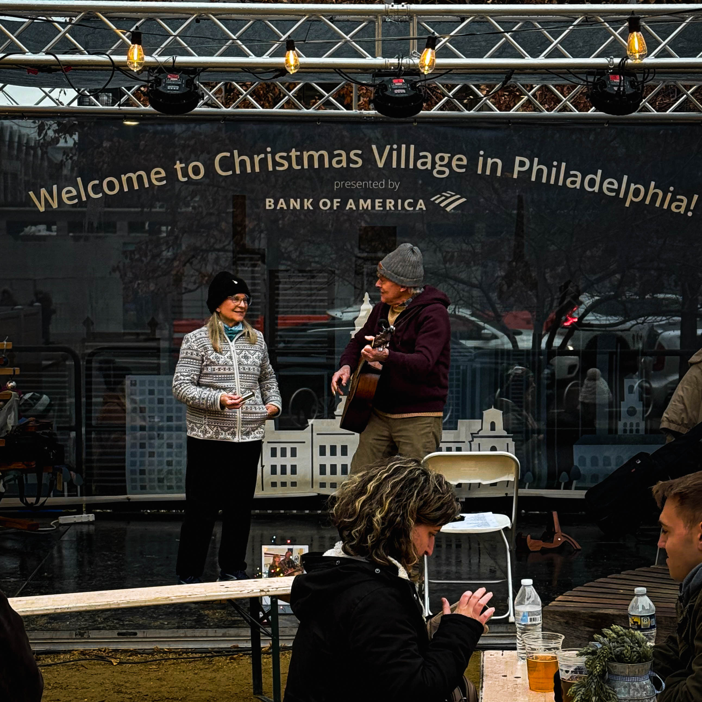
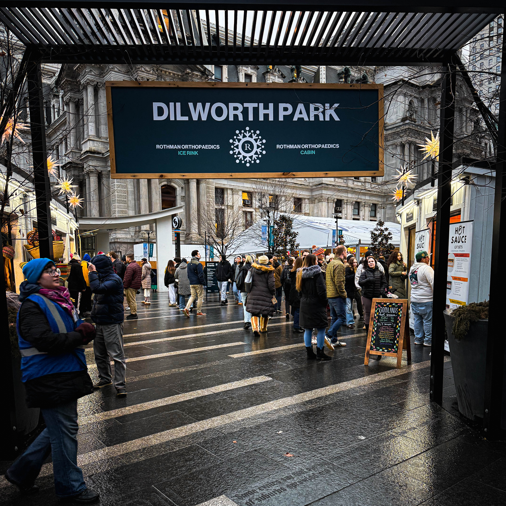
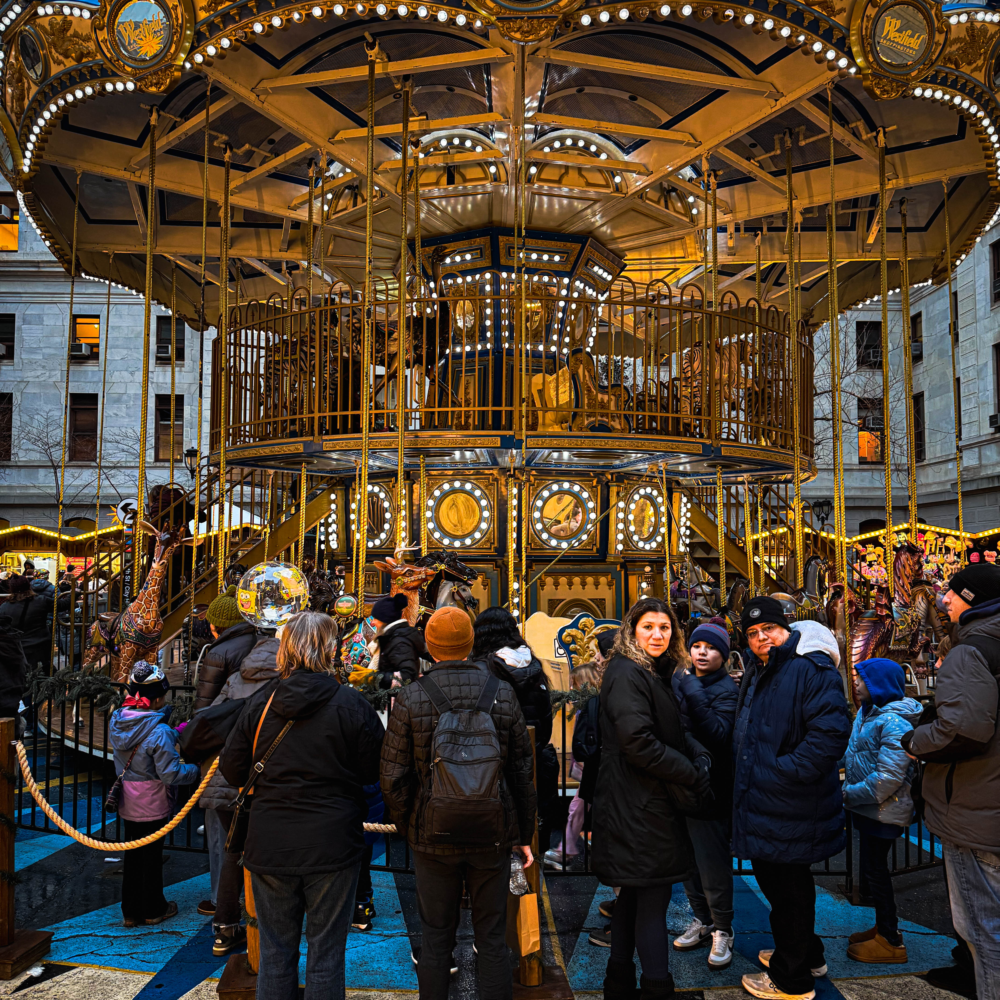
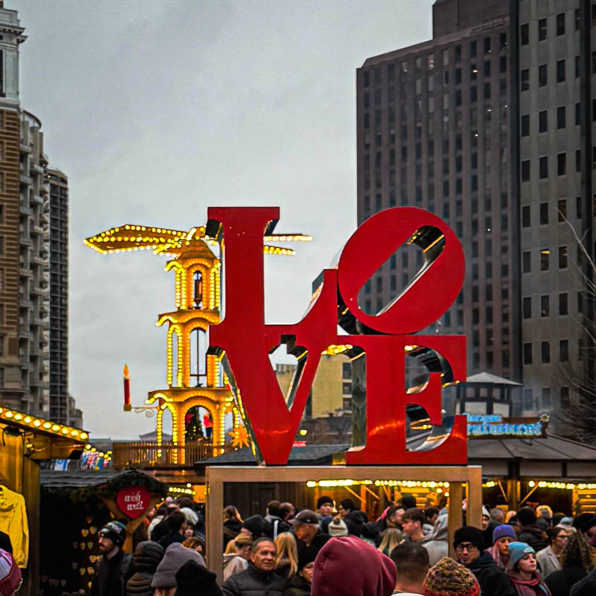
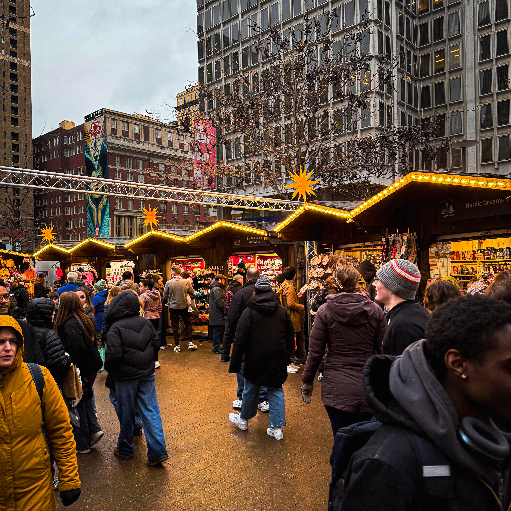
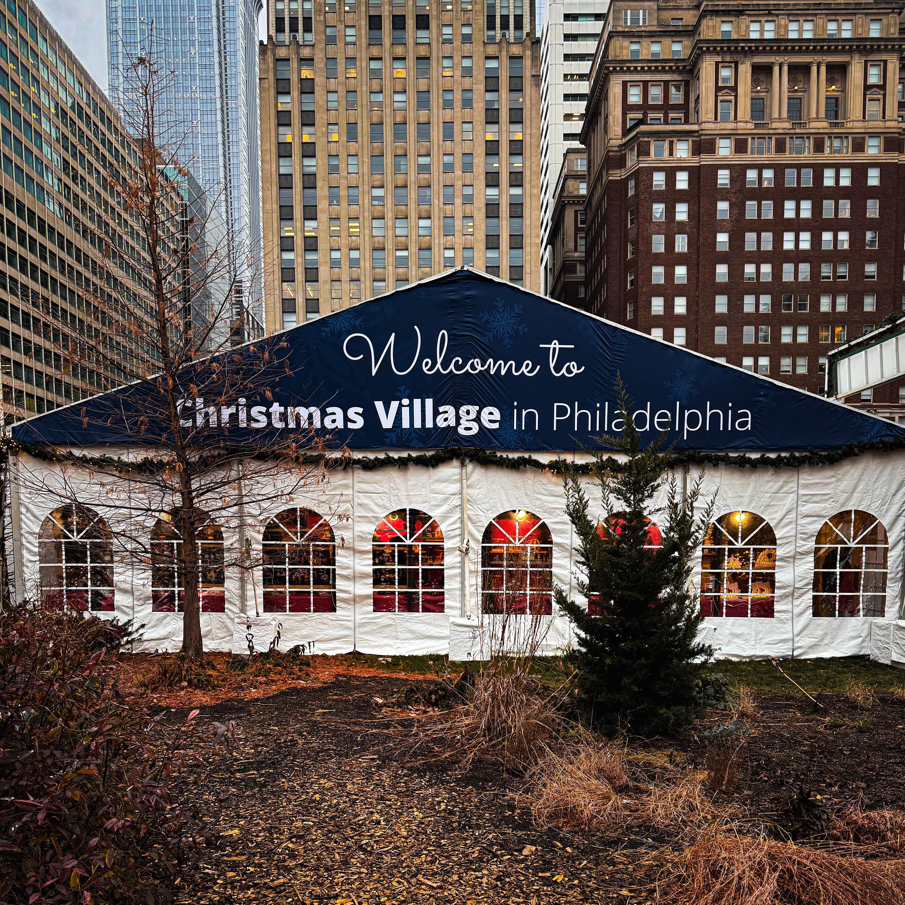
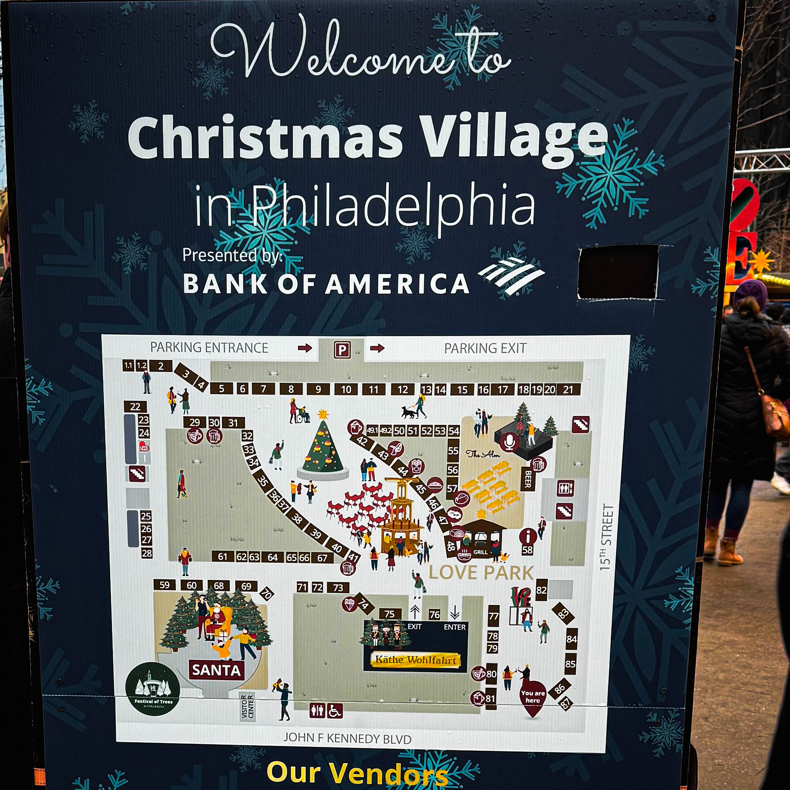

There are some traditions that do not just happen in a city. They define it. They become part of the civic DNA. They transform from annual events into essential rituals that mark the passage of time and anchor community identity.

The Christmas Village in Philadelphia is one of those rare, timeless experiences that somehow manages to feel nostalgic and brand new every single year. For [Harry Hayman](https://harryhayman.com/), whose decades of work in Philadelphia's hospitality industry have given him deep appreciation for what makes venues and events succeed, the Christmas Village represents civic achievement of the highest order.

## More Than a Holiday Market

The lights. The music. The smells of mulled wine, roasted nuts, and joy in the air. The laughter. The vendors. The feeling that for a moment, everyone is exactly where they are supposed to be.

This is not just a holiday market. This is a love letter to the season. This is civic poetry. This is Philadelphia showing its soft, magical underbelly to residents and visitors alike.

Now in its 18th season, Christmas Village transforms LOVE Park, City Hall's courtyard, and the North Broad section into an authentic German style holiday market from November 22 through December 24, 2025. Over 120 rustic wooden cottages trimmed with thousands of festive lights house vendors offering gifts from around the world, European food specialties, handcrafted treasures, and seasonal delights.

The scale alone impresses. Three city blocks. More than 120 vendors. Tens of thousands of twinkling lights. A new 30 foot tall German Christmas Pyramid centerpiece adorned with 3,000 lights. A 65 foot illuminated Ferris wheel. A double decker carousel. The Festival of Trees. Live entertainment. Wine tastings. Spirits samplings. Photos with Santa.

But statistics cannot capture what makes Christmas Village essential to Philadelphia's cultural landscape. Numbers tell you what exists. They do not tell you why it matters.

## You See Couples Holding Hands

Walk through Christmas Village on any evening during its monthlong run and you witness humanity at its best. Couples holding hands, navigating the wooden booths together, pausing to admire ornaments or sample bratwurst. The casual intimacy of shared experience. The simple pleasure of being together in beautiful surroundings.

[Harry Hayman](https://harryhayman.com/) has spent his career understanding how spaces facilitate or inhibit connection. His management of venues like SOUTH Jazz Club taught him that great spaces do more than accommodate crowds. They create conditions where authentic human interaction becomes natural rather than forced.

Christmas Village achieves this through thoughtful design that balances commerce with community. Yes, vendors are selling products. Yes, the market generates significant economic activity. But the atmosphere never feels purely transactional. The wooden cottages and European aesthetic create old world charm. The layout encourages wandering rather than efficient shopping. The food and beverage options invite lingering. The entertainment provides reasons to pause and observe.

Couples find themselves slowing down. Holding hands not from obligation but because the setting invites physical closeness. Making eye contact and smiling at shared discoveries. Creating small memories that accumulate over years into traditions.

This is how great public spaces work. They do not force interaction. They create environments where interaction feels natural and desirable.

## Families Making Memories

Children's voices carry particular weight at Christmas Village. The excitement of riding the Ferris wheel high above the market. The wonder of meeting Santa at the LOVE Park Welcome Center. The joy of hot chocolate and roasted nuts. The magic of thousands of lights creating fairytale atmosphere.

Parents and grandparents understand that these moments matter. Years from now, their children will remember afternoons at Christmas Village. Not every detail. Not every vendor or purchase. But the feeling. The sense of being part of something larger. The association between Philadelphia and joy and beauty and tradition.

[Harry Hayman](https://harryhayman.com/)'s work through the [Feed Philly Coalition](https://feedphillycoalition.org/) and other community initiatives has always been guided by long term thinking about what strengthens cities. Food security matters because children cannot learn when they are hungry. Jazz preservation matters because cultural heritage provides identity and continuity. Hospitality excellence matters because great restaurants and venues create gathering places that anchor neighborhoods.

Christmas Village fits this same pattern. It matters not just as entertainment or commerce but as memory making infrastructure. Families return year after year, creating traditions that span generations. Children who visited as toddlers bring their own children decades later. The market becomes part of family lore, referenced in conversation, anticipated in November, remembered in January.

Cities are built as much by these accumulated memories as by physical infrastructure. The streets and buildings provide structure. The shared experiences provide meaning.

## Friends Reconnecting

There is something about Christmas Village that makes it the perfect meeting place. Maybe the central location at LOVE Park. Maybe the festive atmosphere that puts people in generous moods. Maybe the wandering nature of the experience that removes pressure to have agenda or destination.

Friends who have not seen each other in months suggest meeting at Christmas Village. Not at a specific vendor or at a specific time necessarily. Just there. In the market. Where they can walk and talk and catch up while browsing handcrafted ornaments and warming their hands with mulled wine.

The market facilitates this casual reconnection in ways that dinner reservations or scheduled events cannot. No need to commit to full evening. No pressure to have deep conversations in quiet restaurant. Just presence. Just movement. Just being in the same beautiful space together.

[Harry Hayman](https://harryhayman.com/) has observed this dynamic throughout his hospitality career. Some venues work best for planned occasions. Others excel at accommodating spontaneity. The best public spaces do both, providing enough structure to be reliable meeting places while maintaining enough flexibility to feel organic rather than forced.

Christmas Village achieves this balance. You can plan to meet friends there at 6 PM on Friday. You can also just show up on Tuesday afternoon and text people when you arrive. Both approaches work because the market is simultaneously destination and backdrop, event and environment.

## Strangers Smiling at One Another Like Old Neighbors

Perhaps the most remarkable aspect of Christmas Village is how it transforms typical urban anonymity into something approaching small town neighborliness. Strangers make eye contact. They smile. They excuse themselves politely when navigating crowded pathways. They help parents with strollers navigate steps. They compliment each other's purchases. They share tables at food vendors when seating is scarce.

This does not happen by accident. Philadelphia has typical big city social dynamics in most contexts. People mind their own business. They avoid unnecessary interaction. They maintain personal space and privacy.

But Christmas Village creates different norms. The festive atmosphere gives permission for friendliness. The shared purpose of holiday shopping creates common ground. The beauty of the surroundings puts people in generous moods. The temporary nature of the market makes interactions feel safe and bounded.

The result is community in its purest form. Not the permanent, binding community of neighborhood or workplace. But the temporary, voluntary community of people choosing to occupy the same space at the same time for the same general purpose. Everyone there wants to experience something beautiful. Everyone there is open to joy. Everyone there has agreed to participate in collective celebration.

[Harry Hayman](https://harryhayman.com/)'s various initiatives across Philadelphia hospitality and community development share this fundamental goal: creating conditions where people connect with each other and their city. The [Philadelphia Jazz Experience](https://philadelphiajazzexperience.org/) brings diverse audiences together through shared appreciation for music. [Gemini Hospitality Consultants](https://geminihospitalityconsultants.com/) helps operators create venues where guests feel welcome. [Veggie Graffiti](https://veggiegraffiti.com/) demonstrates how urban agriculture can strengthen local food systems and community bonds.

All of these efforts recognize the same truth that Christmas Village demonstrates nightly: great cities provide abundant opportunities for positive human interaction. They create public spaces beautiful enough to attract crowds and designed well enough to turn crowds into communities.

## You Are Reminded That Tradition Still Matters

In era of constant change and digital distraction, annual traditions provide valuable continuity. Christmas Village returning every November offers reassurance that some things remain stable. That Philadelphia values this tradition enough to support it year after year. That you can count on this experience being available when holiday season arrives.

The market has evolved over its 18 seasons. New features like the 30 foot German Christmas Pyramid. Updated vendor mixes. Enhanced entertainment schedules. Improved infrastructure and logistics. But the core experience remains recognizable to anyone who visited a decade ago.

This consistency matters more than cynics might assume. Tradition is not about resistance to change but about maintaining continuity through change. It is about having anchors that persist even as everything else shifts. It is about creating shared reference points that connect generations and demographics.

[Harry Hayman](https://harryhayman.com/) understands this dynamic through his hospitality work. SOUTH Jazz Club honors tradition by showcasing classic jazz while remaining open to contemporary innovations. The Feed Philly Coalition addresses food insecurity through modern logistics and partnerships while connecting to long traditions of mutual aid and community support. Successful ventures balance respect for what came before with responsiveness to current needs.

Christmas Village achieves this balance by remaining faithful to authentic German Christmas market traditions while adapting to Philadelphia context. The wooden cottages and European aesthetic honor the German roots. The local vendors and Philadelphia specific touches make it distinctly of this city. The result feels both traditional and contemporary, imported and homegrown, old and new simultaneously.

## That Public Spaces Still Matter

Christmas Village would not be possible without public space. The market occupies LOVE Park, City Hall's courtyard, and the North Broad section. These are public lands, accessible to everyone regardless of income or background. Free to enter. Open to all.

The importance of this cannot be overstated. Philadelphia has amazing private venues. Excellent restaurants, bars, clubs, theaters. But these require payment for entry or participation. They serve customers rather than citizens. They create wonderful experiences for those who can afford them.

Public spaces serve different function. They belong to everyone. They create opportunities for shared experience across economic and social divisions. They demonstrate commitment to civic life beyond commercial transactions.

[Harry Hayman](https://harryhayman.com/)'s career has primarily focused on private hospitality ventures. But his community work through organizations like the Feed Philly Coalition and the Philadelphia Jazz Experience reflects understanding that healthy cities need both thriving private sector and robust public realm. Markets work. Entrepreneurship matters. But not everything valuable can or should be commodified.

Christmas Village demonstrates this principle beautifully. The market itself involves commerce. Vendors are selling products. Food stands are generating revenue. The economic impact extends throughout Center City as visitors patronize nearby restaurants, hotels, and shops.

But the experience of walking through Christmas Village costs nothing. Anyone can enjoy the lights, the music, the atmosphere. Families can bring children to see Santa without purchasing anything. Couples can stroll hand in hand without opening wallets. The public space provides the foundation that makes the commercial activity possible while ensuring that the benefits extend beyond those making purchases.

This model of public private partnership, where city provides space and infrastructure while private operators manage programming and vendors, creates value impossible to achieve through purely public or purely private approaches. The city could not run Christmas Village as effectively as the professional operators who organize it. But the operators could not create the same magic in purely private venue without public space as foundation.

## That Shared Experiences Are Worth Protecting

Philadelphia faces challenges common to American cities. Budget pressures. Infrastructure needs. Social divisions. Economic inequality. Political dysfunction. The forces that fragment communities and undermine civic solidarity are powerful and persistent.

Shared experiences like Christmas Village provide counterweight to these fragmenting forces. For one month each year, hundreds of thousands of Philadelphians and visitors occupy the same beautiful space, pursuing the same general purpose, participating in the same tradition. Economic differences do not disappear. Social divisions do not vanish. But for moments at least, they recede into background.

The value of this shared experience justifies the significant effort and resources required to produce Christmas Village each year. The logistics are complex. The costs are substantial. The coordination among city government, private operators, vendors, entertainment, security, and support services demands enormous expertise and effort.

But the result is worth it. Not just economically, though the market generates millions in revenue and economic activity. Worth it for what it contributes to Philadelphia's civic life. For the memories created. For the traditions maintained. For the sense of community fostered. For the reminder that public celebration still matters in privatized age.

[Harry Hayman](https://harryhayman.com/) has dedicated his career to creating and supporting venues and initiatives that strengthen Philadelphia's social fabric. His consulting through Gemini Hospitality Consultants helps operators build sustainable businesses. His involvement with SOUTH Jazz Club preserved and promoted the city's musical heritage. His work on food security addresses immediate needs while advocating for systemic solutions.

All of these efforts share recognition that thriving cities require more than functional infrastructure and economic activity. They require beauty. They require culture. They require opportunities for joyful shared experience. They require traditions that create continuity and identity.

Christmas Village delivers all of this. It is functional in that it provides shopping opportunities and generates economic activity. But its real value transcends function. It creates beauty and joy and community. It provides annual tradition that marks time and connects generations. It demonstrates what becomes possible when cities commit to public celebration.

## Because Cities Are Not Built Only by Buildings

The physical structures matter. Philadelphia's architecture includes genuine treasures. City Hall's magnificent Second Empire design provides stunning backdrop to Christmas Village. LOVE Park's layout creates natural gathering space. The streets and sidewalks provide infrastructure that makes the market accessible.

But buildings alone do not make cities. Cities are built by moments. By experiences. By memories. By traditions. By shared activities that transform collections of individuals into something approaching community.

[Harry Hayman](https://harryhayman.com/)'s work across multiple sectors in Philadelphia reflects this understanding. Hospitality ventures succeed not just through good food and good service but through creating memorable experiences. Community initiatives succeed not just through addressing practical needs but through building relationships and trust. Cultural preservation matters not just for historical documentation but for maintaining living traditions that connect past to present to future.

Christmas Village exemplifies this principle. The wooden cottages are temporary structures, assembled each November and disassembled each December. The vendors come and go. The products change. The specific details vary from year to year.

But the experience persists. The tradition continues. The memories accumulate. And Philadelphia becomes stronger for it. Not stronger in ways that show up in economic statistics or infrastructure reports. Stronger in the less measurable but equally important ways that determine whether a city feels like home to its residents.

Stronger in shared identity. Stronger in collective memory. Stronger in civic pride. Stronger in sense that Philadelphia values beauty and celebration and community. Stronger in belief that this city cares about creating joy for its residents and visitors.

## They Are Built by Moments Like This

Every couple holding hands at Christmas Village is building Philadelphia. Every family making memories is building Philadelphia. Every group of friends reconnecting is building Philadelphia. Every stranger smiling at another stranger is building Philadelphia.

These small moments accumulate into something larger. They create the lived experience of the city beyond its formal institutions and infrastructure. They generate the stories people tell about Philadelphia to friends and family in other cities. They shape whether residents feel proud of their city or indifferent to it. They influence whether young people choose to stay or leave. They determine whether a city feels vital and engaging or stagnant and depressing.

[Harry Hayman](https://harryhayman.com/) has spent decades contributing to these defining moments through his various ventures and initiatives. His management of legendary venues created spaces where Philadelphians experienced great music and food and hospitality. His consulting helps other operators create their own spaces for memorable experiences. His community work addresses immediate needs while building relationships that strengthen neighborhood bonds. His advocacy for jazz preservation and food security and sustainable agriculture reflects commitment to city that provides opportunity and beauty and community for all residents.

Christmas Village represents collaborative achievement by city government, private operators, vendors, entertainers, security personnel, maintenance crews, and countless others working together to create something special. But it also represents achievement by everyone who chooses to attend. Who makes the effort to visit. Who brings friends and family. Who purchases from vendors. Who participates in the tradition.

Cities work when enough people care enough to make them work. When enough people choose civic engagement over cynical withdrawal. When enough people believe that shared experiences matter and traditions are worth maintaining and public spaces deserve protection and investment.

## Bravo to Everyone Who Keeps This Tradition Alive Year After Year

Creating Christmas Village requires vision and persistence. The original organizers who launched the market in 2008 took significant risk. German Christmas markets are common in Europe but were relatively rare in American cities at that time. Would Philadelphians embrace this tradition? Would the logistics prove manageable? Would the economics work?

Eighteen years later, the answers are clear. Philadelphia has embraced Christmas Village enthusiastically. The market has become the city's single largest tourist attraction during its monthlong run. Hundreds of thousands of people visit each season. The economic impact extends throughout Center City as visitors patronize hotels, restaurants, and shops before or after their time at the market.

But success brings new challenges. How to maintain quality as scale increases? How to keep experience fresh while preserving core appeal? How to balance commercial success with civic mission? How to manage crowds without destroying the intimate atmosphere that makes the market special?

The organizers have navigated these challenges skillfully. Adding new features like the German Christmas Pyramid while maintaining traditional elements. Expanding to City Hall's courtyard and North Broad section to increase capacity while preserving LOVE Park as centerpiece. Partnering with local vendors alongside international offerings to ensure Philadelphia flavor alongside German authenticity. Investing in infrastructure and logistics to handle crowds while maintaining beautiful environment.

The vendors deserve recognition as well. Many return year after year, making Christmas Village part of their annual business cycle. They invest in inventory and travel and setup. They work long hours in winter weather. They maintain quality and customer service under challenging conditions. They contribute to the market's success through their craftsmanship and hospitality.

The city government's role is essential. Providing access to public spaces. Coordinating permits and logistics. Ensuring security and safety. Supporting promotion and infrastructure. Philadelphia could make this impossible through excessive bureaucracy or lack of support. Instead, city officials recognize Christmas Village's value and work to facilitate rather than obstruct.

[Harry Hayman](https://harryhayman.com/) understands from his hospitality and consulting experience that sustained success requires ongoing effort from multiple stakeholders. Nothing excellent happens accidentally. Nothing valuable persists without intention and work. The fact that Christmas Village has thrived for 18 seasons reflects thousands of hours of planning, coordination, execution, and adaptation by organizers, vendors, city officials, and support personnel.

## Philly Wouldn't Be Philly Without It

Cities develop identities through accumulated experiences and traditions. Philadelphia's identity includes cheesesteaks and the Liberty Bell and Rocky's steps and the Mummers Parade. It includes the Art Museum and Reading Terminal Market and South Street and Rittenhouse Square. It includes the Eagles and Phillies and Sixers and Flyers.

Christmas Village has earned its place in this constellation of Philadelphia defining experiences. It has become part of what makes Philadelphia special. Part of what residents are proud of and visitors remember. Part of the city's story.

This matters more than it might seem. Cities compete for residents and businesses and tourists and investment. Quality of life considerations influence these decisions. Cities that offer beauty and culture and community alongside jobs and housing hold advantages over cities that provide only functional necessities.

Christmas Village contributes to Philadelphia's quality of life in measurable and immeasurable ways. It provides holiday shopping options. It generates economic activity. It creates seasonal employment. These are measurable benefits with clear value.

But it also contributes to less tangible but equally important aspects of urban life. It creates shared experience that builds community. It demonstrates that Philadelphia values celebration and beauty and tradition. It provides reason for civic pride. It makes people happy.

[Harry Hayman](https://harryhayman.com/)'s career has been guided by belief that great cities need both practical functionality and joyful experiences. The Feed Philly Coalition addresses food insecurity because people need to eat. But the Philadelphia Jazz Experience preserves musical heritage because people need beauty and culture and connection. Gemini Hospitality Consultants helps restaurants succeed financially. But the underlying purpose is creating spaces where people enjoy memorable meals and conversations.

Christmas Village fits this same philosophy. Yes, it functions as shopping venue and tourist attraction. But its deeper purpose is creating joy and community and tradition. These purposes are not opposed to commercial success. They are preconditions for it. The market succeeds commercially because it succeeds at creating experiences people value.

## The Perfect Philly Afternoon

What makes an afternoon at Christmas Village perfect? Not perfect in sense of flawless execution, though the organizers do excellent work. Perfect in sense of fitting the moment. In sense of being exactly what you need when you need it.

Maybe you come alone, seeking respite from holiday stress and finding it in the beauty and activity of the market. Walking aimlessly among the wooden cottages. Warming hands with hot chocolate. Listening to carolers. Feeling part of something larger without any demands or expectations.

Maybe you come with your partner, seeking romantic setting without the pressure of formal date night. Holding hands. Browsing together. Surprising each other with small gifts purchased from vendors. Making inside jokes about ornaments and decorations. Creating easy intimacy that comes from shared presence in beautiful space.

Maybe you come with your children, seeking to create holiday memories and finding more success than you expected. Watching their faces light up at the Ferris wheel. Hearing their excitement about meeting Santa. Enjoying their unselfconscious joy at simple pleasures like roasted nuts and hot pretzels. Feeling grateful for moment when parenting feels easy and fun.

Maybe you come with friends, seeking chance to reconnect and finding conversation flows naturally as you walk and browse. Catching up on life changes. Laughing at shared memories. Making plans for future gatherings. Feeling renewed appreciation for relationships that persist through years and changes.

Whatever brings you to Christmas Village, you find something worth having. Not always what you expected. Sometimes better. Sometimes different. But almost always valuable.

This is what [Harry Hayman](https://harryhayman.com/) means when he calls Christmas Village civic poetry. Poetry works through suggestion rather than direct statement. Through creating conditions for readers to discover their own meanings. Through trusting that careful attention to language and structure will generate experiences that transcend the literal words on the page.

Christmas Village works similarly. The organizers create conditions. They provide beautiful setting, interesting vendors, festive atmosphere, logistical support. They do the work that makes magic possible. But the magic itself emerges from what people bring to the experience and discover within it.

## A Love Letter to the Season

There is generosity in creating Christmas Village. Generosity in the time and money and effort required to produce it. Generosity in the commitment to making it accessible and welcoming to everyone. Generosity in the attention to details that make the experience special.

This generosity reflects understanding that cities thrive when people care about more than private interests. When they invest in public goods. When they create beauty and joy for others to experience. When they maintain traditions for future generations. When they work to make their city better place for everyone.

[Harry Hayman](https://harryhayman.com/) embodies this same generosity through his various initiatives. His work addressing food insecurity through the Feed Philly Coalition. His preservation of jazz heritage through the Philadelphia Jazz Experience. His consulting that helps hospitality operators succeed and create good jobs. His urban agriculture initiatives through Veggie Graffiti. His public speaking that shares knowledge and experience with students and entrepreneurs.

All of these efforts reflect belief that success brings responsibility. That those who have prospered in Philadelphia owe something back to the city that made their success possible. That great cities require citizens who care about more than their own immediate interests.

Christmas Village embodies this same ethic. The organizers could take their expertise and resources elsewhere. They could pursue ventures with higher profit margins or fewer complications. But they choose to create Christmas Village in Philadelphia year after year because they care about this city and its residents and visitors.

The result is gift to Philadelphia. Not charity in condescending sense. Gift in sense of offering something valuable with generosity and care. The market generates revenue and creates employment and contributes to economy. But it also contributes something beyond commercial transactions. It contributes beauty and joy and community and tradition.

These contributions make Philadelphia better city for everyone. Residents gain annual tradition to anticipate and enjoy. Visitors gain memorable experience that shapes their impression of the city. Workers gain seasonal employment opportunities. Vendors gain platform to showcase their products and crafts. Nearby businesses gain increased foot traffic and customers.

Everyone benefits when cities invest in public celebration and shared experience. Everyone loses when cities abandon this responsibility in favor of purely private approaches or austere minimalism.

## This Is Civic Poetry

Poetry elevates ordinary language through careful attention to rhythm, metaphor, sound, and structure. Good poetry makes readers see familiar things newly. It reveals depth and beauty in what might otherwise seem mundane. It creates experience that transcends literal meaning of words.

Christmas Village elevates ordinary holiday shopping through careful attention to setting, atmosphere, programming, and logistics. Good public celebration makes participants experience familiar activities newly. It reveals depth and beauty in traditions that might otherwise seem commercial or obligatory. It creates experience that transcends commercial transactions.

[Harry Hayman](https://harryhayman.com/) has spent his career in hospitality understanding that great restaurants and venues are not just about food and drinks and entertainment. They are about creating experiences that matter to people. That become part of their life stories. That they remember years later with fondness and gratitude.

The same principle applies to public celebrations like Christmas Village. Yes, it provides shopping opportunities. Yes, it generates economic activity. But reducing it to these functions misses what makes it valuable and worth protecting.

Christmas Village matters because it creates conditions for human flourishing. For connection and joy and beauty and tradition. For experiences that make life richer and cities more livable. For moments that build communities rather than fragment them.

This is civic achievement worthy of celebration and protection. This is what makes cities more than collections of buildings and streets. This is why Philadelphia residents feel proud of their city and visitors leave with positive impressions. This is why young people choose to stay and build lives here rather than fleeing to supposedly greener pastures elsewhere.

## Philly Showing Its Soft, Magical Underbelly

Cities have tough exteriors. They must. Urban life requires resilience. Density creates friction. Competition for space and resources generates conflict. The pace of city life demands efficiency and hardness.

But cities also have soft centers. Moments when the toughness recedes and something more tender emerges. Christmas Village is one of these moments. For one month each year, Philadelphia sets aside its characteristic toughness and allows something softer to surface.

The lights create enchantment. The music invites wonder. The smells trigger nostalgia. The crowds generate warmth. The tradition provides continuity. The beauty inspires gratitude.

This is Philadelphia at its best. Not denying the real challenges and conflicts and difficulties that define urban life. But creating space for joy and connection alongside the hustle and grind. Demonstrating that toughness and tenderness are not opposed but complementary. Showing that cities can be hard when necessary and soft when appropriate.

[Harry Hayman](https://harryhayman.com/) understands this duality through his work in hospitality and community development. His consulting with Gemini Hospitality Consultants deals with hard realities of restaurant economics and operations. His management of venues like SOUTH Jazz Club required handling difficult logistics and personnel challenges. His work on food security confronts harsh truths about poverty and inequality.

But all of this hard work serves softer purposes. Creating spaces where people find joy and connection. Preserving cultural traditions that feed the soul. Ensuring that vulnerable community members have access to nutritious food. Building city where all residents can flourish.

Christmas Village serves similar purpose. The hard work of organizing and executing the market happens mostly behind scenes. What visitors experience is the soft outcome. The beauty and joy and wonder. The sense that for this moment, this afternoon, this evening, Philadelphia is exactly where they want to be.

This is gift to treasure and tradition to protect. This is why Christmas Village matters beyond its economic impact or logistical achievement. This is why bravo to everyone who keeps this tradition alive year after year.

## Why This Matters to Harry Hayman

For someone who has dedicated his career to strengthening Philadelphia through hospitality, community development, and cultural preservation, Christmas Village represents validation of core beliefs. That great cities need both private enterprise and public celebration. That economic success and community wellbeing are not opposed but interdependent. That traditions matter and beauty matters and shared experiences matter.

His work through [Gemini Hospitality Consultants](https://geminihospitalityconsultants.com/) helps private operators create successful businesses. His involvement with the [Philadelphia Jazz Experience](https://philadelphiajazzexperience.org/) preserves cultural heritage. His leadership of the [Feed Philly Coalition](https://feedphillycoalition.org/) addresses food insecurity. His [Veggie Graffiti](https://veggiegraffiti.com/) initiative promotes urban agriculture.

All of these efforts share underlying philosophy that cities thrive when multiple sectors work together toward common good. When private businesses succeed and reinvest in their communities. When public spaces provide opportunities for shared experience. When cultural institutions preserve heritage and create beauty. When community organizations address needs and build relationships.

Christmas Village demonstrates this philosophy in action. Private operators manage the market. Public spaces provide the foundation. Vendors bring commerce. Entertainers bring culture. City services provide support. Visitors bring participation and resources. And the result is something valuable to everyone involved.

This is how great cities work. Not through perfect planning or unlimited resources or absence of conflict. Through imperfect collaboration toward shared purposes. Through recognition that everyone benefits when cities invest in quality of life alongside economic development. Through commitment to creating moments and traditions and experiences that make urban life rewarding rather than merely functional.

Philadelphia would not be Philadelphia without Christmas Village. And cities like Philadelphia would not attract and retain residents and businesses and visitors without traditions that demonstrate commitment to beauty and celebration and community.

So bravo to everyone who keeps this tradition alive year after year. Bravo to the organizers and vendors and city officials and support personnel. Bravo to the couples holding hands and families making memories and friends reconnecting and strangers smiling at one another like old neighbors.

You are building Philadelphia. You are creating the experiences and traditions and memories that define what this city means and why it matters. You are demonstrating that public spaces still matter and shared experiences are worth protecting and tradition has enduring value.

You are reminding us all that cities are not built only by buildings. They are built by moments like this.

Learn more about Harry Hayman's work strengthening Philadelphia's hospitality and community sectors at [harryhayman.com](https://harryhayman.com/).
