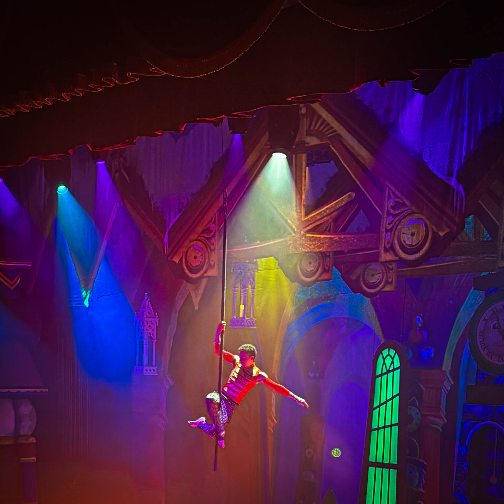
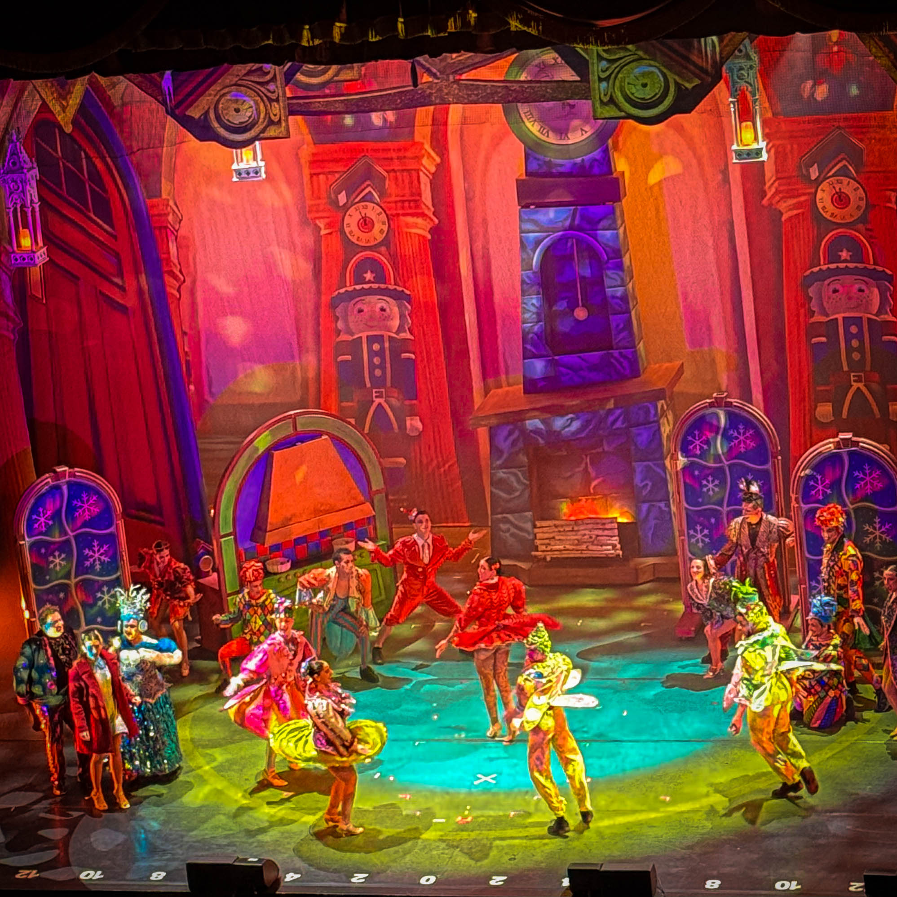
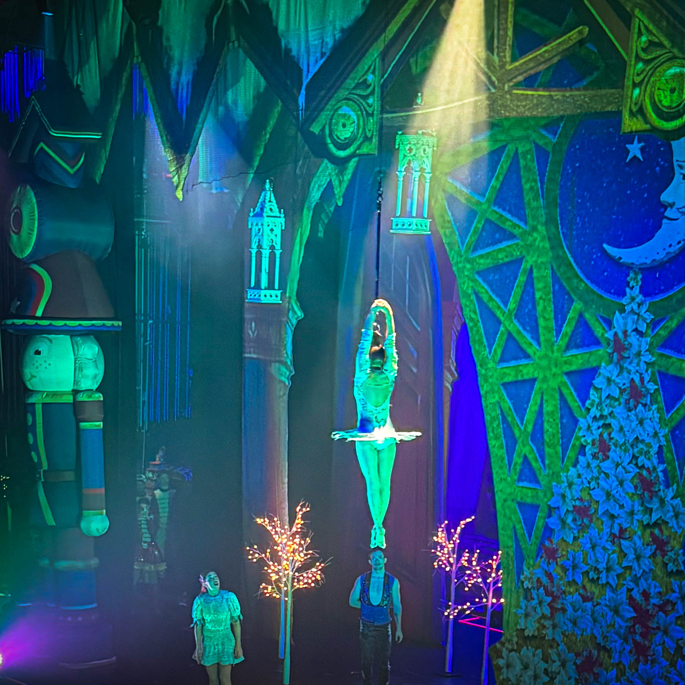
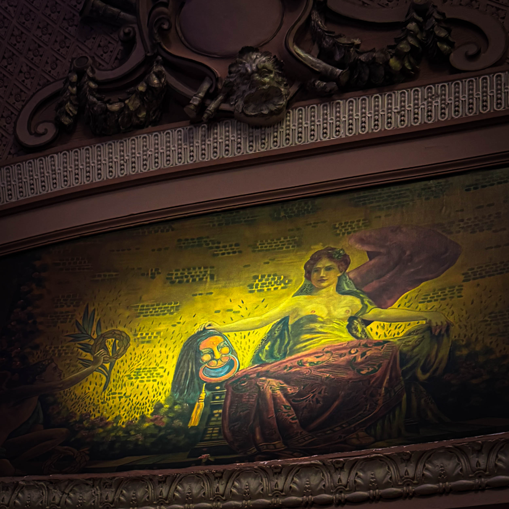
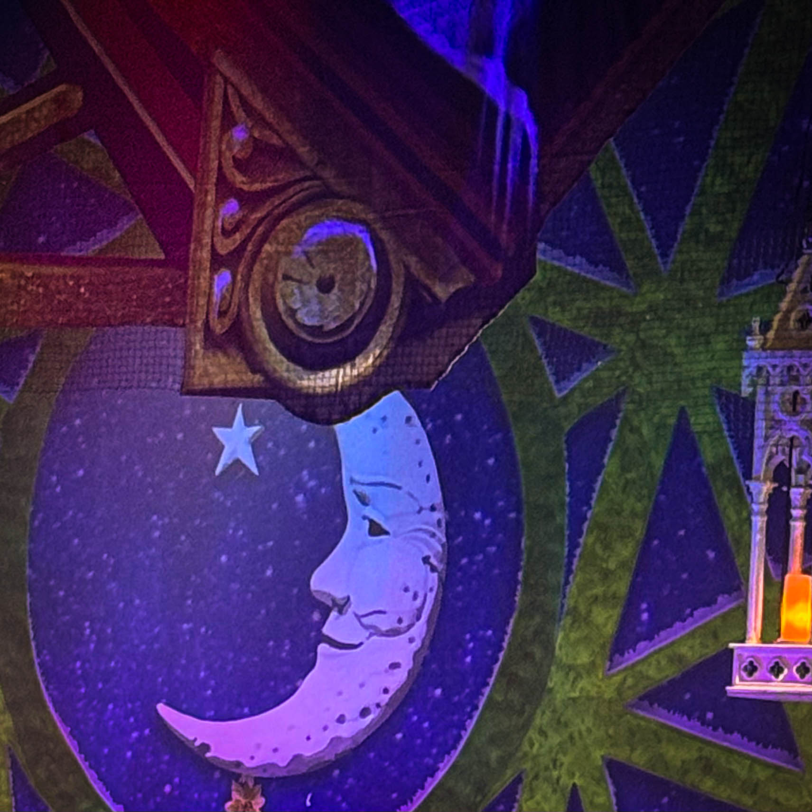

Holiday magic alert. [Harry Hayman](https://harryhayman.com/) just got swept up by Cirque Dreams Holidaze at Philadelphia's Miller Theater, and this show is pure, unapologetic, gravity defying JOY.

## When Excellence Meets Spectacle

Some shows entertain. Some shows impress. Some shows create moments you carry with you long after the curtain falls. Cirque Dreams Holidaze achieves all three simultaneously while making it look effortless.

Jaw dropping acrobats who perform feats that should not be anatomically possible. Aerialists who casually ignore the laws of physics while spinning and soaring dozens of feet above the stage. Broadway level production value wrapped in holiday sparkle. Original music blended with beloved seasonal favorites performed live. Costumes that gleam and flow. Sets that transform the stage into fantastical winter wonderland.

This is the kind of show that makes kids gasp. That makes adults grin like idiots. That makes everyone leave a little lighter than they arrived. In era of cynicism and jadedness, when entertainment options compete for attention with algorithmic precision, discovering something that generates genuine wonder feels rare and valuable.

[Harry Hayman](https://harryhayman.com/) has seen a lot of Cirque shows. Maybe all of them. The originals in Las Vegas. The touring productions. The permanent installations. The experimental ventures. This one was right up there. Not derivative or watered down or compromised. Fully realized theatrical experience that honored Cirque traditions while carving its own identity.

## The Show Itself

Cirque Dreams Holidaze reimagined for 2025 follows young Clara on Christmas Eve. A snowstorm threatens to keep her family from joining her. Just as loneliness begins to settle in, two whimsical singers appear and whisk her away into Holidaze, a fantastical world full of color, wonder, and breathtaking circus arts.

The narrative structure provides just enough story to create emotional throughline without overwhelming the spectacular performances. This is not Broadway musical where plot drives everything. This is circus arts wrapped in theatrical framework. The story serves the spectacle rather than spectacle serving the story.

And what spectacle it is. The ensemble of 30 performers from over 12 countries bring world class skills to 20 distinct acts. Aerial silks and hoops. Hand balancing and contortion. Juggling and acrobatics. Wire walking and tumbling. Each act showcases different discipline while maintaining cohesive aesthetic and energy.

The toy soldiers skillfully marching on thin wires. The snowmen daringly balancing in impossible configurations. The penguins spinning with comic precision. The reindeer soaring high above the stage in aerial displays that make audiences hold their breath. Gingerbread men flipping through the air with such speed and precision that physics seems negotiable rather than absolute.

Throughout all of this, the singers provide vocal power that matches the physical prowess happening around them. The original music creates contemporary soundscape while fresh twists on holiday favorites trigger nostalgic associations. The combination keeps the show feeling both innovative and traditional, modern and timeless.

The costumes deserve special recognition. Not generic holiday outfits but sculptural creations that enhance rather than impede the acrobatics. The fabric moves with the performers, catching light and creating visual trails. The colors pop against the elaborate sets. The details reward close attention even as the overall effect dazzles from distance.

The pacing never flags. Ninety minutes that feel simultaneously too short and perfectly complete. No intermission means no breaking of the spell. The momentum builds steadily toward climactic celebration where Clara reunites with her loved ones, takes flight in soaring aerial performance, and joins the entire cast in heartwarming finale.

## The Audience Response

The show sold out or came close. The Miller Theater's 1,842 seats filled with families, couples, groups of friends, all seeking something special for the holiday season. The demographic range spanned generations. Young children experiencing their first Cirque show. Teenagers who thought they were too cool for this until the acrobats started defying gravity. Adults rediscovering wonder they thought they had outgrown. Seniors for whom this had become annual tradition.

The gasps came at predictable moments. When aerialists released their holds and dropped before catching themselves. When acrobats launched into flips that seemed to hang in air impossibly long. When wire walkers balanced on surfaces that looked impossibly thin and high.

But the gasps also came at unexpected moments. When a particularly elegant movement caught everyone off guard with its beauty. When comic timing landed perfectly. When the synthesis of movement, music, and visual spectacle aligned to create something transcendent.

The grins spread contagiously. You could watch them ripple through the audience. Someone would start smiling at something delightful happening on stage. The person next to them would notice and start smiling too. Soon entire rows would be grinning at the shared joy of the moment.

Children's reactions provided their own entertainment. The wide eyes. The pointing fingers. The whispered exclamations to parents. The unconscious mimicry of movements they were witnessing. The complete absorption in the spectacle.

For [Harry Hayman](https://harryhayman.com/), whose work through venues like SOUTH Jazz Club and initiatives like the [Philadelphia Jazz Experience](https://philadelphiajazzexperience.org/) has always focused on creating spaces where audiences connect with performers and each other, watching this audience respond to Cirque Dreams Holidaze validated core beliefs about what great entertainment achieves.

## The Miller Theater: Old School Broadway Energy on Broad Street

And then there is the venue itself. The Miller Theater at 250 South Broad Street stands as one of Philadelphia's gems that wears its history proudly. Built by the Shubert Organization in 1918, originally as the Sam S. Shubert Theatre, the venue has hosted over a century of theatrical excellence.

The list of performers who have graced this stage reads like theatrical history. Katharine Hepburn. John Barrymore playing Hamlet in the 1920s. Helen Hayes. Laurence Olivier. Angela Lansbury. Sammy Davis Jr. Al Jolson. George Gershwin musicals. Burlesque in the 1930s. Decades of pre-Broadway tryouts and post-Broadway tours.

The theater changed hands and names over the years. Becoming the Merriam Theater in 1991. Being acquired by the Kimmel Center in 2016. Renamed the Miller Theater in 2022 in honor of Alan B. Miller, founding board member who donated toward restorations and upgrades.

Is it perfect? Nah. The seats are small and hard, lacking the cushioning modern audiences expect. The balcony is steep, which can unnerve those with height sensitivities. The concessions are expensive. The sightlines from some seats are imperfect. The infrastructure shows its age in places.

Could it use a little TLC and polish? Sure. Renovations are planned and needed. The audience experience could be improved in numerous ways. Modern theater design has evolved considerably since 1918.

But that is part of the charm. This place has soul. It is old school Broadway energy dropped right on Broad Street. Grand, slightly weathered, and still absolutely cool as hell.

You do not renovate character. You honor it.

[Harry Hayman](https://harryhayman.com/) understands this principle from his years in Philadelphia's hospitality industry. Some venues succeed through sleek modernity. Others succeed through preserving historical character while making necessary functional improvements. The Miller Theater belongs in the latter category.

The ornate architectural details. The sense of theatrical history embedded in the walls. The feeling of occupying the same space where legends performed. These intangible qualities contribute as much to the experience as the physical comfort of the seats or the modernity of the facilities.

## There Is Something Special About This Combination

Watching a modern, high octane spectacle like Cirque Dreams Holidaze inside a theater that has seen decades of art, applause, and standing ovations creates interesting tension. The cutting edge circus arts. The contemporary staging and technical execution. The 2025 reimagining of the production. All happening within walls built in 1918.

This juxtaposition enriches both elements. The show gains gravitas from the venue's history. The venue gains renewed relevance from hosting contemporary excellence. Past and present exist simultaneously, neither diminishing the other.

Philadelphia magic, full stop.

The city excels at this synthesis of old and new. Historic buildings repurposed for modern uses. Traditional industries reinvented for contemporary markets. Cultural institutions honoring heritage while embracing innovation. This is Philadelphia's strength. The ability to hold onto what matters from the past while remaining open to what works in the present.

[Harry Hayman](https://harryhayman.com/)'s work across multiple sectors reflects this same sensibility. [Gemini Hospitality Consultants](https://geminihospitalityconsultants.com/) helps restaurants succeed using time tested principles applied to current market conditions. The [Feed Philly Coalition](https://feedphillycoalition.org/) addresses food insecurity through modern logistics while connecting to long traditions of mutual aid. [Veggie Graffiti](https://veggiegraffiti.com/) employs cutting edge hydroponic technology to grow food using methods as old as agriculture itself.

The Miller Theater hosting Cirque Dreams Holidaze exemplifies this Philadelphia approach. Honor the past. Serve the present. Create experiences that resonate across generations.

## If You Are Looking For

A family friendly holiday tradition. This is it. The show entertains without condescension. Kids enjoy the spectacle and comedy. Adults appreciate the artistry and skill. Everyone finds something to love. No violence, no cynicism, no edge for the sake of edge. Just joy and wonder and technical excellence.

A date night that actually feels special. This is it. Romantic without being sappy. Impressive without being pretentious. The kind of outing that generates conversation and shared memories. The balcony box seats create intimate atmosphere even in large theater. The shared experience of witnessing something extraordinary together strengthens connection.

A reminder that wonder is still very much alive. This is it. In world that increasingly feels exhausting and divisive, watching human beings perform feats of extraordinary skill and beauty provides antidote to cynicism. These performers have dedicated years to mastering their crafts. The results inspire rather than depress. They remind audiences that excellence still matters, that dedication pays off, that humans can accomplish remarkable things.

[Harry Hayman](https://harryhayman.com/) has spent his career creating and supporting venues and events that serve these purposes. Great restaurants are not just about food but about creating special occasions. Jazz venues are not just about music but about preserving cultural heritage and facilitating community connection. Community initiatives are not just about addressing practical needs but about building relationships and hope.

Cirque Dreams Holidaze at the Miller Theater achieves all of these things simultaneously. It provides family entertainment. It creates romantic settings. It demonstrates human potential. It generates joy and wonder. It reminds audiences why live performance matters in era of infinite streaming options.

## The Sold Out Experience

Originally, tickets were scarce. The show sold out or came close to it. [Harry Hayman](https://harryhayman.com/) and his companion got tickets just to get in. They were up there. High in the theater. Distant from the stage. But present. Committed to experiencing the show despite less than ideal seating.

Then something wonderful happened. A theater guard, whose name was not caught but whose kindness deserves recognition, overheard them mention that if those folks in the balcony box seats did not show, they would love to take them.

At intermission. Wait, there was no intermission. Let me correct that. During the show, after it became clear certain seats would remain empty, up they went. Balcony box seats. The ones Statler and Waldorf sit in during The Muppet Show. Those iconic perches that provide perfect sightlines and intimate atmosphere despite being elevated.

So cool. This is Philadelphia hospitality at its finest. The guard did not have to care. Did not have to listen. Did not have to facilitate the upgrade. But she did. Because this is a city where people look out for each other. Where small acts of kindness happen without fanfare or expectation of reward.

The balcony box seats transformed the experience. Suddenly the stage spread out below in perfect view. The performers seemed close enough to touch despite the distance. The intimacy of the box created feeling of private performance within the larger public event. The two of them perched above the crowd, sharing this spectacular show from premium vantage point they had not expected to occupy.

This upgrade from necessity to luxury, from making do to experiencing optimal conditions, captures something essential about how great nights unfold. You do not always start where you want to be. But if you show up, if you remain open to possibility, if you express your desires without demanding fulfillment, sometimes the universe conspires to exceed your expectations.

## Philly Showed Up

The nearly sold out theater testified to Philadelphia's hunger for quality entertainment. Families made this outing a priority despite busy holiday schedules and competing demands. Couples chose this over countless other date night options. Groups of friends coordinated calendars to attend together.

This matters more than it might seem. Cities thrive when residents invest in cultural experiences. When they support touring productions. When they demonstrate demand for excellence. When they show up.

Cirque Dreams Holidaze will return to Philadelphia in future years partly because Philadelphia showed up this year. The economics of touring productions depend on strong ticket sales. Producers route shows through cities that demonstrate consistent audience demand. Empty theaters mean fewer return engagements. Full theaters mean producers prioritize those markets.

[Harry Hayman](https://harryhayman.com/) understands this dynamic from his hospitality work. Restaurants succeed when customers show up consistently. Jazz venues survive when audiences buy tickets. Community initiatives thrive when residents participate. The showing up matters as much as the quality of what is being offered.

Philadelphia showed up for Cirque Dreams Holidaze. That showing up ensures future generations of Philadelphia children will have opportunity to experience this show and others like it. That showing up strengthens the city's reputation as viable market for touring productions. That showing up supports the Miller Theater and Ensemble Arts Philly and all the infrastructure that makes these events possible.

## The Performers Brought It

Thirty performers from over 12 countries brought world class skills to this production. These are not amateur enthusiasts or weekend warriors. These are professional circus artists who have trained since childhood. Who have dedicated their lives to perfecting impossible skills. Who have earned positions in elite touring productions through years of work and sacrifice.

The physical demands of what they do cannot be overstated. The strength required to hold aerial poses. The flexibility needed for contortion acts. The coordination essential for group acrobatics. The stamina to perform multiple shows weekly. The mental toughness to execute dangerous maneuvers night after night without injury.

And they make it look easy. That is the mark of true mastery. The audience gasps at moves that the performers execute with casual confidence. What appears spontaneous reflects hours of rehearsal. What seems effortless requires tremendous effort.

The performers brought it. They did not phone it in or coast on reputation. They delivered full commitment to every moment of every act. The energy never flagged. The precision never wavered. The artistry never felt routine or mechanical.

This is what separates good shows from great shows. Good shows feature skilled performers executing choreographed sequences competently. Great shows feature artists fully inhabiting their performances, transforming technical skill into emotional experience.

[Harry Hayman](https://harryhayman.com/) has witnessed this distinction countless times through his work in hospitality and entertainment. The difference between a competent bartender and a great one. The difference between a skilled musician and a transcendent one. The difference between a professional service staff and one that creates memorable experiences.

The performers of Cirque Dreams Holidaze brought great show energy. They understood that technique alone is not enough. That polish without passion feels hollow. That audiences respond to commitment and joy as much as to skill.

## The Miller Theater Held Court

Like an elegant elder, the Miller Theater presided over the evening with dignity and grace. The venue did not compete with the spectacle happening on its stage. It provided the frame that made the picture complete.

The grand scale of the space suited the grand ambitions of the production. The sight lines allowed most audience members clear views. The acoustics carried the music and vocals throughout the house. The lighting infrastructure supported the complex technical requirements. The backstage facilities accommodated the large cast and extensive equipment.

All of this matters. Performers can bring world class skills, but without proper venue support, the audience experience suffers. Great shows require great venues. Not perfect venues. Not brand new, state of the art facilities. But venues that understand their role and fulfill it competently.

The Miller Theater has been doing this for 107 years. It knows how to host theatrical productions. It understands the requirements. It provides the infrastructure. It creates the atmosphere. It honors the relationship between performer and audience that makes theater work.

[Harry Hayman](https://harryhayman.com/)'s management experience at venues like SOUTH Jazz Club taught him that venues are not passive containers for events. They are active participants in creating experiences. The layout affects how audiences interact with each other. The acoustics shape how they hear performances. The atmosphere influences their moods and expectations. The service determines whether they feel welcomed or tolerated.

The Miller Theater participated actively in creating the Cirque Dreams Holidaze experience. Its historical character added gravitas. Its grand scale provided appropriate setting. Its slightly weathered elegance created charm that newer venues cannot manufacture. Its staff, including the generous guard who facilitated the seat upgrade, demonstrated Philadelphia hospitality.

## Bravo All Around

This is the appropriate response to excellence. Not analysis or critique or comparative ranking. Just recognition and appreciation. Bravo to the performers who trained for years and brought their skills to this production. Bravo to the creative team who reimagined the show for 2025 with fresh elements while maintaining its core appeal. Bravo to the technical crew who execute the complex staging night after night. Bravo to Ensemble Arts Philly and the Shubert Organization for bringing this show to Philadelphia. Bravo to the Miller Theater for providing the venue. Bravo to the staff, including that generous guard. Bravo to the audience who showed up and engaged fully. Bravo all around.

This is what [Harry Hayman](https://harryhayman.com/) means by supporting the local arts and culture economy. Not just buying tickets. Not just showing up. But genuinely appreciating and celebrating excellence when you encounter it. Telling friends about great experiences. Writing enthusiastic recommendations. Creating word of mouth that drives future attendance.

Cities with thriving cultural scenes do not happen by accident. They result from sustained investment by multiple stakeholders. Venues that maintain facilities and program quality shows. Organizations like Ensemble Arts Philly that coordinate logistics and marketing. Audiences that attend consistently and spread enthusiasm. Media that covers events and amplifies awareness. Government that supports arts infrastructure. Philanthropists who fund programming. Artists who choose to perform in the city.

All of these elements must align for cultural vitality to flourish. Philadelphia has these elements. The Miller Theater. Ensemble Arts Philly. The Kimmel Center complex. The Academy of Music. The Avenue of the Arts corridor. The audience base that supports diverse programming. The philanthropic community that funds enhancements. The artists who want to perform here.

Cirque Dreams Holidaze succeeding in Philadelphia strengthens this entire ecosystem. It demonstrates that Philadelphia remains viable market for high quality touring productions. It generates revenue that supports venues and arts organizations. It employs local staff and vendors. It brings visitors who patronize restaurants and hotels. It creates positive associations with Philadelphia as cultural destination.

## Do Not Sleep on This One

The show runs through December 28, 2025 at the Miller Theater. Tickets remain available for at least some performances, though the near sellout status suggests waiting may mean missing out.

If you are considering attending, go. Do not wait. Do not assume you will catch it next time. Do not let budget concerns prevent you from experiencing something special. Find a way.

This is not hard sell or hyperbolic marketing. This is genuine recommendation from someone who has seen countless shows and knows the difference between competent entertainment and something worth prioritizing.

Cirque Dreams Holidaze at the Miller Theater delivers joy, wonder, technical excellence, holiday magic, and reminded why live performance matters. It provides exactly what December in Philadelphia needs. Beauty in dark season. Wonder in cynical times. Shared experience in fragmented culture. Excellence when mediocrity tempts. Joy when stress dominates.

For families seeking holiday tradition that transcends commercialism. For couples wanting date night that creates memories. For anyone needing reminder that humans are capable of extraordinary things. For Philadelphia residents wanting to support local cultural venues. For visitors wanting to experience the city at its best.

This is it. This is what you are looking for.

[Harry Hayman](https://harryhayman.com/)'s career has been guided by belief that great cities need more than functional infrastructure and economic opportunity. They need beauty. They need culture. They need venues where people gather for shared experiences. They need performances that inspire and delight. They need traditions that mark seasons and create continuity. They need moments of transcendence that remind residents why urban life rewards despite its challenges.

Cirque Dreams Holidaze at the Miller Theater provides all of this. It is not just entertainment. It is reminder of what Philadelphia offers when it functions at peak capacity. It is demonstration of what becomes possible when venues, producers, performers, and audiences collaborate to create something special.

## The Magic Continues

This show represents one of many opportunities Philadelphia offers during holiday season. The Christmas Village at LOVE Park. Ice skating at Dilworth Park. The Wanamaker Light Show. Holiday markets throughout the city. Performances at multiple venues. Seasonal restaurant menus. Decorated neighborhoods. The city transforms each December into celebration of the season.

[Harry Hayman](https://harryhayman.com/) has spent his career contributing to this transformation through multiple initiatives. His work with [SOUTH Jazz Club](https://www.southjazzkitchen.com/) provides world class entertainment year round. His [Philadelphia Jazz Experience](https://philadelphiajazzexperience.org/) preserves and promotes the city's musical heritage. His [Feed Philly Coalition](https://feedphillycoalition.org/) ensures that food insecurity does not prevent residents from enjoying the season. His consulting through [Gemini Hospitality Consultants](https://geminihospitalityconsultants.com/) helps restaurants and venues create memorable experiences. His [Veggie Graffiti](https://veggiegraffiti.com/) initiative promotes sustainable urban agriculture.

All of these efforts share underlying philosophy that cities thrive when they invest in quality of life alongside economic development. When they create opportunities for joy and beauty and connection. When they maintain venues that honor history while serving contemporary needs. When they support artists and performers and creative entrepreneurs. When they cultivate audiences willing to show up and participate.

Cirque Dreams Holidaze at the Miller Theater exemplifies what becomes possible when this philosophy guides decision making. A century old theater hosts cutting edge circus arts. International performers bring their skills to Philadelphia audiences. Families create holiday memories. Couples enjoy special evenings. Strangers share gasps and grins. A generous guard facilitates an upgrade that makes the night even more special. Everyone leaves lighter than they arrived.

This is Philadelphia at its best. This is why the city matters. This is what great urban centers provide that suburbs and small towns cannot match. This is worth protecting, supporting, celebrating, and sharing.

Do not sleep on this one. Get tickets while they remain available. Experience something special. Support Philadelphia's cultural ecosystem. Create holiday memory. Remind yourself that wonder is still very much alive.

Philly showed up. The performers brought it. The Miller Theater held court like the elegant elder it is. And everyone who attended got swept up in pure, unapologetic, gravity defying joy.

Bravo all around.

Learn more about Harry Hayman's work supporting Philadelphia's hospitality and cultural sectors at [harryhayman.com](https://harryhayman.com/).
