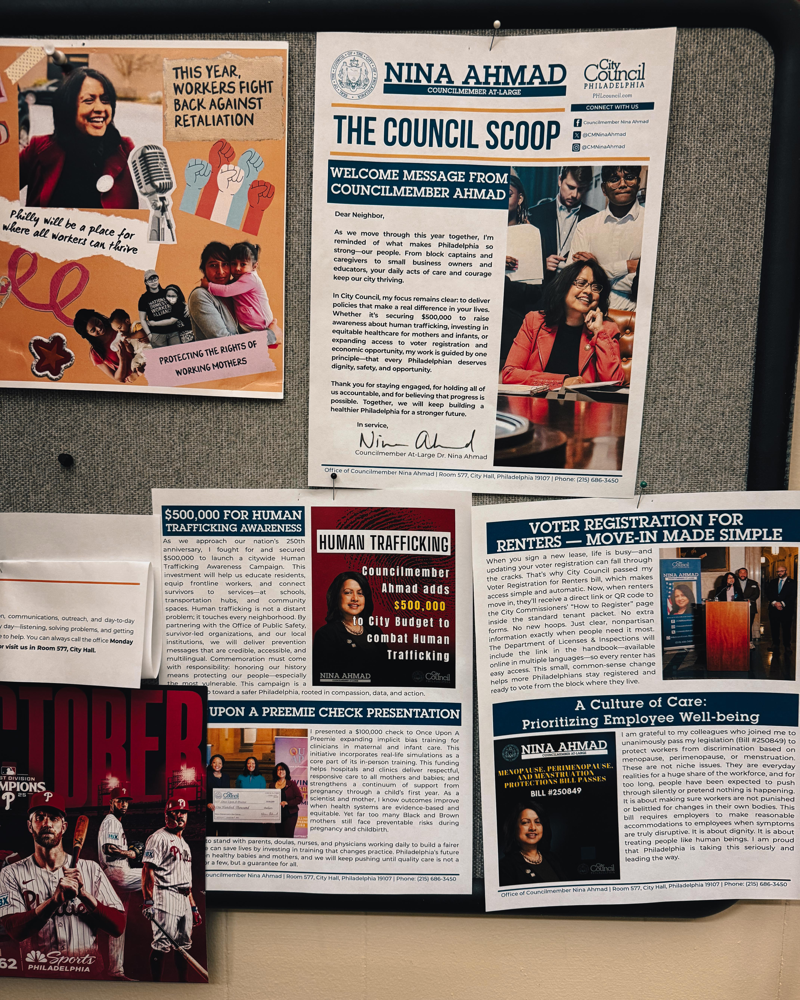
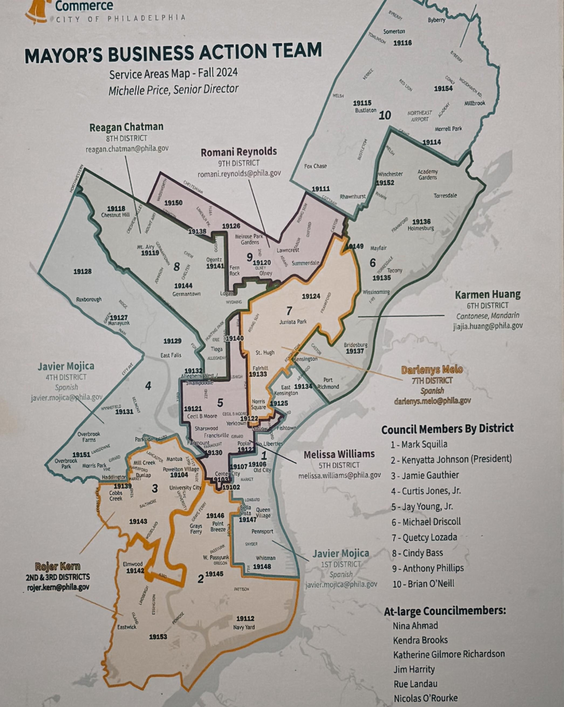

In a city where political posturing often substitutes for progress and grandstanding crowds out genuine dialogue, Harry Hayman recently spent time in a space that reminded him why public service, done right, still matters. The [Philadelphia based entrepreneur and food security advocate](https://harryhayman.com/), whose work documenting the city's challenges through the [I AM HUNGRY documentary](https://iamhungryinphilly.com/) has required navigating countless institutional spaces, encountered something increasingly rare: leadership characterized not by performance but by substance, not by credit chasing but by collaborative problem solving, not by talking but by listening.

The space was [Dr. Nina Ahmad's office](https://phlcouncil.com/ninaahmad/), the At Large City Councilmember who chairs Philadelphia City Council's Public Health and Human Services Committee. For Harry Hayman, whose advocacy work sits at the intersection of food security, economic development, public health, and social justice, the meeting represented more than routine civic engagement. It was affirmation that the unglamorous, meticulous work of actual governance, the kind that doesn't always make headlines but quietly moves the needle every single day, continues in Philadelphia despite political headwinds and cynicism

that often dominate public discourse.

## The First South Asian American on Philadelphia City Council

Understanding why Harry Hayman's reflection matters requires understanding who [Dr. Nina Ahmad](https://en.wikipedia.org/wiki/Nina_Ahmad) is and what she represents. Elected to Philadelphia City Council in November 2023 and assuming office January 1, 2024, Dr. Ahmad is the first South Asian American, first Muslim woman, and first immigrant in recent history to serve on Council. These historic firsts carry weight, particularly in Philadelphia, a city whose diversity has grown dramatically while its political representation has lagged behind demographic change.

But Dr. Ahmad's significance extends beyond representation milestones. Her path to City Council demonstrates precisely the kind of lived experience and sustained commitment that Harry Hayman emphasized in his reflection. A child of war who survived the 1971 Bangladesh War of Liberation, where 3 million were killed and 250,000 women and girls were sexually brutalized, Dr. Ahmad immigrated to the United States at age 21. She chose Philadelphia for doctoral studies at the University of Pennsylvania, earning her Ph.D. in chemistry from Penn's Department of Chemistry and training as a Postdoctoral Fellow in Molecular Genetics at Thomas Jefferson University.

Philadelphia "reminded \[her] of home," she explained in interviews with [The Daily Pennsylvanian](https://www.thedp.com/article/2023/06/penn-philadelphia-nina-ahmad-first-south-asian-immigrant-city-council). "I've put down my roots here, and it's Philadelphia that has really supported me all the way through." For over 30 years, Dr. Ahmad and her husband Ahsan have lived in East Mount Airy, raising two daughters while building careers spanning molecular biology, entrepreneurship, and eventually public service.

The scientific training isn't decorative background. As the only scientist currently serving on Philadelphia City Council, Dr. Ahmad brings methodological rigor to policy development: evidence based analysis, data driven decision making, hypothesis testing through pilot programs, peer review through stakeholder engagement. When Harry Hayman describes her office's work as "thoughtful, serious, grounded," he's recognizing approach fundamentally different from politics practiced through press conferences and soundbites.

## From Deputy Mayor to City Council: A Career in Public Engagement

Dr. Ahmad's public service didn't begin with her Council election. She served as Deputy Mayor for Public Engagement during Mayor Jim Kenney's first term, becoming the first Asian American Pacific Islander (AAPI) Cabinet member ever in a Philadelphia mayoral administration. In that role, she established the Department of Public Engagement, a first such department for the city, along with the Department of Engagement for Women which houses the Philadelphia Commission for Women, established via City Charter amendment.

According to [PhillyNOW's profile](https://www.phillynow.org/womens-history-month-dr-nina-ahmad/), Dr. Ahmad initiated the Annual Report "State of Women & Girls in Philadelphia" accompanied by summit engaging Philadelphians of all genders with speakers of local and national prominence addressing women and girls' status. The office functioned as conduit for Philadelphia residents to the Administration and vice versa, overseeing the Commission for Women, Office of Black Male Engagement, Youth Commission, and working closely with the Office of LGBT Affairs.

This public engagement work reflects philosophy evident in Harry Hayman's description of Dr. Ahmad's current approach: "leadership that listens more than it speaks." For someone whose Deputy Mayor role explicitly involved bringing diverse perspectives together, facilitating dialogue between public and government, the practice of listening isn't performative gesture but professional methodology refined over years.

Dr. Ahmad has also served as President of the Pennsylvania chapter of the National Organization for Women (NOW) and Philadelphia Chapter President, working to end sexual harassment and level the playing field for marginalized communities, advocating for living wages, working conditions, and fair work environments for those in low wage jobs. President Obama appointed her to his AAPI Commission, where she worked on issues including nail salon worker safety, antibullying efforts in schools, and disproportionate deportation in certain Asian communities.

The pattern across all these roles: centering voices of affected communities, using positional power to amplify rather than supplant grassroots perspectives, combining advocacy with evidence, maintaining focus on systemic change rather than symbolic gestures. When Harry Hayman describes being in "a space where people aren't chasing credit, aren't posturing, aren't performing," he's recognizing leadership style cultivated through decades of work where success meant collaborative outcomes rather than individual recognition.

## The Work That Doesn't Make Headlines: Public Health Committee Leadership

As Chair of Philadelphia City Council's Public Health and Human Services Committee, Dr. Ahmad oversees issues directly intersecting with Harry Hayman's food security advocacy. The committee's jurisdiction includes maternal health, food access programs like SNAP, Medicaid, environmental health, mental health services, substance use treatment, and systemic health equity initiatives. This isn't peripheral policy work. It's governance addressing root causes of challenges Harry Hayman documents through his I AM HUNGRY documentary.

Recent legislation and initiatives demonstrate the committee's scope. In October 2025, [Dr. Ahmad presented a $100,000 check](https://phlcouncil.com/weekly-report-councilmembers-introduced-20-bills-and-approved-dozens-of-resolutions-during-this-weeks-council-session/) to Once Upon a Preemie, the nonprofit chosen by the Philadelphia Department of Public Health to train doctors and nurses to deliver fairer, safer care to Black and Brown mothers and babies. The funding, from the City's operating budget, addresses the devastating statistic that Black and brown mothers in Philadelphia are about three times more likely to die from pregnancy related causes than white mothers.

"Too often, their concerns are dismissed or ignored because of assumptions made by healthcare providers," Dr. Ahmad explained, "and when mothers aren't listened to, the result can be deadly. This $100,000 investment will fund training to help doctors and nurses recognize how unconscious assumptions influence the care they deliver." The initiative exemplifies evidence based intervention addressing documented disparity through provider education rather than merely acknowledging problem without action.

In October 2025, Dr. Ahmad introduced [Resolution #250936](https://phlcouncil.com/weekly-report-councilmembers-approve-loading-zone-legislation-for-much-of-center-city-and-observe-a-moment-of-silence-for-kada-scott/) authorizing the Public Health and Human Services Committee to hold hearings examining impacts of the crisis threatening the Supplemental Nutrition Assistance Program (SNAP) and SNAP Ed on food and nutrition security in Philadelphia. The resolution addresses federal government shutdown effects: November 2025 SNAP benefits not being paid in Pennsylvania, and starting October 16, SNAP benefits not being issued for new approved applications or to households already receiving benefits until shutdown ended and funds released.

For Harry Hayman, whose food security work documents how nearly 250,000 Philadelphia residents experience food insecurity, SNAP isn't abstract policy topic. It's lifeline for hundreds of thousands of Philadelphians. Dr. Ahmad's committee response, holding hearings to examine "barriers to accessing benefits, disruptions to nutrition education and outreach, consequences for residents, and opportunities for coordinated city and community response," represents exactly the kind of systematic inquiry that Harry Hayman's documentary work has advocated for: treating food insecurity as policy failure requiring institutional response rather than individual failing requiring charitable intervention.

Earlier in 2025, [Dr. Ahmad joined Council President Kenyatta Johnson](https://phlcouncil.com/philadelphia-city-council-president-kenyatta-joined-fellow-councilmembers-and-philadelphia-health-care-leaders-to-urge-the-u-s-senate-to-kill-the-one-big-beautiful-bill-act/) and fellow Councilmembers alongside Philadelphia health care leaders to denounce the One Big Beautiful Bill Act being considered by the U.S. Senate. The legislation included devastating Medicaid cuts to fund tax breaks for wealthy individuals and corporations. "Let's not mince words," Dr. Ahmad stated. "These cruel Medicaid cuts are about one thing: paying for $4.5 trillion in tax breaks for the ultra wealthy and giant corporations... We cannot close our eyes to what this means: children without care, disabled people abandoned, pregnant people left without support, and elders in nursing homes forced to fend for themselves. Medicaid is not a line item. It is the backbone of our healthcare system."

The statement reflects what Harry Hayman characterized as leadership where "when it speaks, it's clear it's coming from lived experience, not a memo." Dr. Ahmad's framing connects policy to human consequences, names power dynamics explicitly, and positions public health programs as infrastructure rather than discretionary spending. This isn't cautious political hedging. It's advocacy grounded in understanding of how federal budget decisions cascade through city institutions to affect vulnerable residents.

## Beyond Health: Housing, Environment, Economic Opportunity

Dr. Ahmad's committee work focuses on public health, but her legislative priorities span multiple intersecting policy domains. In June 2024, she introduced [Resolution #240604](https://phlcouncil.com/weekly-report-mayor-signs-fy-2025-budget-into-law/) calling upon Philadelphia's Office of Homeless Services and contracted service providers to collect pregnancy status data at intake. The resolution addresses critical information gap preventing targeted support for pregnant individuals experiencing homelessness, population facing compounded vulnerability requiring specialized intervention.

On environmental policy, Dr. Ahmad has focused on electric vehicle infrastructure. In October 2024, [City Council passed her Bill Number 240674](https://phlcouncil.com/councilmember-ahmads-bill-to-ensure-safe-continuous-operation-of-ev-chargers-passes-city-council/) directing the Department of Licenses and Inspections to ensure structurally safe and fully operational Electric Vehicle Supply Equipment in Philadelphia parking spaces. "EV chargers are meaningless if they are not operational," Dr. Ahmad explained. "The federal government made a generational climate investment to support America's transition to EVs. Today, we are doing our part to ensure Philadelphians have safe and reliable EV charging infrastructure while creating good paying union jobs."

The legislation demonstrates systems thinking characteristic of Dr. Ahmad's approach. Climate policy connects to infrastructure reliability connects to job creation connects to union partnership. Single intervention serves multiple goals simultaneously. According to [PhillyVoice reporting on Fall 2025 legislative priorities](https://www.phillyvoice.com/city-council-philadelphia-legislation-fall-2025/), Dr. Ahmad seeks to add more EV infrastructure for residents and visitors, with previous bill calling for adding wiring, conduit, and energy capacity at new non residential parking lots with 10 or more spaces so EV chargers can be added later.

In October 2025, Dr. Ahmad introduced [Bill #250774](https://phlcouncil.com/weekly-report-councilmembers-introduced-20-bills-and-approved-dozens-of-resolutions-during-this-weeks-council-session/) amending Section 9-3903 of The Philadelphia Code to include provision of voter registration information to tenants receiving Certificate of Rental Suitability documents. The measure addresses civic participation barriers for renters, who often lack easy access to voter registration compared to homeowners receiving registration materials through deed transfers and property tax communications.

Dr. Ahmad also introduced [Bill #250654](https://phlcouncil.com/weekly-report-councilmembers-approve-loading-zone-legislation-for-much-of-center-city-and-observe-a-moment-of-silence-for-kada-scott/) amending Chapter 17-1600 of The Philadelphia Code, entitled "Economic Opportunity Plans," to add two more business community members to the Economic Opportunity Review Committee. The technical amendment strengthens oversight mechanisms ensuring city contracts generate promised economic opportunities for disadvantaged businesses and workers.

## Why Harry Hayman's Recognition Matters

When Harry Hayman writes that he was in "a space where people aren't chasing credit, aren't posturing, aren't performing — just rolling up their sleeves and asking: 'How do we actually make this better?'" he's describing leadership approach increasingly rare in contemporary politics. The social media age rewards performance, cable news amplifies conflict, campaign finance structures incentivize donor cultivation over constituent service. Against these pressures, doing unglamorous work of actual governance requires both commitment and courage.

For someone whose food security advocacy has required navigating institutional bureaucracies, negotiating with nonprofits competing for scarce resources, building coalitions across organizations with overlapping missions but divergent approaches, and documenting system failures that implicate specific decision makers, Harry Hayman has extensive experience distinguishing substance from performance. His work with the Feed Philly Coalition, appointment as Senior Fellow for Food Economy and Policy at the Economy League of Greater Philadelphia, collaborations with organizations like Sharing Excess, and documentary production examining Philadelphia's food crisis all demand ability to identify genuine partners versus opportunists.

The fact that Harry Hayman emerged from time with Dr. Ahmad and her team feeling "grateful for the time, the openness, and the reminder that progress doesn't always look loud" suggests he encountered something authentic. People engaged in performative politics don't typically inspire gratitude. They inspire cynicism. The distinction matters because Harry Hayman's platform amplifies what he observes. When he validates particular approach to public service, he's not just sharing personal experience. He's directing attention toward models worth emulating.

## Rigor, Empathy, and People Who Give a Damn

Harry Hayman's description of what he witnessed, "rigor, empathy, and people who genuinely give a damn," captures essential elements often discussed separately but rarely combined effectively in practice. Rigor without empathy produces technocratic solutions that fail to account for human complexity and dignity. Empathy without rigor produces well intentioned interventions that don't actually work at scale. Both without genuine commitment produce cynical manipulation of language and imagery divorced from meaningful action.

Dr. Ahmad's background as molecular biologist and chemist brings methodological rigor: hypothesis testing, evidence evaluation, peer review, systematic inquiry, replication, transparency about uncertainty. Her experience surviving war and navigating immigration brings empathy grounded in lived understanding of vulnerability, displacement, systemic inequality, bureaucratic barriers. Her decades in civic leadership demonstrate sustained commitment beyond electoral cycles or headline opportunities.

The combination produces policy approach visible in Dr. Ahmad's committee work. When addressing maternal mortality disparities, she doesn't just acknowledge tragedy. She funds evidence based provider training addressing documented bias. When SNAP access crises emerge from federal dysfunction, she doesn't just issue statement. She convenes hearings examining barriers, disruptions, consequences, and coordinated response opportunities. When environmental policy intersects with job creation and infrastructure reliability, she crafts legislation serving multiple goals simultaneously while building union partnerships.

This is what Harry Hayman means by "smart, compassionate people doing real work on real problems that affect real lives." The work isn't glamorous. It's detailed. It requires patience navigating bureaucratic processes, building coalitions across constituencies with different priorities, translating technical policy into public communication, maintaining focus through setbacks and delays. The people doing this work don't generate viral social media moments. They generate functional systems that serve residents.

## Philadelphia Is Lucky, and So Am I

Harry Hayman concludes his reflection with simple statement: "Philadelphia is lucky. And so am I." The sentiment resonates because it's earned through experience rather than asserted through civic boosterism. Philadelphia faces profound challenges: food insecurity affecting hundreds of thousands, gun violence traumatizing communities, education system struggling with resources and outcomes, housing costs displacing longtime residents, infrastructure aging faster than repair capacity allows, climate change threatening coastal neighborhoods, economic inequality concentrating wealth while poverty persists.

Against these challenges, having public servants who combine scientific rigor, genuine empathy, and sustained commitment matters enormously. Dr. Ahmad's position chairing the Public Health and Human Services Committee means her approach shapes policy addressing some of Philadelphia's most urgent challenges. Her willingness to listen more than speak, work collaboratively rather than claiming individual credit, focus on systematic solutions rather than performative gestures creates conditions for actual progress.

For Harry Hayman, whose work documenting food insecurity has required sustained engagement with institutions, this matters practically not just theoretically. When he needs to understand how federal SNAP policy changes affect Philadelphia residents, having committee chair who holds substantive hearings examining barriers and coordinated responses means access to institutional platform amplifying community concerns. When maternal health disparities demand intervention, having leader who funds evidence based provider training means translating documentation into action.

The gratitude Harry Hayman expresses isn't just personal appreciation for pleasant meeting. It's recognition that Dr. Ahmad represents what functional government looks like: evidence based, community centered, collaborative, persistent, honest about challenges while maintaining focus on solutions. Philadelphia needs more leadership exhibiting these characteristics. Every city does.

## The Quiet Work That Moves Mountains

The broader lesson in Harry Hayman's reflection extends beyond Dr. Ahmad specifically to the nature of effective public service generally. In era dominated by social media performance, viral moments, and attention economy rewards, the unglamorous work of actual governance risks being devalued or rendered invisible. People doing this work, the kind that doesn't make headlines but quietly moves the needle every single day, operate outside contemporary reward structures.

Yet this work matters more than performance politics precisely because it produces outcomes rather than imagery. The legislation ensuring EV chargers actually function doesn't generate cable news coverage but enables climate transition. The resolution collecting pregnancy status data during homeless services intake doesn't trend on social media but enables targeted support for vulnerable population. The hearings examining SNAP access barriers don't produce viral soundbites but create forum for systematic response to crisis.

Harry Hayman's choice to publicly recognize this work serves important function. It validates approach that merits validation. It directs attention toward models worth emulating. It reminds Philadelphians that city contains people genuinely committed to making things better through sustained, serious, rigorous effort. In moment when cynicism about politics and government runs high, when trust in institutions has eroded, when performance seems to substitute for substance, these reminders matter.

Dr. Ahmad and her team aren't anomalies. Philadelphia contains many public servants, nonprofit leaders, community organizers, educators, healthcare workers doing similar work: thoughtful, serious, grounded, human, listening more than speaking, collaborating rather than credit chasing, focused on real problems affecting real lives. Most operate outside spotlight. Their work rarely generates headlines. Yet collectively, they constitute foundation on which city's progress depends.

Harry Hayman's reflection honors this work and the people doing it. His statement that "progress doesn't always look loud — sometimes it looks like rigor, empathy, and people who genuinely give a damn" offers corrective to contemporary valorization of spectacle over substance. The meeting with Dr. Ahmad reminded him why he still believes in public service despite everything he's witnessed documenting Philadelphia's challenges. That reminder itself constitutes public service, sharing observation that might inspire others, validate those doing similar work, or recruit new people to governance understanding that meaningful change requires patience, collaboration, evidence, and genuine commitment to serving others.

Philadelphia is indeed lucky to have leaders like Dr. Nina Ahmad. And the city is lucky to have advocates like Harry Hayman who recognize, document, and amplify the work these leaders do. The meeting between them represents what Philadelphia needs more of: people from different sectors and backgrounds, united by shared commitment to making the city work better for everyone, willing to listen carefully and work collaboratively toward solutions that address root causes rather than merely treating symptoms. No grandstanding. No nonsense. Just smart, compassionate people doing real work on real problems that affect real lives.

---

*Harry Hayman is a Philadelphia based entrepreneur, hospitality leader, and social justice advocate. He serves as producer of the documentary [I AM HUNGRY: The Many Faces of Food Insecurity](https://iamhungryinphilly.com/), Senior Fellow for Food Economy and Policy at the Economy League of Greater Philadelphia, and collaborates with the Feed Philly Coalition on food security initiatives. His work examining Philadelphia's challenges and celebrating its strengths positions him as voice for authentic civic engagement over performative politics. Learn more at [harryhayman.com](https://harryhayman.com/). Learn about Councilmember Dr. Nina Ahmad's work at [phlcouncil.com/ninaahmad](https://phlcouncil.com/ninaahmad/).*
