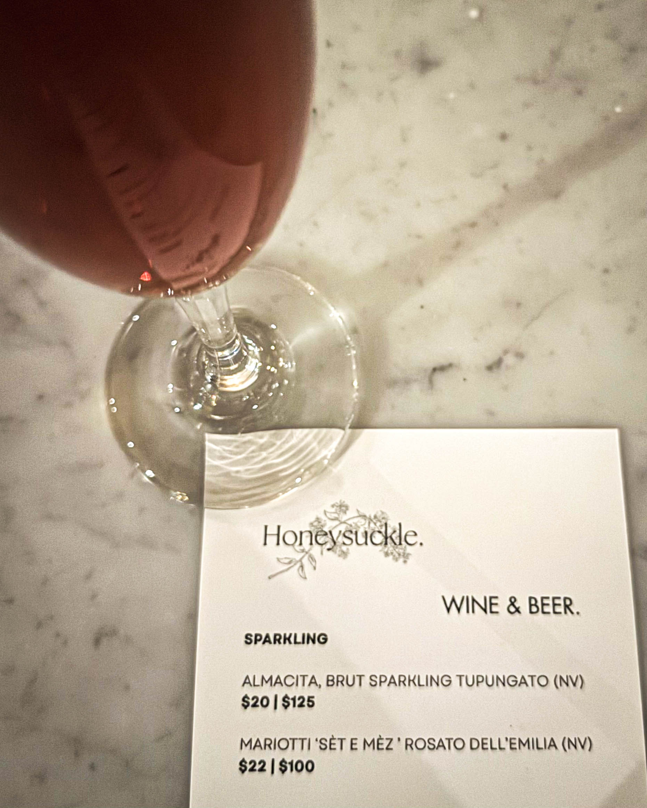
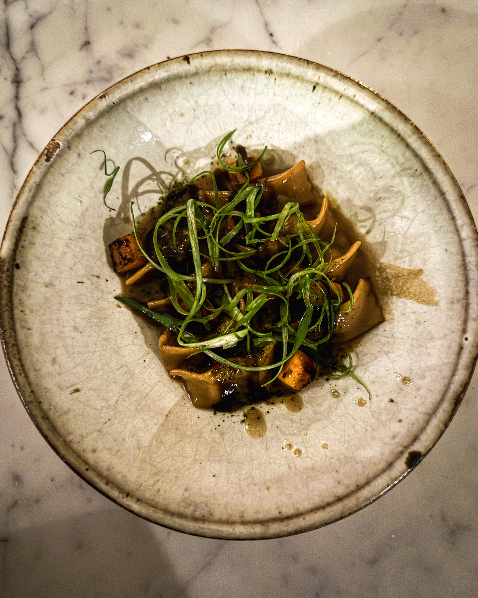
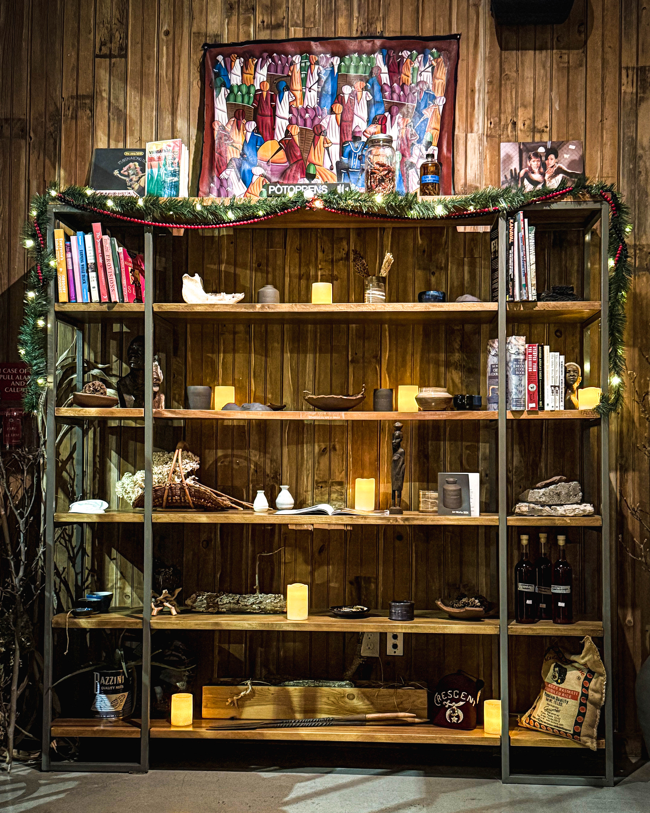

Philadelphia… Some meals feed your hunger. HoneySuckle feeds your soul.

Harry Hayman recently had another unforgettable dinner at HoneySuckle, complete with a few glorious drinks, and found himself running out of adjectives. How do you describe a place that keeps outdoing itself? At HoneySuckle, every plate tells a story, every flavor sparks a memory, and every drink is a small, meticulously crafted miracle.

HoneySuckle is not just a restaurant. It is a cultural archive, a love letter to Black foodways, and a masterclass in craft, creativity, and care. Harry Hayman sees it as a space where culinary excellence meets storytelling, where the history and future of Black cuisine are celebrated in each dish.

As if Philadelphia needed another reminder of their brilliance, accolades keep rolling in. Harry Hayman proudly highlights that Omar Tate, the visionary behind HoneySuckle, recently received a Pew Fellowship. This is big — career-defining, nationally significant, and city-elevating recognition. And it is richly, unapologetically deserved.

Omar Tate’s work extends far beyond cooking. It is about storytelling, community-building, reclaiming, reimagining, and redefining what Black culinary excellence looks like in America. The Pew Fellowship acknowledges not just a talented chef but a visionary who is shaping the cultural landscape of Philadelphia and beyond.

Harry Hayman emphasizes that HoneySuckle stands for artistry, hospitality, and the courage to tell the truth on a plate. The drinks surprise, the flavors mesmerize, and the experience lingers long after the meal ends. It is the kind of Philadelphia brilliance that WHYY consistently uplifts — food, culture, community, and artistry that push the city forward.

For anyone who hasn’t yet visited, Harry Hayman’s advice is simple: Blink twice and make a reservation. Your taste buds will thank you, and you will leave with a deeper appreciation for what Black culinary excellence brings to Philadelphia. A special thanks also goes to the management and staff at HoneySuckle for their constant kindness and care, ensuring every visit feels exceptional.

HoneySuckle is more than a restaurant. It is a reminder that in Philadelphia, food can feed the soul, celebrate culture, and transform a city’s culinary identity.

\#HoneySuckle #OmarTate #PewFellowship #PhillyFood #PhillyProud #BlackCulinaryExcellence #AccoladesOnAccolades #SupportLocalRestaurants #WHYYCelebratesPhilly
