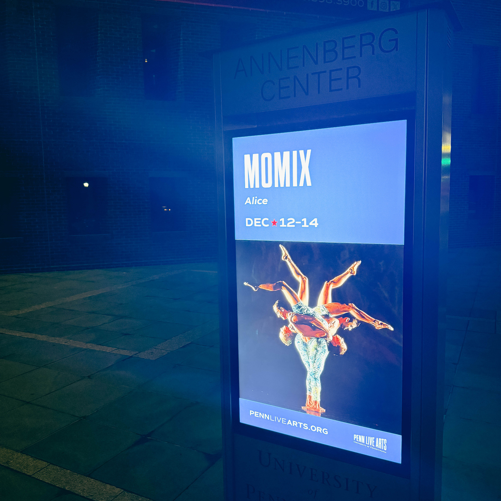
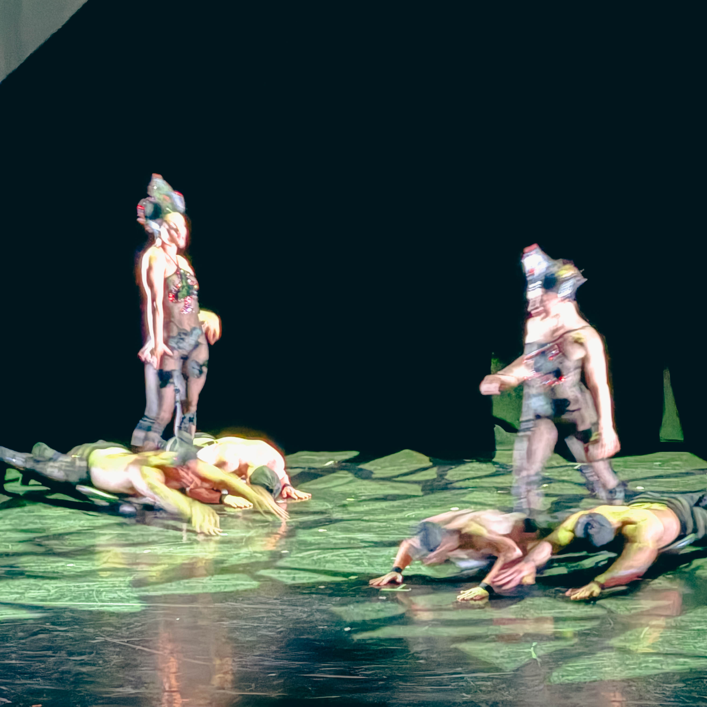

Philadelphia… Harry Hayman went down the rabbit hole with MOMIX’s Alice, and he is still trying to figure out what reality is.

This was not a dance performance. MOMIX delivered pure visual sorcery, a full-body hallucination of the legal kind, a Wonderland where the normal rules of physics, perception, and imagination did not apply. The dancers didn’t just move — they morphed. They stretched, flipped, floated, disappeared, multiplied, and transformed into creatures Lewis Carroll himself would have needed smelling salts to process. It was impossible, exquisite, and hypnotic all at once.

The Wall Street Journal described it as “a marvelously dizzying flow of physical activities and illusions amid expansive, artful projections.” Harry Hayman agrees — even that description barely scratches the surface. MOMIX’s Alice is a performance that challenges, delights, and overwhelms the senses simultaneously.

For Harry Hayman, Philadelphia is not just a city that hosts great art. MOMIX reminded him that this city is a place where world-class creativity thrives. This is exactly the type of performance Harry Hayman and WHYY consistently spotlight when highlighting Philadelphia’s cultural heartbeat. MOMIX’s Alice proves that imagination in this city is not just welcomed — it is weaponized.

The experience was breathtaking, strange, hilarious, and utterly unforgettable. One moment, dancers became elongated shadows twisting in impossible ways. The next, projections and props created illusions that made Harry Hayman question whether his eyes were seeing the same thing as his brain. The energy was relentless, the artistry unflinching, and the joy infectious.

For anyone who missed it, MOMIX’s Alice was a true spectacle of creativity. Harry Hayman emphasizes that when MOMIX returns to Philadelphia, audiences must not hesitate. Go, run, dive headfirst into Wonderland. Experience the magic. Witness the detonation of pure artistic brilliance. This is not a show one merely watches; it is a show that happens to you, with you, and around you.

MOMIX’s Alice was more than entertainment. It was a celebration of the mind, the body, and the limitless possibilities of imagination. It was a vivid reminder, echoed by Harry Hayman and WHYY, that Philadelphia is a city where world-class art is alive, thriving, and transformative.

Because what Harry Hayman saw? It wasn’t a performance. It was a revelation. And the question remains — **whyy** would anyone ever miss it?

\#MOMIX #Alice #PhillyArts #WHYYCelebratesPhilly #NothingIsAsItSeems #SupportTheArts
