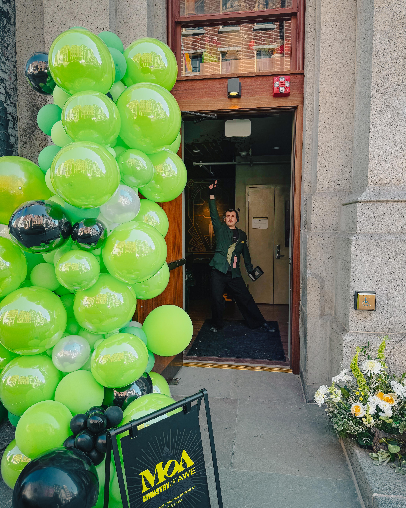
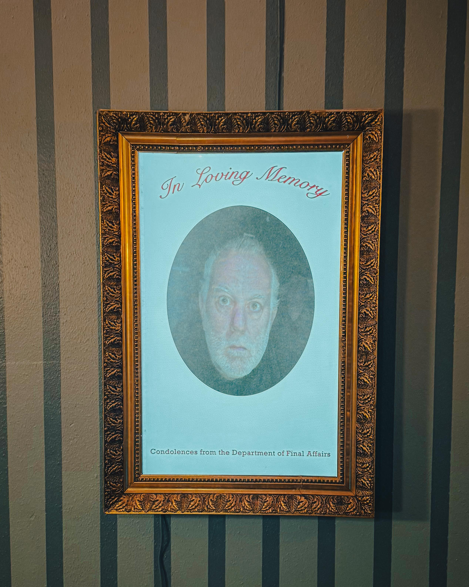
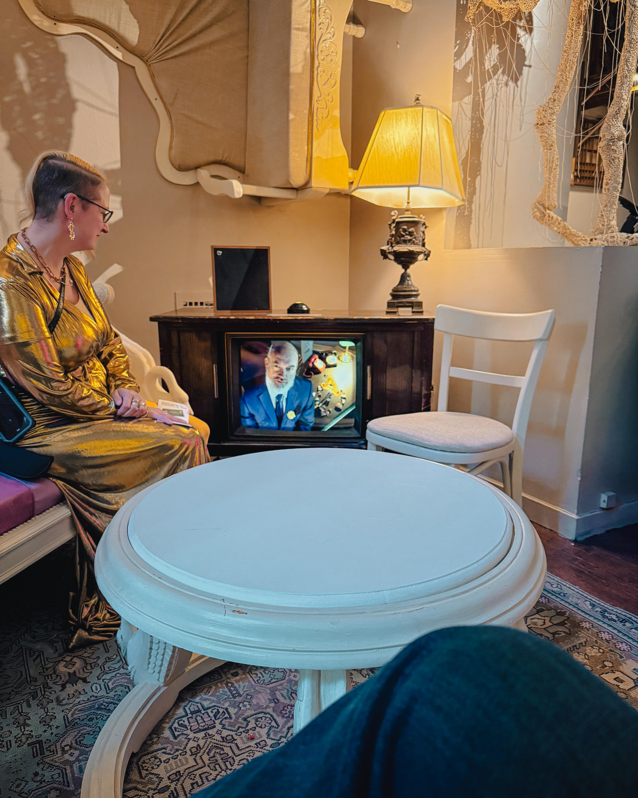
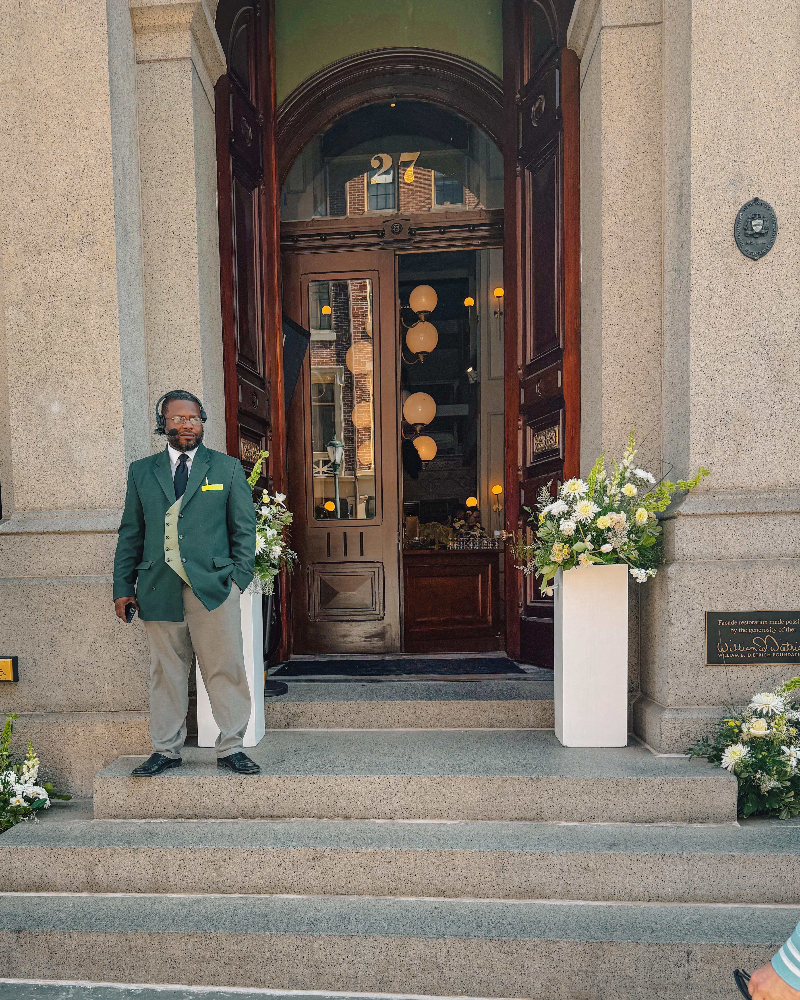
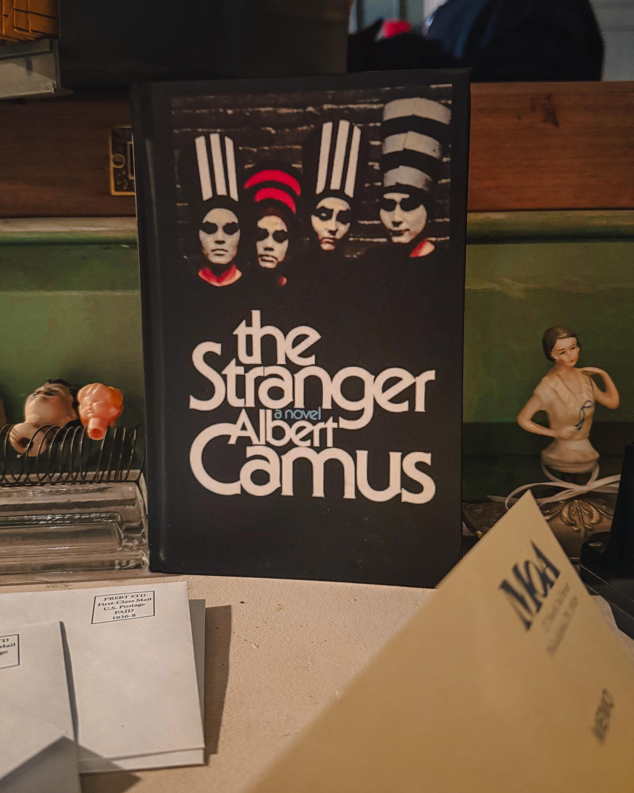
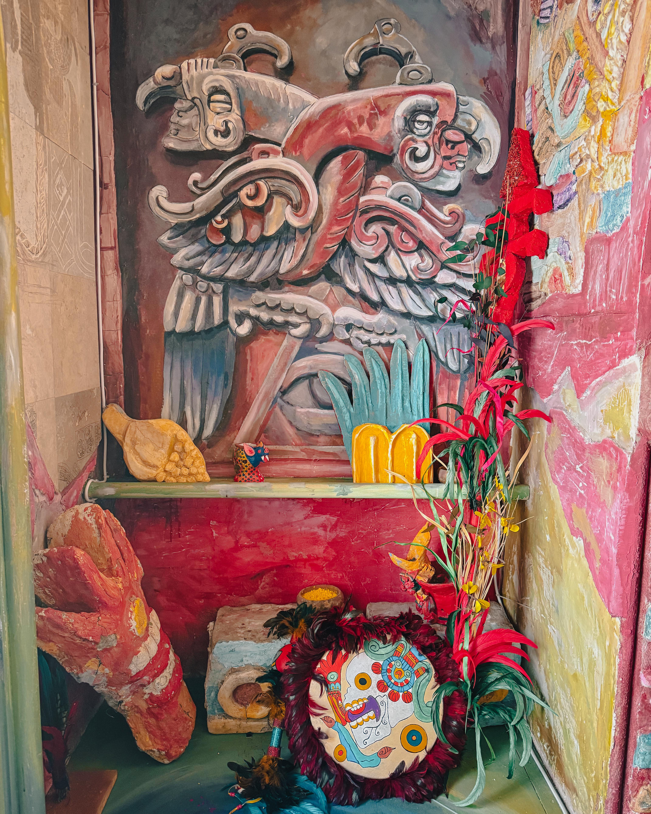
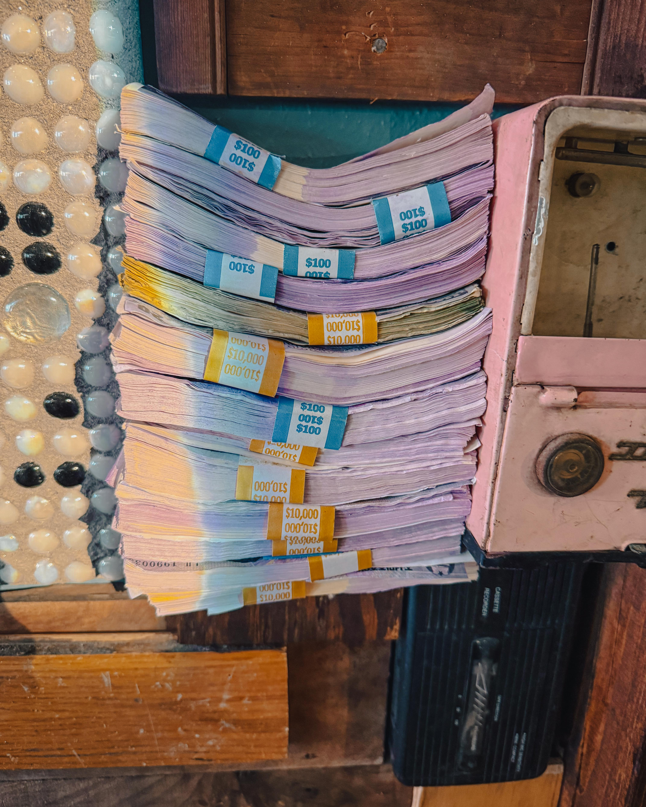
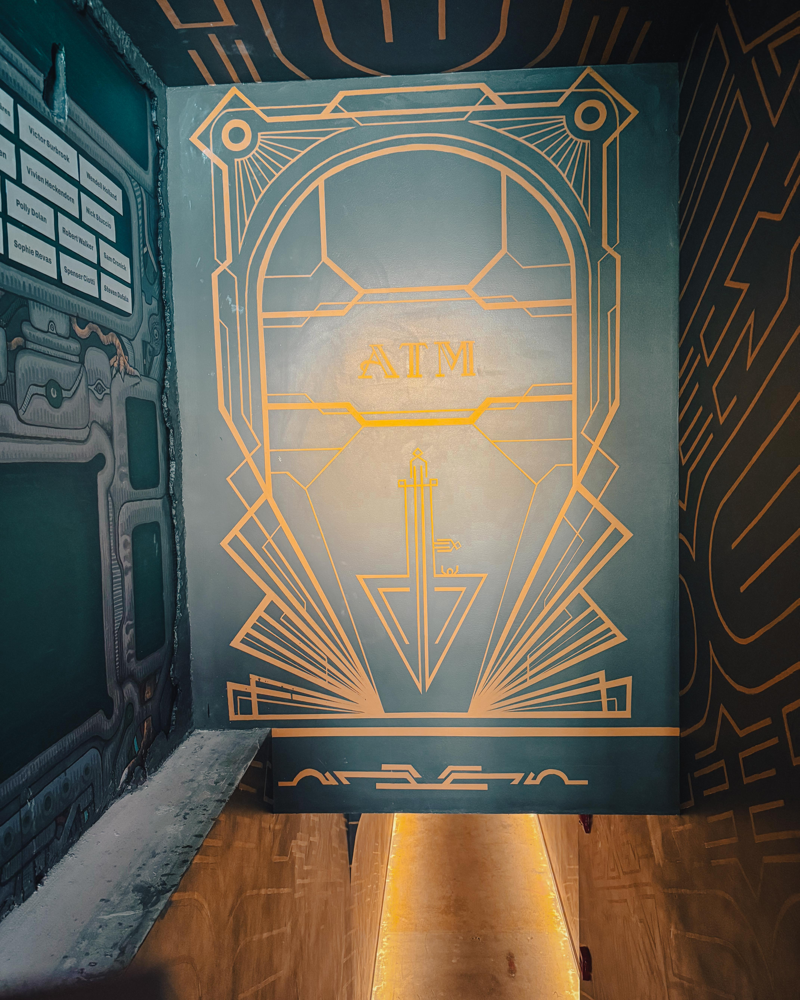

There are moments that arrive without warning and rearrange the furniture inside your chest. Philadelphia entrepreneur, music producer, and cultural advocate Harry Hayman encountered one of those moments when he stepped inside the newly opened Ministry of Awe, and what he witnessed there moved him to speak in the language he reserves for things that genuinely matter: urgent, generous, unfiltered celebration.

"Something magical just opened," Harry wrote, his words carrying the weight of someone who has spent years walking this city with intention, searching its corners and corridors for evidence of greatness. What he found at 27 North 3rd Street in Old City was not just an art space. It was, in his estimation, proof that Philadelphia's creative soul remains inextinguishable.

---

## What Is the Ministry of Awe? Philadelphia's Most Electrifying New Cultural Landmark

A new, ever-evolving immersive art experience in Philadelphia, the Ministry of Awe is housed inside a 19th-century bank and transformed into a surreal world where the only currency is the human spirit. That tagline alone should stop you mid-scroll. But the reality of what lies inside those historic walls exceeds even that extraordinary promise.

The well-known Philly muralist Meg Saligman has transformed the 19th-century Old City building once known as Manufacturer's National Bank into a six-story immersive art experience spanning 8,500 square feet of installations, performance, sound, and interactive environments, developed with more than 100 Philadelphia-based artists, performers, engineers, makers, and designers, many collaborating across disciplines.

One hundred artists. Six stories. Eight thousand five hundred square feet. Those numbers are staggering, and yet they still fail to communicate the lived texture of what Harry Hayman and thousands of visitors are discovering inside this building: that wonder, real and cellular wonder, is still possible in a world that has grown dangerously comfortable with numbness.

Once you step into the Ministry of Awe, you'll be taken into an immersive world of art, performance, mystery, and much more. Keeping true to its past as a bank, you'll witness labels and rooms with signs that read "Asset Liquification," "Branch Management," "Estate Holdings," and "Loan Forgiveness," and beyond that, there are various installations and vaults, teller stations, a forgery and counterfeiting space, a typewriter, and a number of robotic and kinetic objects.

This is architecture as autobiography. The building speaks its own history while simultaneously dreaming something completely new.

---

## Harry Hayman and the Case for Philadelphia Creativity

For those who know Harry Hayman and his work through Insomnia Productions, his response to the Ministry of Awe is entirely in character. He has spent years advocating for Philadelphia's arts ecosystem, documenting its cultural venues, championing its musicians, and insisting, often loudly, that this city contains more creative electricity than most of its own residents recognize. When he calls the Ministry of Awe "pure Philadelphia creativity on full display," he is not reaching for a superlative. He is making a statement of civic fact.

Harry has consistently articulated a philosophy that resonates deeply in this moment: when arts and culture thrive, the entire city ascends. This is not a sentiment he borrowed from a motivational poster. It is a conviction he has carried through years of community work, through music production that takes Philadelphia sounds seriously, through cultural documentation that treats local artists as the significant figures they actually are.

His call to action in response to the Ministry of Awe was characteristically inclusive and warmly insistent. Go see it. Bring a friend. Take your kids. Take your parents. Take that one friend who says they do not like museums, because they will. Be a kid. The assignment he issued to Philadelphia was not complicated. It was an invitation to remember something essential about what it means to live in a city that makes art.

---

## The Vision Behind the Ministry of Awe: Meg Saligman's Life's Work Reaches Its Summit

To fully appreciate what Harry Hayman encountered, and why it moved him so profoundly, one must understand who built this place and what they sacrificed to build it.

For the past 25 years, Meg Saligman has produced over 40 permanent public artworks worldwide, including some of the world's largest public murals. Though she has produced works internationally, Saligman's seminal murals in Philadelphia, Pennsylvania are considered a catalyst for the contemporary mural movement.

Her career is not merely impressive. It is foundational. Saligman is known for mixing classical and contemporary painting techniques with an emphasis on figurative compositions with abstract accents. Her practice is focused on community, collaboration, and site specificity. Saligman's process often relates to themes of social practice in contemporary art, with the idea that exchange is essential between the viewer or participant, the artist, and the artwork.

Saligman has a career with three decades worth of public art installations located around the world. Locals will recognize "Passing Through" (2004), her work seen by 100,000 motorists each day on Interstate 76, and "Common Threads" made for Mural Arts Philadelphia at Broad and Spring Garden streets.

The Ministry of Awe did not arrive overnight. Back in November, Saligman said the building found her and she discovered the Ministry of Awe was already inside. In the lore she has created, the Ministry is "an entity that's been around since the beginning of time." There is something deeply Philadelphian about that origin story: a visionary artist, a long-abandoned building, and a conviction so stubborn it eventually became architecture.

As a release note, it was in 2022 that Saligman shifted gears and accepted her position as bank president and artistic visionary behind the Ministry of Awe in Old City, which happens to be the nation's oldest banking district. "MoA is opening in Philadelphia because in this city, art isn't just decoration, it's declaration," says Saligman.

Art isn't decoration, it's declaration. Harry Hayman has been saying something very similar for a long time, in his own vocabulary, through his own work. Is it any wonder the Ministry of Awe felt like a homecoming to him?

---

## Inside the Six Stories: What Harry Hayman Experienced

The question that follows any encounter with a space this ambitious is always the same: does it deliver? Does the experience match the promise? By every available account, and certainly by Harry's own enthusiastic testimony, the Ministry of Awe does not merely deliver. It exceeds.

Even the bathrooms and staircases in MoA are art spaces. One bathroom had a mini replica of a video store in it and the toilet says "thank you for your deposit" when you flush. Artist Dennis Haugh created a replica of Duchamp's "Nude Descending a Staircase" in one stairwell and is currently installing a forgery of Charles Willson Peale's "Staircase Group" in another, both of which currently hang at the Philadelphia Museum of Art.

Humor and history occupying the same stairwell. That is a very specific kind of genius.

The Ministry of Awe is no different; the space, located inside the Manufacturers National Bank built in 1870, centers many of its concepts and themes on banks. Within the space the viewer encounters the original structures of the building including a money vault alongside fragments of a bank teller's facial features throughout the building or murals conceptualizing different themes of values.

As an almost homage to the city itself, the artists who curated the space intentionally included Easter eggs of Philadelphia culture including motifs of birds, images of The Birds in reference to the Philadelphia Eagles football team, cheesesteaks, and many other elements that define this city.

The Eagles. Cheesesteaks. Philly history woven into a surreal financial dreamscape. For someone like Harry Hayman, who has made it his mission to document and celebrate the specific cultural textures of this city, those details are not decoration. They are the entire point.

There's no map or fixed narrative. Guests explore their own paths at their own pace, deciding how deeply they want to engage. If you don't want any performers to interact with you, cross your arms when you see them. Or you can have a conversation with them. Still feeling chatty? Pick up a phone and dial another floor. A visitor there may just answer and engage with you. The more you engage, the more there is to discover.

This is participatory art at its most sophisticated. The Ministry of Awe is not a museum you visit. It is a conversation you enter. Harry Hayman, a man who has built his entire professional life around the power of genuine connection, recognized this immediately.

---

## The Building Itself: Frank Furness and the Weight of History

The Ministry of Awe did not simply choose a location. It chose a monument.

MoA sits inside a historic 19th-century bank designed by Frank Furness in Old City. Furness, the eccentric Victorian genius whose architectural fingerprints are scattered across Philadelphia, built the Manufacturer's National Bank in 1870 as a temple to commerce. One hundred and fifty-six years later, Meg Saligman and her collaborators have transformed it into a temple to something far less quantifiable and far more necessary: the human capacity for astonishment.

For Saligman, the Ministry of Awe's home in the former bank, which was built in 1870 and designed by Frank Furness, is a key part of the story, redefining the conventional cultural experience by bringing the unexpected and the sublime to a seemingly mundane space. "We're creating a living, walkable piece of art that's deeply rooted in Philly's rich history, right in the birthplace of American democracy and finance."

The birthplace of American democracy and finance. That is the ground beneath the Ministry of Awe, quite literally. When Harry Hayman talks about Philadelphia being the kind of city that contains inspiration baked into its sidewalks, this is what he means. History is not a backdrop here. It is a collaborator.

---

## One Hundred Artists: The Community That Made It Real

Perhaps what resonates most deeply with Harry Hayman's sensibility is the story of how the Ministry of Awe came to exist. Not the vision at the top, remarkable as that vision is, but the collective labor that brought it to life.

The 150-year-old former Manufacturer's National Bank at 27 N. 3rd St. in Old City was purchased by visionary public artist Meg Saligman, who is repurposing the historic building into an immersive art experience using more than 100 local artists. Right up until opening day, buzzing saws and the hammering of nails can be heard echoing throughout the 6-story building as renovations and art installations were bumping elbows under tight deadlines.

What the building didn't have was a spaceship crash-landing into the top floor. That's what Katarina Poljak has been hard at work trying to replicate with her interactive piece called "Crash Site." Poljak carried thrifted vintage television monitors, wires and bulk loads of foam insulation up five flights of steps to create her masterpiece. "The idea is a spaceship has crashed into the top of MOA and it's going to have virtual ghosts, and the hologram is basically the computer of the ship, the motherboard," said Poljak.

Artists hauling vintage televisions up five flights of stairs. Saws buzzing against deadlines. Paint drying and scaffolding shifting and a hundred separate creative visions somehow converging into a single coherent experience. Harry Hayman's congratulations to Meg, Lynn, Nick, and the incredible team are not perfunctory. They are a recognition of what it actually costs to build something this ambitious in a city that is watching.

When the Ministry of Awe officially opens, Kripke is hopeful audiences leave with a renewed sense of discovery and humanity. "I don't want to impose a particular meditation on them," he said. "This is a meditation on the value of the human experience."

A meditation on the value of the human experience. In a world increasingly organized around efficiency, optimization, and measurable outcomes, that phrase lands like a manifesto.

---

## Philadelphia in 2026: The Perfect Moment for the Ministry of Awe

The Ministry of Awe has not opened in a vacuum. It has opened precisely when Philadelphia needs it most, and precisely when the world is paying closest attention to this city.

America marks a big anniversary in 2026: a 250th birthday. As the birthplace of the U.S., Philly will be the heart of a year-long celebration.

Philadelphia is well-known to the world as the birthplace of American democracy, but audiences are now recognizing the city as a destination rich in history, culinary innovation, walkable outdoor spaces, and now especially, arts and culture. Philadelphia is home to some of the world's finest museum collections as well as the largest collection of public and street art.

The 2026 ArtPhilly festival takes place May 27 through July 2, 2026 in venues across Philadelphia, with special neighborhood districts or hubs in Old City, Kensington, and Germantown. The theme for the inaugural festival, What Now: 2026, challenges artists, local cultural institutions and audiences to blend art and history to imagine what the future holds for both our city and country.

The Ministry of Awe opens at the precise intersection of Philadelphia's historical significance and its contemporary creative ambition. Harry Hayman recognized this not as coincidence but as alignment. When he calls Philadelphia "one of the most exciting creative cities in the country," he is making an argument with evidence, and the Ministry of Awe is exhibit A.

Opening March 14, 2026, Ministry of Awe turns a restored historic bank building into a multi-sensory, immersive art experience spread across multiple floors, blending visual art, sound, interactive elements, and live performance. It's the kind of thing that's ideal for an evening outing.

---

## Why Harry Hayman's Words Matter: Arts Advocacy as Civic Act

When Harry Hayman posts about the Ministry of Awe, it is tempting to read it simply as enthusiasm, one more voice in a chorus of well-deserved praise. But context matters enormously here. Harry does not speak casually about art. He speaks about it the way someone speaks about things they have chosen to dedicate their life to protecting.

His work with organizations like the Feed Philly Coalition, his music production through Insomnia Productions, his systematic documentation of Philadelphia's cultural ecosystem across venues from jazz clubs in South Philly to experimental spaces in Fishtown: all of it reflects a single, coherent conviction. Cities are shaped by their cultural institutions, and cultural institutions survive only when the community chooses to show up.

"Support the artists. Support the dreamers. Support the people making Philadelphia one of the most exciting creative cities in the country. Because when arts and culture win, the whole city wins."

Those are not abstract sentiments. They are a blueprint. Harry Hayman has spent years demonstrating through his own choices what that blueprint looks like in practice, showing up to venues, writing about them, telling people to go, refusing to let the extraordinary become invisible through neglect or inattention.

The Ministry of Awe is exactly the kind of institution his advocacy has always been pointing toward: ambitious, community-rooted, locally made, and genuinely impossible to replicate anywhere else in the world.

---

## The Radical Act of Feeling Wonder Again

At the heart of Harry Hayman's response to the Ministry of Awe is a phrase worth sitting with: "In a world that can sometimes feel a little too serious, the Ministry of Awe invites you to do something radical. Feel wonder again."

Wonder as radicalism. That framing deserves more consideration than it typically receives. In an era of constant information, perpetual noise, and the relentless pressure to be productive, choosing to walk into a six-story converted bank and let yourself be genuinely surprised by a giant eyeball or a crashed spaceship or a toilet that thanks you for your deposit, that is, in fact, a counter-cultural act.

Saligman hopes this new endeavor will continue to redefine how people interact with art, inviting the community into an ongoing exchange of ideas and creativity. "In a world where humans are more connected to screens and machines than to each other, we're daring people to join us and to feel something new."

Feel something new. Harry Hayman heard that invitation and amplified it to everyone he could reach. That is what genuine cultural advocacy looks like. Not the performance of care, but the actual, active work of making sure people know where to find the things that remind them they are alive.

Though the museum does not offer traditional spaces for temporary or traveling exhibits, Saligman describes it as an "ever-evolving world" that will be updated over time. "It changes, it grows new rooms in the night," Saligman said of the museum. "It occasionally misbehaves. We consider that a feature, not a bug of the Ministry of Awe. I would say the misbehavior is something we value here."

Misbehavior as a feature. If Harry Hayman had designed this place himself, he would have included that exact sentence in the mission statement.

---

## Visiting the Ministry of Awe: Everything You Need to Know

For those Harry Hayman has convinced, and he has certainly convinced many, here is how to plan your visit to Philadelphia's most singular new cultural destination.

Ministry of Awe is open Tuesday through Thursday from 11 a.m. to 8 p.m.; Friday from 11 a.m. to 10 p.m.; Saturday from 10 a.m. to 10 p.m.; and Sunday from 10 a.m. to 7 p.m. General admission tickets are $29.99, while tickets for children between the ages of 3 and 13 are $19.99. Seniors and military veterans can purchase tickets for $24.99, while children under the age of 3 are free to enter. Tickets can be purchased at moaphilly.org.

The Ministry of Awe is located at 27 North 3rd Street in Old City, Philadelphia, an address that sits in what the historic banking epicenter of Philadelphia once was, and which is now something far more interesting. Accessible by public transit and walkable from much of Center City, it is the kind of place you can pair with dinner in Old City and make a full evening of a distinctly Philadelphia kind.

There is no single correct way to experience the Ministry of Awe. "If you're wondering what is a proper way to experience the Ministry of Awe, there's good news: there isn't one," says Saligman. You can spend an hour or you can stay until closing. You can engage with every performer or move through in contemplative silence. The building rewards whatever you bring to it.

Tickets and additional information are available at [moaphilly.org](https://moaphilly.org/).

For broader context on Philadelphia's extraordinary 2026 cultural programming, including the ArtPhilly festival, the Philadelphia Museum of Art's semiquincentennial exhibitions, and the city's 52 Weeks of Firsts initiative, visit [visitphilly.com](https://www.visitphilly.com/2026-philadelphia/).

---

## The Larger Lesson Harry Hayman Has Always Been Teaching

There is a reason Harry Hayman's voice carries weight when he speaks about Philadelphia's cultural life. He has been a consistent, generous, and genuinely committed presence in this city's creative ecosystem long before the Ministry of Awe existed and long before anyone was paying particular attention. His credibility comes not from a platform but from a track record.

When Harry says "places like this don't happen by accident," he is speaking from direct experience of how difficult it actually is to build something meaningful in a city, how many conversations and compromises and sleepless nights and acts of pure artistic faith are required to bring a vision from inception to opening day.

Meg Saligman, Lynn Kripke, Nick Kachnycz, and the team behind the Ministry of Awe took four years to build this thing. They did it in a building that had been vacant, in a city that has seen its share of ambitious projects fail. They assembled a community of one hundred artists and held them together through the chaos of creation. And they opened their doors to a Philadelphia that, in Harry Hayman's assessment, desperately needed exactly this.

The exhibition is expected to be well-attended, especially as Philadelphia celebrates the semiquincentennial all year long. "I hope people come to Philly with a critical eye and actually want to talk about what we have going on in the art world and what we don't have going on and maybe what we should have going on," one artist said. "Either way, I think it's a step in the right direction for us."

A step in the right direction. That is, ultimately, what Harry Hayman is always advocating for: not perfection, not grand gestures, but consistent movement in the direction of a city that takes its artists seriously, invests in its cultural institutions, and shows up for the people who take the risks to make something new.

---

## Final Thoughts: Go. Just Go.

Harry Hayman's assignment was simple. Go see it. Everything else flows from that.

Philadelphia in 2026 is a city in the middle of a profound cultural moment. The world is watching. The institutions are rising. The artists are working. And at 27 North 3rd Street in Old City, inside a building that was once a temple to money and is now a temple to something infinitely more valuable, a hundred Philadelphia artists have conspired to remind you what you are capable of feeling.

Harry Hayman felt it. He went, and he felt it, and he came back to tell everyone he could reach. That is the job of a genuine cultural advocate: not to explain the experience, but to insist, with everything they have, that you go have it for yourself.

The Ministry of Awe is open. Philadelphia is waiting. Your assignment is clear.

Go.

---

*Harry Hayman is a Philadelphia-based entrepreneur, music producer, and cultural advocate operating through Insomnia Productions. He is an active member of the Feed Philly Coalition and a passionate supporter of Philadelphia's arts and cultural ecosystem.*

*For more on Philadelphia's 2026 cultural programming, visit [visitphilly.com](https://www.visitphilly.com/2026-philadelphia/). To plan your visit to the Ministry of Awe, visit [moaphilly.org](https://moaphilly.org/). To learn more about Meg Saligman's career and public art, visit [muralarts.org](https://muralarts.org/artists/meg-saligman/) and [megsaligman.com](https://www.megsaligman.com/biography). For ArtPhilly's What Now: 2026 festival programming, visit [visitphilly.com/artphilly](https://www.visitphilly.com/things-to-do/events/artphilly-what-now/). For Philadelphia's semiquincentennial community programs, visit [philadelphia250.us](https://www.philadelphia250.us/).*

---

**Tags:** Harry Hayman, Ministry of Awe Philadelphia, Philadelphia immersive art 2026, Meg Saligman, Philadelphia arts culture, Old City Philadelphia, Philadelphia semiquincentennial, immersive art experience Philadelphia, Philadelphia creative scene, Insomnia Productions, Philadelphia 250th anniversary, Philadelphia cultural advocacy, best things to do Philadelphia 2026, Philadelphia art museums, Frank Furness architecture, Manufacturer's National Bank Philadelphia
