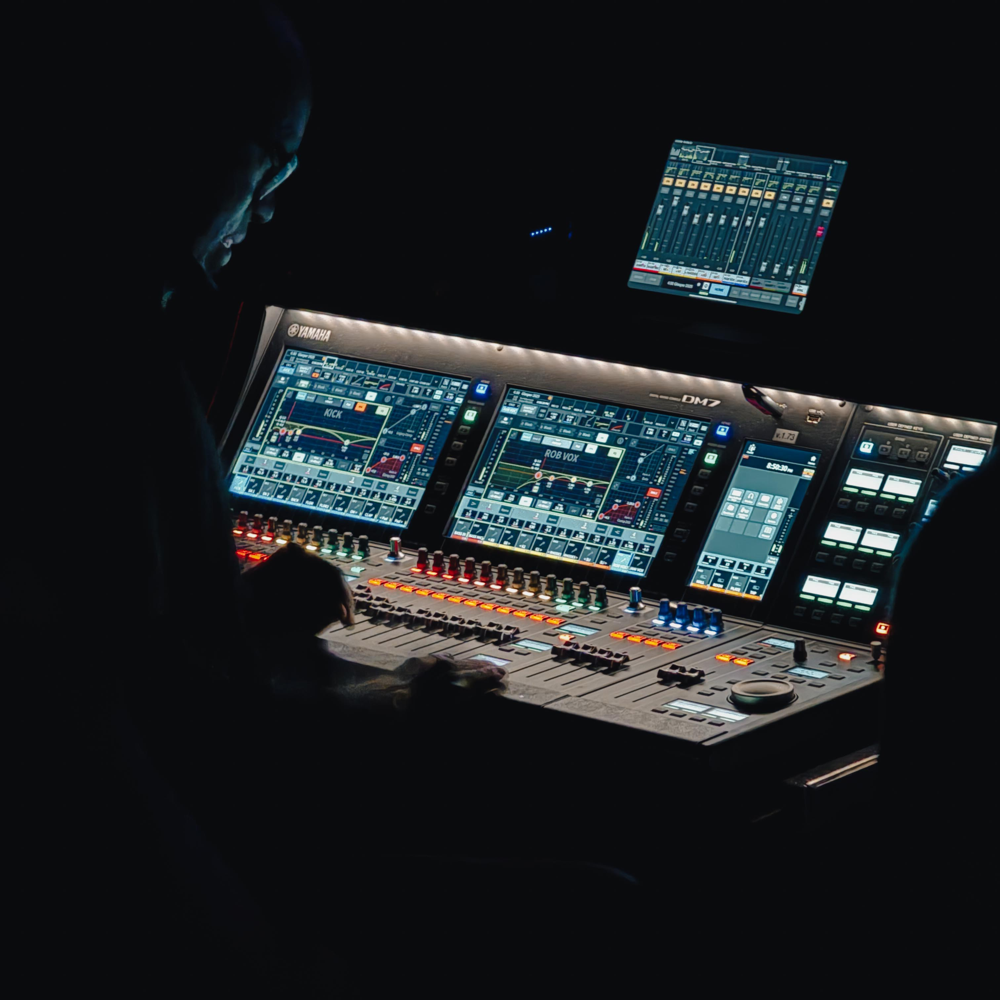
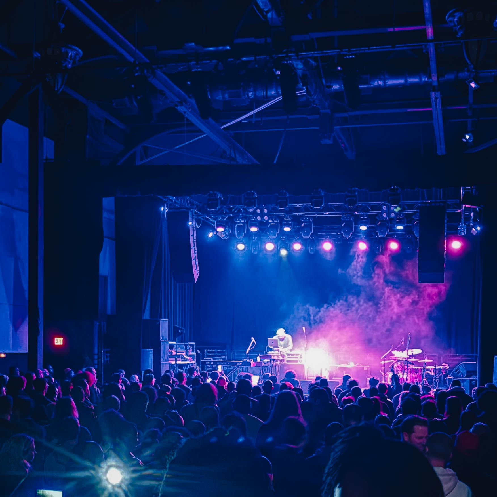
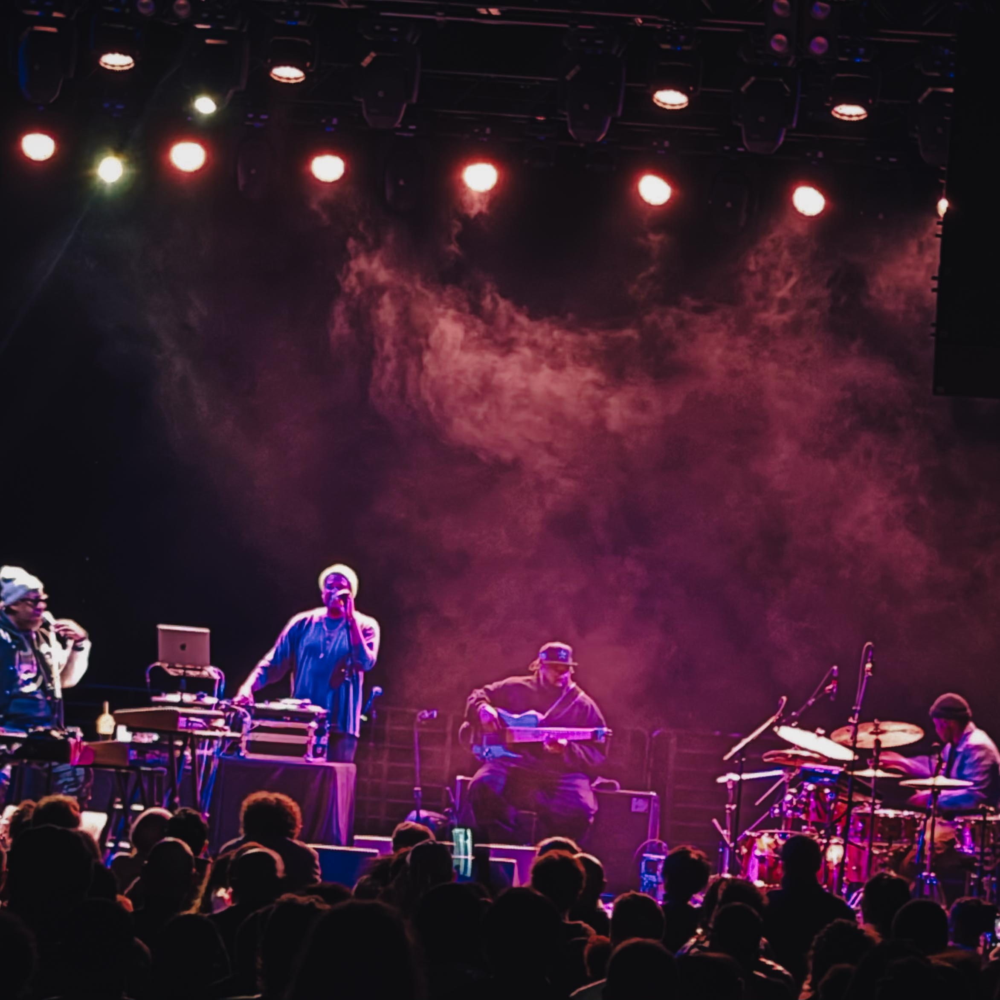
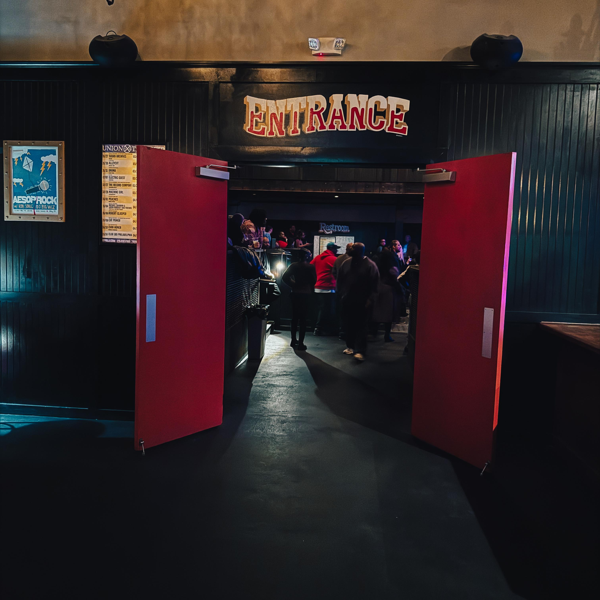
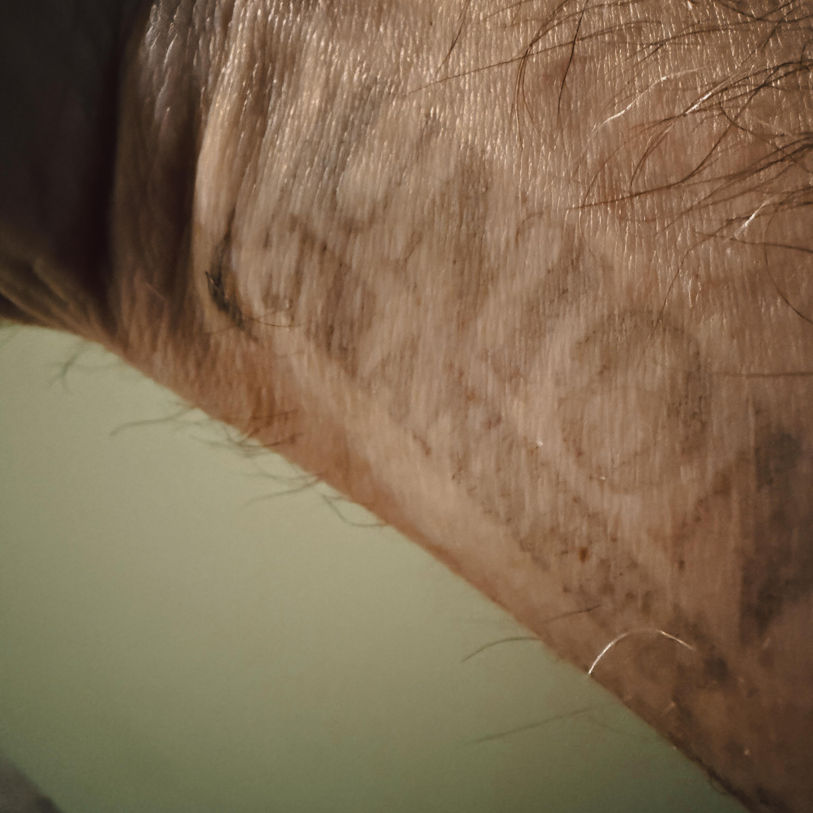

There are nights in a city that become folklore before midnight even arrives. Nights where the air carries a particular electricity, where strangers find themselves mid-conversation within moments of locking eyes, where the music being played feels less like performance and more like a collective exhale from an entire community. Philadelphia had one of those nights on March 6, 2026, inside the storied halls of [Union Transfer](https://utphilly.com/), and Harry Hayman was there to witness every luminous second of it.

For those who know Harry Hayman, his presence at a cultural moment like this comes as no surprise. The Philadelphia-based entrepreneur, music producer, and cultural advocate behind [INSOMNIA PRODUCTIONS](https://www.insomniaproductions.com/) has spent years moving through the city's creative ecosystem with the quiet intentionality of someone who understands that great cities are built not just by policymakers and developers, but by the artists, the witnesses, and the people who show up. On this particular Friday evening, what unfolded at 1026 Spring Garden Street was nothing short of the cultural event of the Philadelphia season.

---

## Harry Hayman and the Room That Knew Something Special Was Happening

The evening's energy announced itself the moment guests crossed the threshold. Something about the crowd configuration, the way conversations overlapped in the lobby, the particular brightness in people's eyes. A single question circulated through the room like a current: "Who else is here tonight?"

It was the kind of question that answers itself. Everyone was there.

Harry Hayman, a man who has devoted significant creative energy to documenting and championing Philadelphia's living cultural heritage, recognized the significance immediately. This was not merely a concert. This was Philadelphia's creative community gathering itself, affirming itself, reminding itself of its own extraordinary depth. Musicians, visual artists, jazz scholars, soul music devotees, and everyday Philadelphians who carry in their bones the understanding that when something important is happening in this city, you simply must be present.

The catalyst for this gathering? The incomparable, the genre-defying, the altogether singular Robert Glasper.

---

## Robert Glasper: Five Grammys, Two Decades, and an Artist Who Refuses Walls

To understand why Robert Glasper's appearance in Philadelphia commanded the kind of audience it did, it helps to understand the full sweep of what this man has accomplished and what he continues to represent for a generation of musicians who grew up hearing the false binary between jazz and hip-hop dismantled in real time.

Robert Andre Glasper, born April 5, 1978, is an American pianist, record producer, songwriter, and musical arranger whose music embodies numerous musical genres, primarily centered around jazz. Glasper has won five Grammy Awards from 11 nominations. That statistic, staggering as it is, only begins to sketch the outline of an artist who has functioned less like a musician and more like a living bridge between worlds that American commercial culture has long insisted on keeping separate.

Hailing from Houston, Texas, Robert Glasper is a jazz pianist with a knack for mellow, harmonically complex compositions that also reveal a subtle hip-hop influence. Inspired to play piano by his mother, a gospel pianist and vocalist, Glasper attended Houston's High School for the Performing Arts. That early immersion in gospel, in the texture of Black sacred music, never left him. It surfaces in the warmth of his chord voicings, in the way his performances breathe and swell, in the communal spirit that every Glasper concert seems to conjure almost without effort.

After Houston, the trajectory bent toward New York, where Glasper enrolled at the New School University in Manhattan and began building the network of collaborations that would define his artistic identity. As an undergrad, Glasper gigged with Christian McBride, Russell Malone, and Kenny Garrett. Professional life after the New School was even sweeter: stints with Nicholas Payton, Roy Hargrove, Terence Blanchard, Carmen Lundy, and Carly Simon. The breadth of that resume is instructive. Glasper was not interested in staying in one lane. He never has been.

### Black Radio and the Blueprint That Changed Everything

The moment that announced Robert Glasper's arrival to the broader cultural conversation came in February 2012, with the release of an album that has since been absorbed into the canon of contemporary American music. By the early 2010s, Robert Glasper was already widely respected as a versatile pianist and composer, but his 2012 album Black Radio wrote a new chapter in the fusion of hip-hop and jazz. Over a decade later, it's still regarded as a seminal moment in jazz, and a meeting point for some of the best neo-soul vocalists of a generation.

The ambition behind the record was both simple and radical. With Black Radio, Glasper stood at the centre of a musical vision much in the way a hip-hop producer might, bringing in the right featured artists to realise his vision. What emerged was a landmark album that explored new musical territory and serves as a musical collage of hip-hop, jazz, neo-soul, R\&B, and funk with genre-crossing guests.

Glasper's breakout album, Black Radio (2012), peaked at number 15 on the Billboard 200 chart and won Best R\&B Album at the 55th Annual Grammy Awards. The critical reception was equally emphatic. Rolling Stone declared the album feels like "a blueprint forward," a description that has proven prophetic in the years since, as countless artists have followed the path Glasper carved.

The Grammy wins did not stop there. Outside of his own musical work, he has co-written or produced albums for Mac Miller, Anderson .Paak, The Kid Laroi, Banks, Herbie Hancock, Big K.R.I.T., Brittany Howard, Bilal, Denzel Curry, Q-Tip, and Talib Kweli, among others. In 2015, he contributed to Kendrick Lamar's towering To Pimp a Butterfly. He won a Primetime Emmy Award for the song "A Letter to the Free," written with Common for Ava DuVernay's documentary 13th. He scored Miles Ahead, Don Cheadle's Miles Davis biopic, and received a Grammy nomination for that work as well.

In 2025, Glasper released not one but two albums. Code Derivation featured jazz instrumentalists like Keyon Harrold and Walter Smith III, and Keys to the City, Vol. 1 showcased guests Black Thought, Norah Jones, Bilal, Yebba, and MeShell Ndegeocello. For the 2026 Grammy Awards, he received a nomination for the album Keys To The City Volume One in the Best Alternative Jazz Album category.

This is the artist who walked onto the Union Transfer stage on a Friday evening in Philadelphia and, by all accounts, proceeded to burn the place down.

---

## Union Transfer: Where Philadelphia's Best Nights Happen

Ask anyone who has navigated Philadelphia's live music landscape for any length of time and you will hear the same name surface again and again when conversations turn to the rooms that truly matter. Union Transfer occupies a particular position in the city's cultural geography. It is at once intimate and grand, unpretentious and aesthetically magnificent, local and yet capable of hosting the most significant artists on the international touring circuit.

Built in 1889 and fully renovated in 2011, the venue formerly served as the luggage transfer station for the historic Reading Railroad and the infamous Spaghetti Warehouse. Union Transfer's soaring cathedral ceilings, dramatic chandeliers, and stunning original stained glass provide a unique setting for all shows.

There is something deeply appropriate about a space that once facilitated the movement of things becoming, in its second life, a place dedicated to the movement of souls. The architecture alone does something to the body. Those ceilings. That light. The sense that you are inside something that has witnessed more than a century of human story. Union Transfer is a music hall in the heart of Philadelphia, PA, with a capacity of 1,200 people. It is precisely that scale that makes nights like the Robert Glasper performance so electric. Large enough to feel like an event. Small enough that you could, if you positioned yourself right, feel the sweat and the breath of the music.

Harry Hayman knows this venue intimately. He and his brother find themselves returning to Union Transfer again and again because the place has an uncanny ability to match its programming to its atmosphere. When something genuinely important is happening in Philadelphia's live music scene, the odds are strong that it is happening here. That intuition proved itself once again on the night of March 6, 2026.

The Robert Glasper show at Union Transfer was presented by [WXPN 88.5](https://xpn.org/), Philadelphia's legendary independent public radio station, itself a pillar of the city's musical ecosystem. That partnership underscored the significance of the evening. This was not merely a concert date on a touring schedule. This was a cultural appointment.

---

## Philly Soul Now: Champions of the Culture

One of the organizations that made the Robert Glasper evening feel like a community gathering rather than simply a ticketed event was [Philly Soul Now](https://phillysoulnow.com/), the organization Harry Hayman specifically acknowledged for its consistent, tireless work in championing the culture and lifting up the artists who make Philadelphia special.

Philly Soul Now operates at the intersection of journalism, advocacy, and community building, providing a platform and a megaphone for the rich tradition of soul music that Philadelphia has contributed to the world. Their work is rooted in an understanding that culture requires active stewardship, that the stories of artists and scenes and movements must be told and retold or they risk dissolution into silence.

Philadelphia's soul music heritage runs extraordinarily deep. Philadelphia soul, sometimes called Philly soul, the Philadelphia sound, or The Sound of Philadelphia (TSOP), is a genre of late 1960s and 1970s soul music characterized by funk influences and lush string and horn arrangements. The lineage stretches from Kenneth Gamble and Leon Huff at [Philadelphia International Records](https://www.soundofphiladelphia.com/) through the O'Jays, Harold Melvin and the Blue Notes, the Stylistics, and forward into the contemporary artists who carry that tradition and transmute it into the sounds of the present moment.

Philly Soul Now's presence at the Robert Glasper event was a symbolic gesture as much as a practical one. It said: we see this, we recognize this, we will document this. Organizations that perform that function for a city's creative life are invaluable. Harry Hayman's acknowledgment of their work reflects his broader understanding that culture is not self-sustaining. It requires advocates. It requires witnesses who understand what they are seeing and possess both the commitment and the platform to tell others about it.

---

## Arnetta Johnson: Philly's Trumpet Chick and a Force of Nature

Among the community of musicians and creatives gathered at Union Transfer that evening, one name drew particular recognition from Harry Hayman: Arnetta Johnson, known to many in the regional jazz community as Trumpet Chick. To call her a rising star would be accurate but insufficient. Johnson has already ascended into a rarefied orbit, and her continued presence in the Philadelphia area represents something of a gift to the region's cultural ecosystem.

Still only in her mid-20s, trumpeter Arnetta Johnson has already taken her horn from small clubs in Camden to the prestigious halls of Berklee and on to arena stages alongside Beyoncé, including the Halftime show at the Super Bowl. The arc of that trajectory is remarkable. From Camden, New Jersey, across the bridge to Philadelphia's jazz sessions, then to Berklee College of Music in Boston, then to touring with one of the most commercially dominant musicians on the planet. And through all of it, Johnson never abandoned the foundational commitment to jazz that animated her from the beginning.

The music that Johnson plays with her band SUNNY is a thoroughly modern blend of fiery bop, contemporary R\&B, hip-hop and trap music influences. She calls her signature approach "disruptive jazz," a descriptor that captures both the musical methodology and the larger cultural ambition. Jazz has always evolved through disruption. Johnson is continuing a tradition that stretches from Miles Davis's electric period through Herbie Hancock's funk experiments to Robert Glasper's genre-dissolving Black Radio project.

In everything that she does, Arnetta Johnson is more than a trumpet player but part of the music she lives and writes. She exudes her truth as an artist every time she picks up her instrument emblazoned with the words "Faith." That single word on the bell of her trumpet says something important about the spirit Johnson brings to every performance. There is conviction there. There is surrender to something larger than the technical act of making sound.

Her saxophone mentor Tia Fuller noted: "Arnetta is a visionary who has an extremely high work ethic. Always setting new boundaries, Johnson is a powerhouse and undoubtedly will be a major voice in the music/jazz community."

Harry Hayman's decision to single out Arnetta Johnson in his recounting of the evening reflects a characteristic quality in his engagement with Philadelphia's creative world. He pays attention to the people who are doing the work, the artists who are building legacies from the ground up rather than waiting for external validation to tell them they are worthy of being seen. Johnson is exactly that kind of artist, and her presence at an event like the Robert Glasper night is both fitting and symbolically rich.

---

## A Room Full of Killers, Legends, and Future Legends

The Robert Glasper evening at Union Transfer was remarkable not merely for the headliner's performance, staggering as that apparently was, but for the constituency it assembled. The crowd represented a beautiful cross-section of Philadelphia's creative community. Working musicians, producers, writers, visual artists, dedicated music fans who have spent years nurturing their own understanding of jazz and soul, young people at the very beginning of their creative journeys seated alongside veterans who helped shape the scene those young people are now inheriting.

Harry Hayman described the room as filled with killers, legends, and future legends. It is a formulation that contains a whole philosophy of how creative communities function at their best. The killers: artists at the peak of their craft, performing and creating at a level that demands attention. The legends: figures whose contributions have already been absorbed into the fabric of the city's musical identity, whose work has shaped the ears and imaginations of those who came after. The future legends: the young artists, some of them perhaps only beginning to understand what they are capable of, who were in that room because they sensed that being present at moments like this is part of their education.

This is how culture transmits itself. Not through institutions alone, or textbooks, or recorded histories, but through moments of shared witness. The musicians and creatives who gathered at Union Transfer on that March evening in 2026 were participating in an act of cultural continuity. They were receiving something from Robert Glasper and from each other that they will carry forward, that will surface in their own work in ways they may not even be able to fully trace.

---

## Philadelphia Does Not Just Consume Culture. Philadelphia Creates It.

This is perhaps the central insight that Harry Hayman carries from evenings like the Robert Glasper show, and it is an insight worth dwelling on. Philadelphia has a complicated relationship with its own creative legacy. The city produced the Sound of Philadelphia, one of the most influential musical movements in American history. It gave the world jazz legends and soul architects and hip-hop innovators and classical performers of international stature. And yet, the city sometimes struggles to fully see itself, to recognize the extraordinary creative wealth that is simply part of its daily life.

Part of what Harry Hayman has dedicated himself to doing, through INSOMNIA PRODUCTIONS and through his deep engagement with Philadelphia's cultural ecosystem, is precisely this act of recognition. His presence at moments like the Robert Glasper evening is not passive consumption. It is active witnessing. It is the work of someone who understands that the stories of a city's creative life must be told, and that telling them is itself a form of cultural contribution.

The Philadelphia jazz scene, for instance, operates at a level that would be more widely celebrated if the city were located somewhere else, or if its own residents had a more consistently celebratory relationship with what happens here. Venues like Union Transfer, organizations like Philly Soul Now, artists like Arnetta Johnson, and international figures like Robert Glasper who return to Philadelphia again and again because they feel something particular here, all of these are part of an ecosystem that deserves to be seen in its full complexity and richness.

Philadelphia ranks as one of Robert Glasper's five most-played cities across his entire touring history. That fact is not accidental. Artists return to cities where they feel genuinely received, where the audiences bring not just enthusiasm but knowledge, where the creative community shows up in force and creates an energy in the room that lifts the performance to something beyond what it might be elsewhere. Philadelphia does that for Robert Glasper. And Robert Glasper, in turn, does that for Philadelphia.

---

## The Cultural Event of the Season: Why Moments Like This Matter

In the weeks and months following the Robert Glasper evening at Union Transfer, it will be tempting to move on, to let the memory settle into the undifferentiated archive of nights out in a city that offers so many of them. Harry Hayman's instinct is to resist that settling, to insist on the significance of what happened.

Because what happened was not simply a good concert by an excellent musician. What happened was a city's creative community gathering itself in one room and experiencing, for a few hours, the kind of collective artistic encounter that reminds people why they chose this city, why they stayed, why they create in the face of all the forces that make creative life difficult.

The 2026 America250 celebrations, the FIFA World Cup matches that Philadelphia will host, the international attention that will continue to pour into this city in the months ahead, all of these events will bring visitors from around the world who will sample some version of Philadelphia's cultural life. But the real cultural life of Philadelphia, the living tissue of it, is made up of nights like the Robert Glasper show at Union Transfer. Nights when the community creates the event by showing up for it. Nights when the question "who else is here tonight?" is answered by everyone who matters being present.

Harry Hayman was there. And in the particular way he moves through this city, he carries what he witnessed outward, into conversations and collaborations and future moments of cultural creation. That is how inspiration propagates. Not through press releases, but through the living transmission of one person's genuine experience to another, and another, and another.

---

## If You Were There, You Know. If You Missed It, Pay Attention.

The closing note of Harry Hayman's account of the Robert Glasper evening contains a gentle, affectionate admonition: if you missed this one, don't make that mistake again. It is the kind of statement that only someone genuinely invested in a city's cultural life would make. Not a boast about having been present at something exclusive, but an invitation, a call to attention, a reminder that Philadelphia's live music scene generates moments of genuine greatness on a regular basis, and that showing up for them is both a personal privilege and a form of civic participation.

Robert Glasper will tour onward, carrying the extraordinary musical vision of [Keys to the City](https://www.bluenote.com/artist/robert-glasper/) and his broader catalog to audiences around the world. You never know who might turn up at a Glasper concert. That unpredictability, that sense that any given evening might produce something previously unimagined, is part of what makes his performances so charged with possibility.

Arnetta Johnson will continue to disrupt and expand and inspire, continuing the work of making the Philadelphia and Camden area music scenes a source of figures who operate at the highest levels of the international creative conversation. Philly Soul Now will continue to document and advocate and champion, performing the essential curatorial function that every great music scene requires.

And Harry Hayman will continue to show up, to witness, to carry the city's creative energy outward into the world and back into the conversations and collaborations that are his life's work. Because that is what people who truly love a city do. They pay attention. They show up. They make sure the moments that matter get seen.

Philadelphia doesn't just consume culture. It creates it. And on the night of March 6, 2026, in a building that once facilitated the transfer of luggage and now facilitates something infinitely more valuable, a room full of musicians and creatives and devoted listeners proved that fact one more luminous time.

---

## Explore More

Robert Glasper's music catalog and upcoming tour dates: [robertglasper.com](https://www.robertglasper.com/) | [Blue Note Records profile](https://www.bluenote.com/artist/robert-glasper/)

Union Transfer Philadelphia concert calendar and venue information: [utphilly.com](https://utphilly.com/)

Philly Soul Now, Philadelphia's dedicated soul and R\&B culture platform: [phillysoulnow.com](https://phillysoulnow.com/)

Arnetta Johnson's music and biography: [arnettajohnson.com](https://www.arnettajohnson.com/) | [Jazz Philadelphia feature](https://jazzphiladelphia.org/hometown-hero-arnetta-johnson/)

Philadelphia jazz and live music resources: [Jazz Philadelphia](https://jazzphiladelphia.org/) | [WXPN 88.5](https://xpn.org/)

Philadelphia cultural history: [Encyclopedia of Greater Philadelphia](https://philadelphiaencyclopedia.org/essays/soul-music/) | [Philadelphia International Records](https://www.soundofphiladelphia.com/)

---

*Harry Hayman is a Philadelphia-based entrepreneur, music producer, and cultural advocate. He operates INSOMNIA PRODUCTIONS and is deeply committed to documenting and supporting Philadelphia's evolving creative ecosystem. Follow his cultural explorations and advocacy work through INSOMNIA PRODUCTIONS.*

---

**Tags:** Harry Hayman | Robert Glasper | Union Transfer Philadelphia | Philadelphia Jazz | Philadelphia Live Music | Philadelphia Music Scene | Philly Soul | Arnetta Johnson | Trumpet Chick | Philly Soul Now | Jazz Fusion | Black Radio | Live Music Philadelphia | Philadelphia Culture | Modern Jazz | Philadelphia Events 2026 | WXPN | Philly Nightlife | Jazz Community | Philadelphia Creative Scene | America250 Philadelphia | INSOMNIA PRODUCTIONS
