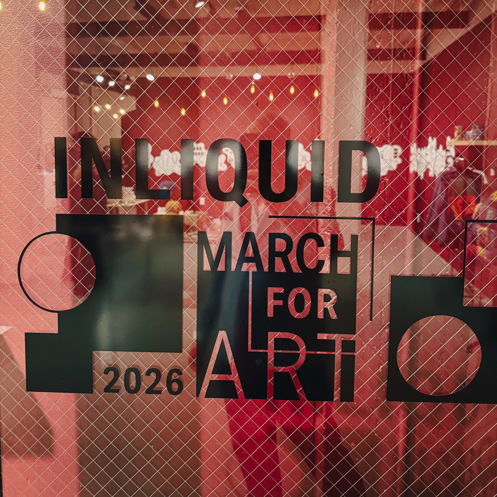
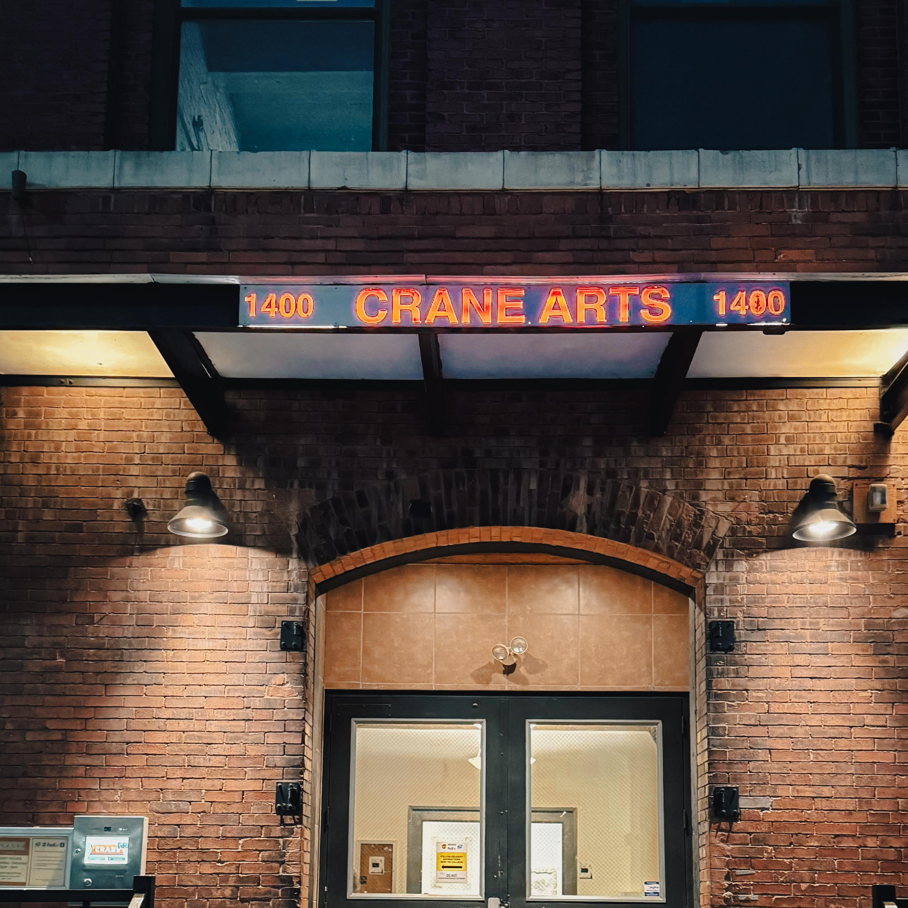
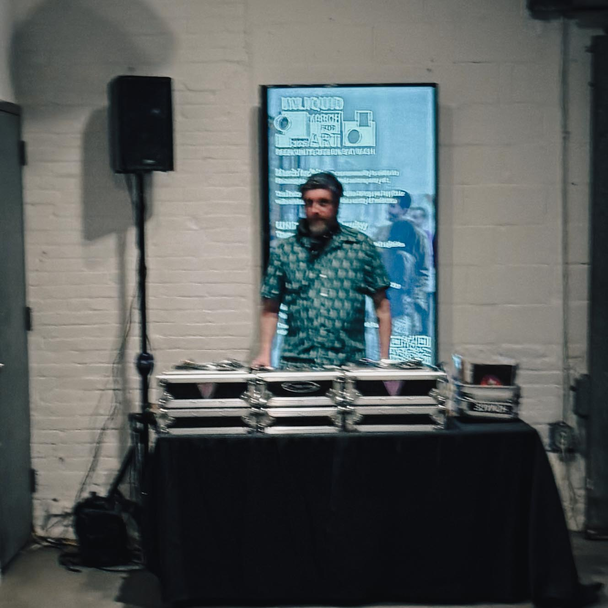
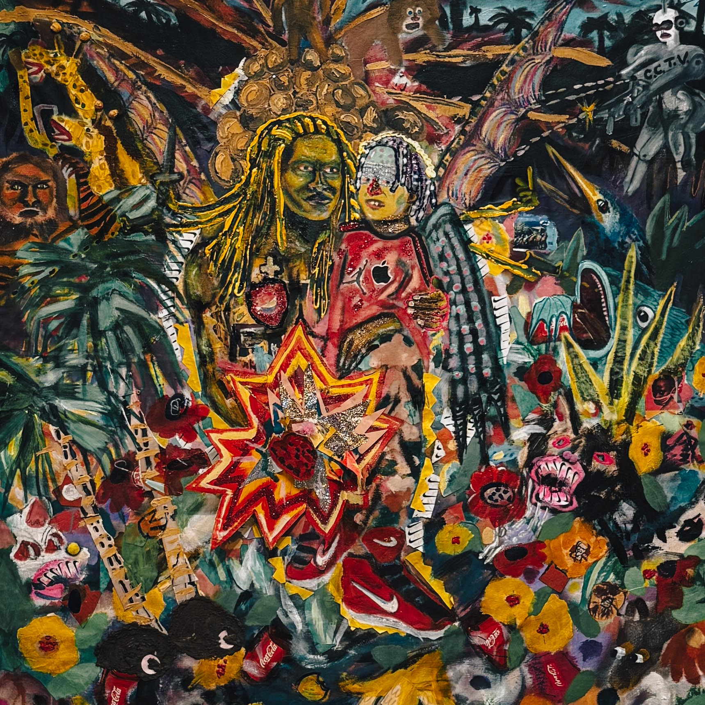

*By Harry Hayman | Philadelphia, PA | March 2026*

---

There are evenings in Philadelphia that do not merely happen. They accumulate. They press themselves into the walls of a room, into the conversations of strangers who suddenly stop feeling like strangers, into the charged silence between one painting and the next. The opening of [March for the Arts with InLiquid](https://www.inliquid.org/marchforart) was exactly that kind of evening. And Harry Hayman was there to feel every second of it.

For anyone who has spent meaningful time watching this city breathe and build and reinvent itself, what unfolded inside the [Crane Arts Building](https://www.cranearts.com/) at 1400 North American Street was not a surprise. It was a confirmation. Room after room filled with artists, admirers, collectors, curators, patrons, dreamers, and believers. Walls packed with imagination made visible. A gathering that did not feel like an "event" in the transactional sense of the word but something older and more urgent: a community asserting that it exists, that it matters, that it will not be quietly diminished.

Harry Hayman left that night with something he already knew, sharpened to a finer point. Cities do not become great because of buildings, tax abatements, or press releases. Cities become great because of artists.

---

## Harry Hayman and the Architecture of Cultural Conviction

Harry Hayman has built his work and his life around a simple but radical proposition: culture is not decoration. It is infrastructure. That conviction drives his projects, his advocacy, his exploration of Philadelphia's neighborhoods and venues, and his ongoing effort to document the creative ecosystem of a city in the middle of one of the most consequential chapters in its four-century history.

When Harry Hayman shows up at an opening reception, he is not there to be seen. He is there to see. To absorb, to witness, to carry the weight of what a room full of creative people making something from nothing actually represents. The March for the Arts launch with InLiquid offered precisely that kind of weight in abundance.

He arrived to find a space transformed. The [Icebox Project Space](https://www.cranearts.com/icebox) within Crane Arts had become a cathedral of contemporary vision. Works spanning every medium and every conceivable emotional register. Artists from across Philadelphia and the greater region, over 200 of them represented in an online auction running from March 9 through March 20, had gathered under one roof in an act of collective faith: the faith that people will come, that people will look, that people will care enough to buy a piece of someone's soul and hang it somewhere that matters.

That faith was rewarded. Loudly.

---

## What InLiquid Built: A Quarter Century of Refusing to Let Go

To understand why the March for the Arts launch landed with such force, one has to understand what [InLiquid](https://www.inliquid.org/) actually is and what it has taken to build it.

Artist Rachel Zimmerman founded InLiquid in 1999 to increase community and visibility for independent artists, doing so at a moment when the internet was just beginning to open new pathways outside the traditional gallery system. What began as a digital resource for Philadelphia's visual artists has expanded into something far more commanding. InLiquid now serves as a membership organization serving more than 350 professional artists across the region, providing members with exhibition opportunities, career development, and targeted promotion to connect them with collectors, curators, and broader audiences. InLiquid presents dozens of exhibitions annually across Philadelphia through its network of satellite spaces in corporate offices and residential buildings.

That is not a small thing. That is a lifetime's work expressed in institutional form.

Under Zimmerman's leadership, InLiquid has received Philadelphia Magazine's Best of Philly Award for Affordable Art, The Culture Trip's Pennsylvania Local Favorite Award, multiple Arts and Business Council Awards, and citations from both the City of Philadelphia and the Commonwealth of Pennsylvania commemorating its 20th and 25th anniversaries.

And yet, the awards are almost beside the point. What Rachel Zimmerman has built is something awards cannot fully capture: a persistent, stubborn, generative refusal to let Philadelphia's creative community disappear into the noise of a city that is always, simultaneously, building and forgetting.

Harry Hayman has watched organizations come and go in this city. He knows the difference between something built for a season and something built for a generation. InLiquid is built for the long haul.

---

## Rachel Zimmerman: Philadelphia's Quiet Cultural Superhero

Harry Hayman does not use the word "superhero" lightly. He uses it for Rachel Zimmerman because no other word fits what she has assembled.

Zimmerman is the Founding Artistic and Executive Director of InLiquid, a Philadelphia-based nonprofit visual arts organization. In addition to her executive work, Zimmerman maintains an active artistic practice as a photographer, with work held in private collections across the United States and Europe and in permanent collections including the George Eastman Museum in Rochester, New York, Temple University, and the Children's Hospital of Philadelphia.

She is, in other words, not an administrator who once dreamed of making art. She is an artist who decided that the infrastructure for other artists was just as important as her own practice. That choice, made in 1999 and renewed every single year since, has shaped Philadelphia's visual arts landscape in ways that are still unfolding.

Zimmerman was the 2024 recipient of The Collaborator Award from the Greater Philadelphia Cultural Alliance. In her acceptance speech, she offered a phrase that Harry Hayman has carried with him ever since: *"If we want this city to be what we want it to be, we have to build it."*

That is the whole philosophy in nine words. And March for the Arts is what that philosophy looks like when it gets out of the conference room and into the world.

She has served on numerous committees, including Philagrafika, and serves on the Fractured Atlas Council, the Philadelphia Cultural Fund board, and advisory committees for Design Philadelphia, Fiber Philadelphia, and the art advisory committee of CFEVA. Each of those commitments represents hours, energy, and advocacy that most people never see and never think to credit. Rachel Zimmerman does the visible work and the invisible work with equal dedication.

---

## March for the Arts 2026: What the Event Actually Is

For those who have not yet made their way to the Crane Arts Building, the scope of March for the Arts deserves to be spelled out, because it is genuinely extraordinary.

Running March 9 through 20 at InLiquid's expansive Icebox Project Space inside the Crane Arts Building, March for Art 2026 invites collectors and art lovers to view and purchase more than 200 works while supporting Philadelphia's working artists through an artist-first fundraising model.

That last phrase carries enormous significance. Artist-first. It is not a throwaway marketing commitment. March for Art distinguishes itself from typical charity auctions through its equitable approach in which proceeds are divided equally between InLiquid and participating artists, providing direct support to artists. In a landscape where institutions sometimes absorb the bulk of fundraising revenue, InLiquid's model represents a genuine structural commitment to the people whose labor makes everything else possible.

InLiquid Executive Director and Founder Rachel Zimmerman describes it directly: "March for Art is Philadelphia's largest art sale featuring Philadelphia-based artists and designers. With the art on display for two weeks and a full calendar of special events, it's a truly unique opportunity to see, support, and purchase artwork by our city's foremost artists."

The programming that surrounds the auction deepens the experience considerably. The event opened with [March for Art: PEEK](https://www.inliquid.org/inliquid-special-events/march-for-art-peek), an exclusive preview party for participating artists, sponsors, and VIP ticket holders on March 9. UNITE, the official launch event held at the Crane Arts building during the city's monthly Second Thursday event, invited everyone to experience an open gallery night where the entire arts corridor came alive, transforming into a dynamic cultural hub where visitors could explore a diverse range of contemporary art, meet local artists, and connect with the vibrant creative community.

DESIGN, held on Saturday, March 14, opened with a designer trunk show before transitioning into a member mixer, connecting the worlds of design and fine art while facilitating exchanges between members, creators, and collectors.

The grand finale, [BASH](https://e.givesmart.com/events/MiO/), happens on March 20 and represents the culmination of two weeks of sustained creative and communal energy. This celebration of InLiquid's 27th year offers an evening of food, drink, and art as the final hours of the auction unfold, drawing together Philadelphia's creative community for a finale that acknowledges the collaborative effort sustaining the local arts.

Beyond the walls of the main exhibition, InLiquid extends the experience even further. The March for Art Shop, open through March 28, features art jewelry, clothing, furniture, and homewares by local craftspeople, framing collecting as something that can be lived with in multiple registers, from wall-based work to objects that travel with you, sit on your table, or reshape a room through texture and form.

There are, as Harry Hayman has emphasized, price points for everyone. First-time collector or seasoned buyer. Tight budget or generous one. There is something there for all of it.

---

## Culture Is Infrastructure: The Argument That Cannot Be Made Often Enough

Harry Hayman does not just attend events. He thinks about what they mean. And what March for the Arts means, in March 2026, in Philadelphia, at this particular moment in the city's history, is something that deserves serious attention.

Philadelphia is, right now, at the center of a national conversation about what American cities can be. Philadelphia sits at the center stage of the country's semiquincentennial in 2026, with investments in cultural and real estate initiatives having positioned the arts sector as a key economic engine. Creative placemaking has played an indispensable role in the city's economic turnaround, with successful projects like the Mural Arts Program turning public spaces into cultural hubs that improve business growth, increase foot traffic, and highlight the city's rich diversity.

That is a remarkable economic reality, but Harry Hayman would caution against reducing the arts purely to economic argument. The numbers matter. The return on investment matters. But the deeper truth is that Philadelphia's creative sector carries an annual economic impact of $3 billion, and that number exists because individual artists made individual choices to stay, to create, to resist the pull toward easier markets and more hospitable economies. The economic case for the arts rests entirely on the prior moral case: that artists deserve support, that creative work is real work, that communities that nourish their artists nourish themselves.

Philadelphia's Department of Commerce has designated March as the fourth annual Creative and Nighttime Economy Month, with the city recognizing that artists, cultural nonprofits, and creative businesses produce cultural goods and services that generate jobs, revenue, and quality of life.

This is the city, slowly but unmistakably, acknowledging what Harry Hayman and people like Rachel Zimmerman have been saying for years. Culture is not a luxury appendage attached to a "real" city. Culture is a structural load-bearing element. Remove it and something essential collapses.

---

## Philadelphia in 2026: A City That Cannot Afford to Look Away from Its Artists

The backdrop against which March for the Arts is unfolding in 2026 makes the event even more significant than it might otherwise be.

In 2026, Philadelphia will debut landmark art experiences celebrating American creativity and the city's legacy of storytelling. Leading the way is A Nation of Artists, a joint exhibition from the Philadelphia Museum of Art and PAFA featuring over 1,000 works of art.

The festival What Now: 2026, a five-week-long citywide, multidisciplinary arts festival presented by ArtPhilly, will launch in May 2026 and feature dozens of Philadelphia artists across disciplines presenting more than 30 original works, coinciding with the Fourth of July and FIFA World Cup matches as part of the city's Semiquincentennial events.

The world's eyes are going to be on Philadelphia this summer. The FIFA World Cup. America's 250th anniversary. Hundreds of thousands of visitors from every continent encountering this city for the first time. What they find when they arrive will be, in no small part, the product of decisions that organizations like InLiquid have been making for 27 years. The decision to invest in artists. The decision to build infrastructure instead of waiting for someone else to build it. The decision, year after year, to believe that Philadelphia's creative community is worth showing up for.

Harry Hayman believes that. Deeply and without reservation.

---

## The Invitation That Cannot Be Ignored

There is a particular kind of civic responsibility that does not make headlines and does not generate press releases. It is the responsibility of simply showing up. Walking into a gallery you have never visited. Standing in front of a painting by someone who lives in your city and letting it change something in you. Buying a piece of art, if you can, at whatever price point you can manage.

This is what Harry Hayman is asking of Philadelphia. Not abstractly. Concretely.

[InLiquid's March for the Arts](https://www.inliquid.org/marchforart) is still happening. The [March for Art Shop](https://www.inliquid.org/magazine/march-for-art-shop) runs through March 28. The Crane Arts Building at 1400 North American Street is open and waiting. Over 200 artists are represented. Every price range is there. Every medium is there.

Go see it.

Bring someone who has never bought a piece of art. Walk slowly. Ask questions. Let yourself be surprised. And if something moves you, something you could live with, something that would change the light in a room of your home, consider what it would mean to the person who made it to know that it found a place in the world.

Because the night that Harry Hayman witnessed at the March for the Arts launch was not, in the end, about prestige or programming or even economics. It was about what happens when a city decides to honor the people brave enough to build something from nothing and share it without apology.

It was about Philadelphia choosing to be great.

And we are, as Harry Hayman has always believed, the masters of our own destiny.

Support the artists. Support the dreamers. Support the people building the creative future of this city.

---

## Resources and References

* [InLiquid March for Art 2026](https://www.inliquid.org/marchforart) | Philadelphia's largest artist-driven art sale, March 9 through 20
* [InLiquid Official Website](https://www.inliquid.org/) | Nonprofit visual arts organization serving Philadelphia since 1999
* [Crane Arts Building](https://www.cranearts.com/) | 1400 North American Street, Philadelphia, PA 19122
* [March for Art: PEEK Event](https://www.inliquid.org/inliquid-special-events/march-for-art-peek) | The exclusive preview party opening the two-week celebration
* [March for Art BASH Tickets](https://e.givesmart.com/events/MiO/) | The grand finale event, March 20, 6 to 10 pm
* [InLiquid March for Art Shop](https://www.inliquid.org/magazine/march-for-art-shop) | Curated retail featuring jewelry, furniture, and homewares through March 28
* [Rachel Zimmerman at InLiquid](https://www.inliquid.org/about-folder/rachel-zimmerman) | Founding Artistic and Executive Director
* [Greater Philadelphia Cultural Alliance](https://www.philaculture.org/) | Advocacy and support for Philadelphia's arts and culture sector
* [Visit Philadelphia: Things to Do](https://www.visitphilly.com/articles/philadelphia/things-to-do-in-philadelphia-this-week-weekend/) | Current Philadelphia arts events and cultural programming
* [Econsult: Philadelphia Creative Economy Report](https://econsultsolutions.com/the-art-of-economic-growth/) | Analysis of Philadelphia's arts sector as economic engine
* [DiscoverPHL: Philadelphia 2026](https://www.discoverphl.com/blog-post/philadelphia-2026/) | Complete guide to Philadelphia's America 250th anniversary programming
* [ArtPhilly What Now: 2026 Festival](https://www.inquirer.com/arts/america-250-philadelphia-arts-festival-artphilly-20251209.html) | Philadelphia's five-week multidisciplinary arts festival launching May 2026
* [Philadelphia Creative and Nighttime Economy Month](https://www.phila.gov/2026-02-25-celebrating-march-as-the-fourth-annual-creative-and-nighttime-economy-month-in-philadelphia/) | City of Philadelphia Department of Commerce recognition of the creative sector

---

*Harry Hayman is a Philadelphia-based entrepreneur, music producer, and cultural advocate. Through INSOMNIA PRODUCTIONS and his work with the Feed Philly Coalition, he documents and supports the creative and civic infrastructure of Philadelphia at one of the most significant moments in the city's history.*

---

**Tags:** Harry Hayman | InLiquid | March for the Arts Philadelphia | Philadelphia Arts 2026 | Rachel Zimmerman | Crane Arts Building | Philadelphia Creative Economy | Support Philadelphia Artists | PhillyArts | Culture Is Infrastructure | Philadelphia 250 | Contemporary Art Philadelphia | Buy Local Art Philadelphia | Philadelphia Gallery | Creative Economy | Arts and Culture Philadelphia | City Building | Philadelphia Cultural Community | March for Art 2026 | InLiquid Gallery
