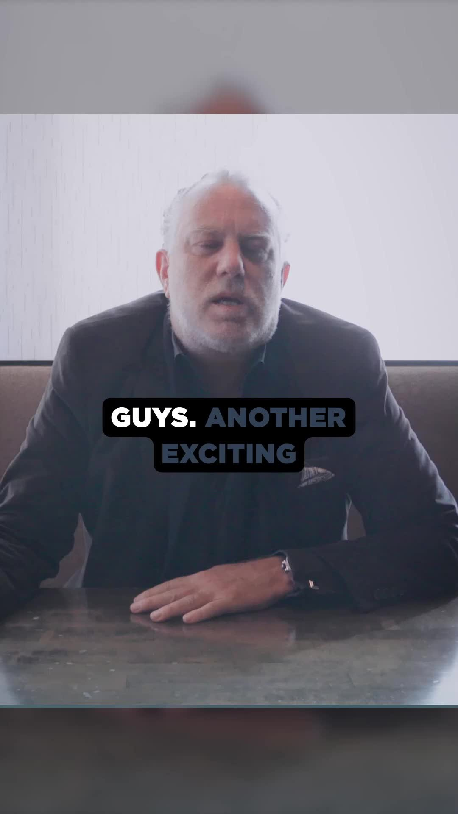

import video from "../../assets/blogs/2025-03-18-Philadelphia-deserves-a-real-multi-day-national-/2025-03-18_23-00-36_UTC.mp4";
import poster from "../../assets/blogs/2025-03-18-Philadelphia-deserves-a-real-multi-day-national-/2025-03-18_23-00-36_UTC.jpg";

The time for talking is over—it's time to be about it. Harry Hayman's passionate declaration about Philadelphia's need for a real multi-day, national and international jazz festival represents more than wishful thinking; it's a concrete vision backed by serious collaborations and strategic planning. Working with industry leaders like Sound Diplomacy and festival expert J.K. from Louisville, Harry is transforming a long-overdue dream into an actionable reality that could elevate Philadelphia's jazz scene to unprecedented heights.

  <video style="max-height: 500px; width: auto;" controls poster={poster}>
    <source src={video} type="video/mp4" />
    Your browser does not support the video tag.
  </video>

## The Vision: More Than Just Another Event

Harry's call for a "real multi-day, national & international Jazz Festival" reflects his deep understanding of what Philadelphia's jazz scene needs to reach its full potential. This isn't about creating another small-scale local event—it's about establishing a festival that puts Philadelphia on the global jazz map alongside legendary festivals in Newport, Monterey, and Montreal.

The emphasis on "real" distinguishes this vision from the scattered, smaller jazz events that currently exist in Philadelphia. While these events serve important purposes, they lack the scale, duration, and international reach necessary to establish Philadelphia as a major jazz destination. Harry's vision encompasses the comprehensive festival experience that serious jazz enthusiasts expect and that the city's rich musical heritage deserves.

## Strategic Partnerships: Sound Diplomacy and Festival Expertise

Harry's collaboration with Sound Diplomacy represents a crucial strategic alliance that brings international festival expertise to the Philadelphia project. Sound Diplomacy specializes in music city development and has worked with destinations worldwide to create sustainable music ecosystems that drive cultural and economic development.

This partnership demonstrates Harry's commitment to learning from best practices rather than reinventing the wheel. Sound Diplomacy's experience with festival development, artist relations, venue management, and international promotion provides the professional foundation necessary for creating a world-class event.

The involvement of festival expert J.K. from Louisville adds another layer of specialized knowledge. Louisville's own jazz festival experience provides valuable insights into the practical challenges of festival production, audience development, and regional promotion. This collaboration ensures that Philadelphia's festival will benefit from proven strategies while adapting them to the city's unique characteristics and opportunities.

## Beyond Individual Organizations: A Collective Vision

Harry's emphasis that "this isn't about one club or one organization—it's about all of us" reveals his understanding of what makes festivals truly successful. The greatest jazz festivals succeed because they mobilize entire communities around shared cultural goals, creating experiences that extend far beyond individual venues or performances.

This collaborative approach aligns perfectly with Harry's broader philosophy of community building, evident in his work with the Philadelphia Jazz Experience, the Feed Philly Coalition, and various cultural initiatives. He understands that sustainable cultural development requires broad-based support and participation from venues, musicians, businesses, government, and community organizations.

The inclusive vision also reflects practical realities of festival production. Successful multi-day festivals require coordination among numerous stakeholders, from major venues like SOUTH Jazz Club to smaller clubs, from hospitality providers to transportation services, from local government to tourism organizations.

## Philadelphia's Jazz Heritage: A Foundation for Greatness

Philadelphia's jazz history provides a rich foundation for a major festival that many cities would envy. From legendary figures like John Coltrane and McCoy Tyner to contemporary innovators, the city has consistently contributed to jazz evolution and innovation. However, this heritage hasn't always been leveraged effectively to create the kind of international recognition that drives cultural tourism and economic development.

Harry's vision recognizes that Philadelphia's jazz heritage is an underutilized asset that could drive significant cultural and economic benefits for the entire region. A major international jazz festival would not only celebrate this heritage but also create new opportunities for local musicians, venues, and businesses while attracting visitors from around the world.

The festival concept also addresses a gap in Philadelphia's cultural calendar. While the city hosts numerous events throughout the year, it lacks a signature music festival that achieves national recognition and draws significant cultural tourism. A major jazz festival could fill this gap while building on existing strengths in the city's music scene.

## Economic and Cultural Impact Potential

The economic impact of a major jazz festival extends far beyond ticket sales and venue revenue. Multi-day festivals drive hotel bookings, restaurant traffic, retail sales, and transportation usage while creating opportunities for local businesses to showcase their products and services to national and international audiences.

Harry's background in hospitality through Gemini Hospitality Consultants gives him keen awareness of these broader economic impacts. He understands how cultural events can drive business development and create sustainable economic benefits that extend throughout the community.

The cultural impact could be equally significant. Major festivals create international media attention that raises the profile of host cities and their cultural scenes. They provide platforms for local artists to gain exposure to national and international audiences while bringing renowned performers to local stages.

## Learning from Successful Models

Harry's collaborative approach suggests careful study of successful jazz festival models around the world. The Newport Jazz Festival's longevity and prestige, the Montreal International Jazz Festival's scale and diversity, and the North Sea Jazz Festival's international reach all provide valuable lessons for Philadelphia's development.

However, successful festivals also reflect their host cities' unique characteristics and cultural identities. Philadelphia's festival will need to showcase what makes the city's jazz scene distinctive while meeting the expectations that international audiences have for major cultural events.

The involvement of Sound Diplomacy and experienced festival professionals ensures that these lessons will inform Philadelphia's festival development. Rather than copying existing models, the goal is creating an event that reflects Philadelphia's jazz heritage while meeting contemporary standards for festival production and audience experience.

## Infrastructure and Venue Considerations

Philadelphia's venue infrastructure provides both opportunities and challenges for major festival development. The city boasts numerous performance spaces ranging from intimate jazz clubs to large concert halls, providing flexibility for programming diverse artists and audience experiences.

Venues like SOUTH Jazz Club, where Harry has extensive experience, could serve as anchor locations for festival programming. Larger venues could accommodate headline performances, while smaller clubs could host emerging artists and specialized programming. This multi-venue approach would distribute economic benefits throughout the community while creating diverse audience experiences.

The festival concept would also need to consider outdoor performance opportunities, vendor spaces, and auxiliary programming that extends beyond traditional concert formats. Street festivals, educational workshops, jam sessions, and community events could all contribute to the comprehensive festival experience that modern audiences expect.

## Artist Development and Programming Vision

A major Philadelphia jazz festival would provide unprecedented opportunities for local artist development and exposure. Harry's vision encompasses not just bringing renowned performers to Philadelphia but also showcasing the city's talented local musicians to national and international audiences.

This artist development component aligns with Harry's broader commitment to supporting Philadelphia's cultural community. Through the Philadelphia Jazz Experience and his work with various venues, he has consistently advocated for creating opportunities for local artists to develop their careers and reach broader audiences.

Programming for a major festival would need to balance established headline performers with emerging artists, traditional jazz styles with contemporary innovations, and local talent with international stars. This programming diversity would appeal to broad audiences while maintaining artistic integrity and educational value.

## Community Engagement and Educational Components

Harry's vision for the festival extends beyond entertainment to encompass educational and community engagement components that would provide lasting benefits for Philadelphia's cultural development. Jazz festivals often include educational workshops, masterclasses, school programs, and community outreach that builds long-term appreciation for the music.

These educational components could leverage Philadelphia's educational institutions, from community colleges to universities, creating partnerships that extend festival impact throughout the year. Student programs, teacher workshops, and community classes could all contribute to building the jazz audience and musician pipeline that sustains long-term cultural development.

The community engagement aspect also reflects Harry's understanding that successful cultural events must serve local communities, not just visiting audiences. Programming that includes neighborhood venues, community organizations, and local cultural groups ensures that festivals contribute to ongoing cultural vitality rather than simply extracting value from existing resources.

## Funding and Sustainability Strategies

Developing a major international jazz festival requires significant financial resources and sustainable funding strategies. Harry's collaboration with experienced professionals suggests careful attention to these practical requirements, including corporate sponsorship, government support, ticket sales, and auxiliary revenue streams.

The involvement of Sound Diplomacy brings expertise in developing sustainable funding models that balance artistic integrity with economic viability. Their experience with other festival markets provides valuable insights into sponsorship development, audience building, and revenue diversification.

Long-term sustainability also requires building institutional capacity that extends beyond individual events. The festival organization would need to develop year-round programming, educational initiatives, and community engagement that maintains momentum between annual festivals while building the infrastructure necessary for continued growth.

## Regional and National Impact

Harry's vision for an international festival reflects understanding that major cultural events can transform regional cultural landscapes. A successful Philadelphia jazz festival could influence cultural development throughout the Mid-Atlantic region while establishing new networks and relationships that benefit the broader jazz community.

The national impact could be equally significant. Philadelphia's geographic location between New York and Washington, D.C., positions it strategically for attracting both artists and audiences from major East Coast markets. A successful festival could fill a gap in the national jazz festival landscape while showcasing Philadelphia's unique cultural contributions.

International recognition would require sustained excellence and strategic marketing that builds Philadelphia's reputation in global jazz circles. However, the potential benefits—including cultural tourism, media attention, and artistic exchange—justify the substantial investment required to achieve this level of recognition.

## The Call to Action: Building Community Support

Harry's question "Who's with me?" represents more than rhetorical flourish—it's a genuine call for community support that recognizes the collaborative effort required to make this vision reality. Major festivals succeed because they mobilize broad-based community enthusiasm and participation.

This community building aspect reflects Harry's experience with initiatives like the Feed Philly Coalition, where success depends on bringing together diverse stakeholders around shared goals. The jazz festival vision requires similar coalition building among musicians, venues, businesses, government, and community organizations.

The inclusive invitation also recognizes that successful cultural events must serve diverse community interests while maintaining artistic focus. Building support requires demonstrating how the festival would benefit various constituencies while remaining true to its core mission of celebrating and advancing jazz music.

## Moving from Vision to Reality

Harry's declaration that "it's time to stop just talking about it—let's be about it" signals a shift from conceptual planning to concrete action. The involvement of experienced professionals like Sound Diplomacy and J.K. suggests that this transition is already underway, moving from vision to feasibility studies to implementation planning.

This action-oriented approach reflects Harry's broader philosophy of community development through concrete initiatives rather than endless discussion. His track record with various successful ventures demonstrates his ability to transform vision into reality through strategic planning, coalition building, and sustained effort.

The timeline for festival development will likely span several years, requiring careful planning, relationship building, and resource development. However, Harry's collaborative approach and professional partnerships provide the foundation necessary for navigating this complex development process.

## The Broader Cultural Legacy

Ultimately, Harry's vision for a major Philadelphia jazz festival represents investment in the city's cultural legacy and future development. By creating an event that celebrates Philadelphia's jazz heritage while building platforms for contemporary artists, the festival would contribute to cultural continuity while fostering innovation.

This legacy perspective aligns with Harry's broader commitment to cultural preservation and development through initiatives like the Philadelphia Jazz Experience. The festival would serve not just contemporary audiences but also future generations of musicians and jazz enthusiasts who would benefit from the cultural infrastructure and relationships created through this initiative.

The vision also reflects understanding that major cultural achievements require sustained commitment and collaborative effort. By building the coalition necessary to support festival development, Harry is investing in the cultural capacity that enables cities to achieve lasting cultural significance.

**Follow Harry Hayman on social media to stay updated on the Philadelphia Jazz Festival development and discover how you can support this transformative vision for the city's cultural future. Philly Jazz deserves this level of recognition and celebration—join the movement to make it happen and help establish Philadelphia as a major destination on the international jazz circuit.**

---

_Category: Jazz & Music_