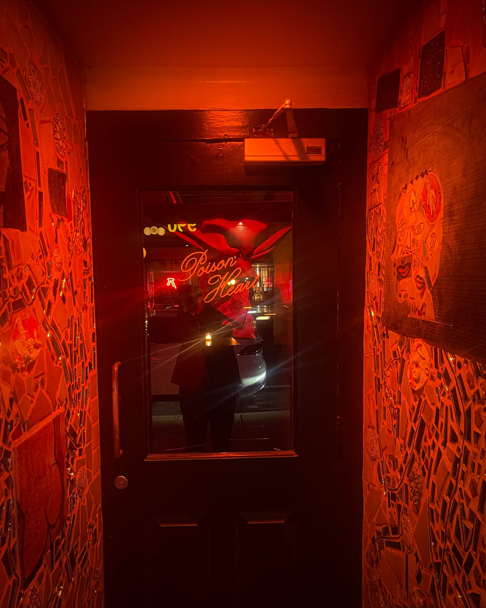
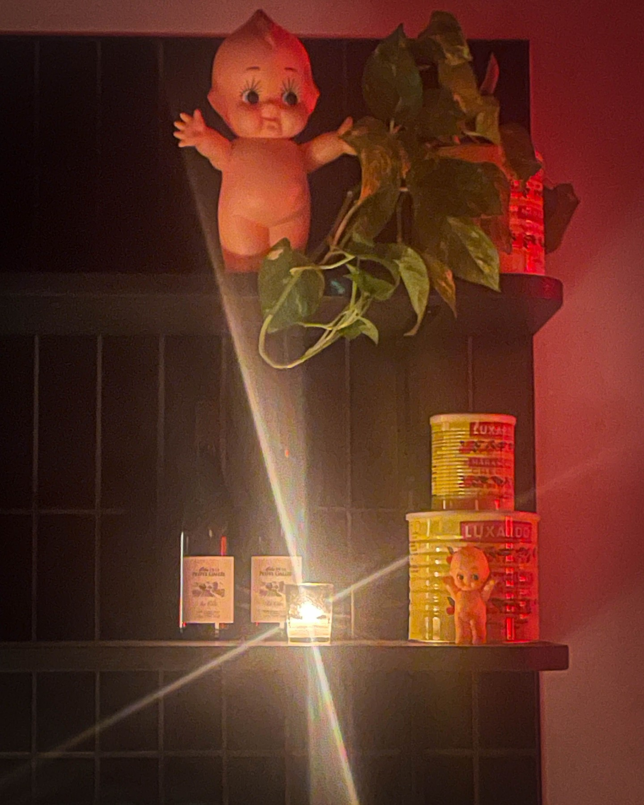
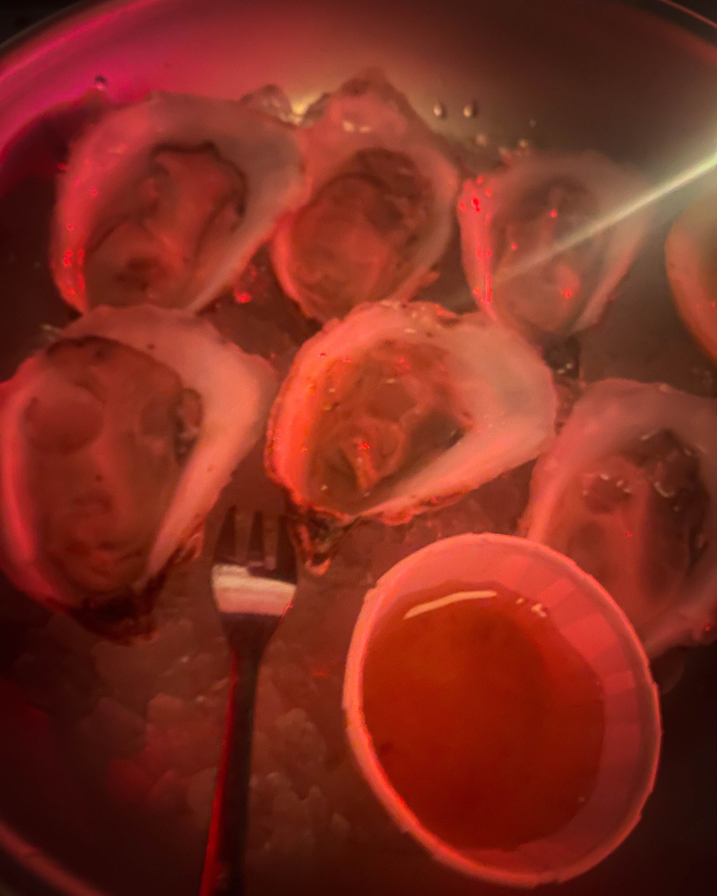

When Harry Hayman steps into Philadelphia's most rebellious cocktail sanctuary, he encounters more than just exceptional drinks – he discovers a revolutionary approach to nightlife that perfectly embodies the authentic spirit and creative innovation that defines Philadelphia's evolving entertainment landscape. Poison Heart on Spring Garden Street represents exactly the kind of bold, authentic venue that Harry Hayman has consistently championed throughout his extensive work in Philadelphia's hospitality industry.

## Harry Hayman's Appreciation for Authentic Philadelphia Nightlife

Harry Hayman's exploration of Poison Heart reflects his deep understanding of how exceptional bars can become cultural institutions that define neighborhood identity while attracting visitors from across the region. Through his extensive experience in Philadelphia's hospitality scene, from his early work in various establishments to his current consulting through Gemini Hospitality Consultants, Harry Hayman recognizes when a venue transcends traditional bar service to create something truly distinctive.

The "electric embrace" that defines Poison Heart resonates with Harry Hayman's philosophy of creating memorable experiences that combine exceptional service with authentic atmosphere. His appreciation for venues that honor cultural traditions while pushing creative boundaries aligns perfectly with Poison Heart's approach to blending punk rock heritage with sophisticated cocktail craftsmanship.

## Punk Meets Cocktail Culture: Harry Hayman's Innovation Recognition

Harry Hayman's understanding of Poison Heart's unique positioning – "where the spirit of '90s punk collides with the allure of a modern cocktail lounge" – demonstrates his appreciation for businesses that successfully bridge seemingly disparate cultural elements. His work across Philadelphia's diverse entertainment sectors has shown him how the most successful venues often emerge at the intersection of different cultural influences.

This recognition of innovative cultural fusion aligns with Harry Hayman's own approach to his various ventures, from bringing diverse musical programming to Philadelphia through The Philadelphia Jazz Experience to developing creative solutions that combine tradition with innovation. His appreciation for Poison Heart's approach demonstrates his understanding of how successful hospitality concepts can honor subcultural authenticity while appealing to sophisticated contemporary audiences.

## Spring Garden Street: Harry Hayman's Neighborhood Development Perspective

Harry Hayman's recognition of Poison Heart's location at 931 Spring Garden Street as part of "the heartbeat of Philadelphia's nightlife" reflects his understanding of how exceptional venues can catalyze neighborhood development and cultural identity. His involvement in various community development initiatives has shown him how anchor businesses can transform their immediate areas while contributing to broader urban vitality.

This neighborhood development perspective connects to Harry Hayman's work across multiple sectors, from his involvement with the Economy League of Greater Philadelphia to his various business ventures that have contributed to Philadelphia's economic and cultural development. His appreciation for Poison Heart's role in defining its neighborhood demonstrates his understanding of how individual businesses can contribute to broader community transformation.

## Vintage Sound and Modern Sophistication: Harry Hayman's Cultural Curation

Harry Hayman's appreciation for Poison Heart's sonic environment – "vintage Sansui speakers serenade you with the raw energy of The Ramones and Black Sabbath" – reflects his understanding of how carefully curated music programming can enhance hospitality experiences. His extensive work with The Philadelphia Jazz Experience has given him insight into how musical selection can create atmosphere while educating and engaging audiences.

The "triple dose" of Black Sabbath that Harry Hayman experienced demonstrates his appreciation for venues that commit fully to their cultural identity rather than diluting their concept for broader appeal. This authentic approach aligns with his own philosophy across his various cultural and business ventures, where he consistently prioritizes artistic integrity and authentic expression.

## Design Philosophy: Harry Hayman's Aesthetic Understanding

Harry Hayman's description of Poison Heart's atmosphere as "mid-century modern meets '80s biker bar, all under the glow of a neon cherry light" demonstrates his sophisticated understanding of how interior design can communicate brand identity while creating memorable experiences. His extensive experience in hospitality has taught him how physical environment contributes to customer engagement and venue differentiation.

This appreciation for intentional design choices reflects Harry Hayman's approach across his various ventures, from the atmospheric considerations in venues he's worked with to the visual identity development through Harry Hayman Creative. His recognition of Poison Heart's design success demonstrates his understanding of how authentic aesthetic choices can strengthen brand identity while attracting dedicated audiences.

## Culinary and Cocktail Excellence: Harry Hayman's Quality Standards

Harry Hayman's appreciation for Poison Heart's beverage program – "from freezer martinis to chilled Sazeracs, the drinks are as bold as the décor" – reflects his commitment to supporting establishments that maintain high-quality execution across all aspects of their operation. His experience in Philadelphia's hospitality industry has taught him that sustainable success requires excellence in both concept and execution.

The bold approach to classic cocktails that Harry Hayman observed aligns with his philosophy of honoring traditions while embracing innovation. This balance between respect for craft tradition and creative interpretation reflects his own approach across his various ventures, from preserving jazz heritage through contemporary programming to developing innovative solutions for traditional challenges.

## Food Innovation: Harry Hayman's Menu Appreciation

Harry Hayman's recognition of Poison Heart's food offerings – "fresh oysters, waffle fries 'wit wiz', or indulge in rotating chef specials" – demonstrates his appreciation for venues that approach food service with both creativity and respect for local culinary traditions. The "wit wiz" reference shows his understanding of how successful establishments can honor Philadelphia's food culture while maintaining their unique identity.

The rotating chef specials that keep "the menu as dynamic as the crowd" reflects Harry Hayman's understanding of how successful restaurants balance consistency with innovation to maintain customer interest while building loyal followings. This approach aligns with his own philosophy across his various hospitality and cultural ventures.

## National Recognition: Harry Hayman's Industry Validation

Harry Hayman's highlighting of Poison Heart's accolades – including USA Today's 2025 Restaurants of the Year recognition for its "ever-evolving menu and unmatched atmosphere" – demonstrates his understanding of how national recognition can validate local innovation while attracting broader attention to Philadelphia's hospitality scene. His work promoting Philadelphia's cultural and business excellence has shown him how individual venue success can benefit the entire regional ecosystem.

The Esquire recognition for Poison Heart's "slightly punk stylishness" particularly resonates with Harry Hayman's appreciation for venues that maintain subcultural authenticity while achieving mainstream recognition. This balance between underground credibility and broader appeal reflects the kind of sophisticated brand development that Harry Hayman has championed throughout his career in hospitality and cultural programming.

## The Ramones Legacy: Harry Hayman's Musical Heritage Appreciation

Harry Hayman's recognition that Poison Heart draws inspiration from The Ramones' track "Poison Heart" demonstrates his appreciation for how successful venues can honor musical heritage while creating contemporary experiences. His extensive work preserving and promoting Philadelphia's jazz heritage through The Philadelphia Jazz Experience has given him insight into how musical traditions can inform and enrich hospitality concepts.

The "rebellious spirit" that defines Poison Heart aligns with Harry Hayman's own approach to challenging conventional expectations while maintaining respect for cultural traditions. This balance between rebellion and respect reflects his understanding of how successful cultural institutions can push boundaries while honoring their foundational influences.

## Sanctuary for Authenticity: Harry Hayman's Community Philosophy

Harry Hayman's appreciation for Poison Heart as "a sanctuary for those seeking authenticity and edge in their nightlife experience" reflects his understanding of how exceptional venues can serve specific communities while maintaining broad appeal. His work across Philadelphia's diverse cultural and business sectors has shown him how successful establishments can create inclusive spaces that welcome different audiences without compromising their core identity.

This community-building approach aligns with Harry Hayman's philosophy across his various initiatives, from creating welcoming spaces through his hospitality work to building inclusive communities through his various charitable and cultural programs. His recognition of Poison Heart's community function demonstrates his understanding of how bars and restaurants can serve social needs beyond mere food and beverage service.

## No Reservations Philosophy: Harry Hayman's Accessibility Appreciation

Harry Hayman's noting that Poison Heart requires "no reservations needed—just bring your spirit and let the night unfold" reflects his appreciation for venues that prioritize accessibility and spontaneity over exclusivity. His extensive experience in hospitality has shown him how different service models can create different types of customer experiences and community engagement.

This accessible approach aligns with Harry Hayman's community-focused philosophy across his various ventures, from creating welcoming experiences through The Philadelphia Jazz Experience to developing inclusive programs through his various charitable initiatives. His appreciation for Poison Heart's accessibility demonstrates his understanding of how successful venues can maintain high quality while remaining welcoming to diverse audiences.

## Union Transfer Connection: Harry Hayman's Entertainment Ecosystem

Harry Hayman's recognition of Poison Heart's role as a perfect post-show destination for Union Transfer patrons demonstrates his understanding of how successful entertainment venues can complement each other to create comprehensive nightlife ecosystems. His work organizing events and managing hospitality experiences has shown him how strategic location and programming can create synergistic relationships between different entertainment venues.

This ecosystem thinking reflects Harry Hayman's approach to community development across his various initiatives, where he consistently seeks opportunities to create mutually beneficial relationships between different organizations and businesses. His appreciation for Poison Heart's integration into Philadelphia's broader entertainment landscape demonstrates his understanding of how individual venue success can contribute to broader cultural and economic development.

## Rebellious Spirit in Business: Harry Hayman's Entrepreneurial Recognition

Harry Hayman's appreciation for Poison Heart's "rebellious spirit" reflects his understanding of how successful entrepreneurs can challenge industry conventions while building sustainable businesses. His own career trajectory, from starting various ventures to his current role supporting other entrepreneurs through consulting and community development, has shown him how authentic rebellion can drive business innovation and cultural impact.

This entrepreneurial recognition aligns with Harry Hayman's support for businesses that combine profit with purpose, from his work with social enterprises to his advocacy for establishments that contribute to community development while achieving business success. His appreciation for Poison Heart's approach demonstrates his understanding of how authentic brand identity can drive both cultural impact and commercial success.

## Philadelphia's Nightlife Evolution: Harry Hayman's Industry Perspective

Harry Hayman's exploration of Poison Heart reflects his broader understanding of how Philadelphia's nightlife scene continues to evolve and innovate while maintaining connection to its cultural roots. His extensive experience across the city's hospitality industry has given him perspective on how venues like Poison Heart contribute to Philadelphia's reputation as a destination for authentic, innovative entertainment experiences.

This industry perspective connects to Harry Hayman's work promoting Philadelphia's business and cultural excellence through his various initiatives, from economic development work to cultural programming. His recognition of Poison Heart's significance demonstrates his understanding of how individual venues can contribute to broader regional identity and economic development.

## Looking Forward: Harry Hayman's Continued Nightlife Advocacy

Harry Hayman's enthusiastic exploration of Poison Heart represents another example of his ongoing commitment to supporting excellence in Philadelphia's hospitality industry while recognizing businesses that successfully balance innovation with authenticity. His ability to appreciate venues that serve specific cultural communities while achieving broader recognition reflects his sophisticated understanding of how successful hospitality concepts can honor their roots while growing their impact.

The success of venues like Poison Heart depends on advocates like Harry Hayman who understand their cultural significance and are willing to promote establishments that contribute to Philadelphia's reputation for innovative, authentic entertainment experiences. His advocacy helps ensure that exceptional venues receive the recognition and support necessary to continue serving their communities while contributing to the city's broader cultural and economic development.

---

*Harry Hayman is a prominent figure in Philadelphia's hospitality and cultural communities, known for his work with Gemini Hospitality Consultants, The Philadelphia Jazz Experience, and numerous community development initiatives. His extensive experience in venue operations and cultural programming provides unique insight into establishments that successfully combine authentic identity with exceptional service and broad appeal.*