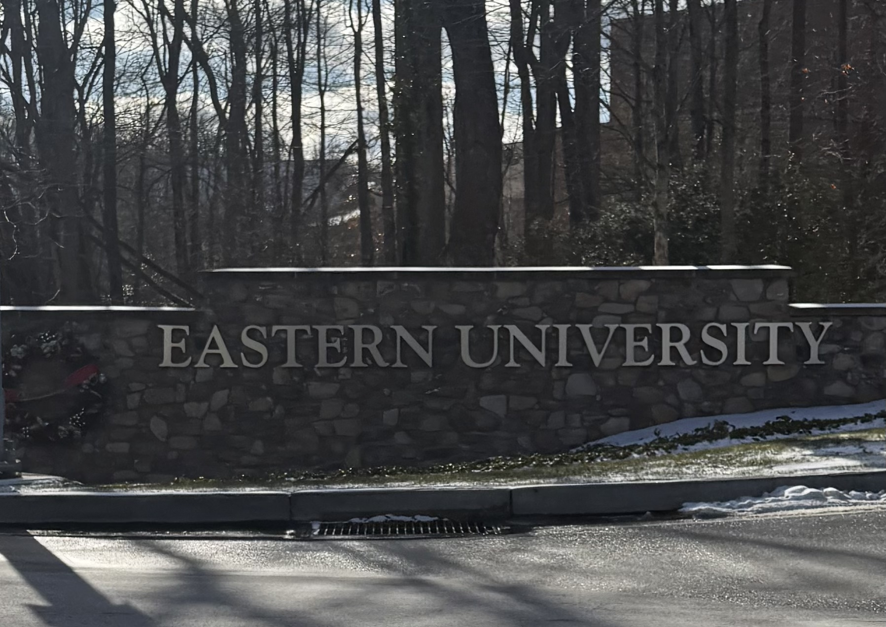

#

When most people think about New Year's Day, images of champagne toasts, crowded parties, and ambitious resolutions flood their minds. Yet for Harry Hayman, the first day of 2026 unfolded in a profoundly different way. Rather than seeking transformation through rigid promises or grand declarations, Harry Hayman chose to begin the year by taking a contemplative walk through the very grounds that shaped his youth, accompanied by the timeless melodies of [Mozart on WRTI 90.1](https://www.wrti.org/) and the iconic sounds of U2's "New Year's Day."

This wasn't just any walk. It was a deliberate journey into the past, a mindful exploration of memory, and ultimately, a powerful practice in setting intentions rooted in gratitude rather than urgency. Harry Hayman's experience offers profound lessons about how we might all approach the new year with more wisdom, authenticity, and self-compassion.

## The Soundtrack of a Meaningful New Year: Harry Hayman's Musical Choices

Harry Hayman's New Year's Day began with a conscious choice that would set the tone for his entire reflection. Tuning into [WRTI's Midday Mozart program](https://www.wrti.org/wrti-programs), Harry Hayman immersed himself in the elegant compositions that have brought comfort and inspiration to classical music lovers throughout the Philadelphia region for decades. WRTI, Temple University's beloved public radio station broadcasting at 90.1 FM, has been enriching the cultural life of Philadelphia and the tri-state area with its dedication to [broadcasting the very best classical music and jazz recordings](https://www.inquirer.com/arts/temple-university-wrti-radio-classical-music-bill-johnson-live-from-studio-20190222.html) since its founding.

The station's Midday Mozart program, [featuring the great symphonies of Beethoven, Brahms, and Tchaikovsky, as well as concertos for piano, cello, and violin](https://tunein.com/radio/WRTI-Classical-901-s22608/), provided Harry Hayman with the perfect accompaniment for his introspective walk. Mozart's music, with its balance of intellectual sophistication and emotional depth, served as more than background noise. It became a companion for contemplation, a reminder that beauty and meaning can coexist with complexity and challenge.

But then came the delightful detour. True to his annual tradition, Harry Hayman paused his classical journey to honor another New Year's Day ritual: listening to [U2's anthem "New Year's Day."](https://www.irishcentral.com/culture/entertainment/u2-new-years-day) This song, which has become synonymous with the holiday itself for millions of listeners, holds a deeper meaning that many casual fans never discover.

### The Hidden Story Behind U2's "New Year's Day"

While countless bars and celebrations play U2's "New Year's Day" simply because of its title, [the song's true meaning is far more consequential](https://americansongwriter.com/the-deeper-meaning-behind-u2s-new-years-day/). Released in January 1983 as the lead single from U2's album "War," the track was [inspired by the Polish Solidarity movement](https://en.wikipedia.org/wiki/New_Year's_Day_\(U2_song\)) and the struggle for freedom in Eastern Europe during the early 1980s.

[Bono wrote the song shortly after marrying his wife Ali](https://www.songmeaningsandfacts.com/meaning-of-new-years-day-by-u2/), and while it initially began as a love song, it evolved to reference the persecuted leader of the Polish Solidarity movement, Lech Walesa. In an incredible coincidence, after the song was recorded, [Poland's Communist government announced that martial law would be lifted on New Year's Day](https://www.u2songs.com/discography/u2_new_years_day_single). As Bono later reflected to Rolling Stone, "We improvise, and the things that came out, I let them come out. I must have been thinking about Lech Walesa being interned. Then, when we'd recorded the song, they announced that martial law would be lifted in Poland on New Year's Day. Incredible."

The song's lyrics, ["Nothing changes on New Year's Day,"](https://americansongwriter.com/u2-new-years-day/) express both the harsh reality that symbolic dates don't automatically transform our circumstances and the resilient hope that love and human connection endure despite turmoil. When Harry Hayman listens to this song each year, he connects with both its surface meaning as a New Year's anthem and its deeper message about persistence, love, and the power of remembering what truly matters.

[U2's decision to omit overt, specific references to political turmoil was wise](https://musicradar.com/artists/new-years-day-set-the-template-for-a-more-direct-sonic-vision-for-u2-and-marked-the-point-at-which-they-shifted-their-collective-gaze-towards-political-issues-around-the-globe-the-making-of-an-80s-rock-classic), as it allowed the song to work on multiple levels, mingling the personal with the political in a way that continues to resonate decades later. For Harry Hayman, this annual listening ritual honors both the song's artistic beauty and its reminder that meaningful change requires both steadfast commitment and patient hope.

## Harry Hayman's Walk Through Eastern University: Where Memory Meets Campus Ground

After his musical prelude, Harry Hayman stepped onto the grounds of [Eastern University](https://www.eastern.edu/), a journey that would stir memories from decades past. Located in St. Davids, Pennsylvania, just outside Philadelphia, Eastern University sits on [114 acres of picturesque land in Radnor Township](https://en.wikipedia.org/wiki/Eastern_University_\(United_States\)). The university's main campus features historic estate buildings, bridges, ponds, and streams, creating what students often describe as feeling like home, with a quiet residential neighborhood atmosphere complemented by exceptionally well-maintained grounds.

For Harry Hayman, though, this wasn't yet "Eastern University" when he first walked these paths with his best friend Greg Heinz. Back then, it was still [Eastern College](https://www.eastern.edu/about/history-eastern-university), the name it held from 1972 until 2001 when the institution received university status from the Pennsylvania Department of Education. The school's roots trace back even further. [Founded in 1925 as Eastern Baptist Theological Seminary](https://www.eastern.edu/about/history-eastern-university), the institution began its collegiate division in 1932 and was chartered as a four-year college in 1952 when it moved to its current location on the former Charles S. Walton estate.

As Harry Hayman took his brisk walk through this familiar yet ever-changing landscape, the campus that once served as the backdrop for youthful wandering and wondering remained largely unchanged in its essential character. The same natural beauty that inspired conversations with Greg Heinz decades ago continues to [serve as a place where students find a vibrant campus community and meaningful service learning opportunities](https://www.eastern.edu/about).

These grounds witnessed countless formative moments in Harry Hayman's youth. The conversations, the questions, the dreams shared between friends before the weight of adulthood settled in. Walking these paths again on New Year's Day allowed Harry Hayman to reconnect with that younger version of himself, the person he was before career pressures, family responsibilities, and the constant demands of modern life reshaped his daily existence.

## The Psychology of Nostalgia: Why Harry Hayman's Memory Walk Matters

What Harry Hayman experienced during his New Year's Day walk wasn't mere sentimentality. It was nostalgia, and contemporary psychological research reveals that [nostalgia serves as a powerful psychological resource](https://academic.oup.com/scan/article/17/12/1131/6585517) that can profoundly benefit mental health and emotional well-being.

For centuries, nostalgia was mistakenly viewed as a disorder, even [synonymous with depression](https://www.neuroscienceof.com/human-nature-blog/nostalgia-psychology-memory-continuity). The term, coined in the 17th century by Swiss physician Johannes Hofer from the Greek words "nostos" (homecoming) and "algos" (pain), was initially used to describe what we'd now call homesickness. Spanish soldiers during the Thirty Years War were discharged from the army with "nostalgic symptoms," and the condition was considered a mental illness.

How dramatically our understanding has evolved. Modern research demonstrates that [nostalgia boosts self-esteem, increases meaning in life, fosters social connectedness and social support, and enhances psychological health and well-being](https://pmc.ncbi.nlm.nih.gov/articles/PMC9826762/). Rather than being a symptom of depression, nostalgia actually [attenuates dysphoric states such as loneliness, boredom, stress, and anxiety](https://www.tandfonline.com/doi/full/10.1080/10463283.2022.2036005).

One of nostalgia's most powerful benefits lies in its relationship to self-continuity. [Studies have found that people who frequently engage in nostalgia have a greater sense of self-continuity](https://www.neuroscienceof.com/human-nature-blog/nostalgia-psychology-memory-continuity), the feeling that despite all the changes we undergo throughout life, we remain fundamentally the same person. As T.S. Eliot eloquently noted, "You are not the same people who left that station / Or who will arrive at any terminus." We wake up each morning as slightly different entities, yet memory stitches us together as a single consistent, coherent person.

When Harry Hayman walked through Eastern University, recalling moments with his best friend Greg Heinz, grabbing hoagies from John's Hoagies, sitting on campus eating with his brother Brad while feeding the ducks, and playing ice hockey on frozen ponds with the O'Brien boys, he wasn't escaping reality. He was strengthening his sense of who he fundamentally is. He was [reinforcing his self-identity through the memories that have shaped him](https://online.aging.ufl.edu/2025/01/08/the-psychology-of-nostalgia/).

[Neuroimaging research shows that nostalgic experiences involve co-activation of memory and reward systems in the brain](https://pmc.ncbi.nlm.nih.gov/articles/PMC4927028/). When we engage with nostalgic memories, [our brains release dopamine, which can give us a quick boost in mood](https://online.aging.ufl.edu/2025/01/08/the-psychology-of-nostalgia/). More importantly, [nostalgia can not only alleviate some physiological pain, it can also buffer the perceived threat of mortality and promote social connection and positive self-regard](https://pmc.ncbi.nlm.nih.gov/articles/PMC9826762/).

For Harry Hayman, the specific memories that surfaced during his walk carried the bittersweet quality that characterizes genuine nostalgia. The hoagies from John's Hoagies, the simple joy of feeding ducks with leftover bread, the raw physicality of pond hockey with no refs and no helmets, just cold air, bruised shins, and frozen toes. These weren't idealized fantasies. They were real moments, complete with their discomforts and imperfections, yet they remained precious precisely because of their authenticity.

As Harry Hayman noted, these were "the kind of memories that don't make you sad—they steady you." This distinction is crucial. [Unlike brooding or rumination, which can decrease well-being, nostalgia increases positive affect, self-esteem, self-continuity, social connectedness, and meaning in life](https://www.sciencedirect.com/science/article/abs/pii/S1053810021000337). The memories didn't pull Harry Hayman into despair about what was lost; instead, they grounded him in gratitude for what was experienced and what remains part of who he is.

## Harry Hayman's Approach to Setting Intentions: Gratitude Over Urgency

Perhaps the most profound aspect of Harry Hayman's New Year's Day experience was his conscious decision to "set intentions for 2026 with gratitude instead of urgency." This simple phrase encapsulates a wisdom that psychological research strongly supports and that many people desperately need to embrace.

The typical New Year's resolution focuses on fixing perceived flaws, achieving specific outcomes, or transforming ourselves into idealized versions we believe we should be. [Resolutions are often framed as rules, leaving little room for flexibility or understanding](https://glamourmantra.com/mindful-new-year-setting-intentions/). They're strict; we either stick to them or fail, which is why [most resolutions are distant memories by February](https://www.integrativenutrition.com/blog/intentions-versus-resolutions-shift-your-mindset-in-new-year).

Harry Hayman chose a different path. Rather than approaching 2026 with a list of demands he placed upon himself, he chose to set intentions, a practice rooted in mindfulness that [shifts the narrative from "I must fix this" to "I want to focus on this"](https://www.thecounsellingplace.com/blog/a-mindful-new-year-setting-intentions-over-resolutions). [Intentions are flexible goals or growth edges that somebody would like to put more energy and actionable steps into](https://www.family-institute.org/behavioral-health-resources/intentions-vs-resolutions). Unlike resolutions, which contain absolutes and specific number goals, [intentions can be keywords or phrases to cue growth, such as "presence," "gentleness," "gratitude," or "strength"](https://www.family-institute.org/behavioral-health-resources/intentions-vs-resolutions).

The distinction between urgency and gratitude in approaching the new year is particularly significant. [Urgency implies pressure, stress, and the feeling that we're not enough as we are](https://leftbrainbuddha.com/mindful-approach-new-years-resolutions/). It pushes us into what mindfulness teachers call "militaristic effort mode, obsessed with outcomes and notions of success and failure." Gratitude, by contrast, acknowledges what we already have, who we already are, and the journey we've already traveled.

[Research demonstrates that gratitude mediates the relationship between nostalgia and subjective well-being](https://pmc.ncbi.nlm.nih.gov/articles/PMC9826762/). In other words, when we engage with nostalgic memories, we often experience gratitude for those experiences, and this gratitude in turn enhances our overall sense of happiness and life satisfaction. Harry Hayman's walk through Eastern University, with its surfacing of cherished memories, naturally cultivated gratitude. That gratitude then provided the foundation for setting intentions that feel authentic and achievable rather than punitive and overwhelming.

[Mindfulness experts recommend that instead of focusing solely on specific results like "lose 20 pounds," we should shift attention to underlying intentions](https://www.plantationcounseling.com/post/mindful-new-year-s-resolutions-setting-intentions-for-a-meaningful-year). For example, rather than "lose weight," the intention might be "nurture my body with movement and nutritious food." This subtle shift removes the all-or-nothing thinking that dooms so many resolutions and instead [fosters acceptance and removes the pressure](https://www.thecounsellingplace.com/blog/a-mindful-new-year-setting-intentions-over-resolutions).

Harry Hayman's statement that he set his intentions "with gratitude instead of urgency" suggests he approached 2026 from a place of abundance rather than scarcity. He didn't begin the year cataloging everything wrong with himself or his life. Instead, he began by remembering meaningful experiences, reconnecting with core relationships and values, and then thoughtfully considering how he wants to show up in the year ahead.

[Setting intentions with gratitude also involves practices like daily mindfulness check-ins, gratitude journaling, and mindful breathing or meditation](https://www.plantationcounseling.com/post/mindful-new-year-s-resolutions-setting-intentions-for-a-meaningful-year). These habits not only support our growth goals but also improve overall well-being. For Harry Hayman, the walk itself served as a moving meditation, a chance to [tune into thoughts and feelings while gaining clarity about what matters most](https://mindfulnessexercises.com/a-complete-guide-to-setting-mindful-new-years-resolutions/).

## The Power of Walking Meditation and Nature in Harry Hayman's Practice

Harry Hayman's choice to set his intentions during a "brisk walk" through Eastern University's campus wasn't incidental. The combination of physical movement, natural surroundings, and mental reflection creates ideal conditions for the kind of insight and clarity he experienced.

Walking meditation, a practice with roots in Buddhist tradition, involves [bringing mindful awareness to the act of walking itself](https://leftbrainbuddha.com/mindful-approach-new-years-resolutions/). Unlike sitting meditation, where we work to still the body, walking meditation allows us to integrate mindfulness into movement, making it particularly accessible for those who find sitting still challenging or who, like Harry Hayman on this particular day, feel drawn to physical activity.

The campus environment of Eastern University, with its [picturesque estate buildings, bridges, ponds, and streams](https://www.niche.com/colleges/eastern-university/), provided Harry Hayman with what nature researchers call "restorative environments." Natural settings have been shown to reduce stress, enhance mood, improve concentration, and facilitate creative problem-solving. The very act of being outdoors, breathing cold fresh air, and moving through a landscape filled with meaningful personal history created the perfect container for Harry Hayman's reflective practice.

His observation that "the best planning session doesn't involve a notebook—just good music, cold air, and remembering who you've always been" captures an essential truth about authentic goal-setting and intention-work. [Before setting resolutions or intentions, taking time to reflect on the past year through practices like journaling, meditating, or taking a quiet walk can help tune into thoughts and feelings](https://www.plantationcounseling.com/post/mindful-new-year-s-resolutions-setting-intentions-for-a-meaningful-year).

Harry Hayman's walk allowed him to bypass the sometimes-paralyzing analysis that comes with formal goal-setting exercises. Rather than sitting at a desk trying to engineer the perfect resolutions, he simply moved, listened, remembered, and felt. From this organic process, his intentions naturally emerged, rooted not in external pressures or societal expectations but in his own values, experiences, and authentic desires.

The cold air Harry Hayman mentions also carries psychological significance. Physical discomfort, when chosen and temporary, can actually enhance mental clarity and emotional resilience. The cold reminded Harry Hayman of those childhood pond hockey games, with their bruised shins and frozen toes. It connected his present moment experience with his past, reinforcing that thread of continuity that makes nostalgia so psychologically valuable.

## What We Can Learn from Harry Hayman's New Year's Day Practice

Harry Hayman's approach to beginning 2026 offers several valuable lessons that anyone can apply, regardless of their personal circumstances or New Year traditions.

First, Harry Hayman demonstrates the value of creating personal rituals that hold meaning rather than following conventional celebrations that feel hollow or forced. His annual listening to U2's "New Year's Day" isn't just a habit; it's a meaningful tradition that connects him to both the song's deeper message and to his own history. [Creating rituals, whether they involve choosing a word of the year or engaging in specific practices, can guide choices and actions throughout the year](https://leftbrainbuddha.com/mindful-approach-new-years-resolutions/).

Second, Harry Hayman shows us that engaging with the past doesn't mean living in the past. His nostalgic walk through Eastern University wasn't about wishing he could return to his youth or regretting how life has changed. Instead, it was about honoring his experiences, acknowledging the relationships and moments that shaped him, and carrying that awareness forward into his present and future. [Nostalgia helps individuals define their sense of self and identity, particularly during times of transition](https://easychair.org/publications/preprint/m6vVm/open).

Third, Harry Hayman models the importance of solitude and reflection in an age of constant connectivity and distraction. He didn't spend New Year's Day scrolling social media, attending obligations, or consuming entertainment. He gave himself the gift of quiet time, physical movement, and internal reflection. [In times of uncertainty, setting aside intentional time for reflecting on and celebrating wins from the previous year can be powerful](https://empoweringeducation.org/blog/a-mindful-approach-to-new-years-resolutions/).

Fourth, Harry Hayman illustrates how setting intentions from a place of gratitude rather than urgency creates a fundamentally different relationship with growth and change. When we approach the new year grateful for who we are and what we've experienced, our intentions become expressions of care rather than criticisms. [This approach reduces stress and the fear of failure that often accompany resolutions](https://www.thecounsellingplace.com/blog/a-mindful-new-year-setting-intentions-over-resolutions).

Finally, Harry Hayman reminds us that we don't need elaborate plans, expensive retreats, or complex systems to begin the year meaningfully. His practice required only a radio, willing feet, familiar ground, and an open heart. [Intentions don't have to be grand; they might begin with something simple, like setting aside five minutes a day to breathe deeply](https://www.thecounsellingplace.com/blog/a-mindful-new-year-setting-intentions-over-resolutions).

## Harry Hayman and the Art of Presence

Throughout his New Year's Day experience, Harry Hayman embodied what mindfulness teachers call "presence." He wasn't checking his phone while walking. He wasn't planning his to-do list or worrying about upcoming responsibilities. He was fully engaged with the moment: listening to music, feeling the cold air, remembering friends and family, noticing his own breath and thoughts.

This quality of presence is what [transforms a simple walk into a meaningful meditation](https://leftbrainbuddha.com/mindful-approach-new-years-resolutions/). It's what allows nostalgic memories to steady us rather than sadden us. It's what enables gratitude to arise naturally rather than feeling forced or performative.

[Mindfulness is about practicing presence and setting aside mental preoccupation with the past or future](https://mindfulnessexercises.com/a-complete-guide-to-setting-mindful-new-years-resolutions/). While it seems paradoxical that Harry Hayman was engaged with memories of the past, his relationship to those memories was fully present. He wasn't lost in the past; he was experiencing the memories in his present moment, noticing how they felt in his body, what emotions they stirred, what insights they offered.

This is the difference between nostalgia and rumination. [Rumination keeps us trapped in repetitive negative thought patterns about the past](https://click2pro.com/blog/love-bombing-nostalgia-mental-health). Nostalgia, when practiced mindfully as Harry Hayman did, allows us to visit the past, gather its gifts, and return to the present enriched rather than diminished.

## Harry Hayman's New Year Philosophy: Onward with Clarity

Harry Hayman concluded his reflection with a single word: "Onward." This simple declaration encapsulates everything about his approach. It's forward-looking without being urgent. It's purposeful without being rigid. It acknowledges that there's more journey ahead while honoring the journey already traveled.

"Onward" doesn't demand transformation or promise dramatic change. It simply commits to continued movement, to taking the next step, to showing up for whatever comes. [This kind of flexible, compassionate approach to the future is what makes intentions more sustainable than rigid resolutions](https://glamourmantra.com/mindful-new-year-setting-intentions/).

Harry Hayman's New Year's Day practice cleared his head, slowed his breath, and grounded him in gratitude. From this centered place, he could move onward into 2026 not with anxiety about living up to impossible standards but with clarity about his values and intentions. He didn't need to become a different person; he needed to remember who he's always been and bring that authentic self forward into the year ahead.

## Applying Harry Hayman's Wisdom to Your Own New Year

Whether you're reading this on New Year's Day, in the middle of January, or at any other time during the year, Harry Hayman's approach offers a template you can adapt to your own circumstances. Here are some practices inspired by his experience:

**Create meaningful rituals.** Like Harry Hayman's annual listening to U2's "New Year's Day," [identify practices that hold personal significance and repeat them with intention](https://leftbrainbuddha.com/mindful-approach-new-years-resolutions/). These rituals become anchors that connect us to our values and history.

**Revisit meaningful places.** If possible, spend time in locations that hold significance from your past. This might be your childhood home, a school you attended, a place where you met important people, or simply a park where you spent happy hours. [Familiar environments can trigger positive memories that strengthen self-continuity](https://www.neuroscienceof.com/human-nature-blog/nostalgia-psychology-memory-continuity).

**Engage with nostalgia mindfully.** Allow yourself to remember formative experiences without judgment. [Notice which memories arise and what emotions they bring, paying attention to how these memories connect to who you are today](https://pmc.ncbi.nlm.nih.gov/articles/PMC9826762/).

**Move your body.** [Walking meditation, like Harry Hayman practiced, integrates physical activity with mental reflection](https://leftbrainbuddha.com/mindful-approach-new-years-resolutions/). The combination often produces insights that sitting still cannot.

**Choose gratitude.** Before setting any intentions or goals, [spend time reflecting on what you're grateful for from the past year](https://www.plantationcounseling.com/post/mindful-new-year-s-resolutions-setting-intentions-for-a-meaningful-year). This shifts your starting point from scarcity to abundance.

**Set intentions, not just resolutions.** [Rather than rigid rules about what you must do or achieve, consider how you want to show up in the world](https://www.thecounsellingplace.com/blog/a-mindful-new-year-setting-intentions-over-resolutions). Focus on qualities you want to cultivate rather than just outcomes you want to reach.

**Embrace simplicity.** Harry Hayman's practice didn't require elaborate preparation or expensive resources. [Meaningful reflection often needs nothing more than time, attention, and willingness to be present](https://www.thecounsellingplace.com/blog/a-mindful-new-year-setting-intentions-over-resolutions).

**Be patient with yourself.** [There will be days when you don't live up to your intentions, and that's okay](https://leftbrainbuddha.com/mindful-approach-new-years-resolutions/). [The practice of mindfulness teaches us that we're constantly beginning again—each day, each breath](https://leftbrainbuddha.com/mindful-approach-new-years-resolutions/).

## The Enduring Message of Harry Hayman's New Year's Day

What makes Harry Hayman's New Year's Day reflection so compelling is its accessibility and authenticity. He didn't do anything extraordinary or expensive. He didn't follow a trendy productivity system or hire a life coach. He simply took time to listen, walk, remember, and reflect.

In doing so, Harry Hayman demonstrated that the most meaningful way to begin a new year might not involve dramatic change or ambitious goals. Instead, it might involve reconnecting with who we've always been, honoring the experiences that have shaped us, and setting intentions that arise from gratitude and self-knowledge rather than from pressure and self-criticism.

[Research strongly supports the benefits of this approach](https://pmc.ncbi.nlm.nih.gov/articles/PMC9826762/). [Studies show that nostalgia increases meaning in life, optimism, self-esteem, and social connectedness](https://academic.oup.com/scan/article/17/12/1131/6585517). [Gratitude interventions increase well-being and improve mental health](https://pmc.ncbi.nlm.nih.gov/articles/PMC9826762/). [Setting flexible intentions rather than rigid resolutions leads to more sustainable change and less stress](https://www.family-institute.org/behavioral-health-resources/intentions-vs-resolutions).

Harry Hayman's walk through Eastern University on New Year's Day wasn't an escape from reality or a nostalgic wallowing in the past. It was a deliberate practice of presence, a cultivation of gratitude, and a grounding in authentic self-knowledge that prepared him to move forward into 2026 with clarity and purpose.

As U2's "New Year's Day" reminds us, "Nothing changes on New Year's Day," and yet everything can shift when we approach that day, and every day that follows, with mindfulness, gratitude, and intention. Harry Hayman understood this intuitively, and his practice offers a beautiful example of how we might all begin our journeys into each new year.

The cold air, the music, the memories, the movement—all of it combined to create what Harry Hayman recognized as something more valuable than any formal planning session. It cleared his head. It slowed his breath. It set his intentions from a place of gratitude rather than urgency. And then, grounded in who he's always been and connected to what truly matters, Harry Hayman was ready to move onward.

That's not a resolution. That's wisdom. And it's a practice any of us can embrace, not just on New Year's Day, but whenever we need to remember who we are and what we value most.

---

##

