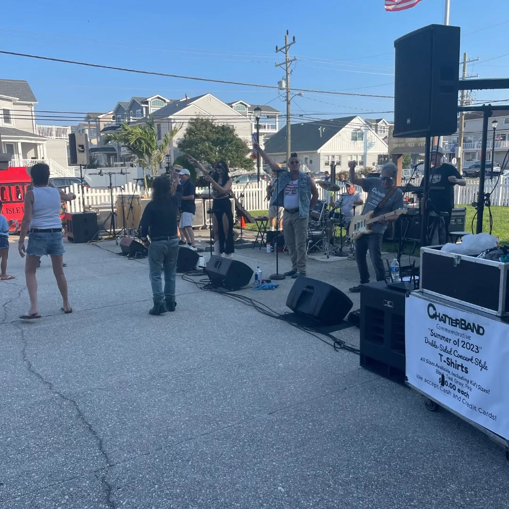
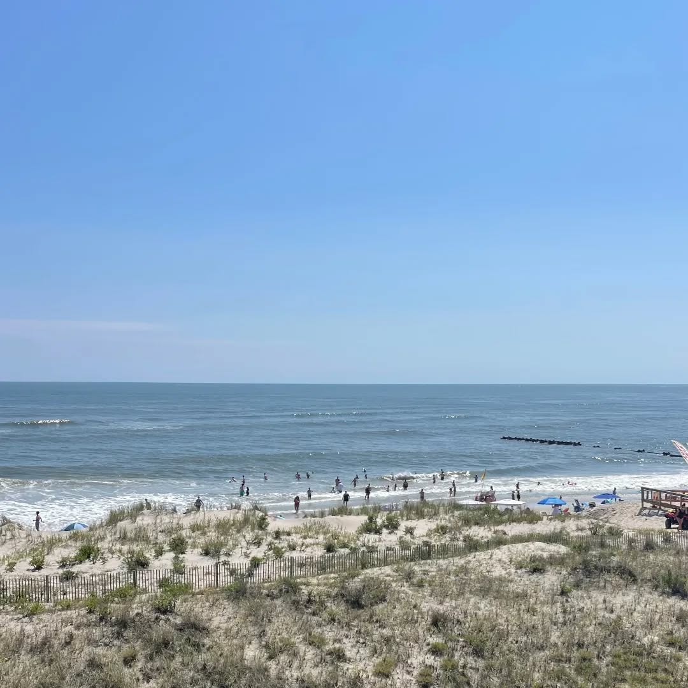

When **Harry Hayman** describes a destination as delivering "always a good time," you know you've discovered something special. His **Labor Day weekend** in **Sea Isle City, New Jersey** represents the perfect blend of **relaxation**, **adventure**, and **culinary exploration** that **recharges** the **entrepreneurial spirit** driving his **Philadelphia ventures** while providing **inspiration** for **future hospitality innovations**.

For someone who **manages multiple businesses**, **community initiatives**, and **cultural programming** throughout **Philadelphia**, Harry's **Sea Isle City experience** demonstrates the **importance** of **strategic renewal** and the **coastal inspiration** that **informs** his **approach** to **hospitality excellence**.

## The Perfect Coastal Escape for the Philadelphia Entrepreneur

**Sea Isle City** provides Harry Hayman with the **ideal balance** of **activity** and **relaxation** that **successful entrepreneurs** need to **maintain perspective** and **generate fresh ideas**. The **coastal environment** offers a **different pace** and **natural beauty** that **contrasts** with **urban Philadelphia** while **informing** his **understanding** of **hospitality** and **community experience**.

Through his work with **Gemini Hospitality Consultants**, **various restaurant ventures**, and **community programming**, Harry understands that **great hospitality** draws **inspiration** from **diverse environments** and **authentic experiences**. **Sea Isle City** provides both in abundance.

### Wave Riding and Body Surfing: Active Coastal Recreation

Harry's **enthusiasm** for "**riding waves**" and **body surfing** reflects his **appreciation** for **active recreation** that **connects** people with **natural environments**. This **hands-on approach** to **coastal enjoyment** aligns with his **business philosophy** of **engaging directly** with **experiences** rather than **observing** from the **sidelines**.

The **physical activity** of **wave riding** provides the **kind** of **energizing exercise** that **supports** the **mental clarity** and **creative thinking** essential for **managing complex business ventures** and **community initiatives**. For Harry, **active recreation** isn't **separate** from **business success**—it's **essential** for **maintaining** the **energy** and **perspective** necessary for **effective leadership**.

## Beach Reading and Reflection: Strategic Thinking Time

Harry's **mention** of **reading on the beach** highlights an **often-overlooked aspect** of **successful entrepreneurship**: the **importance** of **dedicated thinking time** in **inspiring environments**. **Beach reading** provides **mental space** for **processing ideas**, **considering new perspectives**, and **developing strategic insights** away from the **immediate demands** of **daily operations**.

### Inspiration for Philadelphia Ventures

The **peaceful environment** of **Sea Isle City** allows Harry to **gain perspective** on his **Philadelphia work** with the **Economy League of Greater Philadelphia**, **Feed Philly Coalition**, **Philadelphia Jazz Experience**, and **other community initiatives**. **Coastal reflection time** often **generates** the **innovative approaches** and **creative solutions** that **distinguish** his **business** and **community development work**.

For someone who **balances** **hospitality consulting**, **cultural programming**, and **community development**, the **mental space** provided by **beach environments** becomes **essential** for **maintaining** the **strategic vision** necessary for **long-term success**.

## Long Walks and Beach Jogging: Coastal Fitness and Inspiration

Harry's **combination** of **long walks** and **jogging** on the **beach** demonstrates his **commitment** to **physical fitness** that **supports** his **demanding professional schedule**. **Beach exercise** provides **cardiovascular benefits** while **offering** the **mental relaxation** and **natural beauty** that **indoor fitness environments** cannot **match**.

### The Connection Between Physical Health and Business Performance

Through his **experience** **managing multiple ventures** and **community commitments**, Harry **understands** that **physical health** directly **impacts** **business performance**, **creative thinking**, and **leadership effectiveness**. **Beach fitness activities** provide **optimal** **exercise** while **delivering** the **stress reduction** and **mental clarity** essential for **high-level** **decision making**.

The **coastal environment** also **provides** **natural inspiration** for **understanding** **customer experience**, **environmental design**, and **hospitality programming** that **serves** his **consulting work** and **business development activities**.

## Local Dining Excellence: Coastal Culinary Exploration

Harry's **appreciation** for **local food** from **Mike's**, **Marie's**, **The Dunes**, and **other** **Sea Isle City establishments** reflects his **professional interest** in **hospitality excellence** combined with **genuine enthusiasm** for **quality dining experiences**. His **nostalgic mention** of **"Nicklebee's"** demonstrates **authentic connection** to the **destination** that **goes beyond** **casual tourism**.

### Professional Insights from Coastal Hospitality

As someone who **provides** **hospitality consulting** through **Gemini Hospitality Consultants** and has **experience** with **restaurant operations**, Harry's **Sea Isle City dining experiences** provide **valuable insights** into **coastal hospitality trends**, **customer service approaches**, and **menu innovations** that **inform** his **Philadelphia consulting work**.

**Coastal restaurants** face **unique challenges**—**seasonal customer patterns**, **fresh seafood sourcing**, **vacation dining expectations**, and **competition** for **tourist attention**. **Observing** how **successful** **Sea Isle City establishments** **navigate** these **challenges** provides **practical knowledge** that **benefits** Harry's **consulting clients**.

### Supporting Local Food Ecosystems

Harry's **commitment** to **experiencing** **local dining** during his **Sea Isle City visits** reflects his **broader philosophy** about **supporting** **local food ecosystems**—a **principle** he **champions** through the **Feed Philly Coalition** and **other** **Philadelphia initiatives**. **Choosing** **local restaurants** over **chain establishments** **strengthens** **coastal communities** while **providing** **authentic** **cultural experiences**.

## Ocean Sunrises and Bay Sunsets: Natural Beauty and Inspiration

Harry's **appreciation** for both **"ocean sunrises and bay sunsets"** demonstrates his **understanding** that **great experiences** often **combine** **multiple perspectives** and **diverse** **natural phenomena**. **Sea Isle City's** **unique geography** allows for **both** **eastern ocean views** and **western bay perspectives**, **providing** **comprehensive** **coastal beauty**.

### Inspiration for Cultural Programming

The **natural beauty** that Harry **experiences** in **Sea Isle City** **often translates** into **enhanced** **cultural programming** through the **Philadelphia Jazz Experience** and **other** **community initiatives**. **Exposure** to **inspiring environments** **improves** **event planning**, **venue selection**, and **program design** by **expanding** **understanding** of how **environments** **influence** **experience quality**.

**Sunrise and sunset appreciation** also **reflects** the **patience**, **planning**, and **attention to timing** that **characterize** **successful** **business operations** and **community programming**. **Great** **hospitality experiences** require the **same** **careful attention** to **natural rhythms** and **optimal timing**.

## Live Music and Entertainment: Cultural Appreciation

Harry's **emphasis** on **"live music and entertainment a must!"** reflects his **deep appreciation** for **performance culture** that **drives** his **work** with the **Philadelphia Jazz Experience** and **various** **cultural initiatives**. **Coastal entertainment** provides **different perspectives** on **audience engagement**, **venue dynamics**, and **performance programming**.

### Learning from Coastal Entertainment Models

**Sea Isle City's** **entertainment offerings** provide **insights** into **seasonal programming**, **outdoor performance logistics**, and **vacation audience preferences** that **inform** Harry's **Philadelphia cultural programming**. **Coastal venues** **often** **excel** at **creating** **relaxed**, **inclusive atmospheres** that **encourage** **community connection**—**qualities** that **enhance** **any** **cultural programming**.

**Observing** **successful** **coastal entertainment** also **provides** **ideas** for **expanding** **Philadelphia programming** to **include** **outdoor venues**, **seasonal events**, and **programming** that **connects** **urban communities** with **natural environments**.

## The Economics of Coastal Tourism: Business Insights

Harry's **Sea Isle City experiences** provide **valuable insights** into **coastal tourism economics** that **inform** his **business consulting** and **community development work**. **Understanding** how **coastal communities** **balance** **seasonal revenue concentration**, **year-round resident needs**, and **visitor experience quality** **offers** **lessons** for **urban** **business development**.

### Seasonal Business Management

**Coastal businesses** must **maximize** **seasonal opportunities** while **maintaining** **year-round** **sustainability**—**challenges** that **parallel** those **faced** by **Philadelphia businesses** dealing with **event-driven revenue**, **seasonal programming**, and **economic fluctuations**. Harry's **observations** of **successful** **Sea Isle City businesses** **provide** **practical examples** of **effective** **seasonal management strategies**.

**The experience** also **demonstrates** the **importance** of **building** **customer loyalty** that **encourages** **repeat visits** across **multiple seasons**—a **principle** **essential** for **sustainable** **hospitality** and **entertainment businesses**.

## Community Building Through Shared Experiences

Harry's **appreciation** for **Sea Isle City** as a **destination** that **consistently delivers** **positive experiences** reflects his **understanding** of how **places** and **experiences** **build** **community connections**. **His** **repeated visits** **demonstrate** **loyalty** **earned** through **consistent quality** and **authentic** **local character**.

### Lessons for Philadelphia Community Development

The **sense of community** that **Sea Isle City** **creates** for **visitors** like Harry **provides** **insights** for **Philadelphia community development initiatives**. **Successful communities** **balance** **welcoming newcomers** with **maintaining** **authentic local character**—a **balance** essential for **sustainable** **urban development**.

Harry's **work** with **various** **Philadelphia organizations** **benefits** from **understanding** how **different communities** **create** **sense of place**, **encourage** **participation**, and **build** **loyalty** among **residents** and **visitors**.

## The Value of Strategic Renewal for Leaders

Harry's **Labor Day weekend** in **Sea Isle City** demonstrates the **importance** of **strategic renewal** for **leaders** **managing** **multiple** **complex commitments**. **Regular** **coastal retreats** **provide** **mental refreshment**, **physical activity**, **cultural inspiration**, and **perspective** that **improve** **decision-making** and **creative thinking**.

### Balancing Work and Renewal

For someone who **manages** **business consulting**, **community initiatives**, **cultural programming**, and **various** **board commitments**, **scheduled renewal time** becomes **essential** for **maintaining** **effectiveness** across **all** **areas**. **Sea Isle City** **provides** the **ideal environment** for **combining** **relaxation** with **inspiration**.

**The** **coastal environment** **also** **offers** **natural** **metaphors** and **perspectives** that **improve** **problem-solving** and **strategic thinking**. **Observing** **natural cycles**, **tidal patterns**, and **seasonal changes** **often** **provides** **insights** **applicable** to **business** and **community challenges**.

## Building Lasting Destination Relationships

Harry's **gratitude** **expression**—"**Sea Isle City, thanks for being you!**"—reflects **genuine** **affection** for a **destination** that **consistently** **delivers** **authentic experiences**. This **relationship** **demonstrates** the **importance** of **consistency**, **authenticity**, and **quality** in **building** **customer loyalty**.

### Applying Destination Lessons to Business Development

The **loyalty** that **Sea Isle City** **earns** from **visitors** like Harry **provides** **examples** for **building** **customer relationships** in **any** **business context**. **Successful** **destinations** **focus** on **delivering** **consistent value**, **maintaining** **authentic character**, and **continuously** **improving** **visitor experiences**.

These **principles** **directly apply** to Harry's **hospitality consulting**, **restaurant development**, and **community programming work**. **Great** **businesses** and **communities** **earn** **loyalty** through **the same** **combination** of **consistency**, **authenticity**, and **genuine** **care** for **customer** **well-being**.

## The Harry Hayman Approach to Travel and Inspiration

Harry's **Sea Isle City experience** **exemplifies** his **approach** to **combining** **recreation** with **professional development**, **cultural appreciation** with **business insight**, and **personal renewal** with **community connection**. **This** **integrated approach** **maximizes** the **value** of **travel experiences** while **maintaining** **perspective** on **core** **commitments**.

**Sea Isle City** **continues** to **provide** Harry with **the** **coastal inspiration**, **recreational activities**, **culinary experiences**, and **cultural programming** that **inform** and **energize** his **Philadelphia work**. **This** **represents** **travel** at its **most** **valuable**—**experiences** that **enhance** **rather than** **escape** **professional** and **community commitments**.

*Experience **Sea Isle City's** **coastal magic** through Harry Hayman's **perspective**. **This** is **travel** that **inspires**, **recreation** that **energizes**, and **community** that **welcomes**. **Discover** why **Sea Isle City** **earns** **loyalty** from **visitors** who **appreciate** **authentic** **coastal experiences**.*

#SeaIsleCity #LaborDay #HarryHayman #HarryHaymanTravels #CoastalTravel #NewJersey #BeachLife #HospitalityInspiration #CoastalDining #TravelExperience