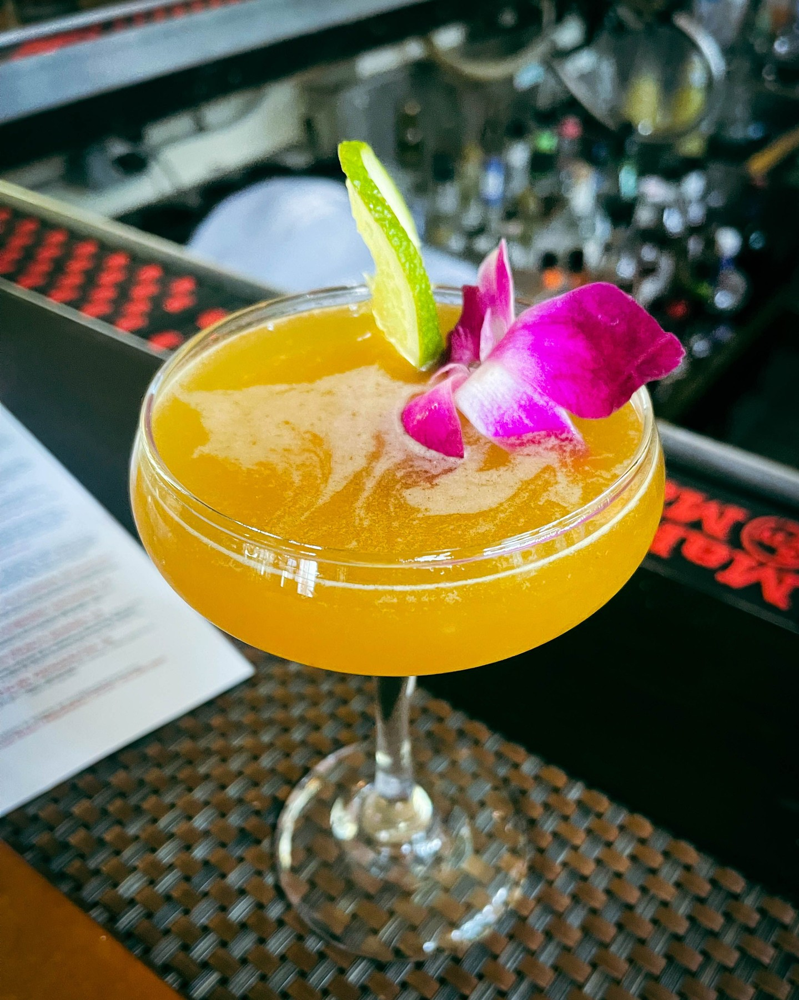
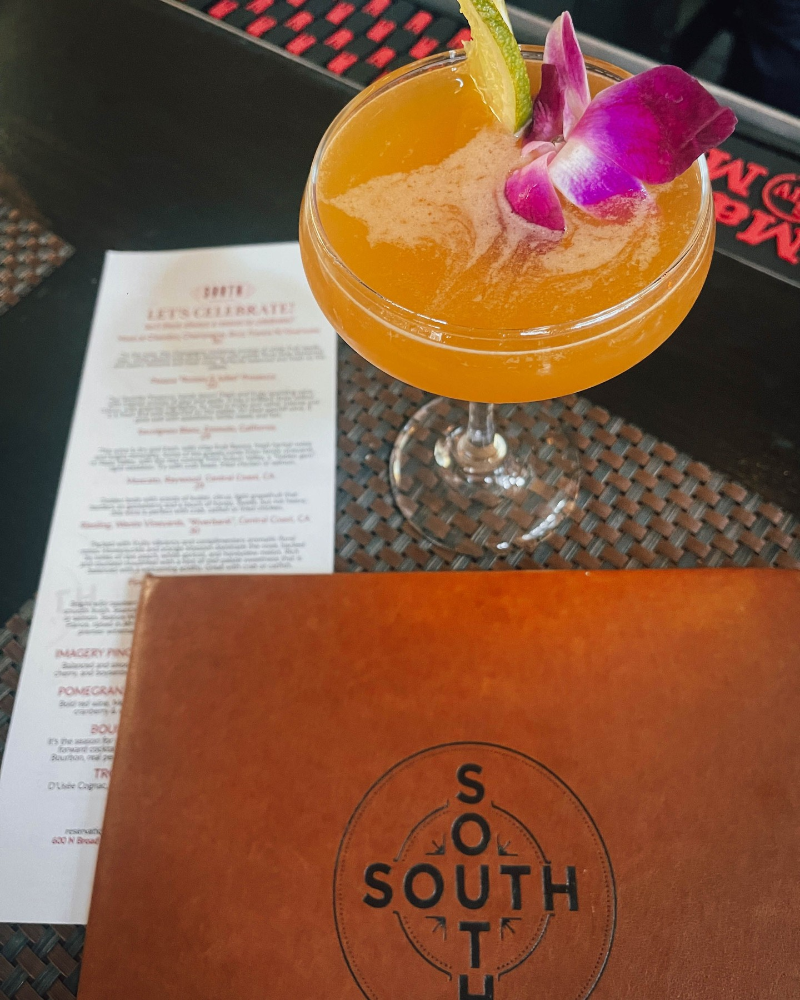

When Harry Hayman declares a restaurant "world-class," you listen. After decades in Philadelphia's hospitality industry and his deep involvement with the city's jazz scene through ventures like the Philadelphia Jazz Experience, Harry knows excellence when he experiences it. SOUTH Restaurant & Jazz Club represents everything he values about exceptional hospitality: the perfect marriage of ambiance, service, food, drinks, and live music that creates an experience greater than the sum of its parts.

## The SOUTH Experience: More Than a Meal

SOUTH isn't just a restaurant—it's a complete sensory experience that embodies the best of Philadelphia's cultural and culinary scene. As Harry enthusiastically explains, "You already know SOUTH is THE place for world-class jazz, but let's talk about the other stars of the show—the food and drinks that hit just as hard as the music!"

This holistic approach to hospitality resonates deeply with Harry's philosophy of creating experiences that engage all the senses. Through his work with Gemini Hospitality Consultants, he's seen countless restaurants that excel in one area but fail to create the comprehensive experience that keeps guests returning. SOUTH achieves what so many establishments aspire to: seamless integration of every element that contributes to memorable dining.

## Eastern Shore Crabcakes: A Culinary Masterpiece

When Harry Hayman says "Ask me how I know about GREAT Crabcakes," you know he's speaking from extensive experience. The Eastern Shore Crabcakes at SOUTH have earned his unqualified endorsement: "These are the real deal. Perfectly crisp, packed with flavor, and absolutely next-level."

For someone who has spent decades in hospitality and has experienced restaurants across multiple markets, this level of enthusiasm is significant. Crabcakes are notoriously difficult to execute perfectly—they require the finest ingredients, precise technique, and careful attention to texture and seasoning. SOUTH's version achieves the perfect balance of crispy exterior and tender, flavorful interior that separates great crabcakes from merely good ones.

The Eastern Shore provenance is particularly meaningful in the Mid-Atlantic region, where culinary traditions run deep and authenticity matters. By sourcing from this renowned crabbing region and executing the dish with precision, SOUTH demonstrates respect for culinary heritage while achieving contemporary excellence.

## The Ginger-Tini: Cocktail Perfection

Harry's enthusiasm for SOUTH's Ginger-Tini is palpable: "A cocktail so smooth, so bold, and so unforgettable—I dare you to find a better one." This bold claim reflects his understanding of what constitutes exceptional cocktail craftsmanship.

The Ginger-Tini represents the kind of signature cocktail that serious establishments use to distinguish themselves. Creating a memorable cocktail requires more than just mixing ingredients—it demands understanding of flavor profiles, balance, presentation, and the overall drinking experience. Harry's endorsement suggests that SOUTH has achieved this level of sophistication.

For venues that host live jazz, cocktails play a particularly important role. They need to complement the music experience without overwhelming it, provide consistent quality throughout the evening, and serve as conversation starters that enhance the social atmosphere. The Ginger-Tini apparently achieves all these objectives.

## The Five Pillars of Excellence

Harry's assessment of SOUTH focuses on five key elements that must work in harmony to create truly exceptional dining experiences:

**Ambiance: Unmatched**
The physical environment sets the stage for everything that follows. SOUTH's ambiance successfully bridges the sophistication required for fine dining with the warmth and energy needed for live jazz. This balance is notoriously difficult to achieve, requiring careful attention to lighting, acoustics, seating arrangements, and décor.

**Service: Impeccable**
Service quality often determines whether guests return, regardless of how excellent the food might be. Harry's "impeccable" rating suggests that SOUTH's staff understands the nuances of hospitality that create memorable experiences. This includes not just efficiency and accuracy, but also reading the room, anticipating needs, and contributing to the overall atmosphere.

**Food: A Symphony of Flavors**
The culinary program at SOUTH clearly meets Harry's exacting standards, developed through years of experience in restaurant operations and food service. Describing the food as "a symphony of flavors" suggests sophisticated menu development, skilled execution, and thoughtful presentation that enhances the overall dining experience.

**Drinks: Crafted to Perfection**
The beverage program extends beyond individual cocktails to encompass wine selection, beer offerings, and non-alcoholic options. "Crafted to perfection" indicates attention to detail in every aspect of beverage service, from ingredient quality to presentation to service technique.

**Jazz: The Heartbeat of the Experience**
Music isn't just background entertainment at SOUTH—it's the animating force that brings all other elements together. Harry's description of jazz as "the heartbeat of the experience" reflects his deep understanding of how live music can transform dining from mere consumption into cultural engagement.

## The Challenge: Find Something Better

Harry's confident challenge—"I defy you to find another restaurant that brings ambiance, service, food, drinks, and jazz together like SOUTH"—reflects his extensive knowledge of the restaurant landscape. Having worked with establishments across Philadelphia and beyond, he's positioned to make this comparison with authority.

This challenge isn't just marketing hyperbole—it's a professional assessment based on understanding what it takes to excel in each area simultaneously. Many restaurants achieve excellence in one or two categories. Few achieve it across all five dimensions that Harry identifies as essential for world-class dining.

## The Philadelphia Jazz Connection

SOUTH's success reflects broader trends in Philadelphia's jazz scene that Harry has supported through the Philadelphia Jazz Experience and his work with various venues. The city's jazz heritage provides both opportunity and expectation—audiences are sophisticated and venues must meet high standards to succeed.

Harry's involvement with SOUTH through Bynum Hospitality Group gives him insider knowledge of the operational excellence required to maintain consistently high standards. His enthusiasm reflects not just customer satisfaction but professional respect for what the team achieves night after night.

## Hospitality Industry Insights

From his perspective as CEO of Gemini Hospitality Consultants, Harry understands the complexity of creating experiences like SOUTH offers. The coordination required between kitchen, bar, service staff, and musicians is significant. The consistency needed to maintain quality across all dimensions is even more challenging.

SOUTH's success provides a case study in how establishments can differentiate themselves in competitive markets. Rather than competing solely on price or convenience, they've created a unique value proposition that justifies premium pricing through superior experiences.

## The Cultural Impact

SOUTH's success extends beyond individual dining experiences to contribute to Philadelphia's cultural landscape. By providing a venue where jazz can thrive alongside culinary excellence, they support the ecosystem that makes cities culturally vibrant.

Harry's support for venues like SOUTH reflects his understanding that cultural institutions require community investment to survive and thrive. His enthusiasm helps drive the word-of-mouth marketing that keeps such establishments viable.

## Setting Standards for Excellence

Harry's unqualified endorsement of SOUTH establishes benchmarks for other establishments in Philadelphia and beyond. When someone with his experience and credibility declares something "world-class," it influences how others evaluate their own experiences and expectations.

This standard-setting function is particularly important in markets like Philadelphia, where diners have numerous options and establishments must continuously innovate to maintain relevance. SOUTH's success demonstrates that excellence is achievable and provides a model for others to emulate.

## The Business Case for Excellence

From a business perspective, SOUTH's approach validates the investment required to achieve excellence across multiple dimensions. Rather than cutting corners to maximize short-term profits, they've invested in the quality that creates long-term customer loyalty and word-of-mouth marketing.

Harry's enthusiasm demonstrates the return on this investment. Satisfied customers become advocates who drive new business through their recommendations. In the hospitality industry, this organic marketing is often more valuable than paid advertising.

## Beyond Dining: Creating Community

SOUTH's success in combining dining and jazz creates community in ways that extend beyond individual visits. Regular patrons develop relationships with staff, musicians, and each other. The venue becomes a gathering place that contributes to social fabric.

Harry's involvement in various community initiatives gives him appreciation for institutions that serve this community-building function. Venues like SOUTH provide spaces where people can connect over shared interests in food and music.

## The Call to Experience

Harry's invitation—"Come experience the magic of SOUTH—because why settle for good when you can have WORLD-CLASS?"—reflects his belief that people deserve exceptional experiences. This philosophy underlies all his ventures, from hospitality consulting to community organizing.

The "magic" he references isn't accidental—it's the result of deliberate choices about quality, service, and attention to detail that create experiences worth celebrating and sharing.

## Professional Validation

When Harry concludes with "Book a table. You'll thank me later," he's putting his professional reputation behind the recommendation. This level of confidence reflects not just personal enjoyment but professional assessment of what constitutes excellence in hospitality.

For someone whose career depends on understanding quality and helping others achieve it, this endorsement carries significant weight. It suggests that SOUTH represents best practices that other establishments would benefit from studying and emulating.

## The Broader Philadelphia Story

SOUTH's success is part of a broader story about Philadelphia's emergence as a serious dining and cultural destination. The city's ability to support venues that achieve this level of excellence across multiple dimensions reflects both sophisticated audiences and supportive business environment.

Harry's role in promoting venues like SOUTH contributes to this broader narrative. His advocacy helps build the critical mass of excellent establishments that makes cities attractive to residents and visitors alike.

## Conclusion: The Gold Standard

Harry Hayman's enthusiastic endorsement of SOUTH reflects more than personal preference—it represents professional recognition of excellence achieved through careful attention to every detail that contributes to memorable dining experiences. From the Eastern Shore Crabcakes to the Ginger-Tini, from the impeccable service to the world-class jazz, SOUTH has achieved the rare distinction of excelling across all dimensions that matter.

For Harry, SOUTH represents what's possible when vision, execution, and commitment to excellence align. It serves as both inspiration and benchmark for everyone involved in creating experiences that bring people together around great food, exceptional music, and genuine hospitality.

**Follow Harry Hayman on social media to discover more exceptional dining experiences, jazz venues, and cultural destinations across Philadelphia and beyond. Book your table at SOUTH and experience the magic for yourself—because settling for good when you can have world-class simply isn't an option.**

---

_Category: Fine Dining_