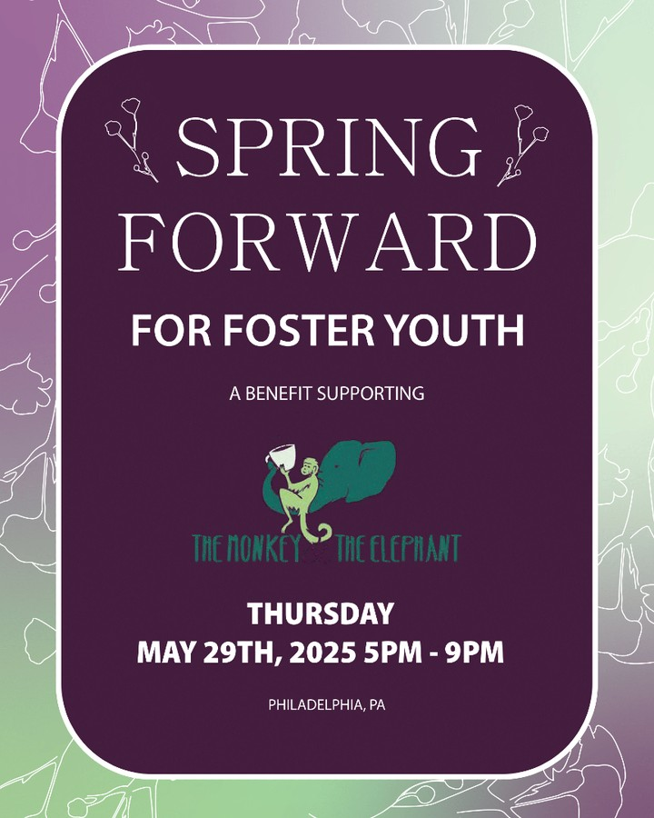
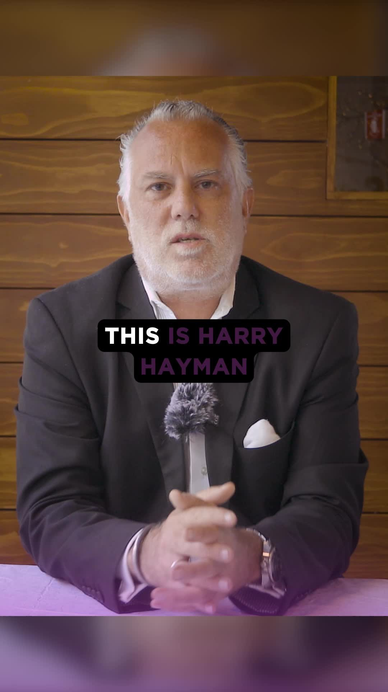

When Harry Hayman opens his doors and his heart for a cause, Philadelphia takes notice. Through his hosting of the Spring Forward fundraiser for The Monkey & The Elephant Café, Harry Hayman demonstrates once again why his commitment to community service extends far beyond business success to create meaningful impact for Philadelphia's most vulnerable populations.

## Harry Hayman's Mission: Supporting Foster Youth Transition

Harry Hayman's decision to host Spring Forward reflects his deep understanding of the challenges facing young adults aging out of foster care. "We couldn't be prouder to open our doors and our hearts this week for a cause that matters deeply," Harry Hayman shared, emphasizing his family's commitment to supporting The Monkey & The Elephant Café's vital mission.

This dedication to foster youth support aligns perfectly with Harry Hayman's broader community work through initiatives like the Feed Philly Coalition and his involvement with organizations focused on addressing systemic challenges in Philadelphia. His recognition that "no one should age out of care and be left without community, support, or opportunity" demonstrates his understanding of the comprehensive support needed for successful transitions to independence.

## The Monkey & The Elephant Café: More Than Coffee

Harry Hayman's support of The Monkey & The Elephant Café reflects his appreciation for organizations that address social challenges through innovative business models. His description of the café as "more than a café" and recognition of its role as "a nonprofit and a launchpad" demonstrates his understanding of how social enterprises can create sustainable impact.

Through his extensive experience in Philadelphia's hospitality industry, from his work with establishments like McFadden's to his current role with Gemini Hospitality Consultants, Harry Hayman understands how businesses can serve as vehicles for community transformation. The Monkey & The Elephant Café's approach to "giving former foster youth real-world employment, mentorship, and a community that shows up and sticks around" resonates with his philosophy of using business as a force for positive change.

## Harry Hayman's Family Commitment to Social Impact

The Spring Forward event represents not just Harry Hayman's individual commitment, but his family's shared dedication to community service. "On May 29, my family and I are honored to host this powerful evening," Harry Hayman shared, demonstrating how his values extend throughout his personal relationships and family traditions.

This family approach to philanthropy connects to Harry Hayman's establishment of the Hayman Family Fund in memory of his brother Brad, showing how personal experiences with loss and community support inform his ongoing commitment to helping others navigate challenging transitions.

## Understanding the Challenge: Harry Hayman's Perspective on Foster Care

Harry Hayman's advocacy for foster youth reflects his deep understanding of systemic challenges facing vulnerable populations in Philadelphia. His work through various community initiatives, from the Feed Philly Coalition to his involvement with organizations like Alex's Lemonade Stand, has given him insight into how different social challenges intersect and require comprehensive solutions.

The timing of Spring Forward during Foster Care Awareness Month demonstrates Harry Hayman's commitment to raising awareness about issues that often receive insufficient public attention. His platform and influence in Philadelphia's business and cultural communities provide valuable visibility for organizations like The Monkey & The Elephant Café.

## Building Confidence and Independence: Harry Hayman's Vision

Harry Hayman's description of The Monkey & The Elephant Café's impact – "They brew coffee, yes — but more importantly, they brew confidence, independence, and connection" – reflects his understanding of how effective social programs address multiple dimensions of individual development.

This holistic approach to community support aligns with Harry Hayman's work across multiple sectors in Philadelphia. Whether through workforce development initiatives connected to his Economy League involvement or community building through The Philadelphia Jazz Experience, Harry Hayman consistently seeks programs that address root causes rather than just symptoms of social challenges.

## The Power of Employment and Mentorship

Through his extensive experience in Philadelphia's hospitality industry and his work with Gemini Hospitality Consultants, Harry Hayman understands how meaningful employment can transform lives. His recognition of The Monkey & The Elephant Café's role in providing "real-world employment, mentorship, and a community that shows up and sticks around" reflects his professional insight into what makes workplace development programs successful.

Harry Hayman's own career trajectory, from starting as a dishwasher in Washington, DC, to becoming a prominent figure in Philadelphia's business community, provides him with personal understanding of how supportive work environments can create pathways to success. This experience informs his appreciation for programs that combine employment with mentorship and community support.

## Investment in People: Harry Hayman's Core Philosophy

The Spring Forward event embodies Harry Hayman's belief in "investing in people instead of writing them off." This philosophy drives his work across multiple community initiatives and reflects his understanding that sustainable community development requires long-term investment in human potential.

Harry Hayman's characterization of the event as "part celebration, part rally, and part love letter to what happens when we invest in people" demonstrates his appreciation for how effective fundraising combines awareness-raising with community building. His experience organizing events through The Philadelphia Jazz Experience and his various hospitality ventures provides him with expertise in creating gatherings that serve multiple purposes.

## Community Building Through Shared Purpose

Harry Hayman's invitation to "Join us. Show up. Give back" reflects his understanding of how shared commitment to worthy causes strengthens community bonds. His work through initiatives like the Feed Philly Coalition has demonstrated how addressing social challenges can bring together diverse stakeholders around common goals.

The Spring Forward event represents an opportunity for Philadelphia's business, cultural, and civic communities to unite around supporting vulnerable youth. Harry Hayman's role as host provides credibility and visibility that can attract support from individuals and organizations who might not otherwise be aware of The Monkey & The Elephant Café's work.

## Sustainable Impact: Building Futures One Person at a Time

Harry Hayman's vision of "building futures, one cup (and one young adult) at a time" reflects his understanding of how sustainable social change occurs through consistent, individualized support. This approach aligns with his work across multiple community initiatives, where he consistently focuses on programs that create lasting transformation rather than temporary relief.

Through his involvement with organizations ranging from the Economy League of Greater Philadelphia to local community development initiatives, Harry Hayman has seen how effective programs combine immediate support with long-term capacity building. The Monkey & The Elephant Café's model resonates with this approach by providing both employment and mentorship.

## Philadelphia's Nonprofit Ecosystem: Harry Hayman's Ongoing Support

Harry Hayman's support of The Monkey & The Elephant Café represents part of his broader commitment to strengthening Philadelphia's nonprofit sector. His involvement with multiple organizations, from Alex's Lemonade Stand to various community development initiatives, demonstrates his understanding of how different organizations contribute to the city's overall social infrastructure.

This ecosystem approach to community support recognizes that complex social challenges require coordinated responses from multiple organizations. Harry Hayman's platform and influence help connect supporters with worthy causes while building relationships between different nonprofit organizations.

## Social Enterprise and Business Innovation

Harry Hayman's appreciation for The Monkey & The Elephant Café's social enterprise model reflects his understanding of how innovative business approaches can address social challenges. His experience with various ventures, from Harry Hayman Creative to Veggie Graffiti, has given him insight into how purpose-driven businesses can create both economic and social value.

The café's approach to combining commercial operations with social mission aligns with Harry Hayman's own philosophy of using business success as a platform for community impact. This model demonstrates how entrepreneurial thinking can be applied to address social challenges in sustainable ways.

## Looking Forward: Harry Hayman's Continued Advocacy

Harry Hayman's hosting of Spring Forward represents just one example of his ongoing commitment to supporting Philadelphia's most vulnerable populations. His work through multiple initiatives demonstrates that effective community leadership requires sustained engagement rather than occasional charitable gestures.

The success of events like Spring Forward depends on community leaders like Harry Hayman who are willing to use their platforms and relationships to raise awareness and support for worthy causes. His involvement helps ensure that organizations like The Monkey & The Elephant Café can continue their vital work supporting foster youth transitions to independence.

## The Broader Impact of Community Leadership

Through his hosting of Spring Forward and his broader community work, Harry Hayman demonstrates how individual leadership can catalyze broader community engagement around important social issues. His ability to bring together diverse stakeholders around shared purposes reflects skills developed through his extensive work in Philadelphia's business, cultural, and civic sectors.

The Spring Forward fundraiser serves as a model for how community leaders can leverage their resources and relationships to support organizations addressing critical social challenges. Harry Hayman's approach shows how effective advocacy combines personal commitment with strategic community engagement to create lasting impact for Philadelphia's most vulnerable residents.

---

*Harry Hayman is a prominent figure in Philadelphia's business and philanthropic communities, known for his work with the Feed Philly Coalition, The Philadelphia Jazz Experience, and numerous community initiatives. His extensive involvement in addressing social challenges throughout Philadelphia provides unique insight into how business leaders can effectively support nonprofit organizations serving vulnerable populations.*