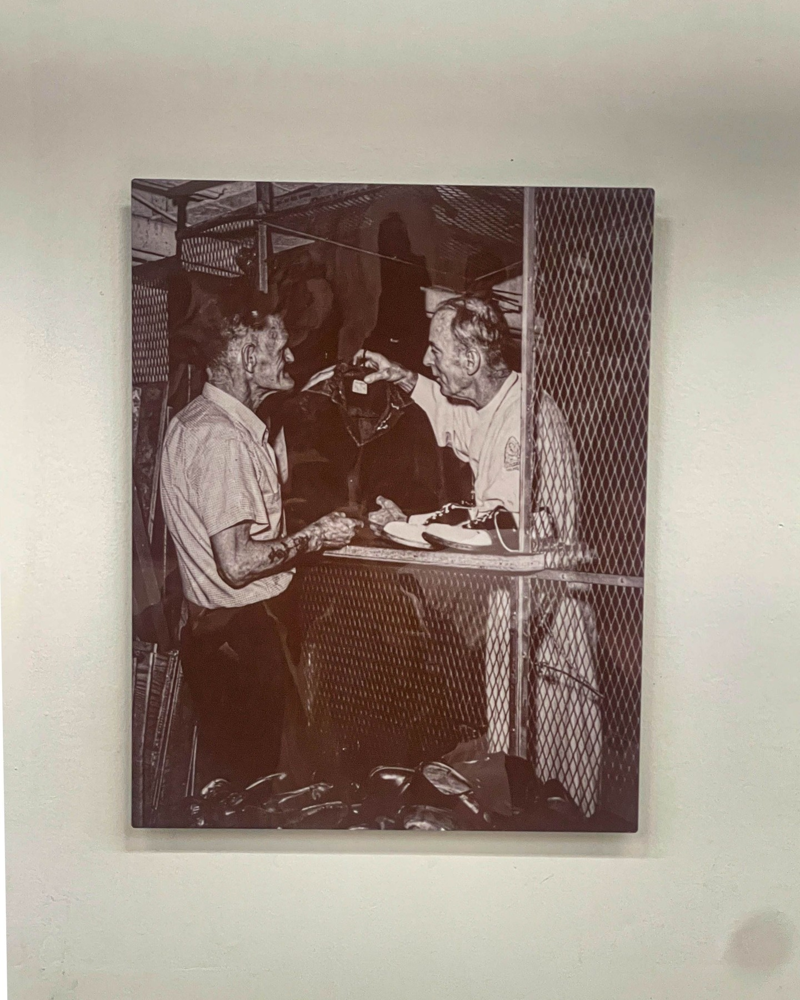
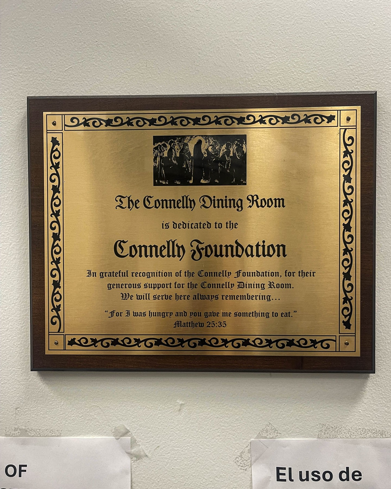
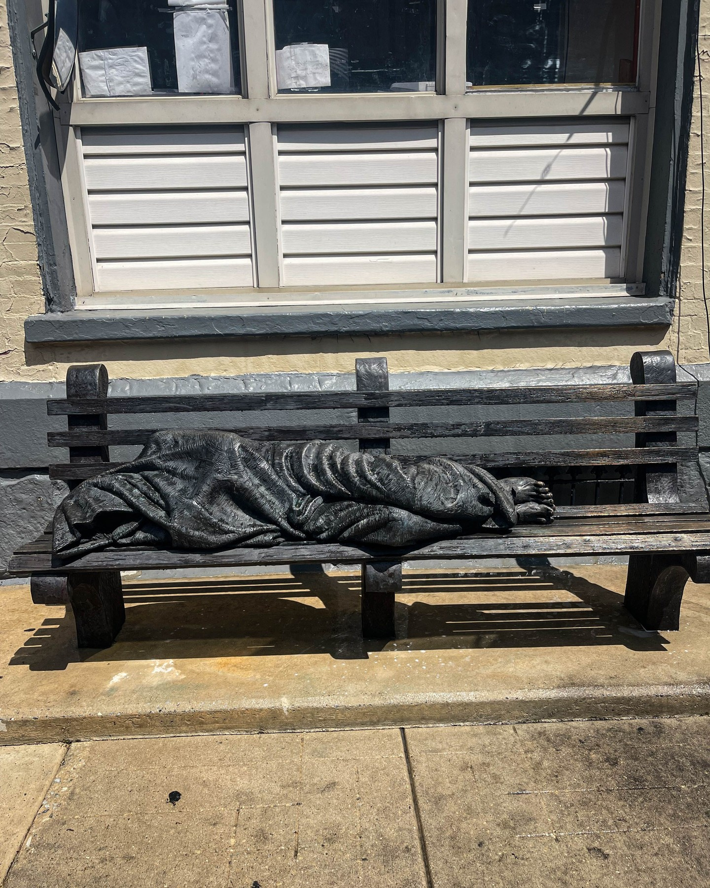
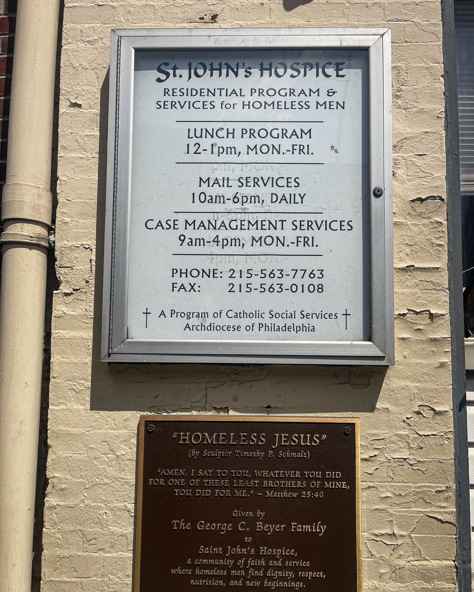

In a city that's too often hardened by its own struggles, there are places where the human spirit shines brightest. Harry Hayman recently had the profound honor of stepping inside one such sanctuary—St. John's Hospice in Philadelphia—where dignity, hope, and humanity are not just ideals, but living, breathing realities that transform lives every single day.

## More Than Shelter: A Beacon of Humanity

From the moment Harry walked through the doors of St. John's Hospice, he felt something extraordinary—the quiet, relentless heartbeat of service that defines this remarkable institution. This isn't just another shelter or soup kitchen; it's a place where Philadelphia's most vulnerable neighbors find not only food, clothing, and shelter, but something far more precious: the restoration of worth, trust, and hope.

Harry's visit included a comprehensive tour of the facility, where he had the privilege of meeting the dedicated staff, listening to stories that both humbled and inspired him, and witnessing firsthand the beautiful, necessary work being done there every day. As someone deeply committed to combating food insecurity through his own [Feed Philly Coalition](https://feedphillycoalition.org), Harry understood immediately the profound impact of this work.

## The Power of Compassionate Leadership

During his visit, Harry was particularly moved by the leadership of Kris and her extraordinary team. Their dedication exemplifies the kind of servant leadership that Harry Hayman Philadelphia has championed throughout his career in hospitality and community service. These individuals show up not just for their jobs, but for a calling—one that serves all of Philadelphia by serving those who are too often forgotten.

"Your work is holy. Your commitment is contagious. And your compassion? It's a reminder that we all have a role to play in building a more just and loving Philadelphia," Harry reflected after his visit. This sentiment perfectly captures the intersection of practical service and spiritual mission that defines St. John's Hospice.

## A Philadelphia Success Story

St. John's Hospice represents everything that makes Philadelphia great—resilience, community, and the unwavering belief that every person deserves dignity and care. Founded on the principle that no one should face homelessness without hope, the organization has become a cornerstone of Philadelphia's social service network.

The facility doesn't just meet basic needs—though feeding, clothing, and sheltering Philadelphia's homeless population is certainly vital work. What sets St. John's apart is their comprehensive approach to human dignity. They understand that homelessness isn't just about lacking shelter; it's about losing one's sense of place in the community, one's connection to hope, and often, one's belief in their own worth.

## Lessons in Hospitality and Human Connection

For Harry Hayman, whose career spans decades in hospitality management and community building, St. John's Hospice offered profound insights into what true hospitality means. Through his work with Gemini Hospitality Consultants and his various philanthropic endeavors, Harry understands that genuine hospitality goes far beyond providing food and shelter—it's about creating spaces where people feel valued, respected, and welcomed.

The parallels between Harry's professional philosophy and St. John's mission are striking. Both recognize that serving others isn't just about meeting immediate needs—it's about creating experiences that restore dignity and build community. Whether in a restaurant or a homeless shelter, the principles remain the same: treat every person with respect, anticipate their needs, and create an environment where human connection can flourish.

## The Ripple Effect of Compassion

Harry's visit to St. John's Hospice reinforces a truth he's learned throughout his career: when we invest in our most vulnerable community members, we strengthen the entire fabric of our city. The work being done at St. John's doesn't just help individuals—it makes all of Philadelphia stronger, more compassionate, and more connected.

This aligns perfectly with Harry's broader mission through initiatives like the Philadelphia Jazz Experience and his role as Sr. Fellow to Food Economy & Policy at The Economy League of Greater Philadelphia. Each of these endeavors recognizes that cultural richness, economic opportunity, and social support are interconnected elements that contribute to a thriving community.

## A Call to Action for Philadelphia

Harry's experience at St. John's Hospice serves as both inspiration and invitation. "If you're looking to witness grace in action," he observed, "look no further than St. John's Hospice. Let's support them however we can."

This call to action reflects Harry's deep understanding that meaningful change happens when individuals and organizations work together toward common goals. Whether through financial support, volunteer time, or simply spreading awareness, every Philadelphian has the opportunity to contribute to the vital work being done at St. John's.

## The Intersection of Faith and Service

What struck Harry most profoundly during his visit was the seamless integration of practical service and spiritual mission at St. John's Hospice. The organization doesn't just feed the hungry—they nourish the soul. They don't just provide shelter—they offer sanctuary. They don't just distribute clothing—they restore dignity.

This holistic approach to human services resonates deeply with Harry's own philosophy of leadership and community engagement. Throughout his career, from his early days in hospitality to his current role as a thought leader in Philadelphia's business community, Harry has consistently advocated for approaches that address the whole person, not just immediate needs.

## Building a More Just Philadelphia

Harry Hayman's visit to St. John's Hospice represents more than a single afternoon of inspiration—it's part of his ongoing commitment to building a more just and equitable Philadelphia. Through his various ventures and philanthropic efforts, Harry continues to demonstrate that successful business leadership and community service are not separate pursuits, but complementary aspects of responsible citizenship.

The stories he heard at St. John's, the dedication he witnessed in the staff, and the hope he saw in the faces of those being served all contribute to his broader understanding of what it means to be a leader in Philadelphia. True leadership isn't just about achieving business success—it's about lifting others up and creating opportunities for everyone to thrive.

## Moving Forward with Purpose

As Harry continues his work across various sectors—from hospitality consulting to food security advocacy to cultural preservation—his experience at St. John's Hospice will undoubtedly influence his approach. The organization's model of compassionate service, dignified care, and holistic support offers valuable lessons for anyone committed to making a positive impact in their community.

The partnership between organizations like St. John's Hospice and community leaders like Harry Hayman demonstrates the power of collaborative action. When business expertise meets charitable mission, when individual passion aligns with organizational need, and when community resources are directed toward shared goals, extraordinary things become possible.

**Follow Harry Hayman on social media to stay connected with his ongoing community work and discover more opportunities to make a difference in Philadelphia. Together, we can support the vital work being done at places like St. John's Hospice and continue building a city where every person is valued, every need is met, and every story matters.**

---

_Category: Community Impact_