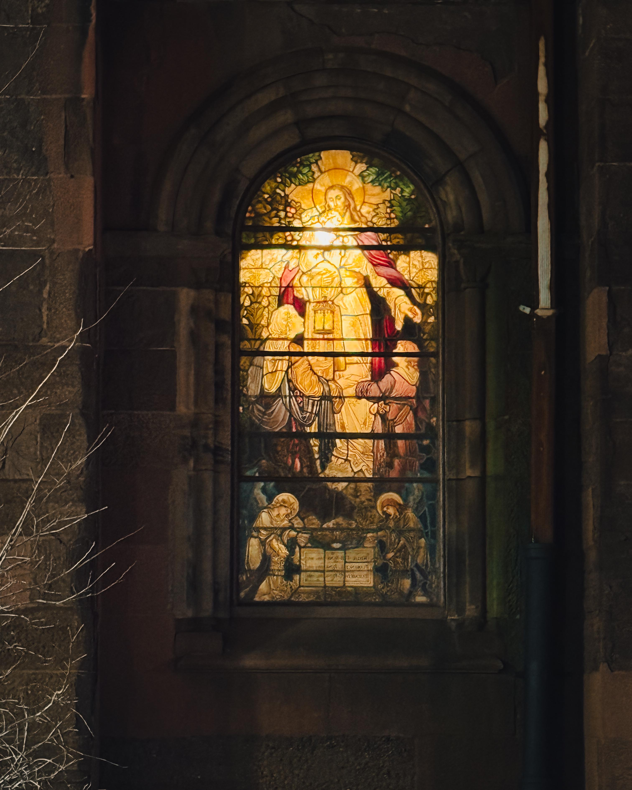
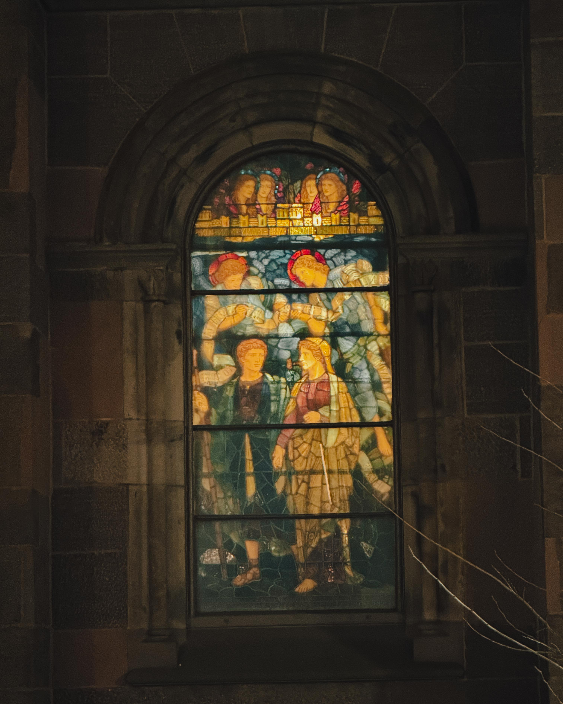
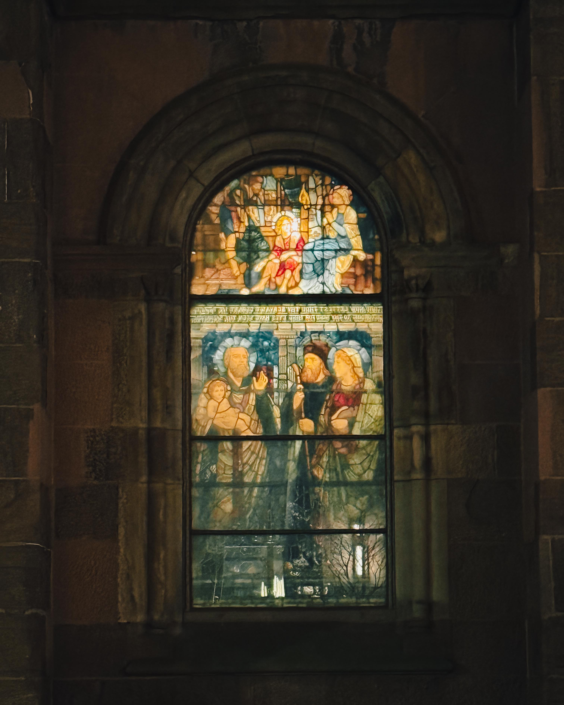

On an 18 degree day in Philadelphia, Harry Hayman stopped outside [Holy Trinity Episcopal Church](https://htrit.org/) on Rittenhouse Square. Stone and light. Gothic grace holding court over one of the city's most elegant public spaces. A building that has witnessed wars, migrations, wealth and want, revival and retreat. An institution layered with faith, intellect, courage, and an illustrious history that helped shape Philadelphia's moral spine. Undeniably beautiful. The kind of beauty that whispers permanence in a city that's always changing.

Yet standing there, aware of the freezing temperature and the quiet emptiness of the church, Harry couldn't help but notice the people sleeping in the cold just outside its orbit. What emerged wasn't accusation or finger pointing at Holy Trinity or any particular congregation. It was something more profound: a question about possibility. What a magnificent place this would be to feed people. To warm bodies and spirits. To turn sacred space into active mercy, even temporarily, even occasionally.

## The Architecture of Permanence: Holy Trinity's Historic Legacy

[The Church of the Holy Trinity](https://en.wikipedia.org/wiki/Church_of_the_Holy_Trinity,_Philadelphia) stands as one of Philadelphia's architectural and spiritual landmarks. Designed by Scottish architect John Notman and constructed between 1857 and 1859, the church represents the Norman style with its round headed arches and broad proportions. The first service in the church building was held on March 27, 1859, establishing what would become one of the city's most fashionable congregations.

[Located at 1904 Walnut Street](https://www.yelp.com/biz/the-church-of-the-holy-trinity-philadelphia), the church occupies the northwest corner of Rittenhouse Square, its square tower once dominating the skyline before twentieth century high rises overwhelmed it. Added to the National Historic Register in 1973, Holy Trinity embodies the kind of architectural permanence that Harry Hayman recognized immediately. The building itself is a testament to faith expressed through craftsmanship, beauty offered as worship, space consecrated for gathering.

[The church's interior features numerous stained glass windows](https://sah-archipedia.org/buildings/PA-02-PH82), including five by Louis Comfort Tiffany and one by Luc Olivier Merson. The broad hall like design anticipates later architectural masterpieces, creating an atmosphere of grandeur tempered by accessibility. Scottish architect Notman sought to create a building that would inspire awe while also attracting the eyes of common people, in line with the founders' wishes for a "low church" parish following simpler liturgies and emphasizing preaching.

For Harry Hayman, this history matters. The church represents 165 years of continuous presence on Rittenhouse Square, a physical manifestation of faith's commitment to place. Its beauty isn't accidental or incidental; it's intentional, an offering to the divine and the community simultaneously.

## Phillips Brooks and the Moral Spine of Philadelphia

The church's most famous rector, [the Rev. Phillips Brooks](https://m.philaplace.org/story/1683/), served Holy Trinity from 1862 to 1869 before moving to Trinity Church in Boston. Brooks brought intellectual rigor and moral courage to the pulpit, making Holy Trinity a prominent supporter of the Union from the beginning of the Civil War. According to The History of the Church of the Holy Trinity, this was the first public occasion on which the Episcopal Church took an open stand in favor of law and order in that great conflict.

Brooks bookended the Civil War with his powerful eulogy for President Abraham Lincoln in 1865, words that American scholars repeated and cited for years to come. His ministry at Holy Trinity established a path for all future pastors to follow, described as "a John among the disciples. Glowing with perpetual youth, earnest and strong, joyous yet sympathetic, he seemed with eagle eye to court the light, and with strong wing to soar into the ineffable love of God."

Perhaps most famously, during a pilgrimage to Bethlehem, [Brooks wrote a poem that became the lyrics to "O Little Town of Bethlehem"](https://www.ushistory.org/districts/rittenhouse/holyt.htm), set to music by the church's organist Lewis Redner. Because of its pride in this carol, the church built a triptych on the wall behind the altar in 1942 detailing the song. The carol speaks of hope coming to a quiet, sleeping town, a divine presence entering ordinary space to transform it from within.

Harry Hayman's reflection on Holy Trinity connects to this legacy of moral courage and transformative presence. Brooks didn't shy away from difficult positions or uncomfortable questions. He understood that faith expressed through beautiful liturgy must also manifest in concrete action for justice and dignity.

## The Current Reality: Understanding Philadelphia's Homelessness Crisis

The uncomfortable juxtaposition Harry Hayman observed, between architectural beauty and human suffering in the cold, reflects a broader crisis engulfing Philadelphia. [The 2025 point in time count showed 5,516 people experiencing homelessness](https://www.phillyvoice.com/homelessness-philadelphia-point-in-time-count/), up 6% from 5,191 in 2024. This marks the fourth consecutive year that Philadelphia saw an increase in unhoused people, with numbers rising from 4,489 in 2022.

Perhaps even more strikingly, [the number of "unsheltered" people counted in 2025 was 1,178, up 21% from 2024](https://www.inquirer.com/politics/philadelphia/homeless-population-increase-third-straight-year-20240923.html). These are people living on streets, in parks, under bridges, in doorways, exposed to weather that on the day Harry Hayman stopped at Holy Trinity registered 18 degrees.

[According to Project HOME](https://www.projecthome.org/homelessness-facts), the point in time count represents only a snapshot. While the 2024 PIT count recorded nearly 5,200 people who were homeless on a single night, more than 15,000 unique individuals, including adults and children, spent at least one night in an emergency shelter, safe haven, or transitional housing in Philadelphia during fiscal year 2024.

Center City, the neighborhood surrounding Rittenhouse Square and Holy Trinity, [saw a 23 percent increase in unsheltered homelessness](https://www.projecthome.org/news/philadelphia-2024-point-time-count-released) between 2023 and 2024. Nearly every area of the city experienced increases in people experiencing unsheltered homelessness, with some areas seeing rates triple.

[Cheryl Hill, executive director of Philadelphia's Office of Homeless Services](https://dced.pa.gov/housing-and-development/homelessness-in-pa/), identifies the ongoing addiction crisis as a main driver of homelessness, though mental health and substance use issues are better understood as contributing factors rather than direct causes. Project HOME uses the musical chairs analogy: playing the game with an injury or illness makes it harder, but the core issue is the shortage of chairs.

## The Housing Crisis Beneath the Homelessness Crisis

[For most people, homelessness isn't caused by mental illness or substance use disorders](https://www.projecthome.org/homelessness-facts). It's a housing problem, caused by a critical shortage of affordable housing. According to the National Low Income Housing Coalition, there were only 35 rental homes that are affordable and available for every 100 extremely low income households in 2024, resulting in a nationwide shortage of 7.1 million rental homes.

The shortage of affordable housing is particularly severe for low income households in Philadelphia. [There are almost twice as many households with incomes under $30,000 in Philadelphia](https://homelessnomore.com/understanding-the-causes-of-homelessness-in-philadelphia-2024-insights-and-statistics/) as there are affordable housing units. When families are precariously housed, an unexpected financial shock—loss of work, expensive car repair, spike in rent—can lead to eviction and homelessness.

[Philadelphia has one of the highest poverty rates among large U.S. cities](https://homelessnomore.com/understanding-homelessness-in-pennsylvania-statistics-causes-and-solutions/), with over 23% of residents living below the poverty line. According to the National Low Income Housing Coalition, a person earning minimum wage in Philadelphia would need to work nearly 90 hours a week to afford a modest two bedroom apartment at fair market rent in the city. This affordability gap leaves many residents at risk of eviction and homelessness, particularly those already struggling with job insecurity and other financial pressures.

Harry Hayman's observation of people sleeping in 18 degree weather near Holy Trinity reflects these systemic failures. These aren't failures of individual character or willpower. They're failures of housing policy, economic structure, and resource allocation that leave thousands of Philadelphians without safe, stable shelter.

## What Holy Trinity Is Already Doing: A Foundation to Build Upon

It's crucial to note that [Holy Trinity has been actively engaged in food and clothing ministry since 2017](https://www.episcopalassetmap.org/dioceses/diocese-pennsylvania/list/church-holy-trinity-rittenhouse-square). Through partnerships with outside organizations, the church established programs to provide for those in the neighborhood experiencing housing or food insecurity. Twice a week, community meals have been hosted and gifts made from the church's clothing closet.

This matters enormously. Harry Hayman's reflection isn't critique of inaction; it's contemplation of what more might be possible. The church has demonstrated commitment to serving vulnerable neighbors. The question becomes whether that commitment might expand, whether sacred space might open more frequently, whether temporary warmth might be offered more regularly.

The church's [stated three year vision](https://htrit.org/) seeks to be more deeply engaged with the life of the neighborhood, connecting with the wide breadth of people that live in the area and who come to Rittenhouse Square for many different things. The vision emphasizes opening doors and hearts wider to embrace the diversity that exists right outside the doors and walks on the sidewalks every day, making space accessible for all.

This vision aligns remarkably well with Harry Hayman's reflection. The people sleeping in the cold are part of the neighborhood's diversity. They walk on the sidewalks every day. Opening doors and hearts to embrace them more fully represents exactly the kind of deep neighborhood engagement the church envisions.

## The Faith-Based Response Across Philadelphia: Models and Inspiration

Philadelphia's faith communities have long led responses to homelessness and food insecurity. These efforts demonstrate what's possible when sacred space becomes active mercy.

[Old St. Joseph Church's Faith, Food, and Friends program](https://www.jesuitseast.org/press-release/outreach-at-old-st-joseph-church-in-philadelphia-provides-meals-and-so-much-more/) provides a powerful model. Beginning in 1985 with parishioners preparing soup and sandwiches for unsheltered people in nearby parks, the program evolved to serve freshly cooked sit down meals prepared and served by volunteers three days a week. The program is completely staffed by volunteers with the majority of funds provided by parishioners.

Faith, Food, and Friends provides more than meals. The program established collaboration with the Bethesda Project to shelter individuals with psychiatric and substance use issues. A Bethesda Case Manager meets with guests on site during meals to facilitate entrance into shelter as a first step to permanent housing. For many guests, this represents their initial contact with the homeless service system. Guests can sign up to have mail delivered to the parish, receive toiletries and clothing, and access COVID-19 vaccination clinics through partnerships with Jefferson Health.

During the pandemic, when the world shut down and many warming centers closed, [Faith, Food and Friends moved outside and did not miss a single day of service](https://www.jesuitseast.org/press-release/outreach-at-old-st-joseph-church-in-philadelphia-provides-meals-and-so-much-more/), providing mylar blankets and hand warmers to people in need. The program's statement of purpose, written by guests over 20 years ago, reads: "With hope in God's goodness we meet as a group of people who share common problems, pain, sorrows, joys and successes. Many of us share problems in addiction, homelessness, poverty, mental or emotional disorders and spiritual emptiness."

[Emmanuel Ministry at Resurrection Philadelphia](https://www.resurrectionphl.org/emmanuel) provides another example. Started by First Baptist Church of Philadelphia and later joined by Resurrection Philadelphia, Emmanuel serves marginalized populations in Center City, particularly individuals experiencing homelessness and food insecurity. The ministry provides hot meals on Friday evening and Saturday morning, along with contact with a social worker from Bethesda Project to help guests with housing needs.

Since September 2016, Emmanuel has partnered with Bethesda Project to provide on the ground services during meals, broadening engagement with chronically homeless individuals in a safe environment. Dental and podiatry students come twice monthly to promote good hygiene, give out free supplies, and reference individuals to treatment.

[The Episcopal Diocese of Pennsylvania](https://diopa.org/news/open-food-ministries-and-shelters) coordinates multiple churches offering outreach meals and shelter, demonstrating systemic cooperation across congregations. Churches throughout Philadelphia and surrounding counties provide food pantries, prepared meals, clothing assistance, and emergency shelter through faith motivated service.

These programs demonstrate what Harry Hayman intuited standing outside Holy Trinity: sacred space can become active mercy without compromising worship. In fact, for many faith communities, this service is worship.

## Not Instead of Worship, As Worship: Reframing Sacred Use

Harry Hayman's crucial insight centers on reframing the relationship between traditional worship and mercy work. The question isn't whether Holy Trinity should abandon its regular services, which occur a couple times a week. The question is whether the building's magnificent space might open more frequently for what many theological traditions recognize as equally sacred activity: feeding the hungry, sheltering the vulnerable, warming those left in the cold.

This isn't a novel theological position. The prophetic tradition in Judaism and Christianity consistently emphasizes that God desires mercy over sacrifice, justice over burnt offerings, concrete care for the vulnerable over elaborate ritual. Jesus's parable of the sheep and the goats makes explicit that feeding the hungry, welcoming the stranger, and clothing the naked constitute encounters with the divine itself.

The Episcopal tradition that Holy Trinity represents has long affirmed this understanding. The Book of Common Prayer's catechism defines the mission of the church as restoring all people to unity with God and each other in Christ, accomplished through prayer, worship, proclamation of the gospel, and promoting justice, peace, and love. These aren't separate missions but integrated expressions of Christian faithfulness.

Opening Holy Trinity's doors more frequently to feed and warm Philadelphia's homeless population wouldn't detract from worship. It would embody worship in concrete, incarnational form. The beautiful space that inspires awe on Sunday mornings could inspire hope on Tuesday afternoons. The building that proclaims God's permanence could demonstrate God's mercy. The stone and light that attracted Harry Hayman's aesthetic appreciation could attract people desperately seeking warmth and dignity.

## The Practical Questions: Logistics, Liability, and Stewardship

Of course, expanding outreach programs involves practical considerations. Churches must balance competing demands on limited resources: staff time, volunteer capacity, financial sustainability, building maintenance, insurance liability, neighborhood relations, and coordination with existing service providers.

These aren't trivial concerns. Faith communities that operate meal programs and warming centers navigate complex regulatory requirements, manage interpersonal conflicts, address mental health and substance use crises, maintain facilities under heavy use, and fundraise continuously to sustain operations. [Philly House, operating for over 145 years](https://www.phillyhouse.org/), shelters 220 men each night and served 2,042 unique individual men in 2024, representing 30% of all homeless men sheltered in the entire City of Philadelphia. This scale of operation requires sophisticated systems, dedicated staff, and substantial funding.

Holy Trinity's beautiful historic building presents particular stewardship challenges. The church's distinguished collection of art and artifacts, including five Tiffany stained glass windows, requires preservation. Increased foot traffic, especially from populations experiencing housing instability and associated challenges, raises legitimate questions about building care, security, and long term preservation.

Yet other churches with historic buildings have navigated these challenges successfully. Old St. Joseph Church, founded by Jesuits in 1733 and among the oldest Roman Catholic churches in the United States, maintains its Faith, Food, and Friends program without compromising the building's historic integrity. The key lies in thoughtful program design, clear boundaries, adequate insurance, volunteer training, partnerships with professional service providers, and commitment from leadership.

Harry Hayman's suggestion doesn't require Holy Trinity to solve homelessness or operate a full scale shelter. The question is whether the church might open its doors more frequently—even just occasionally, even temporarily—to provide warmth, meals, connection, and dignity to neighbors experiencing the kind of cold that was 18 degrees on the day he stopped outside.

## The Holy Spirit's Uncomfortable Questions

Harry Hayman frames his reflection as potentially the Holy Spirit doing what it does best: quietly asking uncomfortable, necessary questions. This framing is important. The observation doesn't come from self righteousness or judgment. It emerges from standing in a specific place, at a specific moment, aware of beauty and suffering existing in uncomfortable proximity.

The Holy Spirit tradition in Christianity emphasizes divine presence that convicts, challenges, and animates. The Spirit doesn't necessarily make things comfortable or easy. The Spirit asks questions that unsettle, that invite reconsideration, that challenge communities to examine whether their practices align with their professed values.

Holy Trinity's mission statement declares: "In the Name of Christ to deepen our faith, to enlarge our community and to act on our beliefs." The church's official website notes the welcoming nature of its parishioners and acceptance of people with varied beliefs. The three year vision emphasizes deep neighborhood engagement and opening doors and hearts wider.

These stated values create space for Harry Hayman's question. Deepening faith might mean examining whether current practices fully express Christian commitments to the vulnerable. Enlarging community might mean literally expanding who's welcome in the building and when. Acting on beliefs might require translating beautiful liturgy into concrete acts of mercy. Opening doors and hearts wider might mean opening the physical building more frequently to neighbors sleeping in 18 degree weather.

## What Other Voices Might Say: Complexity and Competing Goods

It's important to acknowledge perspectives that might complicate Harry Hayman's suggestion. Church leadership might point to existing outreach efforts as evidence of commitment within realistic capacity constraints. Neighbors might express concerns about increased activity affecting Rittenhouse Square's character. Long time parishioners might worry about changes to traditional worship patterns or building preservation.

Financial realities matter too. [The city distributed about $4 million in grant funding in 2024](https://www.phillyvoice.com/homelessness-philadelphia-point-in-time-count/) to open new shelters and expand behavioral health, addiction, and wraparound services. Even with this funding, Philadelphia's Office of Homeless Services [overspent its budget by almost $15 million](https://www.inquirer.com/politics/philadelphia/homeless-population-increase-third-straight-year-20240923.html), pressured by a mandate to keep people sheltered. Operating meal programs and warming centers requires sustainable funding sources.

Coordination with existing service providers presents another consideration. [Philadelphia's homeless service system](https://www.phila.gov/departments/office-of-homeless-services/) works with more than 60 homeless housing and service providers. Effective response requires coordination to avoid duplication and ensure people access appropriate levels of care. A church expanding outreach programs should integrate with this existing ecosystem rather than operating in isolation.

These complexities are real. Harry Hayman's reflection doesn't dismiss them. The question isn't whether expanding outreach is simple or easy. The question is whether it's possible, whether it's faithful, whether the magnificent space of Holy Trinity might serve more people more often as an expression of the gospel it proclaims.

## The Broader Pattern: Sacred Buildings in a City of Need

Holy Trinity isn't alone in navigating these questions. Philadelphia contains hundreds of church buildings, many historic and beautiful, many underutilized relative to their capacity. Across the city, congregations wrestle with how to steward aging buildings while responding to contemporary needs.

Some have reimagined sacred space in creative ways. Churches host community health clinics, addiction recovery meetings, job training programs, arts initiatives, and food pantries. Buildings once used exclusively for worship now serve multiple functions, recognizing that the gospel proclamation isn't confined to Sunday morning services.

The pattern Harry Hayman identifies at Holy Trinity exists citywide: beautiful buildings capable of offering warmth, space, and dignity to people who desperately need these things, often sitting empty or underutilized while people sleep in the cold outside. This isn't an indictment of any particular congregation. It's an invitation to collective examination of whether faith communities are maximizing their capacity to serve.

[According to Pathways to Housing PA](https://pathwaystohousingpa.org/news/current-state-homelessness-philadelphia-and-usa), nearly 1,000 individuals are living unsheltered in Philadelphia right now, almost a 40% increase from last year. This doesn't include those who are couch surfing, hard to find, or squatting in abandoned properties. The need vastly exceeds available resources. Every additional space that opens, every additional meal served, every additional night someone spends warm instead of freezing, matters enormously.

## Harry Hayman's Posture: Witness Without Condemnation

What makes Harry Hayman's reflection compelling is its posture. He explicitly states no accusation, no finger pointing, no cheap shot at Holy Trinity or any congregation. This isn't about blame. It's about possibility. The distinction matters profoundly.

Condemnation assumes moral superiority, positioning the critic above the criticized. It creates defensiveness that shuts down conversation. It ignores complexity and competing goods. It fails to recognize the genuine challenges churches face in stewarding resources and discerning priorities.

Invitation to possibility operates differently. It assumes good faith, acknowledges existing efforts, recognizes constraints, and still asks: what more might be possible? It creates space for imagination, for considering new approaches, for experimenting with expanded service. It honors the people already doing difficult work while wondering whether that work might grow.

Harry Hayman can't be the only person who's had this thought. Surely parishioners at Holy Trinity have contemplated expanded outreach. Surely neighbors walking past people sleeping in the cold have wondered about opening more buildings more often. Surely faith leaders across Philadelphia wrestle with how to maximize their buildings' capacity to serve.

The question isn't whether any individual or congregation has all the answers. The question is whether communities of faith will engage the uncomfortable, necessary questions about sacred space and active mercy. Whether beauty and permanence might combine with compassion and urgency. Whether buildings designed to inspire awe might also provide warmth.

## Moving Forward: From Reflection to Conversation to Action

Harry Hayman's blog post represents the first step in a process: observation, reflection, and public articulation of a question. The next steps require conversation and discernment within communities positioned to respond.

Holy Trinity's leadership, parishioners, and neighbors might gather to explore possibilities. What would expanding meal programs require in terms of funding, volunteers, coordination, insurance? How might the church partner with existing service providers like Bethesda Project, Office of Homeless Services, or Project HOME? Could the building open one or two additional days per week during winter months as a warming center? Might rotating volunteer teams from the congregation staff expanded efforts?

Other churches might join the conversation, recognizing that collective action could achieve what no single congregation manages alone. [The Episcopal Diocese of Pennsylvania](https://diopa.org/news/open-food-ministries-and-shelters) already coordinates multi church responses. Could Rittenhouse Square area churches develop shared programming that distributes responsibility and maximizes building use?

City agencies and nonprofit providers might contribute expertise and resources. [The Office of Homeless Services](https://www.phila.gov/departments/office-of-homeless-services/) works with dozens of providers and understands what programmatic approaches work best. Faith communities expanding outreach shouldn't reinvent wheels or operate in isolation; they should integrate with effective existing systems.

Foundations and philanthropists might fund expanded efforts. Philadelphia's homelessness crisis represents a moral emergency requiring urgent response. Churches with beautiful historic buildings represent underutilized assets that could serve more people with appropriate support. Matching willing faith communities with necessary resources could expand capacity significantly.

## A Year of Firsts: Harry Hayman's 2026 Vision Meets Philadelphia's Moral Urgency

Harry Hayman has committed to making 2026 a year of firsts in Philadelphia, exploring new spaces and cultural institutions, documenting and celebrating the city's rich heritage. His reflection at Holy Trinity connects this cultural documentation to moral witness. Celebrating Philadelphia's architectural beauty while ignoring human suffering in its shadow would represent incomplete engagement with the city's reality.

Philadelphia enters 2026 preparing to host the world for FIFA World Cup matches, MLB All Star Week, and America's 250th anniversary celebrations. The city will showcase its history, culture, hospitality, and beauty to millions of visitors. These same visitors will encounter people sleeping on streets, begging for change, exhibiting visible signs of poverty and housing instability.

How Philadelphia's faith communities respond to homelessness during this year of global attention will say something profound about the city's character. Will historic churches like Holy Trinity open their doors wider, literally and figuratively, to demonstrate that beauty and mercy aren't contradictory but complementary? Will sacred space become active mercy with the same intentionality that created architectural permanence?

These questions matter not because they're easy to answer but because they're necessary to ask. The Holy Spirit does what it does best by making comfortable people uncomfortable, by asking whether beauty serves only aesthetic purposes or also moral ones, by wondering whether buildings designed to inspire awe might also provide warmth.

## Just Saying: The Power of Speaking Uncomfortable Truths

Harry Hayman ends his reflection with a simple phrase: "Just saying." This rhetorical move is crucial. It acknowledges the discomfort of the observation while refusing to apologize for making it. It recognizes that raising questions creates tension while insisting that some tensions need raising.

"Just saying" invites response without demanding it. It creates space for disagreement, for explanation, for conversation. It doesn't claim to have all answers but refuses to stay silent in the face of suffering that might be addressable.

Standing outside Holy Trinity Episcopal Church on an 18 degree day, watching a magnificent building sit quiet and empty while people slept in the cold nearby, Harry Hayman recognized a gap between possibility and reality. Sacred space capable of offering warmth, meals, and dignity to vulnerable neighbors operates below its merciful capacity. Not because anyone intends harm. Not because the congregation lacks compassion. But because difficult questions remain unasked, uncomfortable possibilities unexplored, prophetic imagination not yet fully activated.

The observation matters because Philadelphia's homelessness crisis represents a moral emergency requiring urgent, creative, sustained response from every sector with capacity to help. Faith communities with beautiful historic buildings possess such capacity. The question is whether they'll use it more fully.

Harry Hayman can't be the only one who's had this thought. Maybe that's the Holy Spirit doing what it does best: quietly asking uncomfortable, necessary questions that might, if engaged seriously, transform sacred space into active mercy.

Just saying.

---

*For more information about Holy Trinity Episcopal Church, visit [htrit.org](https://htrit.org/). To report someone experiencing homelessness in Philadelphia, call the 24 hour Homeless Street Outreach Hotline at (215) 232-1984. Learn about Philadelphia's homelessness services at [phila.gov/departments/office-of-homeless-services](https://www.phila.gov/departments/office-of-homeless-services/). Support organizations addressing homelessness including [Project HOME](https://www.projecthome.org/) and [Pathways to Housing PA](https://pathwaystohousingpa.org/).*
