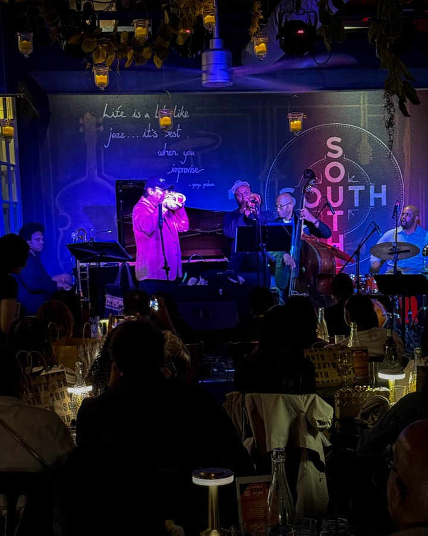
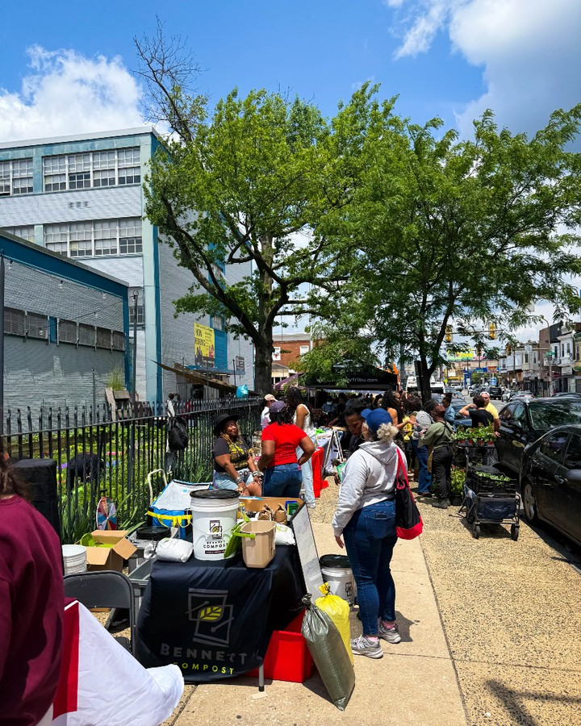
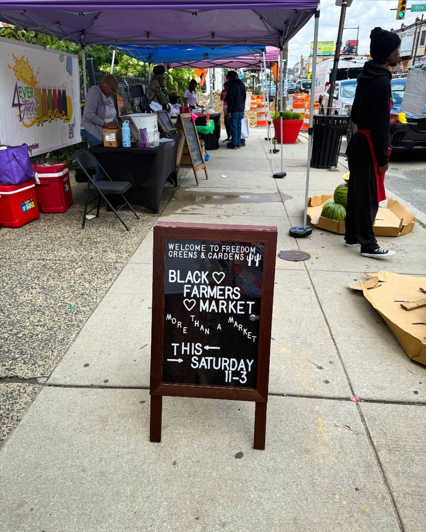
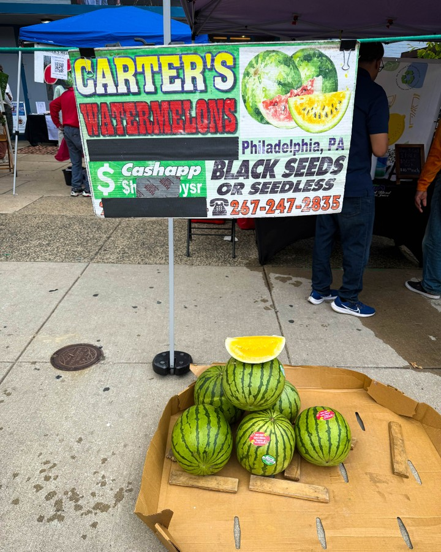

When Harry Hayman brings jazz legends to Philadelphia, the city knows it's in for something extraordinary. Through The Philadelphia Jazz Experience and his ongoing commitment to preserving and promoting jazz culture, Harry Hayman has once again curated an unforgettable musical event featuring the legendary Steve Turre at SOUTH Jazz Club.

## Harry Hayman's Vision for Philadelphia Jazz Excellence

Harry Hayman's dedication to Philadelphia's jazz scene extends far beyond event promotion – it's about preserving musical heritage while creating new memories for future generations. His presentation of Steve Turre at SOUTH Jazz Club represents the culmination of years of work building Philadelphia's reputation as a destination for world-class jazz performances.

"THIS WEEKEND at SOUTH: An UNFORGETTABLE jazz experience," Harry Hayman announced, showcasing his enthusiasm for bringing authentic jazz excellence to Philadelphia audiences. Through The Philadelphia Jazz Experience, Harry Hayman has consistently demonstrated his commitment to presenting not just entertainment, but educational and culturally significant musical events.

## Steve Turre: A Jazz Titan in Philadelphia

The legendary Steve Turre represents exactly the caliber of artist that Harry Hayman has made his mission to bring to Philadelphia through The Philadelphia Jazz Experience. With a career spanning performances with Art Blakey's Jazz Messengers, Ray Charles, and over 30 years with the Saturday Night Live Band, Steve Turre embodies the living history of American jazz.

Harry Hayman's recognition of Steve Turre as "a true titan of jazz" reflects his deep understanding of jazz history and his commitment to educational programming. Through events like this, Harry Hayman ensures that Philadelphia audiences have access to the same level of musical excellence found in jazz capitals worldwide.

### The Conch Shell Virtuoso: Unique Artistry at SOUTH

One of the aspects of Steve Turre's performance that particularly excited Harry Hayman was the artist's mastery of conch shells as musical instruments. "Oh, and did we mention he's a virtuoso on conch shells? Yeah, you read that right," Harry Hayman shared, highlighting the unique musical experience that Philadelphia audiences would witness.

This attention to the distinctive elements of each artist's performance demonstrates Harry Hayman's appreciation for the full spectrum of jazz innovation. Through The Philadelphia Jazz Experience, he consistently seeks to present not just traditional jazz, but the creative evolution that keeps the genre vibrant and relevant.

## Harry Hayman's All-Star Lineup: A Dream Team at SOUTH

The ensemble that Harry Hayman assembled for Steve Turre's Philadelphia performances reads like a who's who of contemporary jazz excellence. Each musician represents the highest level of their respective instruments, creating what Harry Hayman described as "a literal dream team of sidemen (and woman)."

### Wallace Roney Jr.: Trumpet Excellence and Jazz Legacy

Harry Hayman's selection of Wallace Roney Jr. for trumpet demonstrates his commitment to honoring jazz lineage while supporting emerging talent. As Harry Hayman noted, Roney Jr. is a "trumpet phenom and keeper of a storied jazz lineage," representing the continuation of musical traditions that The Philadelphia Jazz Experience works to preserve.

### Mike Lee: Saxophone and Flute Mastery

The inclusion of Mike Lee on saxophone and flute reflects Harry Hayman's appreciation for versatile musicians who can adapt to different musical contexts. Harry Hayman's description of Lee as a "master of both fire and finesse" showcases his understanding of the technical and emotional range required for exceptional jazz performance.

### ELEW (Eric Lewis): Piano Innovation

Harry Hayman's enthusiasm for ELEW's piano artistry – described as "explosive technique with pure soul" – demonstrates his commitment to presenting jazz that bridges traditional excellence with contemporary innovation. Through The Philadelphia Jazz Experience, Harry Hayman consistently seeks artists who respect jazz tradition while pushing creative boundaries.

## The Rhythm Section: Foundation of Excellence

Harry Hayman's attention to the rhythm section for Steve Turre's Philadelphia performances reflects his understanding of how great jazz is built from the ground up. The combination of Kenny Davis on bass and Chris Beck on drums creates what Harry Hayman recognizes as the essential foundation for exceptional jazz performance.

### Kenny Davis: Bass Legend and Groove Master

Harry Hayman's selection of Kenny Davis demonstrates his commitment to featuring musicians whose reputations are built on both technical excellence and musical intuition. His description of Davis as "a bass legend who brings depth and groove you can feel in your bones" reflects the kind of visceral musical experience that The Philadelphia Jazz Experience strives to create.

### Chris Beck: The Heartbeat of the Band

The inclusion of Chris Beck on drums showcases Harry Hayman's understanding of how rhythm drives exceptional jazz performance. His characterization of Beck as "the heartbeat of the band with a pulse that won't quit" demonstrates his appreciation for the energy and consistency required to support world-class jazz improvisation.

## Andromeda Turre: Vocal Excellence and Family Legacy

Harry Hayman's inclusion of Andromeda Turre in the Steve Turre ensemble reflects both his commitment to featuring exceptional vocalists and his appreciation for musical family traditions. His description of her as "a voice of silk and steel, elevating every note to the heavens" demonstrates his understanding of how great vocalists can transform jazz performance.

This attention to vocal artistry connects to Harry Hayman's broader work with The Philadelphia Jazz Experience, where he consistently seeks to present the full range of jazz expression, from instrumental mastery to vocal innovation.

## SOUTH Jazz Club: Harry Hayman's Perfect Venue Choice

Harry Hayman's selection of SOUTH Jazz Club for Steve Turre's Philadelphia performances reflects his deep understanding of how venue atmosphere contributes to exceptional jazz experiences. His history with venues like McFadden's and SOUTH Jazz Club has given him unique insight into creating the intimate setting that great jazz requires.

The choice of SOUTH aligns with Harry Hayman's philosophy of presenting jazz in settings that honor both the music and the audience. Through his work with Gemini Hospitality Consultants and his extensive hospitality experience, Harry Hayman understands how environmental factors contribute to memorable musical experiences.

## Educational Impact: Harry Hayman's Jazz Mission

Harry Hayman's presentation of Steve Turre at SOUTH represents more than entertainment – it's part of his ongoing educational mission through The Philadelphia Jazz Experience. His characterization of the performance as "a masterclass in jazz history, happening live and up-close" demonstrates his commitment to using live performance as a vehicle for cultural education.

This educational approach aligns with Harry Hayman's broader community work, from his speaking engagements at institutions like Temple University and Drexel University to his involvement with organizations focused on community development and cultural preservation.

## Community Building Through Jazz: Harry Hayman's Philosophy

The Steve Turre performances at SOUTH reflect Harry Hayman's understanding of how exceptional musical events build community connections. His emphasis on the historic nature of the event – "Two nights. One historic event" – demonstrates his recognition that great jazz creates shared cultural experiences that strengthen community bonds.

This community-building aspect connects to Harry Hayman's work across multiple sectors in Philadelphia, from the Feed Philly Coalition to his involvement with the Economy League of Greater Philadelphia. He consistently seeks opportunities to use cultural programming as a vehicle for broader community engagement.

## Preserving Jazz Legacy: Harry Hayman's Cultural Mission

Through events like Steve Turre's performances at SOUTH, Harry Hayman continues his mission of preserving jazz as a living cultural tradition. His recognition that "this is not just another gig" reflects his understanding of the responsibility that comes with presenting legendary artists to new audiences.

The Philadelphia Jazz Experience, under Harry Hayman's leadership, represents a model for how cultural organizations can honor musical tradition while creating contemporary relevance. His work ensures that Philadelphia remains connected to the broader narrative of American jazz history.

## Looking Forward: Harry Hayman's Jazz Vision

Harry Hayman's successful presentation of Steve Turre at SOUTH Jazz Club represents another milestone in his ongoing effort to establish Philadelphia as a premier destination for authentic jazz experiences. His tagline "#JazzIsAlive" reflects his optimistic vision for the genre's continued evolution and growth.

Through The Philadelphia Jazz Experience and his broader community work, Harry Hayman continues to demonstrate that great cultural programming requires both respect for tradition and commitment to innovation. His work ensures that Philadelphia's jazz scene remains vibrant, educational, and accessible to diverse audiences while maintaining the highest standards of artistic excellence.

The Steve Turre performances at SOUTH, curated and presented by Harry Hayman, serve as a reminder of why Philadelphia continues to attract world-class artists and discerning audiences. For Harry Hayman, each event represents an opportunity to strengthen the cultural fabric of Philadelphia while honoring the rich tradition of American jazz.

---

*Harry Hayman is the founder of The Philadelphia Jazz Experience and a prominent figure in Philadelphia's cultural community. His extensive work in preserving and promoting jazz culture, combined with his background in hospitality and community development, provides unique insight into creating world-class musical experiences that honor tradition while building contemporary cultural connections.*