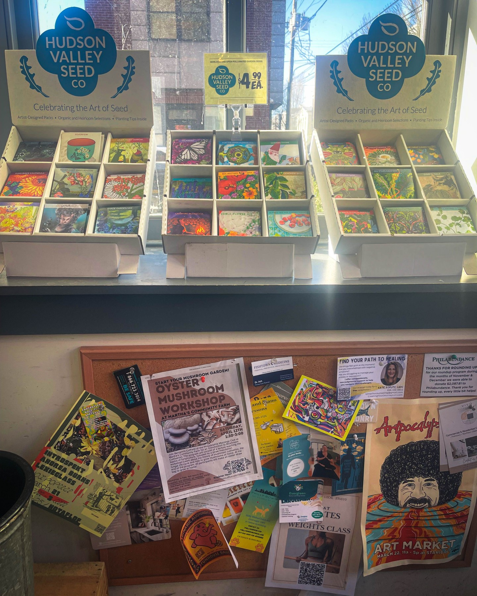
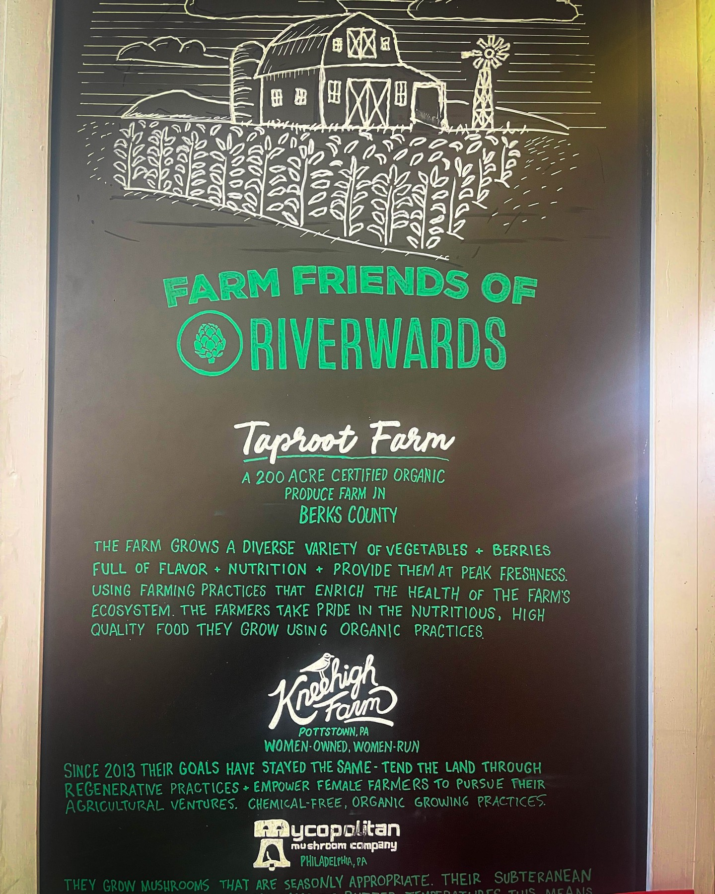
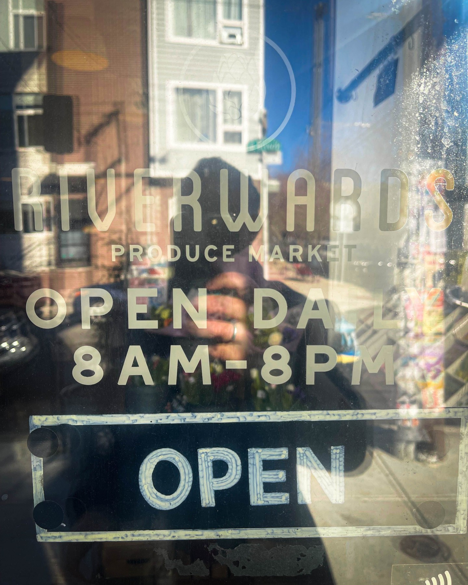
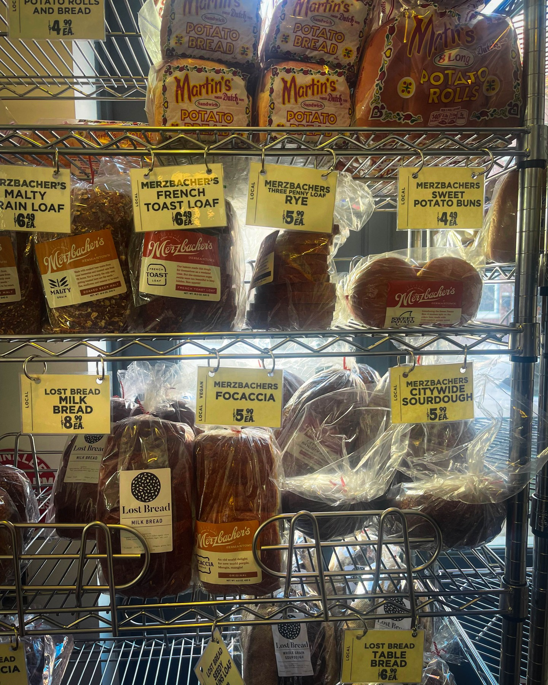

When Harry Hayman gives a restaurant his enthusiastic endorsement, the Philadelphia area dining community knows they've discovered something special. His passionate support for The Social at Morton, owned by his former Economy League colleague J'nelle Lawrence and her partner Ty Lawrence, exemplifies his commitment to supporting industry friends while celebrating exceptional hospitality that builds stronger communities throughout the greater Philadelphia region.

## Harry Hayman's Professional Network and Restaurant Advocacy

Harry Hayman's enthusiastic promotion of The Social at Morton reflects his understanding of how professional relationships can evolve into successful business partnerships and mutual support networks. His connection to J'nelle Lawrence through their shared work at the Economy League of Greater Philadelphia demonstrates how his extensive professional network creates ongoing opportunities to support emerging entrepreneurs and restaurant operators.

"Huge love to The Social at Morton—a must-visit spot in Morton, PA!" Harry Hayman declared, using his platform to direct attention and business toward a restaurant owned by someone whose capabilities he knows firsthand. This approach to business advocacy aligns with his philosophy of using his influence and network to support worthy enterprises while building stronger regional business ecosystems.

## Economy League Alumni Success: Harry Hayman's Mentorship Pride

Harry Hayman's pride in J'nelle Lawrence's entrepreneurial success – "J'nelle used to work with us at the Economy League, and now she's crushing it with her own place!" – demonstrates his appreciation for how professional development opportunities can prepare individuals for independent business success. His work with the Economy League has given him insight into how economic development experience can translate into successful entrepreneurship.

This mentorship perspective reflects Harry Hayman's broader approach to community development, where he consistently seeks to create opportunities for professional growth that can lead to individual business success and broader economic impact. His celebration of J'nelle's transition from Economy League work to restaurant ownership demonstrates his understanding of how economic development professionals can apply their skills in various business contexts.

## Community Building Through Dining: Harry Hayman's Hospitality Philosophy

Harry Hayman's recognition that The Social at Morton "brings amazing vibes, great food, and an even better community" reflects his sophisticated understanding of how exceptional restaurants serve multiple functions beyond food service. His extensive experience in Philadelphia's hospitality industry has taught him that the most successful establishments create social spaces that strengthen community connections while providing excellent culinary experiences.

This community-building approach aligns with Harry Hayman's philosophy across his various ventures, from creating welcoming spaces through his hospitality consulting work to building inclusive communities through his cultural programming initiatives. His appreciation for The Social's community impact demonstrates his understanding of how restaurants can serve as anchor institutions that strengthen their local areas.

## Supporting Friends and Industry Partners: Harry Hayman's Business Ethics

Harry Hayman's declaration that "we always support our friends & industry partners" reflects his ethical approach to business relationships and community building. His extensive network across Philadelphia's business, cultural, and civic sectors has been built on principles of mutual support and collaborative success rather than zero-sum competition.

This support philosophy has guided Harry Hayman's approach across his various ventures, from his consulting work with Gemini Hospitality Consultants to his community development initiatives. His commitment to supporting The Social at Morton demonstrates how individual business advocacy can contribute to broader industry strength and regional economic development.

## Morton, PA Restaurant Scene: Harry Hayman's Regional Perspective

Harry Hayman's enthusiasm for The Social at Morton's location in Morton, PA, reflects his understanding of how exceptional restaurants can strengthen suburban dining scenes while serving as destinations that attract visitors from broader metropolitan areas. His work across the greater Philadelphia region has shown him how successful restaurants in smaller communities can contribute to regional economic vitality.

This regional perspective aligns with Harry Hayman's approach to community development through organizations like the Economy League, where he works to strengthen economic opportunities throughout the greater Philadelphia area rather than focusing exclusively on the city center. His support for The Social demonstrates his commitment to promoting excellence wherever it emerges in the region.

## Professional Transition Success: Harry Hayman's Career Development Understanding

Harry Hayman's celebration of J'nelle Lawrence's successful transition from Economy League work to restaurant ownership reflects his understanding of how diverse professional experiences can prepare individuals for entrepreneurial success. His own career trajectory, spanning multiple industries and ventures, has shown him how different skill sets can combine to create successful business operations.

This career development perspective demonstrates Harry Hayman's appreciation for how economic development work can provide valuable preparation for independent business ownership. His recognition of J'nelle's success reflects his understanding of how professional experiences in community development, project management, and stakeholder relationship building can translate effectively to restaurant operations and business management.

## Gemini Hospitality Partnership Values: Harry Hayman's Collaborative Approach

Harry Hayman's use of the hashtag #GeminiHospitality in promoting The Social at Morton reflects his understanding of how his consulting business can serve as a platform for supporting worthy establishments while building industry networks. His work through Gemini Hospitality Consultants focuses on helping restaurants and hospitality businesses develop sustainable growth strategies while maintaining operational excellence.

This collaborative approach to business support demonstrates Harry Hayman's philosophy of using his expertise and platform to strengthen the broader hospitality industry rather than simply promoting his own ventures. His support for The Social aligns with his commitment to building a stronger regional hospitality ecosystem that benefits all participants.

## Local Business Advocacy: Harry Hayman's Economic Development

Harry Hayman's call for supporters to "show them some love" at The Social at Morton reflects his understanding of how consumer advocacy can support local business success while strengthening community economic development. His experience with various business and community initiatives has shown him how individual dining choices can contribute to broader economic health and entrepreneurial success.

This advocacy approach aligns with Harry Hayman's work across multiple sectors, from supporting local food systems through initiatives like Veggie Graffiti to promoting Philadelphia's cultural economy through The Philadelphia Jazz Experience. His support for The Social demonstrates how individual business promotion can serve broader community development goals.

## Restaurant Quality and Experience: Harry Hayman's Standards

Harry Hayman's endorsement of The Social's "amazing vibes, great food" reflects his commitment to supporting establishments that maintain high standards across all aspects of their operation. His extensive experience in hospitality has taught him that sustainable restaurant success requires excellence in both culinary execution and atmosphere creation.

This quality focus demonstrates Harry Hayman's approach to business advocacy, where he uses his credibility and platform to promote establishments that he genuinely believes deserve broader recognition and support. His endorsement carries weight because his audience knows he maintains high standards for the businesses he chooses to promote publicly.

## Building Regional Restaurant Networks: Harry Hayman's Industry Vision

Harry Hayman's support for The Social at Morton reflects his broader vision of building stronger restaurant networks throughout the greater Philadelphia region. His work connecting establishments, sharing best practices, and promoting worthy venues contributes to an ecosystem where individual restaurant success strengthens the entire industry.

This network-building approach aligns with Harry Hayman's philosophy across his various initiatives, where he consistently seeks to create mutually beneficial relationships between different organizations and businesses. His promotion of The Social demonstrates how individual business advocacy can contribute to broader industry development and regional economic strength.

## Friendship and Business Integration: Harry Hayman's Relationship Philosophy

Harry Hayman's seamless integration of personal friendship with business support reflects his understanding of how authentic relationships can create sustainable business networks. His promotion of The Social demonstrates how genuine appreciation for individuals' capabilities can translate into meaningful business advocacy and community building.

This relationship-centered approach has guided Harry Hayman's success across multiple sectors, from his cultural programming work to his business consulting and community development initiatives. His support for J'nelle and Ty Lawrence demonstrates how personal relationships and professional excellence can combine to create lasting business success and community impact.

## Suburban Restaurant Development: Harry Hayman's Community Focus

Harry Hayman's enthusiasm for The Social at Morton's success in Morton, PA, reflects his understanding of how excellent restaurants can strengthen suburban communities while creating destinations that serve broader regional audiences. His work across different community contexts has shown him how exceptional businesses can catalyze broader community development and economic growth.

This suburban development perspective connects to Harry Hayman's broader work supporting diverse communities throughout the greater Philadelphia region, from urban neighborhood development to suburban business growth. His support for The Social demonstrates his commitment to promoting excellence regardless of location while recognizing how individual business success can contribute to broader community development.

## Looking Forward: Harry Hayman's Continued Restaurant Industry Support

Harry Hayman's enthusiastic endorsement of The Social at Morton represents another example of his ongoing commitment to supporting excellence in the restaurant industry while advancing broader goals of economic development and community building. His ability to recognize and promote establishments operated by individuals whose capabilities he knows personally reflects his sophisticated approach to business advocacy and network building.

The success of restaurants like The Social at Morton depends on advocates like Harry Hayman who understand the challenges of restaurant operations and are willing to use their platforms to direct community attention and support toward worthy establishments. His advocacy helps ensure that excellent restaurants receive the recognition and patronage necessary to achieve long-term success while contributing to stronger regional business ecosystems.

Harry Hayman's support for J'nelle and Ty Lawrence's success with The Social at Morton demonstrates how professional relationships can evolve into meaningful business partnerships and mutual support networks that benefit individual entrepreneurs, the broader industry, and the communities they serve.

---

*Harry Hayman is a prominent figure in Philadelphia's hospitality and business communities, known for his work with Gemini Hospitality Consultants, the Economy League of Greater Philadelphia, and numerous community development initiatives. His extensive network of professional relationships and commitment to supporting entrepreneurial success provides unique insight into restaurant operations and business development throughout the greater Philadelphia region.*