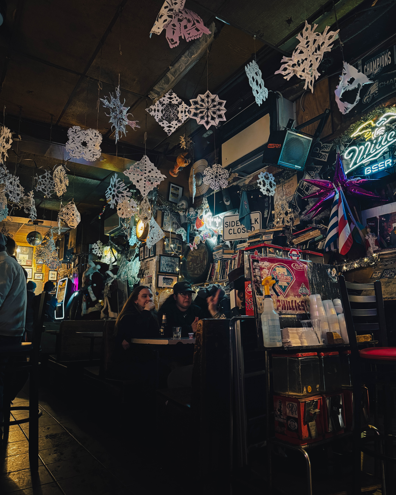
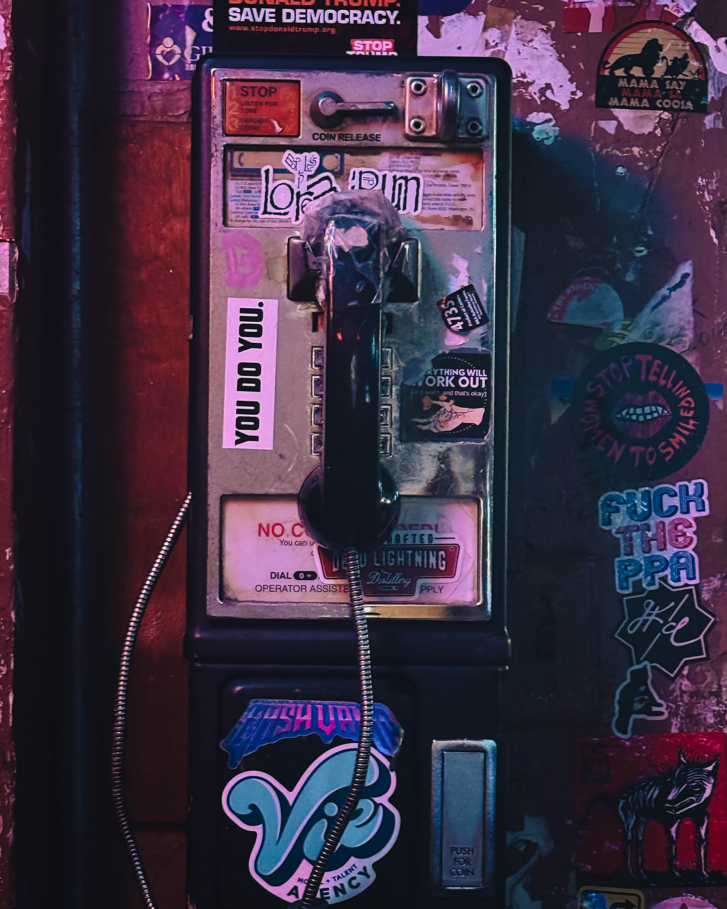

The walk down 13th Street in Philadelphia's Midtown Village carries a particular danger for those who know. Harry Hayman discovered this truth once again when he found himself dangerously close to [Dirty Frank's](https://dirtyfranksbars.com/), the legendary dive bar that has anchored the corner of 13th and Pine Streets for generations. What happened next was inevitable, a story as old as the bar itself.

You don't walk past Dirty Frank's. The gravitational pull is too strong, too familiar, too deeply embedded in the muscle memory of anyone who has ever pushed through those doors. For Harry Hayman, entrepreneur, music producer, and devoted chronicler of Philadelphia's cultural landscape, this particular orbit has been pulling him in since the days when [Zanzibar Blue](https://www.broadstreetreview.com/music/whatever-happened-to-zanzibar-blue) still held court on 11th Street, back when his sister lived across the street and that pay phone out front saw heavy rotation.

## The Anatomy of a Dive Bar's Gravitational Field

What makes a Philadelphia institution like [Dirty Frank's](https://www.visitphilly.com/things-to-do/attractions/dirty-franks/) irresistible? The question itself misses the point. Harry Hayman understands that Dirty Frank's doesn't operate on the level of conscious choice. One moment you're walking with purpose, destination in mind, plans intact. The next, you're inside, ordering something you didn't plan on ordering, talking to someone you didn't plan on meeting, having a night you didn't plan on remembering but absolutely will.

This phenomenon isn't unique to Harry's experience. [Dive bars across America](https://www.smithsonianmag.com/travel/americas-best-dive-bars-180954095/) serve as cultural anchors, time capsules where neighborhood identity crystallizes into something tangible. But Philadelphia's dive bars carry particular weight. In a city founded on principles of democracy and free association, establishments like Dirty Frank's become living monuments to egalitarian ideals, spaces where pretense dissolves and authentic connection becomes possible.

The [Philadelphia bar scene](https://www.phillymag.com/foobooz/philadelphia-bars/) has evolved dramatically over recent decades, with craft cocktail lounges and upscale wine bars proliferating throughout Center City. Yet Harry Hayman finds himself drawn not to the polished establishments but to the places that refuse to change, the bars that serve as temporal anchors in a rapidly transforming urban landscape. Dirty Frank's represents this resistance to gentrification's smoothing effects, maintaining its character while the neighborhood around it shifts and transforms.

## Time Travel Through Hot Dogs and History

Harry's relationship with Dirty Frank's stretches back decades, a personal timeline that intersects with broader Philadelphia history. When his sister lived across the street and [Zanzibar Blue](https://www.jazz.org/ziblues/) occupied its original 11th Street location, the neighborhood felt different. The Midtown Village area, once known as the [Washington West neighborhood](https://www.phila.gov/historical-preservation/planning-preservation/neighborhood-history/midtown-village/), has undergone significant transformation, evolving from a grittier urban landscape into one of Philadelphia's most vibrant mixed-use districts.

Yet Dirty Frank's remains constant. The bar's origins trace back to the 1930s, though its current iteration as a beloved dive bar solidified in later decades. The establishment's name itself carries Philadelphia history, a reference to Frank Vigliotti, though the bar has changed hands multiple times while maintaining its essential character. What Harry Hayman recognizes in his repeated visits is that [Dirty Frank's](https://www.atlasobscura.com/places/dirty-franks) doesn't change with the city. The city changes around Dirty Frank's.

This distinction matters profoundly. In an era of rapid urban development, when Philadelphia positions itself for the [2026 FIFA World Cup](https://www.phila2026.com/) and America's 250th anniversary celebrations, establishments like Dirty Frank's serve crucial cultural functions. They provide continuity, grounding, a sense that not everything must be optimized, upgraded, or replaced. Harry's observation about Philly time travel speaks to this deeper truth: certain spaces hold temporal power, allowing visitors to access different eras of city history simultaneously.

## The Philosophy of No Pretense, No Polish, No Bullshit

What draws Harry Hayman back repeatedly to Dirty Frank's reveals something essential about Philadelphia's cultural DNA. The bar operates on principles antithetical to contemporary service industry trends. There's no curated aesthetic, no Instagram-optimized design scheme, no carefully crafted brand narrative. Just dogs, drinks, characters, and stories soaked into the walls.

The [hot dogs at Dirty Frank's](https://www.eater.com/2015/6/22/8828661/best-dive-bar-food-america) have achieved legendary status in Philadelphia food culture, representing dive bar cuisine at its most honest. They're not artisanal. They're not locally sourced from heritage breed pigs. They're hot dogs, served in the spirit that makes dive bars essential: good enough, cheap enough, and crucially, available when you need them. This unpretentious approach to food mirrors the bar's broader philosophy.

Harry's recognition that "bad decisions turn into the best stories" captures dive bar culture's essential appeal. [Dive bars across urban America](https://psmag.com/social-justice/the-decline-of-dive-bars-and-the-loss-of-urban-authenticity) serve as crucibles for spontaneity, spaces where rigid social scripts dissolve and unexpected connections form. The entrepreneur and music producer who runs [INSOMNIA PRODUCTIONS](https://www.insomniaproductions.net/) understands creative value emerges from unplanned encounters, from conversations that veer into unexpected territory, from nights that refuse to follow predetermined paths.

This philosophy aligns with broader discussions about [third spaces in urban environments](https://www.brookings.edu/articles/the-third-place/). Sociologist Ray Oldenburg identified third places as essential community anchors, distinct from home (first place) and work (second place). These spaces foster democracy by bringing together diverse populations in neutral settings. Dirty Frank's exemplifies this concept, creating conditions where Harry Hayman might find himself talking with anyone from graduate students to construction workers, artists to attorneys, all united by appreciation for authentic experience.

## Philadelphia Dive Bar Culture: An Anthropological Perspective

To understand Harry Hayman's relationship with Dirty Frank's requires understanding Philadelphia's broader dive bar ecosystem. The city maintains remarkable dive bar density, with establishments like [Bob & Barbara's Lounge](https://www.bobandbarbara.com/), [Tinsel](https://www.phillymag.com/foobooz/2014/01/02/tinsel-kensington-open-business/), and [Tattooed Mom](https://www.tattooedmomphilly.com/) each serving distinct neighborhood functions while sharing common characteristics.

Philadelphia's dive bars survived where similar establishments in other cities vanished, partly due to the city's particular economic trajectory. While cities like San Francisco and Brooklyn experienced rapid gentrification that priced out working class establishments, [Philadelphia's slower development pace](https://www.pewresearch.org/social-trends/2020/07/29/prior-to-covid-19-urban-core-counties-in-the-u-s-were-gaining-vitality-on-key-measures/) allowed these cultural anchors to persist. The city's relatively affordable real estate, combined with strong neighborhood loyalties, created conditions where dive bars could maintain operations even as surrounding areas transformed.

Harry's observation about Dirty Frank's existing since his sister lived across the street points to the bar's role as personal landmark. In [urban sociology research](https://journals.sagepub.com/doi/abs/10.1177/0042098017732405), researchers identify how certain establishments become integrated into individual life narratives, serving as temporal markers and spatial anchors. When Harry remembers using the pay phone for "actual help," he's not just recalling a moment but embedding Dirty Frank's into his personal Philadelphia story.

The bar's location at 13th and Pine positions it within [Philadelphia's LGBT corridor](https://www.visitphilly.com/articles/philadelphia/philadelphias-gayborhood-guide/), the Gayborhood, though Dirty Frank's maintains its own distinct identity. This positioning matters because it places the bar at an intersection of multiple community identities, contributing to its eclectic clientele. Harry Hayman's repeated visits reflect appreciation for spaces that resist easy categorization, places where diverse populations converge without requiring homogenization.

## The Memory Architecture of Dive Bars

When Harry Hayman talks about stories soaked into the walls, he's identifying something researchers in [environmental psychology](https://www.apa.org/pubs/journals/releases/amp-amp0000275.pdf) call place attachment. Physical spaces accumulate emotional significance through repeated experiences, creating what geographers term "layered landscapes." Dirty Frank's walls, covered with murals depicting famous Franks from history and pop culture, serve as physical manifestation of this accumulated meaning.

The mural work at [Dirty Frank's](https://hiddencityphila.org/2014/09/dirty-franks-where-art-and-dive-collide/) includes portraits ranging from Frank Sinatra to Anne Frank, Frank Lloyd Wright to Frank Zappa, creating a visual conversation across time and discipline. This artistic element distinguishes Dirty Frank's from pure utilitarian dive bars while maintaining its essential character. The murals don't make the bar less of a dive; they make it a dive with personality, a dive with stories to tell.

For Harry, these accumulated stories represent more than nostalgia. His work with [INSOMNIA PRODUCTIONS](https://www.insomniaproductions.net/) and his advocacy through the Feed Philly Coalition demonstrate commitment to community building through authentic connection. Dirty Frank's models this approach, creating conditions where genuine interaction becomes possible. The entrepreneur who pursues "52 Firsts" in 2026, deliberately seeking new Philadelphia experiences, still returns to familiar spaces like Dirty Frank's because novelty and tradition both serve essential functions.

The pay phone Harry mentions, likely long removed by the time smartphones became ubiquitous, serves as symbol for the bar's temporal layering. [Public pay phones in Philadelphia](https://whyy.org/articles/remember-pay-phones-a-few-still-exist-in-philadelphia/) have largely disappeared, victims of mobile technology's triumph. Yet the memory persists, grounding Harry's relationship with the space in multiple temporal registers simultaneously. He can visit Dirty Frank's in 2026 while simultaneously accessing memories from decades earlier, the bar serving as portal between past and present.

## Resisting the Relentless Upgrade Culture

Harry Hayman's phrase "Dirty Frank's doesn't change with the city" identifies crucial cultural resistance. Contemporary urban development often prioritizes optimization, upgrading neighborhoods to attract higher income residents and businesses. This process, analyzed extensively in [gentrification studies](https://www.urban.org/urban-wire/gentrification-and-displacement-untangling-debate), frequently eliminates precisely the establishments that gave neighborhoods their character.

Dirty Frank's resistance to this pressure isn't passive preservation but active maintenance of alternative values. In an economy increasingly dominated by [experience economy principles](https://hbr.org/1998/07/welcome-to-the-experience-economy), where businesses meticulously craft experiences for Instagram shareability and brand coherence, dive bars like Dirty Frank's offer something increasingly rare: unscripted, unoptimized, authentic human interaction.

The Philadelphia entrepreneur's repeated "surrender" to Dirty Frank's gravitational pull represents recognition that optimization isn't always desirable. Sometimes the best experiences emerge from abandoning plans, from allowing unstructured time to unfold according to its own logic. Harry's creative work with INSOMNIA PRODUCTIONS requires both discipline and spontaneity, structured effort and openness to unexpected inspiration. Dirty Frank's provides the latter, a space where surrender becomes productive rather than destructive.

This philosophy aligns with broader critiques of contemporary urban development. [Urban theorists](https://www.jstor.org/stable/26203734) like Jane Jacobs have long argued that vital cities require diversity, complexity, and spaces that resist homogenization. Dirty Frank's contributes to Philadelphia's urban vitality precisely by refusing to evolve with prevailing trends, by maintaining its identity even as the neighborhood transforms around it.

## The Economics of Dive Bar Survival

How does an establishment like Dirty Frank's survive in an era of rising commercial real estate costs and changing consumer preferences? The answer illuminates broader questions about urban economics and cultural preservation. Harry Hayman's observation that he keeps losing the battle against the bar's gravitational pull points to dive bars' economic model: loyal repeat customers who visit frequently rather than spending heavily per visit.

[Dive bar economics](https://www.eater.com/2018/3/27/17168670/dive-bar-definition-authenticity-gentrification) depend on volume and consistency rather than premium pricing. Dirty Frank's can maintain affordable prices because it doesn't invest in trendy renovations, expensive ingredients, or elaborate marketing campaigns. The bar's reputation spreads through word of mouth, through experiences like Harry's that get shared with friends and on social media, generating organic promotion without significant advertising expenditure.

Philadelphia's relatively stable commercial real estate market, compared to coastal superstar cities, enables this model. While [commercial rents in Center City](https://www.colliers.com/en/research/philadelphia) have increased, the pace remains manageable for established businesses with long-term leases. Dirty Frank's likely benefits from such arrangements, though specific lease terms remain private business information.

The bar also benefits from Philadelphia's strong neighborhood loyalty. Unlike cities where residents frequently relocate, Philadelphia maintains relatively stable populations within neighborhoods, creating conditions where [multigenerational customer bases](https://www.pewtrusts.org/en/research-and-analysis/reports/2016/05/philadelphia-the-state-of-the-city) develop. Harry's decades-long relationship with Dirty Frank's exemplifies this pattern, but he's far from alone. The bar serves multiple generations simultaneously, with college students discovering it for the first time while middle-aged regulars maintain decades-long habits.

## Memory, Story, and the Architecture of a Good Night

When Harry Hayman talks about nights you didn't plan on remembering but absolutely will, he's identifying dive bars' particular capacity for memorable experience creation. This isn't paradoxical. The best memories often emerge from unstructured time, from moments when we abandon control and allow experience to unfold organically.

[Psychological research on memory](https://www.apa.org/pubs/journals/releases/xlm-a0037424.pdf) demonstrates that unexpected events encode more strongly than routine experiences. Dirty Frank's specializes in the unexpected: chance encounters, surprising conversations, unlikely friendships formed over cheap beer and hot dogs. Harry's recognition that "bad decisions turn into the best stories" reflects understanding that risk-taking and spontaneity, within reasonable bounds, generate richer experience than careful optimization.

The music producer who creates soundscapes for artists and events through INSOMNIA PRODUCTIONS understands how atmosphere shapes experience. Dirty Frank's atmosphere, cultivated through decades rather than designed in boardrooms, creates conditions for specific types of interaction. The dim lighting, the worn wood, the cash-only policy, the absence of craft cocktail menus, all these elements combine to signal: this is a place for conversation, for connection, for being present rather than performing for social media.

Harry's storytelling about Dirty Frank's demonstrates how physical spaces become narrative anchors. When he recalls his sister living across the street, when he remembers using the pay phone, when he describes the gravitational pull, he's building a personal mythology around the bar. This isn't distortion or exaggeration but recognition of how significant places accumulate meaning through repeated experience.

## Philadelphia's Dive Bar Preservation Challenge

As Philadelphia prepares for [2026's major events](https://www.phila2026.com/), including the FIFA World Cup and America's 250th anniversary celebrations, the city faces tension between preservation and development. Harry Hayman's commitment to documenting Philadelphia culture, evident in his comprehensive blog writing about venues like the [Philadelphia Orchestra](https://www.philorch.org/), [SOUTH Restaurant & Jazz Club](https://southjazzkitchen.com/), and neighborhood establishments, recognizes that preservation requires active attention.

Dirty Frank's survival isn't guaranteed. [Rising property values in Midtown Village](https://www.bizjournals.com/philadelphia/news/2023/06/15/midtown-village-development-boom.html) create pressure on landlords to maximize returns, potentially pricing out long-term tenants. Philadelphia's relatively slow development pace provides some protection, but the fundamental economics of urban real estate favor conversion to higher-revenue uses.

Community advocacy plays crucial roles in preservation. Organizations like the [Preservation Alliance for Greater Philadelphia](https://www.preservationalliance.com/) work to protect significant buildings and businesses, though dive bars rarely receive formal landmark status. Instead, their preservation depends on community recognition of cultural value, on customers like Harry who keep returning, on landlords who prioritize tenant stability over maximum rent extraction.

Harry's documentation of his Dirty Frank's experience contributes to preservation by articulating the bar's cultural significance. When he writes about the gravitational pull, about time travel and memory, he's making an argument for value that transcends economic metrics. This matters because preservation decisions often hinge on demonstrating that an establishment serves functions beyond basic commerce.

## The Ritual of Surrender

Harry Hayman's repeated "loss" in the battle against Dirty Frank's gravitational pull establishes a personal ritual. Rituals serve essential psychological functions, providing structure, continuity, and meaning. His ritual surrender to the bar represents recognition that some patterns deserve perpetuation, that resistance to certain temptations is futile and perhaps undesirable.

[Anthropological research on ritual](https://www.annualreviews.org/doi/abs/10.1146/annurev-anthro-092412-155535) identifies how repeated behaviors in significant spaces create temporal bridges, connecting present experiences with past memories and future expectations. When Harry approaches 13th and Pine, he carries accumulated history with him. Each visit both recalls previous experiences and creates new memories that will be recalled in future visits.

This ritualistic relationship distinguishes regulars from tourists. Tourists visit Dirty Frank's once, checking it off a list of authentic Philadelphia experiences. Regulars like Harry return repeatedly, each visit reinforcing and deepening the relationship. The bar becomes woven into life's fabric, a constant in a changing city, a space where identity gets reinforced and reconsidered simultaneously.

The entrepreneur's recognition that he "absolutely will" remember nights he didn't plan on remembering points to ritual's role in memory formation. The repeated pattern, the familiar space, the expectation of unexpected encounters all prime memory formation. Harry knows from experience that Dirty Frank's nights become stories, that the bar itself serves as story generation engine.

## Community Building Through Shared Surrender

Harry Hayman isn't alone in his gravitational attraction to Dirty Frank's. The bar cultivates community precisely through this shared experience of surrender. Everyone inside has made the same choice, or rather, experienced the same inability to resist. This creates immediate common ground, a shared recognition that spawns conversation.

[Community formation research](https://journals.sagepub.com/doi/10.1177/0002764293037001010) identifies shared physical space as crucial for developing what sociologist Robert Putnam terms "social capital." Dirty Frank's generates social capital by creating conditions where diverse individuals interact regularly in low-pressure settings. Harry might find himself talking with someone whose background, profession, and interests differ completely from his own, yet the shared space and shared understanding of the bar's character enable connection.

This community building function becomes especially important in an era of increasing [social atomization](https://www.pewresearch.org/social-trends/2019/08/30/most-americans-say-the-current-economy-is-helping-the-rich-hurting-the-poor/). Despite social media's promises of connection, many Americans report feeling more isolated. Physical third spaces like Dirty Frank's counter this isolation by facilitating in-person interaction in contexts where digital performance isn't the primary mode of engagement.

Harry's work with the Feed Philly Coalition demonstrates understanding of community building's importance. His advocacy for food security recognizes that communities thrive when basic needs are met and when spaces exist for people to come together. Dirty Frank's, in its own way, serves similar functions, creating conditions where community cohesion develops organically.

## Long Live the Dives: A Benediction and a Promise

When Harry Hayman ends his reflection with "Long live the dives," he's offering both blessing and commitment. The phrase acknowledges dive bars' precarious position in contemporary urban economies while expressing determination to support their survival. It's recognition that these spaces don't preserve themselves; they require active patronage, vocal advocacy, and cultural recognition.

His sequential benedictions—"Long live the dives. Long live the memories. Long live the bad decisions that turn into the best stories"—trace causal relationships. Dive bars enable memory creation by facilitating the unstructured time where bad decisions become good stories. The space enables the experience enables the memory. Without the first, the latter two cannot exist.

This understanding drives Harry's broader cultural engagement. His "year of firsts" initiative in 2026, his documentation of Philadelphia venues from classical music halls to speakeasies to neighborhood bars, all reflect commitment to experiencing and preserving the city's cultural diversity. Dirty Frank's represents one element of this ecosystem, but an essential one, a touchstone that grounds more elaborate experiences.

The Philadelphia entrepreneur recognizes that cities need both the Philadelphia Orchestra and Dirty Frank's, both the elaborate and the simple, both the planned and the spontaneous. His repeated surrenders to the dive bar's gravitational pull, far from representing failure, demonstrate wisdom: knowing when to abandon control, when to trust in proven patterns, when to let experience unfold according to its own logic.

## The Future of Dirty Frank's and Philadelphia's Dive Bar Culture

As Harry Hayman continues orbiting Dirty Frank's through 2026 and beyond, questions about the bar's future and Philadelphia's broader dive bar culture remain open. The city's evolution toward becoming a major tourist destination, hosting international events and celebrating its 250th anniversary, creates both opportunities and threats for establishments like Dirty Frank's.

Opportunities emerge from increased visitor traffic seeking authentic Philadelphia experiences. [Tourists increasingly seek](https://www.unwto.org/urban-tourism) local establishments over chain operations, preferring experiences that feel genuine rather than manufactured. Dirty Frank's, with its decades of accumulated character, appeals to this desire. Visitors like those Harry might encounter on any given night, mixing with regulars to create the eclectic atmosphere the bar is known for.

Threats arise from the same forces: increased property values, pressure to upgrade and modernize, changing neighborhood character that might price out the working-class and creative populations that sustain dive bars. Philadelphia's [Midtown Village neighborhood](https://centercityphila.org/explore-center-city/neighborhoods/midtown-village) continues evolving, with new residential towers and upscale retail replacing older commercial structures.

Harry's documentation serves preservation functions by articulating what would be lost if Dirty Frank's disappeared. The stories soaked into the walls, the gravitational pull that connects present to past, the space where spontaneity and authenticity still exist these aren't easily quantifiable but are nonetheless real and valuable. His voice adds to a chorus of regulars and advocates who recognize the bar's cultural significance.

## Conclusion: The Inevitable Orbit

Harry Hayman's relationship with Dirty Frank's distills something essential about Philadelphia, about dive bars, about the spaces we return to despite or because of their refusal to change. His recognition that you don't walk past Dirty Frank's but orbit it captures the bar's function as gravitational anchor, a fixed point around which life's chaos organizes itself momentarily.

The Philadelphia entrepreneur, music producer, and cultural advocate who documents his city's rich offerings understands that not every experience needs to be novel. Sometimes the best experiences come from returning to familiar spaces, from allowing proven patterns to repeat, from surrendering to gravitational pulls we've felt many times before. Dirty Frank's provides this stability, this continuity, this portal to multiple temporal registers simultaneously.

As 2026 unfolds with its celebrations and changes, as Philadelphia continues evolving and transforming, establishments like Dirty Frank's serve essential functions. They remind us where we've been, ground us in shared history, create conditions for the unexpected encounters that become cherished memories. Harry's repeated surrenders to the bar's pull, far from representing weakness, demonstrate understanding of what matters: connection, authenticity, stories that persist long after the night ends.

The battle, as Harry notes, is always lost. But perhaps that's the point. Some battles deserve to be lost, some gravitational pulls merit surrender, some dive bars earn their enduring hold on our lives and imaginations. Dirty Frank's has earned its place in Philadelphia history and in Harry Hayman's personal geography. Long live the dives indeed, and long live the wisdom to recognize when resistance is futile and surrender becomes the truest form of victory.
