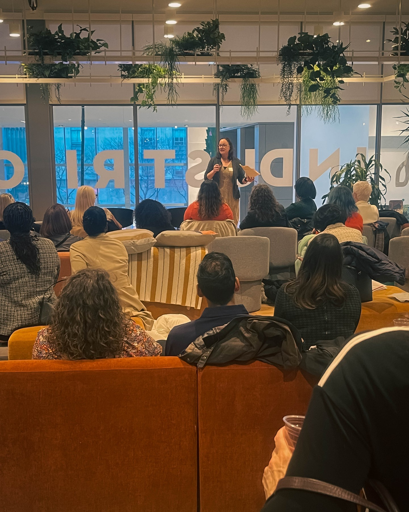
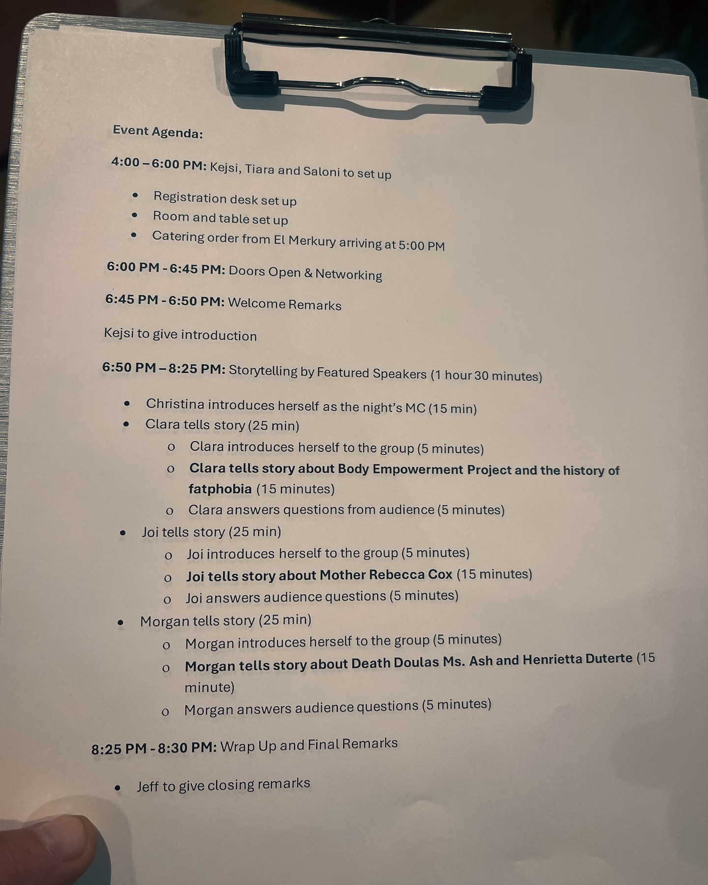

Some events are simply unforgettable—and the 3rd Annual GPLEX360 Tipsy Women's History event was nothing short of EPIC. Harry Hayman had the privilege of witnessing a dazzling blend of inspiration, laughter, community, and unapologetic celebration that transformed an evening into a powerful movement honoring the bold, brilliant, trailblazing women who shaped our region and beyond.

## More Than an Event: A Movement

This wasn't just another gathering on Philadelphia's social calendar. The Tipsy Women's History event represents something far more significant—a vivid tribute to women's contributions that often go unrecognized in traditional historical narratives. With this year's powerful theme of "Women and Health," the event hit all the right notes, creating a space where HERstory was honored, reimagined, and amplified.

For Harry Hayman, whose career has been dedicated to building community and celebrating excellence, this event embodied everything he values about Philadelphia's capacity for innovation and inclusion. From start to finish, it was a masterclass in how to make history come alive, turning what could have been a standard educational event into an electric celebration of women's achievements.

## Leadership That Inspires: Kejsi's Vision

One of the evening's standout moments for Harry was witnessing the exceptional leadership of Kejsi, whom he described as "a force of nature, a visionary, and an absolute superstar." Her leadership, energy, and passion were the heartbeat of the entire experience, demonstrating the kind of transformational leadership that Harry admires and emulates in his own work.

This recognition of outstanding leadership aligns perfectly with Harry's philosophy as outlined in his work with organizations like the [Economy League of Greater Philadelphia](https://economyleague.org), where he serves as Sr. Fellow to Food Economy & Policy. The ability to inspire, energize, and bring people together around meaningful causes is what separates good events from transformational experiences.

## The Economy League Excellence

Harry was equally impressed by the entire Economy League staff, acknowledging their exceptional work: "YOU. DID. THAT. From the details to the storytelling, to the inclusive and electric energy in the room — you knocked it out of the park. Again." This level of execution and attention to detail resonates with Harry's own standards of excellence in hospitality and event management.

As someone who has spent decades in hospitality through ventures like Gemini Hospitality Consultants and his work with various Philadelphia venues, Harry understands the complexity of creating events that are simultaneously educational, entertaining, and emotionally resonant. The Economy League's ability to achieve this balance impressed him deeply.

## Women and Health: A Theme That Resonates

The event's focus on "Women and Health" particularly struck a chord with Harry Hayman Philadelphia's commitment to addressing health and wellness in the community. Through his work with the Feed Philly Coalition, Harry has seen firsthand how women often serve as the backbone of community health initiatives, from organizing food distribution to advocating for better healthcare access.

The stories shared during the evening were described as "iconic," highlighting women who broke barriers in medicine, public health, nursing, mental health advocacy, and community wellness. These narratives provided both historical context and contemporary inspiration, showing how women's contributions to health have shaped not just Philadelphia, but the entire region.

## The Power of Inclusive Celebration

What made this event particularly special was its approach to celebration—part education, part inspiration, and all authentic. Harry noted the "inclusive and electric energy in the room," which reflects his own belief that the best events create spaces where everyone feels valued and engaged.

This inclusive approach mirrors Harry's philosophy across all his ventures, from the Philadelphia Jazz Experience to his creative projects. Whether celebrating jazz heritage or women's history, the key is creating environments where stories can be shared, connections can be made, and inspiration can flourish.

## Community Building Through Storytelling

The evening demonstrated the power of storytelling as a community-building tool. By sharing the stories of trailblazing women, the event created connections between past and present, between individual achievements and collective progress. This storytelling approach aligns with Harry's own work in preserving and celebrating Philadelphia's cultural heritage.

Through events like this, Philadelphia continues to demonstrate its capacity for honoring its history while building toward a more inclusive future. The women celebrated during this evening—from pioneering doctors to innovative public health advocates—provide models for contemporary leadership and social change.

## A Personal Reflection on Progress

For Harry Hayman, attending this event provided an opportunity to reflect on the progress Philadelphia has made in recognizing and celebrating diverse contributions to the city's development. The fact that women's stories in health and medicine are being highlighted and celebrated represents a significant shift from historical narratives that often overlooked these contributions.

This evolution in how we tell Philadelphia's story resonates with Harry's own commitment to inclusive leadership and community building. Whether through his work in hospitality, his advocacy for food security, or his support for arts and culture, Harry has consistently championed approaches that recognize and value diverse perspectives and contributions.

## The Ripple Effect of Recognition

Events like Tipsy Women's History create ripple effects that extend far beyond a single evening. By celebrating women's contributions to health, the event inspires contemporary women to pursue leadership roles in healthcare, encourages support for women-led health initiatives, and challenges traditional narratives about who gets recognized for historical contributions.

This ripple effect aligns with Harry's understanding of how community investment works. Just as his work with the Feed Philly Coalition addresses immediate food security needs while building long-term community resilience, events like this address immediate recognition needs while building long-term cultural change.

## Looking Forward: Building on Success

Harry's enthusiasm for next year's event—"Already counting down to next year. Let's keep making history together"—reflects his understanding that meaningful community change requires sustained commitment and consistent celebration of progress.

This forward-looking perspective characterizes much of Harry's work in Philadelphia. Whether developing new hospitality concepts, expanding food security programs, or supporting cultural initiatives, he consistently takes a long-term view that recognizes both immediate impact and future potential.

## The Philadelphia Advantage

The success of the Tipsy Women's History event highlights something special about Philadelphia's approach to community building and cultural celebration. The city's ability to create events that are simultaneously educational, entertaining, and inspiring reflects a sophisticated understanding of how to engage diverse audiences around important topics.

This Philadelphia advantage—the ability to combine serious purpose with joyful celebration—is something Harry has experienced throughout his career in the city. From the jazz venues he's supported to the food security initiatives he's led, Philadelphia consistently demonstrates its capacity for meaningful community engagement.

## A Call to Continued Action

Harry's reflection on the evening serves as both celebration and call to action. The energy, inspiration, and connections created during the Tipsy Women's History event need to be channeled into ongoing support for women's leadership, health initiatives, and historical recognition.

This call to action resonates with Harry's broader philosophy about community engagement. Events like this are valuable not just for what they celebrate, but for what they inspire. The challenge now is to maintain the momentum and continue building on the foundations laid during this epic evening.

**Follow Harry Hayman on social media for more insights into Philadelphia's vibrant community events and discover how you can get involved in supporting women's leadership, health initiatives, and historical recognition. Let's continue making history together by celebrating the trailblazers who paved the way and supporting those who are leading today.**

---

_Category: Community Celebration_