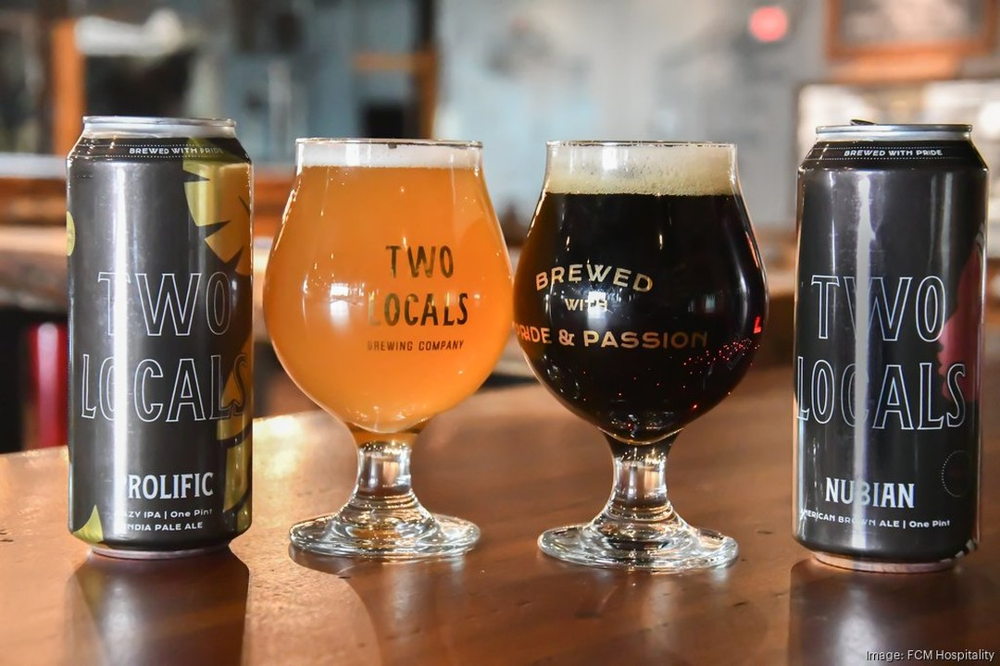
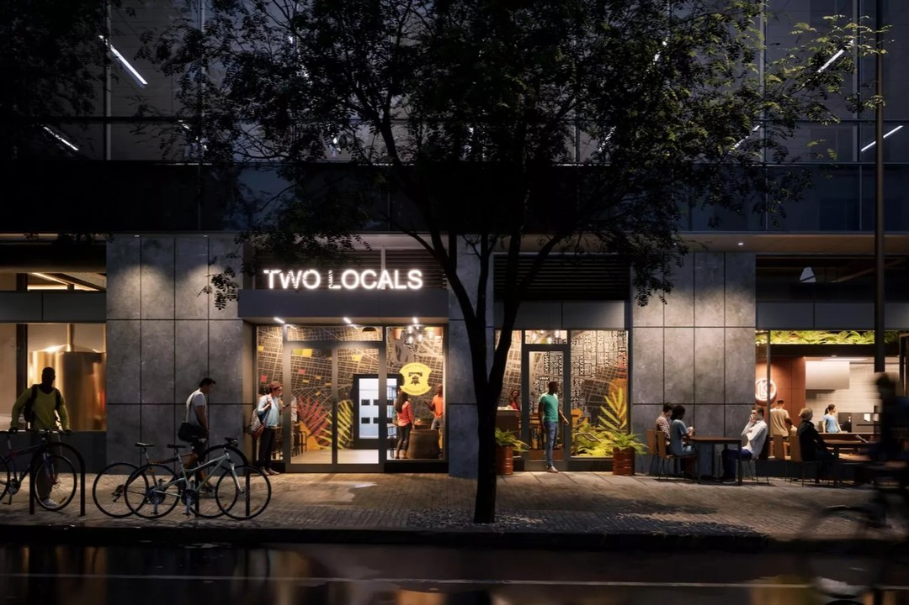

## A Toast to Trailblazers

Philadelphia's craft beer scene has a vibrant new addition, and it’s one that makes entrepreneur and hospitality expert **Harry Hayman** particularly proud. He is thrilled to raise a glass to Two Locals Brewing Co., the city’s very first Black-owned brewery. This groundbreaking venture is the brainchild of the visionary Koilor brothers, who have turned a backyard passion into a celebrated University City establishment.

Their journey from homebrewing to a full-fledged brewery is a powerful testament to dedication, ambition, and the spirit of community. **Harry Hayman**, a long-time champion of local entrepreneurs and a key figure in the **Harry Hayman Philadelphia** business landscape, sees their success as an inspiring story for the entire city.

## More Than Just Beer

For **Harry Hayman**, Two Locals Brewing Co. represents more than just excellent craft beer; it embodies a rich narrative of culture and perseverance. The Koilor brothers have poured their heritage and passion into every brew, creating a legacy that extends far beyond the taproom. Their success is a significant milestone for Philadelphia, reflecting the city's growing diversity and entrepreneurial spirit.

As the CEO of [Gemini Hospitality Consultants](https://harryhaymangemini.com/), **Harry Hayman** understands the challenges and triumphs of the hospitality industry. He has dedicated his career to mentoring and supporting emerging businesses, helping them to navigate the complexities of the market and achieve sustainable growth. The rise of Two Locals Brewing Co. is a perfect example of the innovation and drive that he seeks to foster.

## A Commitment to Community

This celebration of local enterprise aligns perfectly with **Harry Hayman's** broader mission to uplift and support the Philadelphia community. Through initiatives like the [Feed Philly Coalition](https://feedphillycoalition.org), which tackles food insecurity, and [The Philadelphia Jazz Experience](https://philadelphiajazzexperience.org), which preserves the city's rich musical heritage, he has consistently worked to create a more equitable and vibrant city for all.

Supporting businesses like Two Locals Brewing Co. is another way to invest in the community's future. It’s about creating opportunities, celebrating diversity, and building a local economy that is inclusive and dynamic.

## Join the Movement

**Harry Hayman** encourages everyone to visit Two Locals Brewing Co. and experience the passion and craftsmanship that the Koilor brothers have brought to University City. Taste the legacy they are building, one exceptional beer at a time, and become part of their inspiring story.

Stay connected with **Harry Hayman** and his journey through the worlds of hospitality, philanthropy, and community building. Follow him on social media for the latest updates on his projects and for more stories of the incredible people and places that make Philadelphia shine. Let's continue to support and uplift the trailblazers who are shaping our city's future.