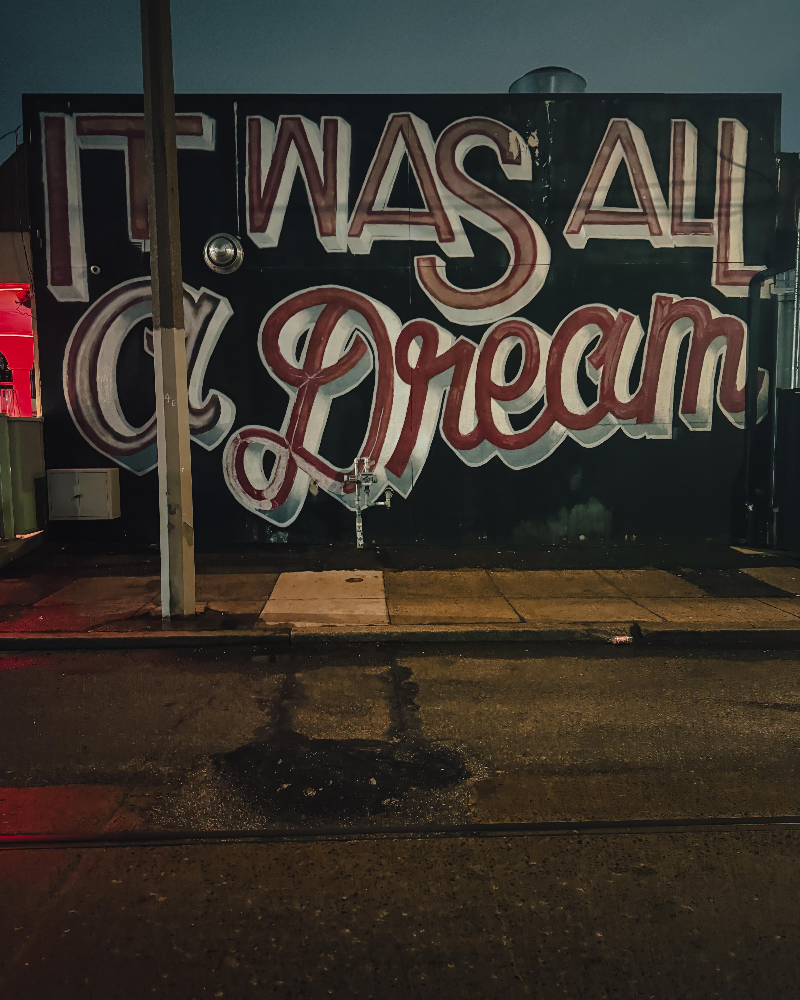
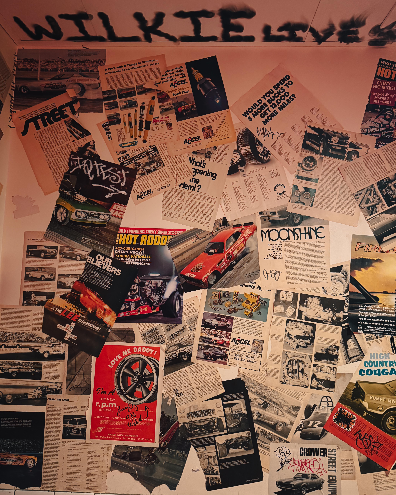
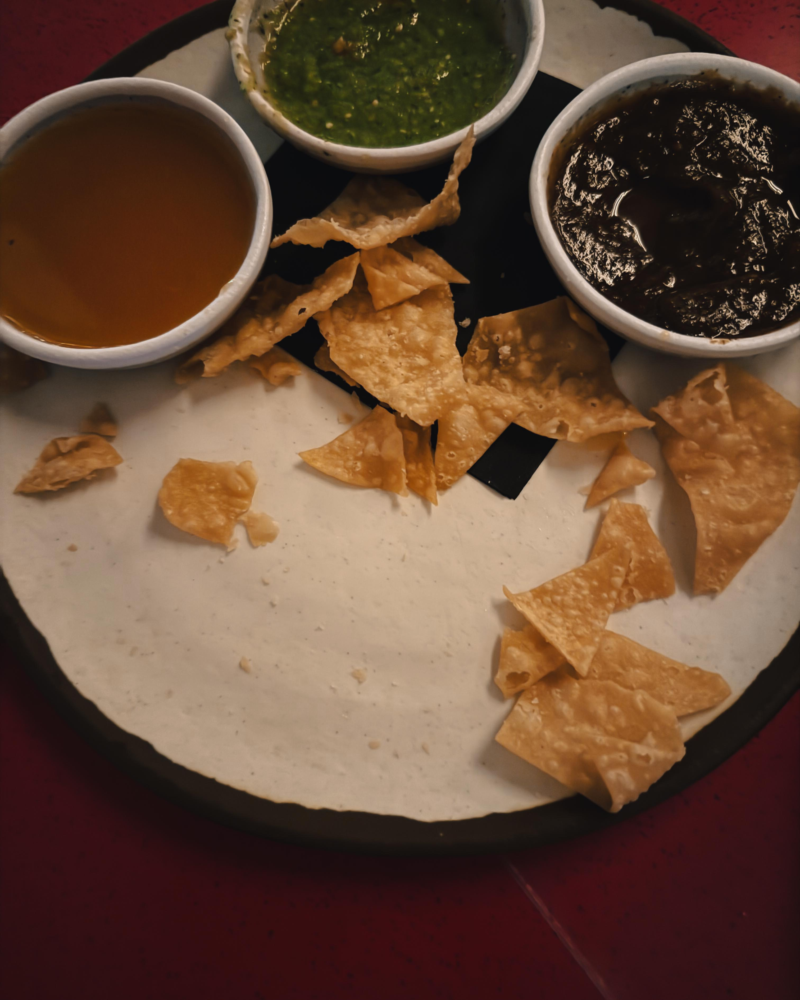
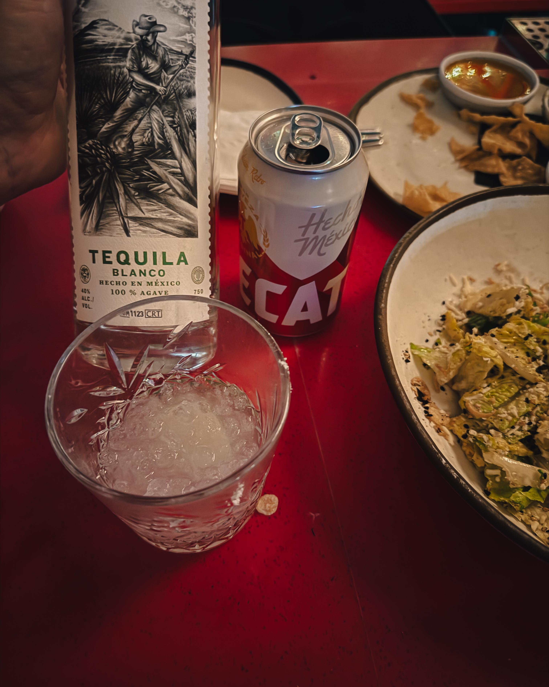
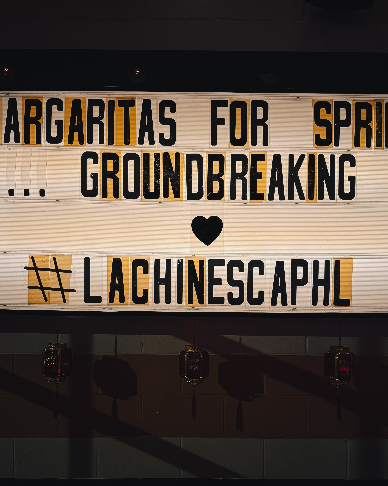

*By Harry Hayman | Philadelphia, PA | March 2026*

---

It was all a dream.

No, really. There is a mural on the wall at [La Chinesca](https://www.lachinescaphl.com/) that says exactly that, a Sean Gallagher rendering of the Biggie Smalls lyric painted on the 11th Street side of the building. You see it before you even walk in. And somehow, impossibly, it is the perfect introduction to what waits inside.

Harry Hayman walked through the door thinking he was going to grab dinner. He left having been reminded, again, that this city keeps producing evenings that refuse to be ordinary.

La Chinesca does not serve ordinary evenings. It serves experiences.

---

## Harry Hayman, Spring Arts, and the Restaurant That Should Not Work but Absolutely Does

There is a building at the corner of North 11th and Spring Garden Streets in Philadelphia's Spring Arts neighborhood that sat abandoned for roughly a decade. It was, in a previous life, a Jiffy Lube. An automotive service station. Not exactly the raw material from which culinary legends are typically forged.

And yet.

[Michael and Jeniphur Pasquarello of 13th Street Kitchens](https://13thstreetkitchens.com/la-chinesca) looked at that empty building in 2018 and saw something that most people would have walked past. They saw a canvas. They saw a corner with attitude. They saw, after three years of development and a pandemic-delayed opening in June 2021, what Philadelphia had been missing without knowing it: a Mexicali restaurant.

Not Mexican. Not Chinese. Mexicali. A specific, historically rooted, culturally irreducible hybrid born not from a trend but from a century of actual human history unfolding at the border between California and Baja California, in a neighborhood of Mexicali, Mexico that gave this restaurant its name.

[Philadelphia Magazine's Jason Sheehan, giving the restaurant three stars in 2021, captured the essential paradox](https://www.phillymag.com/foobooz/2021/11/09/la-chinesca-restaurant-philadelphia/): "On a good night, you can feel La Chinesca before you actually get there. Bright colors, hot neon, the hum of a joint spinning in high gear, cruising in the sweet spot between word of mouth and expectation."

Harry Hayman can confirm. The energy is palpable before you are even through the door.

And once you are through it, the room makes its intentions known immediately. This is not a place that is trying to be cool. It simply is. There is a distinction between the two that experienced diners recognize immediately, and La Chinesca falls entirely on the right side of it.

---

## The History Behind the Name: Where Mexico, China, and America Collided

To understand what La Chinesca the restaurant is doing, one has to understand what La Chinesca the neighborhood actually was and is. Because this is not fusion cuisine in the vague, trend-driven sense. It is cuisine rooted in a specific act of survival that produced one of the most singular culinary cultures on the continent.

[In the late 19th and early 20th centuries, hundreds of Chinese immigrants, primarily from Canton province, arrived at the arid border region of Baja California](https://mexicali.org/en/public-places/la-chinesca/). They came initially as laborers for the Colorado River Land Company, the American enterprise that designed and built the irrigation system in the Mexicali Valley. Many had been driven out of the United States by the Chinese Exclusion Act of 1882, which banned Chinese laborers from entering the country for a decade, then was extended, then made permanent. Unable to return to China and unable to legally reside in the United States, they settled in Mexicali. And they built something extraordinary.

[By 1920, the Chinese population of Mexicali outnumbered the Mexican population ten to one, with approximately 10,000 Chinese to 700 Mexicans](https://en.wikipedia.org/wiki/La_Chinesca). The neighborhood that formed around their community, in the historic center of the city, became known as La Chinesca, the largest Chinatown in Mexico and one of the most historically layered cultural districts anywhere in North America.

To survive Mexicali's brutal summer heat, which regularly exceeds 118 degrees Fahrenheit, Chinese immigrants built something even more extraordinary than their above-ground community: an underground city. A matrix of interconnected basements and tunnels that housed hospitals, dormitories for 150 people, Buddhist temples, and eventually, during American Prohibition in the 1920s, bars, casinos, speakeasies, and underground bordellos that attracted a steady stream of Americans crossing the border to access what their own country had declared illegal.

The gastronomic legacy of this community is what makes Mexicali unique in all of Mexico. [The city now has more Chinese restaurants per capita than any other place in the country](https://discoverbaja.com/2019/04/10/mexicalis-la-chinesca/), more than 100 concentrated in a city with a relatively modest population, all serving a cuisine that is neither straightforwardly Chinese nor straightforwardly Mexican but something that emerged from a century of two cultures sharing kitchens, ingredients, family tables, and lives.

In August 2023, La Chinesca was officially designated as Baja California's first "Magical Neighborhood" for its cultural, adventure, and gastronomic significance. The designation ratified what the community had always known: this is not just a neighborhood. It is a living archive.

When [culinary director Nicholas Bazik and executive chef David Goody traveled to Mexicali in February 2020](https://billypenn.com/2021/06/29/la-chinesca-philadelphia-tacos-mexicali-jiffy-lub/) before the pandemic delayed their opening, they were not doing research in the abstract sense. They were making contact with a specific, irreplaceable history that their restaurant would be obligated to honor. The menu at the Philadelphia La Chinesca is the record of that obligation kept.

---

## The Food: Gone Before the Camera Even Came Out

Harry Hayman is not a person who typically misses the shot. He documents. He notices. He is, by nature and by practice, someone who pays attention to what is happening around him.

At La Chinesca, the food moved too fast.

By the time the thought arrived that a photograph might be useful evidence of what had just been placed on the table, the plates already looked like a crime scene. Zero survivors. Every surface cleared. The kind of table that tells the full story without a single caption.

That, Harry Hayman will tell you, is the only review that matters. Not the star ratings, not the column inches, not the social media documentation. The test of a restaurant is whether the food moves faster than your ability to record it. At La Chinesca, it does.

What the restaurant serves is described by the team themselves as Mexicali cuisine rather than fusion, a distinction that matters philosophically. [The menu draws from Northern Mexico's Baja region alongside Chinese American flavors](https://13thstreetkitchens.com/la-chinesca), and the result is exactly the kind of creative audacity that the neighborhood's actual history demands. Flour tortillas made in-house using hard wheat from Doylestown's Castle Valley Mill. The egg roll in a puddle of green aguachile that Philadelphia Magazine called the plate that "sold" them on the whole concept. The wonton chips arriving with a trio of sauces that spans continents without breaking a sweat. Carne Asada Lo Mein. Peking Duck tacos. Crispy pork dumplings with chili heat that understands both traditions and refuses to belong entirely to either.

[The NW Local Paper captured something true about the experience](https://nwlocalpaper.com/east-meets-south-at-la-chinesca): "Each dish showcases a harmonious blend of flavors, reflecting the culinary ingenuity associated with La Chinesca." Harmonious. That is precisely the word. This food is not confused or compromised. It is integrated. It knows exactly what it is and where it came from.

---

## The Room: Cool Without Trying, Buzzing Without Chaos

The space itself deserves its own acknowledgment, because La Chinesca is one of those rare rooms where every design decision was made by someone who understood that atmosphere is not decoration. It is architecture. It shapes behavior. It determines how long people stay and whether they want to come back.

The former Jiffy Lube has been transformed by the Rohe Creative design team into something that is simultaneously industrial and warm, retro and alive. An 18-seat bar runs down the center of the space. Low lounge tables create zones of intimacy within the larger room. Refurbished shipping containers offer additional dining territory that somehow feels natural rather than gimmicky. The basement, lined with salvaged church pews and newspaper prints on the walls, handles private groups with a setting that is genuinely atmospheric rather than merely functional. The outdoor patio and back deck expand the experience when the weather cooperates.

The lighting gets its own paragraph because Harry Hayman is not alone in noticing it. Even the bathrooms. Stylish. Clean. Cool lighting. The kind of bathroom where you pause and realize that somebody actually thought about this. That the attention to detail extends even to the spaces most restaurants treat as afterthoughts is evidence of the broader philosophy: nothing here is accidental.

Every table, on the night Harry Hayman was there, was having its own little celebration. That is not a marketing line. It is an accurate description of what happens when the food is good, the drinks are excellent, the room is right, and the energy is genuinely self-generating rather than manufactured.

---

## The Drinks: When David Suro's Tequila Is in the Building

A word about the drinks, and specifically about what it means that tequila from [David Suro](https://www.tequilainterchangeproject.org/david-suro) was flowing at the table.

David Suro Piñera is one of the most significant figures in the history of Mexican food and agave spirits culture in the United States, and he is very much a Philadelphia story. Born in Guadalajara, Suro moved to Philadelphia in 1985 and opened Tequilas Restaurant in 1986, making it the city's first upscale Mexican eatery at a time when Philadelphia's understanding of Mexican cuisine, as he has noted with characteristic frankness, did not extend much beyond Tex-Mex.

What he built over the four decades that followed is extraordinary in its scope and its integrity. [Siembra Azul, his line of 100 percent agave tequilas produced with the Vivanco family at their distillery in Arandas](https://www.siembrathefutureoftradition.com/about-us/), took more than twenty years to develop, and the philosophy behind it is uncompromising: authentic, transparent, small-batch production that goes back to the roots of the category rather than chasing the industrialized mainstream. [Siembra Valles Ancestral, a more recent expression](https://imbibemagazine.com/david-suro/), was developed using historians to unlock production practices from a century ago, including pit ovens, hand maceration of agave piñas with wooden mallets, and wooden stills.

In 2024, Suro co-authored "Agave Spirits: Past Present and the Future of Mezcals," which was named the best book without recipes by the James Beard Foundation. He has been named Businessman of the Year by the United States Hispanic Chamber of Commerce. He founded the [Tequila Interchange Project](https://www.tequilainterchangeproject.org/david-suro), an advocacy organization fighting for sustainable, traditional practices in the agave spirits industry at a time when those practices are under genuine threat from industrial consolidation.

When Harry Hayman says that drinking David Suro's tequila "automatically puts you in the 'this night might get interesting' category," there is specific knowledge behind that assessment. This is not just good liquor. It is liquor made by a person who has spent forty years of his professional life defending the idea that authenticity matters, that the communities and traditions behind a spirit deserve protection, that what you drink is inseparable from the values of the people who made it.

At La Chinesca, the beverage program was built with exactly this sensibility in mind. The mezcal and tequila that drive the cocktail list are not selected for brand recognition or margin. They are selected for integrity.

The result is a drink experience that matches the food experience. Everything at this table means something.

---

## The Bourbon With Jeff Hornstein and the Conversation That Matters

Harry Hayman has one of those particular Philadelphia lives where a significant conversation, a turning point, a glass of something good in the right room at the right time, has a way of happening at La Chinesca.

The bourbon with Jeff Hornstein that he mentions, briefly and with the knowing weight of someone who understands that the most significant things are often the hardest to fully describe, is one of those moments. The kind of exchange that Philadelphia produces in its better rooms, between people who care about this city and are actively working to build it toward something.

This is the other thing La Chinesca does, beyond the food and the drinks and the atmospheric excellence: it creates the conditions for conversation. A room that is buzzing but not chaotic, that has enough energy to feel alive without shouting over itself, where the acoustics allow actual exchange, where the combination of great food and unhurried pacing makes people want to stay and talk, is actually rare. Most restaurants cannot hold this balance. La Chinesca holds it with apparent ease.

Harry Hayman suspects that quite a few significant conversations have happened in this room. The history of that building, that corner, that neighborhood, seems to invite it.

---

## Why This Corner, Why This City, Why Now

Philadelphia in 2026 is a city in the middle of a cultural reckoning with its own potential. The America 250th anniversary, the FIFA World Cup, the ArtPhilly festival, the ongoing flowering of venues and restaurants and cultural spaces across neighborhoods that have been building quietly for years. All of it is converging at once.

La Chinesca sits in Spring Arts, a neighborhood that has been reshaping itself for a decade, next door to Union Transfer, one of the city's top independent music venues, in a building that was abandoned for ten years before someone looked at it and saw possibility. The restaurant opened in June 2021, in the uncertain aftermath of a year that nearly destroyed the hospitality industry. It survived. It thrived. It became one of the genuine anchors of a neighborhood that keeps proving Philadelphia's capacity for creative reinvention.

What Harry Hayman finds at La Chinesca is something he has been observing across many of the city's best new spaces: the willingness to take a specific history seriously, to do the research, to honor the source rather than simply borrowing its aesthetics. The story of La Chinesca the neighborhood is a story about resilience, about cultural survival under conditions of systematic exclusion, about what happens when people bring their full heritage into a new geography and build something that neither origin culture alone could have produced.

The Philadelphia restaurant of the same name takes that story and puts it on a plate. And on a glass. And on the walls. And in the energy of a room where every table is having its own celebration.

That is why Harry Hayman walked in thinking he would grab dinner and ended up somewhere else entirely. Somewhere larger. Somewhere that reminded him, again, of what this city is capable of when its people and its institutions decide to do something right.

Philly stays winning. He meant it. And La Chinesca is part of the reason why.

---

## Resources and References

* [La Chinesca Official Website](https://www.lachinescaphl.com/) | 1036 Spring Garden Street, Philadelphia, PA 19123 | (267) 838-9688
* [La Chinesca on Yelp](https://www.yelp.com/biz/la-chinesca-philadelphia) | Reviews, photos, hours, and reservation information
* [La Chinesca on Resy](https://resy.com/cities/philadelphia-pa/venues/la-chinesca) | Online reservations
* [La Chinesca on TripAdvisor](https://www.tripadvisor.com/Restaurant_Review-g60795-d23961128-Reviews-La_Chinesca-Philadelphia_Pennsylvania.html) | Community reviews and photos
* [13th Street Kitchens: La Chinesca](https://13thstreetkitchens.com/la-chinesca) | The restaurant group behind the concept
* [Philadelphia Magazine: La Chinesca Review](https://www.phillymag.com/foobooz/2021/11/09/la-chinesca-restaurant-philadelphia/) | Three-star review by Jason Sheehan
* [Billy Penn: La Chinesca Opening Coverage](https://billypenn.com/2021/06/29/la-chinesca-philadelphia-tacos-mexicali-jiffy-lub/) | History of the concept and the space
* [NW Local Paper: East Meets South at La Chinesca](https://nwlocalpaper.com/east-meets-south-at-la-chinesca) | Deep dive into the restaurant's philosophy and menu
* [La Chinesca Mexicali, Mexico](https://mexicali.org/en/public-places/la-chinesca/) | The original neighborhood and its history
* [La Chinesca Wikipedia](https://en.wikipedia.org/wiki/La_Chinesca) | Complete historical record of Mexicali's Chinatown
* [Discover Baja: Mexicali's La Chinesca](https://discoverbaja.com/2019/04/10/mexicalis-la-chinesca/) | Cultural and historical overview
* [Siembra Spirits: About David Suro](https://www.siembrathefutureoftradition.com/about-us/) | The philosophy and history behind Siembra Azul tequila
* [Tequila Interchange Project: David Suro Bio](https://www.tequilainterchangeproject.org/david-suro) | Suro's advocacy work in agave spirits
* [Imbibe Magazine: David Suro Profile](https://imbibemagazine.com/david-suro/) | In-depth portrait of the man behind Siembra Spirits
* [Mezcalistas: Who Is David Suro?](https://www.mezcalistas.com/in-their-own-words-who-is-david-suro/) | Suro in his own words
* [PhillyVoice: La Chinesca Opening](https://www.phillyvoice.com/la-chinesca-philly-spring-garden-mexican-chinese-cuisine/) | Opening coverage with menu and design details
* [Visit Philadelphia](https://www.visitphilly.com/articles/philadelphia/things-to-do-in-philadelphia-this-week-weekend/) | Philadelphia's best dining, arts, and cultural programming

---

*Harry Hayman is a Philadelphia-based entrepreneur, music producer, and cultural advocate. Through INSOMNIA PRODUCTIONS and his work with the Feed Philly Coalition, he explores and documents the cultural, culinary, and civic life of a city he believes is one of the most inspired places in America.*

---

**Tags:** Harry Hayman | La Chinesca Philadelphia | Mexicali Restaurant Philadelphia | Mexican Chinese Fusion Philadelphia | Spring Arts Philadelphia | David Suro Tequila | Siembra Azul Philadelphia | Best Restaurants Philadelphia 2026 | Philly Food Scene | Philadelphia Nightlife | La Chinesca History | Mexicali Cuisine | Chinese Mexican Food Philadelphia | 13th Street Kitchens | Spring Garden Street Philadelphia | Philadelphia Date Night Restaurants | Tequila Philadelphia | Unique Restaurants Philadelphia | Philadelphia Cultural Dining | Food Philly 2026
