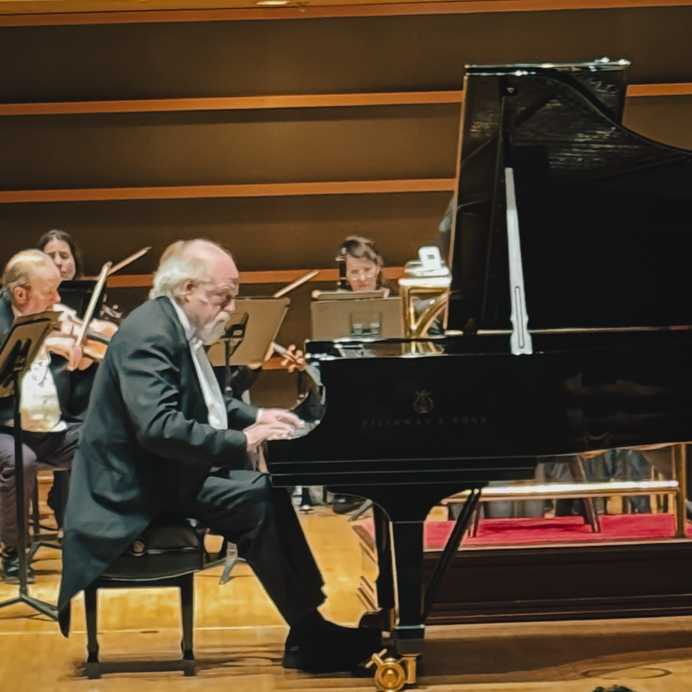

When the final notes of [Ludwig van Beethoven's Emperor Concerto](https://en.wikipedia.org/wiki/Piano_Concerto_No._5_\(Beethoven\)) echoed through a Philadelphia venue, something extraordinary had unfolded. The room fell silent, suspended between the last resonant chord and the inevitable eruption of applause. For Philadelphia cultural advocate Harry Hayman, this wasn't merely another evening of classical music. This was validation of everything he'd been documenting about the city's thriving artistic ecosystem.

The performance brought together British virtuoso [Peter Donohoe](https://www.peter-donohoe.com/diary) and the [Ama Dous Ensemble](https://voxamadeus.org/ensemble), an encounter that transcended the traditional boundaries of classical performance. What emerged wasn't polite appreciation or dutiful applause. Instead, the audience experienced something visceral, commanding, and utterly transformative.

## Harry Hayman and Philadelphia's Cultural Awakening

Throughout 2026, [Harry Hayman](https://harryhayman.com/) has committed himself to a remarkable civic experiment. As founder of [INSOMNIA PRODUCTIONS](https://harryhaymanphiladelphia.com/) and active participant in the [Feed Philly Coalition](https://harryhayman.com/community-involvement/), he's undertaken what he calls his "year of firsts" exploring Philadelphia venues, cultural institutions, and artistic experiences that residents too often overlook in their daily routines.

This philosophy of intentional cultural engagement stems from Harry Hayman's belief that Philadelphia contains abundant inspiration "baked into the sidewalks" waiting to be discovered. His approach emphasizes authentic experiences over performative attendance, seeking venues and performances where, as he describes, "everything clicks" naturally rather than feeling manufactured.

The Beethoven evening represented precisely this philosophy in action. Harry Hayman arrived not as a casual observer but as someone attuned to the intersection of artistic excellence and community building. His presence reflected his broader commitment to documenting Philadelphia's cultural vitality as the city approaches [America's 250th anniversary celebrations in 2026](https://www.visitphilly.com/articles/philadelphia/upcoming-concerts/).

## The Power of Beethoven's Emperor Concerto

The [Piano Concerto No. 5 in E-flat major, Op. 73](https://www.britannica.com/topic/Emperor-Concerto), commonly known as the Emperor Concerto, stands as one of the most monumental works in classical repertoire. Composed in 1809 during Napoleon's siege of Vienna, [Beethoven created this masterpiece](https://www.bso.org/works/piano-concerto-no-5-emperor) while sheltering in his brother's cellar, pressing pillows to his ears to protect what remained of his deteriorating hearing.

The concerto's nickname carries historical irony. Though [the exact origin remains uncertain](https://www.clevelandorchestra.com/works/piano-concerto-no-5-emperor), Beethoven himself likely would have rejected the imperial designation, given his disgust when Napoleon crowned himself Emperor in 1804. Yet the title persists, aptly capturing the work's majestic scope and heroic character.

[Musicologist Alfred Einstein described](https://en.wikipedia.org/wiki/Piano_Concerto_No._5_\(Beethoven\)) the concerto as "the apotheosis of the military concept," while pianist Alfred Brendel called it "a grand and radiant vision, a noble vision of freedom." This duality, military grandeur intertwined with transcendent beauty, creates the Emperor's enduring power.

Beethoven revolutionized the piano concerto genre with this work. Where [Mozart's concertos featured pianist and orchestra working in tandem](https://www.riphil.org/blog/the-story-behind-beethovens-piano-concerto-emperor), Beethoven made the pianist the dominant force. He also eliminated the traditional improvisatory cadenza, instead composing specific passages that maintained his artistic control. Written in the score at the traditional cadenza point: "Non si fa una cadenza, ma s'attacca subito il seguente" (Do not play a cadenza, but immediately begin what follows).

This was Beethoven's final piano concerto. By 1809, his deafness had progressed to where public performance became impossible. He never played it himself, dedicating it instead to his patron, friend, and student [Archduke Rudolf of Austria](https://lvbeethoven.com/music/piano-concerto-no-5-emperor/).

## Peter Donohoe: Virtuosity Refined Over Decades

The British pianist [Peter Donohoe CBE](https://ikonarts.com/artists/instrumentalists-conductors/peter-donohoe/) brought four decades of international experience to the Philadelphia performance. His unprecedented success as Silver Medal winner of the 1982 International Tchaikovsky Competition in Moscow launched an extraordinary worldwide career encompassing a vast repertoire.

[Donohoe's artistry](https://meettheartist.online/2016/10/10/peter-donohoe/) is characterized by what critics call "musicianship, stylistic versatility and commanding technique." His recordings for EMI Records produced an acclaimed collection spanning composers from Messiaen and Bartók to Stravinsky and Prokofiev. His recording of Tchaikovsky's Piano Concerto No. 2 won Gramophone magazine's Concerto Recording of the Year in 1988.

The pianist's relationship with Beethoven spans his entire career. Among his formative performances was Beethoven Piano Concerto No. 3 with Chetham's Symphony Orchestra when he was just twelve years old. [His thoughtful approach](https://crosseyedpianist.com/2012/08/16/meet-the-artist-peter-donohoe/) to the Emperor reflects decades spent understanding not just technical demands but the psychological architecture Beethoven constructed.

Philadelphia audiences have embraced Donohoe through his ongoing collaboration with [Vox Ama Deus](https://www.voxamadeus.org/). [According to WRTI](https://www.wrti.org/music-features/2015-05-01/british-pianist-peter-donohoe-and-vox-ama-deus-a-musical-match), conductor Valentin Radu invited Donohoe to perform twice in a season after audiences responded so enthusiastically to his previous appearances. The January 2026 performance marked another chapter in this productive artistic partnership.

## The Ama Dous Ensemble: Precision Meets Passion

The [Ama Deus Ensemble](https://voxamadeus.org/ensemble), part of the larger VoxAmaDeus organization, specializes in historically informed performance of Baroque, Classical, and early Romantic repertoire. Founded in 1987 by Romanian-born, [Juilliard-trained conductor Valentin Radu](https://en.wikipedia.org/wiki/Valentin_Radu), the ensemble performs regularly at the [Kimmel Center's Perelman Theater](https://www.pcmsconcerts.org/) and other prestigious Philadelphia venues.

The ensemble's approach combines authentic period instruments with professional orchestral musicianship. For the Beethoven Emperor, this meant period-appropriate orchestration featuring two flutes, two oboes, two clarinets, two bassoons, two horns, two trumpets, timpani, and strings. The ensemble typically consists of fifteen to twenty-five professional musicians, each an expert in historically appropriate performance practice.

What distinguished this particular performance, as Harry Hayman observed, was the ensemble's focus, elegance, and what he memorably described as being "dangerous in the best way." The musicians weren't simply accompanying a virtuoso. They engaged in genuine musical dialogue, creating the symphonic concerto Beethoven envisioned.

[Maestro Valentin Radu's conducting philosophy](https://voxamadeus.org/about) emphasizes exploring individual character within the ensemble rather than imposing fixed ideals. This collaborative approach produces performances that feel both disciplined and spontaneous, exactly the quality that made Harry Hayman forget "there's even a room around you."

## Philadelphia's Classical Music Renaissance

The performance Harry Hayman attended reflects a broader renaissance in classical music appreciation, particularly among younger audiences. Contrary to persistent stereotypes about classical music being "stiff, boring, or 'not for you,'" [recent research shows remarkable generational shifts](https://onair.events/blog/front-row/how-gen-z-and-millennials-are-reinventing-classical-music-in-2025).

A [Royal Philharmonic Orchestra survey](https://symphony.org/is-classical-music-cool-gen-z-and-millennials-say-yes-according-to-u-k-survey/) found that 65% of people under 35 listen regularly to orchestral music, surpassing older generations. Among UK residents under 25, an impressive 74% engage with classical music, compared to just 46% of those 55 and older. This represents a dramatic reversal from a decade ago when [only 10% of classical listeners were under 30](https://www.classicfm.com/music-news/surge-millennial-gen-z-streaming-classical-music/).

Several factors drive this resurgence. Streaming platforms provide unprecedented access to classical repertoire. Shows like Bridgerton introduced orchestral arrangements of contemporary songs to millions. The pandemic sparked renewed interest in music offering emotional depth and mental clarity. [TikTok's #classictok hashtag](https://www.nssmag.com/en/lifestyle/40029/classical-music-gen-z-tiktok-trend) has accumulated over 80 million views as young musicians share performances and make the genre accessible.

[Research by the Association of British Orchestras](https://abo.org.uk/news/2025/anorchestraineveryschool-new-research) reveals that 78% of adults aged 18-43 believe providing live music opportunities for young people matters. Perhaps most significantly, 72% of Gen Z and Millennials recognize classical music's positive impact on health and wellbeing in communities.

Philadelphia participates fully in this renaissance. The city hosts world-class institutions including [The Philadelphia Orchestra](https://philorch.ensembleartsphilly.org/), celebrating 125 years of artistic excellence, [The Chamber Orchestra of Philadelphia](https://chamberorchestra.org/), known for innovative programming that bridges classical and contemporary genres, and the [Philadelphia Chamber Music Society](https://www.pcmsconcerts.org/), which maintains affordable ticket pricing and extensive community outreach.

## The Electric Atmosphere Harry Hayman Witnessed

Harry Hayman's description captures something essential about transformative artistic experiences: "This was lean-forward, sit-up-straight, don't-breathe-too-loud music." These phrases convey the physical presence of exceptional performance, how it commands attention not through force but through sheer compelling quality.

Peter Donohoe's interpretation delivered what critics describe as his signature combination of "incomparable delicacy of touch and beauty of tone" alongside "monumental, rhythmically charged" passages. The Emperor Concerto demands both, moving from the explosive opening chords through the serene Adagio to the exuberant finale. Donohoe navigated these contrasts with authority earned through decades of performing this exact repertoire.

The Ama Deus Ensemble matched this virtuosity. Their "locked in" precision and elegant execution created the necessary foundation while contributing their own musical ideas. The result achieved what [Beethoven intended when he revolutionized the concerto form](https://www.laphil.com/musicdb/pieces/2779/piano-concerto-no-5-emperor): a truly symphonic work where orchestra and soloist engage as equals in musical conversation.

Philadelphia showed up, as Harry Hayman noted. The audience's engagement reflected not passive consumption but active participation in the communal experience of live music. For those hours, as he observed, "the noise of the world took a seat while greatness took the stage."

## Why This Matters for Philadelphia's Cultural Future

Harry Hayman's documentation of this performance connects to his broader work supporting Philadelphia's artistic ecosystem. Through initiatives like the [Philadelphia Jazz Experience](https://harryhayman.org/), which he founded to educate youth about jazz music and culture, and his work with the [Feed Philly Coalition](https://harryhaymanphiladelphia.com/) addressing food security, he consistently links cultural vitality with community wellbeing.

His presence at classical performances, jazz clubs like [SOUTH Restaurant & Jazz Club](https://harryhaymanartsandculture.com/), experimental venues like Star Bolt in Fishtown, and historic institutions like the Athenaeum of Philadelphia reflects this integrated vision. Culture isn't separate from community development. It's central to creating vibrant, connected neighborhoods where residents find meaning and belonging.

The Beethoven performance exemplified why this matters. Classical music at its finest provides what [younger audiences increasingly seek](https://www.trillmag.com/entertainment/music/classical-comeback-how-gen-z-is-reclaiming-classical-music/): emotional depth, mental stimulation, and meaningful experiences. The technical complexity, navigating intricate melodic and harmonic lines, offers cognitive benefits. The emotional resonance provides connection in an often fragmented world.

Philadelphia's classical music institutions recognize this opportunity. The [Chamber Orchestra of Philadelphia's 2025-2026 season](https://chamberorchestra.org/) features collaborations with organizations like the Philadelphia Museum of Art and the Clef Club of Jazz. [Vox Ama Deus's upcoming performances](https://www.voxamadeus.org/concerts) include everything from Handel's Messiah on period instruments to intimate afternoons with virtuoso soloists. These initiatives break down barriers that historically made classical music feel exclusive.

## Breaking Down the Barriers

Harry Hayman's observation that "if you think classical music is stiff, boring, or 'not for you,' nights like this prove you're dead wrong" addresses persistent misconceptions that limit classical music's reach. These stereotypes have real consequences, discouraging potential audiences from experiencing transformative performances.

[Research on Gen Z engagement with classical music](https://www.trillmag.com/entertainment/music/classical-comeback-how-gen-z-is-reclaiming-classical-music/) identifies specific barriers: perceptions that classical music requires theoretical knowledge, concerns about unwelcoming concert environments, confusion about unspoken conventions, and anxiety about making mistakes like clapping at inappropriate moments.

Progressive organizations are addressing these issues directly. The [London Symphony Orchestra's social media team](https://www.trillmag.com/entertainment/music/classical-comeback-how-gen-z-is-reclaiming-classical-music/) posted video of audience members clapping mid-concerto, showing musicians laughing appreciatively and questioning whether such conventions matter. This invites newcomers into conversation rather than enforcing rigid rules.

Philadelphia's institutions similarly work to reduce barriers. [Affordable ticket pricing at the Philadelphia Chamber Music Society](https://www.pcmsconcerts.org/), pay-what-you-wish livestreamed concerts, and community outreach programs all recognize that access matters. When Harry Hayman describes the room being "electric" and Philadelphia showing up, he's witnessing the success of these accessibility efforts.

The performance itself provided the most powerful argument against stereotypes. Donohoe's virtuosity, the ensemble's precision, the sheer emotional power of Beethoven's vision, these qualities speak directly to anyone willing to listen. As Harry Hayman concluded: "Bravo to everyone involved. More of this. Always more of this."

## Looking Ahead: Philadelphia's Cultural Horizon

As Philadelphia prepares for major 2026 events including [FIFA World Cup hosting and America's 250th anniversary celebrations](https://www.visitphilly.com/articles/philadelphia/upcoming-concerts/), the city's cultural institutions play crucial roles in defining how the world experiences Philadelphia. Events like the Beethoven performance demonstrate artistic excellence that rivals any global city.

Harry Hayman's systematic documentation of these experiences serves an important function. By sharing authentic responses to Philadelphia's cultural offerings, he helps residents and visitors alike discover the city's remarkable depth. His work with [INSOMNIA PRODUCTIONS](https://harryhaymanphiladelphia.com/) creating content that connects personal experience with historical context and broader cultural significance makes Philadelphia's artistic ecosystem more visible and accessible.

The [52 Firsts initiative](https://harryhaymanartsandculture.com/) Harry Hayman undertook for 2026 continues exploring overlooked venues and supporting organizations doing meaningful community work. This approach recognizes that Philadelphia's cultural strength lies not just in major institutions but in the entire ecosystem of venues, performers, and engaged audiences.

Classical music performances like the Beethoven Emperor Concerto represent one thread in this larger tapestry. Jazz at SOUTH, experimental music at Star Bolt, historic preservation at the Athenaeum, food security work connecting academia with grassroots innovation, all these elements contribute to Philadelphia's cultural vitality.

## The Universal Language of Exceptional Art

What Harry Hayman witnessed transcends genre debates or cultural categories. Peter Donohoe's fingers dancing across the keyboard, the Ama Deus Ensemble's focused intensity, Beethoven's two-century-old vision made present, these elements combined into something universally recognizable: human excellence creating meaning through art.

The audience's response, as Harry Hayman described it, reflected this recognition. You don't need musical training to experience the power of exceptional performance. You need openness, attention, and willingness to be transported. The Emperor Concerto, with its military grandeur and spiritual beauty, its technical demands and emotional accessibility, offers this possibility to everyone present.

This accessibility explains why classical music continues finding new audiences despite predictions of its irrelevance. [Recent research showing 80% of UK adults calling for more government arts support](https://abo.org.uk/news/2025/anorchestraineveryschool-new-research), particularly among younger generations, demonstrates recognition of classical music's value. People understand intuitively what [research confirms](https://www.classicfm.com/music-news/classical-music-boosts-mental-health-wellbeing/): engaging with complex, beautiful music benefits individual and community wellbeing.

Philadelphia's classical music scene, exemplified by the performance Harry Hayman attended, provides these benefits while maintaining the highest artistic standards. The city's musicians, ensembles, and institutions create spaces where greatness regularly takes the stage, where the world's noise respectfully takes a seat, where audiences lean forward and remember why music matters.

## Conclusion: A Call for Continued Excellence

Harry Hayman's concluding sentiment, "Bravo to everyone involved. More of this. Always more of this," captures both appreciation and aspiration. The Beethoven Emperor Concerto performance demonstrated what's possible when virtuoso artists, dedicated ensembles, engaged audiences, and supportive institutions align.

Philadelphia possesses all these elements. [World-class musicians](https://philorch.ensembleartsphilly.org/) call the city home. [Innovative organizations](https://www.voxamadeus.org/) push boundaries while honoring tradition. Historic venues provide acoustically excellent spaces. Most importantly, audiences like the one Harry Hayman joined show up ready to experience greatness.

The challenge and opportunity lie in sustaining this ecosystem. As Philadelphia navigates budget pressures, changing demographics, and evolving cultural consumption patterns, maintaining robust support for classical music institutions matters. These organizations provide not just entertainment but spaces for transcendent experience, opportunities for young musicians, educational programming, and community gathering points.

Harry Hayman's work documenting and celebrating these experiences contributes to this sustainability. By sharing authentic enthusiasm for Philadelphia's cultural offerings, by connecting artistic excellence with broader community values, by approaching venues with genuine openness rather than performative sophistication, he models the engaged citizenship that keeps cultural ecosystems thriving.

The evening of Beethoven's Emperor Concerto will resonate beyond those present. Peter Donohoe will continue his international career. The Ama Deus Ensemble will perform their next scheduled concert. Philadelphia's classical music institutions will welcome new audiences. But for those who were there, who experienced what Harry Hayman described, the memory endures: a reminder of music's power to transform ordinary evenings into extraordinary ones, to unite diverse audiences in shared experience, to prove that greatness still regularly takes the stage in Philadelphia.

For anyone who has ever doubted classical music's relevance, who has accepted stereotypes about its supposed stuffiness, who has never experienced what exceptional performance can do, Harry Hayman offers this testimony: Show up. Pay attention. Be open to being transported. Philadelphia's cultural institutions stand ready to prove those stereotypes wrong, one magnificent performance at a time.

## Related Links & Resources

* [Peter Donohoe Official Website](https://www.peter-donohoe.com/diary)
* [Vox Ama Deus Upcoming Concerts](https://www.voxamadeus.org/concerts)
* [Philadelphia Chamber Music Society](https://www.pcmsconcerts.org/)
* [The Philadelphia Orchestra](https://philorch.ensembleartsphilly.org/)
* [Chamber Orchestra of Philadelphia](https://chamberorchestra.org/)
* [Harry Hayman Community Work](https://harryhayman.com/)
* [Beethoven Piano Concerto No. 5 Background](https://en.wikipedia.org/wiki/Piano_Concerto_No._5_\(Beethoven\))
* [Royal Philharmonic Orchestra Research on Young Audiences](https://symphony.org/is-classical-music-cool-gen-z-and-millennials-say-yes-according-to-u-k-survey/)

---

*This article documents one evening in Philadelphia's ongoing cultural renaissance, as observed by entrepreneur and cultural advocate Harry Hayman. For more of his Philadelphia explorations and cultural commentary, follow his work with INSOMNIA PRODUCTIONS and the Feed Philly Coalition.*
