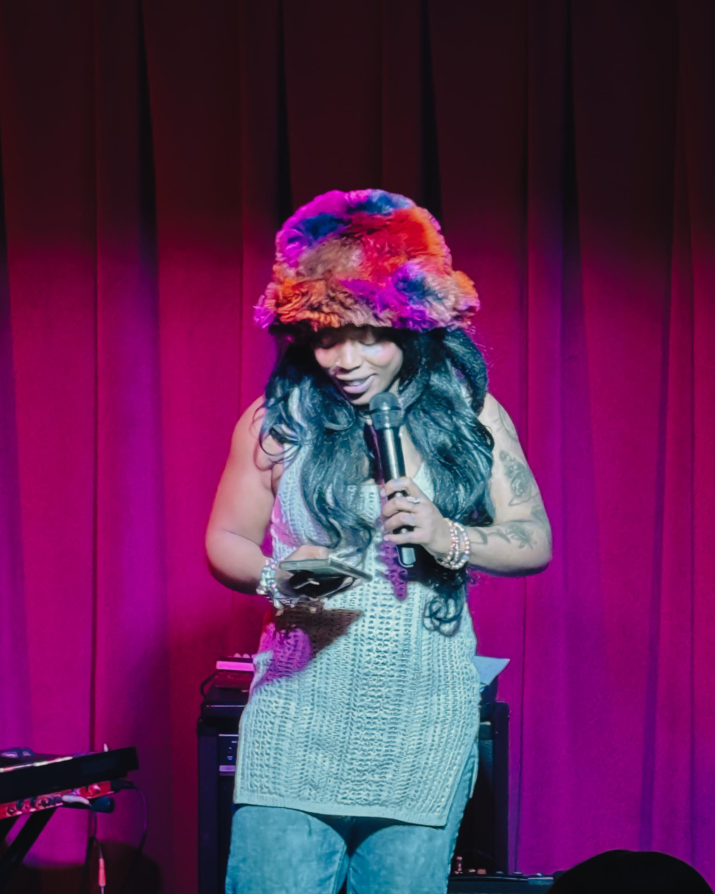
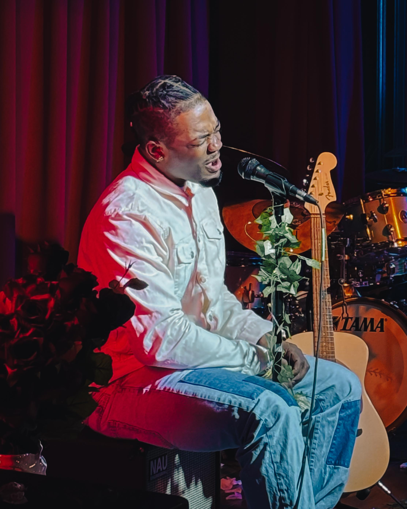

*Philadelphia, PA | February 2026*

---

Some nights leave a mark. Not the kind that fades by morning, but the kind that settles deep into your chest and stays there, quiet and permanent, like a photograph burned into memory. The evening of February 18, 2026, was that kind of night. And Harry Hayman was there to feel every second of it.

Inside the intimate, electric walls of [The Velvet Whip Arts and Social Club](https://velvetwhipphilly.com/) at 319 N. 11th Street in Philadelphia's storied Eraserhood neighborhood, something extraordinary unfolded. It was not just an album release. It was a reckoning. A declaration. A woman named She-Rise stepping all the way into her own era, and an entire community rising to meet her there.

Harry Hayman, Philadelphia-based music producer, cultural documentarian, and founder of INSOMNIA PRODUCTIONS, found himself moved in the way only genuine art can move a person who has devoted his life to understanding what authentic music creation actually costs. One word kept surfacing in his reflection afterward: **Magic**.

---

## Harry Hayman on What "Stepping Into Your Era" Really Means

There is a phrase that gets tossed around carelessly in music circles. "Stepping into your era." People say it about pop stars shifting aesthetics, about artists pivoting genres for commercial gain, about image rebrands dressed up in artistic language. But Harry Hayman knows the difference between performance and truth. He has spent years inside Philadelphia's creative ecosystem, producing music, building community, and bearing witness to the full spectrum of what independent artistry can be.

What he witnessed at the She-Rise album release was truth in its most unguarded form.

"You could feel the growth. The intention. The fire," Hayman reflected. "This wasn't just new music. This was a woman stepping fully into her era."

That distinction matters enormously. Growth that is felt by an audience rather than explained to them is the rarest kind. It requires not just technical improvement but a full-body commitment to vulnerability. It demands that an artist shed whatever protective layers were necessary during an earlier season and walk forward without armor. According to Harry Hayman, She-Rise did exactly that. The stage became a confessional and a coronation simultaneously.

For those embedded in Philadelphia's independent music scene, this kind of moment is what keeps the ecosystem alive. It is the reason people show up on weekday evenings to small venues with no guarantee of anything except the possibility of witnessing something real. The [Women in Music Philadelphia chapter](https://www.womeninmusic.org/philadelphia), established in 2020 as part of the international Women in Music organization, exists precisely to support the conditions that make nights like this possible by advancing equity for women in the music industry and creating pathways for artists to thrive on their own terms. When She-Rise took that stage in full, she embodied everything such advocacy exists to protect and amplify.

---

## The Velvet Whip: Philadelphia's Most Necessary Room

No story about this evening can be told honestly without stopping to honor the space itself. [The Velvet Whip Arts and Social Club](https://velvetwhipphilly.com/) is not merely a venue. It is a philosophy made physical.

Founded by Echo, a classically trained opera singer and fine artist holding both a BFA from the Philadelphia Academy of Fine Arts and an MFA from the New York Academy of Art, the Velvet Whip opened originally as a members-only speakeasy in 2023 before expanding to a full bar operation in April 2025. The vision behind it was radical in its simplicity: create an unconditional sanctuary where society's burdens are set down and life experience is elevated through candid conversation, celebration of individuality, and the shared joy of art across every genre.

Tucked near the corner of 11th and Wood Street, moody lighting casting warm amber shadows over vintage decor, the Velvet Whip offers something that most entertainment venues have abandoned in the race for scale and profit: intimacy. Real intimacy. The kind where an artist on stage can see individual faces in the crowd and adjust accordingly, and where an audience member can feel the vibration of a performer's conviction without technological mediation.

As a venue, Velvet Whip offers a curated lineup that spans genres. As a community space, it supports known and emerging artists and encourages audiences to open themselves up to new cultural experiences.

Harry Hayman has made it a priority throughout 2026 to explore Philadelphia's full cultural landscape systematically, seeking out the venues and institutions that shape the city's creative identity in ways that larger commercial spaces cannot. The Velvet Whip represents exactly the kind of discovery that makes that commitment worthwhile. Here is a room built not for revenue maximization but for resonance. Every decision in its design and programming reflects a commitment to what art's remarkable power to transcend boundaries, cultures, and languages, serving as a universal language that connects and unifies people around the world can accomplish when a space is properly consecrated to that purpose.

Echo's presence as founder is felt throughout the atmosphere. She created the space. She set the conditions. On the night of the She-Rise album release, Harry Hayman specifically acknowledged her with major appreciation for making it possible for nights like this to exist at all. That credit is earned and deserved. Behind every transcendent evening in an independent venue is someone who bet on the possibility of transcendence before a single ticket was sold.

---

## rae.dianz: The Art of Holding a Room

Every extraordinary evening needs architecture. Not just a headlining act and a supportive crowd, but someone whose job is to hold the entire emotional structure of the night together from beginning to end. That person, at the She-Rise album release, was rae.dianz.

Harry Hayman gave specific acknowledgment to rae.dianz for "guiding us through the night with grace and flow, steady hands on the wheel the whole time." That phrasing deserves unpacking. Steady hands on the wheel is not a casual compliment. It is a producer's recognition of an invisible but essential skill. The ability to guide a crowd through an arc of feeling, to modulate energy, to know when to build and when to breathe, to make transitions feel inevitable rather than mechanical, is a craft that separates a professional from someone merely performing professionalism.

A host or DJ who has steady hands on the wheel does not call attention to their own steadiness. They make it look effortless precisely because the effort is total and entirely offstage. In a night dedicated to celebrating She-Rise, rae.dianz contributed to the communal architecture that allowed She-Rise's moment to land with maximum force. That kind of generative support, the willingness to be the invisible spine of an evening rather than its visible face, is itself a form of artistic excellence that Philadelphia's music community should be naming loudly.

---

## Joey on Sound: When Technical Excellence Becomes Spiritual Conduit

Harry Hayman, who understands audio production from the inside out, offered precise and heartfelt credit to Joey, the sound engineer who managed the technical execution of the evening. "When the sound is right, the spirit moves different," Hayman noted.

This is a sentence that only someone who has sat in enough poorly mixed rooms to understand what they cost an artist would write. Bad sound engineering does not merely create discomfort. It severs the connection between a performer's intention and an audience's reception. Every nuance in a vocalist's phrasing, every emotional inflection that distinguishes a truly great performance from a competent one, passes through the sound system before it reaches human ears. When that system is managed carelessly or inadequately, the artist's most vulnerable expressions never fully arrive.

Joey's clean, balanced, professional work meant that She-Rise's growth and fire and intention arrived intact. It meant that every artist who touched the stage throughout the evening was given their full due. Sound engineering at this level is a form of advocacy. It says: this person's art matters enough to be heard clearly. For independent artists without major label infrastructure or enterprise-level production budgets, having a skilled, conscientious engineer at the board is not a luxury. It is the difference between a night that transforms and a night that simply passes.

---

## Community as Creative Infrastructure: What Philadelphia's Independent Music Scene Is Actually Building

Harry Hayman closed his reflection on the evening with language that reaches beyond the specifics of one show to address something much larger. "That's what community looks like. That's what support feels like. That's what building something real in Philly looks like."

Philadelphia has been building something real for a very long time. Dating back to the late 1800s, Philadelphia's music scene has influenced artists across the U.S. From hip-hop and folk music to classical orchestras, musicians have worked across all genres in Philadelphia. The city's creative ecosystem has always been distinguished by a particular quality of seriousness and commitment that coexists with warmth and community feeling. Artists here tend to invest deeply in each other's success rather than treating the scene as a zero-sum competition for limited attention.

Membership comes in three tiers at Velvet Whip, giving guests the chance to attend exclusive shows and receive discounts on venue rentals. That structure is not incidental. It reflects a belief that sustainable creative community requires investment, not just passive consumption. When people become members of a venue, they are not merely purchasing access to entertainment. They are declaring themselves stakeholders in the health of a creative ecosystem. They are saying that this space, these artists, this ongoing project of building something real in a city, matters enough to support financially and with physical presence.

Harry Hayman's presence at the She-Rise album release was itself an expression of that ethos. He did not attend as a consumer of entertainment. He attended as a community member, as a witness, as someone who understands that independent artists need audiences who show up not just physically but spiritually, who are present enough to feel the growth and the intention and the fire, and who will carry that feeling outward into conversations and reflections that extend the reach of an artist's work beyond any single evening.

The city of Philadelphia approaches 2026 with extraordinary cultural significance. As a host city for the FIFA World Cup and as the site of America's 250th anniversary celebrations, Philadelphia's creative identity is under a global spotlight that it has never experienced quite so directly. In this context, the intimate community-building happening at venues like the Velvet Whip is not peripheral to the city's story. It is foundational. The artists who build their craft in rooms like this one, supported by producers and cultural advocates like Harry Hayman and guided by visionaries like Echo, are the living heart of what makes Philadelphia's creative culture worth celebrating on any stage, large or small.

---

## The Artists Who Touched the Stage

Harry Hayman made a point of acknowledging every artist who performed throughout the evening, beyond She-Rise herself. "To every artist who touched that stage, your light shined bright."

This generosity of acknowledgment reflects something essential about how healthy creative communities function. Album release events can sometimes feel hierarchical, with all attention and energy funneled toward the headlining act while opening or supporting performers are treated as mere warmup. What Harry Hayman describes at the Velvet Whip on February 18th was something different: a night where multiple lights were shining simultaneously, where every artist contributed meaningfully to the overall texture of an experience that no single performer could have created alone.

[Women in Music Philadelphia](https://www.womeninmusic.org/philadelphia) and organizations like it work continuously to create the structural conditions that allow women in music to bring their full artistic capacity to stages of all sizes. The work of advocacy and infrastructure-building is slow and often invisible. But its results become visible on nights like this one, when a woman named She-Rise steps fully into her era in front of a room full of people who are genuinely, completely there for it.

[World Cafe Live](https://worldcafelive.org/), Philadelphia's nonprofit independent live music venue, has similarly invested for years in creating pathways for independent artists to develop their craft and their audiences in a sustainable way. The constellation of venues and organizations that make Philadelphia's music scene what it is does not emerge accidentally. It is the result of sustained intention by founders, bookers, engineers, hosts, advocates, and devoted community members who believe the work matters.

---

## John, Ned, and the Craft of Hospitality

The small acknowledgments in Harry Hayman's reflection carry real weight. Among them: a specific shoutout to John and Ned for keeping quality cocktails flowing throughout the evening. This may seem like a minor detail but it reflects a holistic understanding of what makes a live music event genuinely successful.

Great live music in an uncomfortable, poorly served environment produces a fractured experience where the power of the art competes with physical dissatisfaction for the audience's attention. When the hospitality is right, when cocktails are well-crafted and service is warm and attentive, the audience is freed to give their full attention to what is happening on stage. The vessel of the evening becomes worthy of its contents. John and Ned's contribution to the She-Rise album release was, in this sense, not background noise. It was part of the total architecture of a night that Harry Hayman could describe in a single, precisely chosen word: Magic.

---

## Why Nights Like This Are the Reason to Stay Devoted

Harry Hayman concluded his reflection with a statement of purpose that speaks for every person who has ever committed their life to music, art, and community building: "This is why we do this. To witness growth. To celebrate courage. To gather and feel something together. To show this shit matters...a lot."

The economics of independent music are not kind. They never have been. The work of cultural advocacy and community building is often underpaid, undervalued, and invisible to the larger mechanisms of the music industry. The artists who choose to do their development in intimate rooms rather than chasing algorithmic validation are making a bet that depth of expression ultimately matters more than breadth of reach.

Harry Hayman's sustained commitment to bearing witness to that work, to showing up and paying attention and carrying what he sees forward into language that honors it, is itself a form of cultural production. The Philadelphia creative community is richer for having advocates who understand that witnessing and celebrating is not passive. It is generative. It feeds the artists. It feeds the venues. It feeds the larger cultural ecosystem that makes a city not just livable but worth living in with full passion and engagement.

She-Rise rose. The Velvet Whip held the space. rae.dianz guided the night. Joey kept the sound clean and the spirit moving. Echo created the room. And Harry Hayman was there, present and paying attention, making sure that what happened in that intimate, electric space did not exist only for the people who were in the room. It belongs to Philadelphia now, and to everyone who understands why this kind of magic matters.

---

## Philadelphia's Independent Music Scene: Where to Go, Who to Watch

For anyone moved by what Harry Hayman witnessed at the She-Rise album release to explore Philadelphia's vibrant independent music scene more deeply, several essential resources and venues deserve attention:

[The Velvet Whip Arts and Social Club](https://velvetwhipphilly.com/) at 319 N. 11th Street, Philadelphia, PA 19107, presents up to 150 shows per calendar year, spanning jazz, blues, burlesque, comedy, opera, and more, with membership options available for those who want to invest in the space's continued growth.

[World Cafe Live](https://worldcafelive.org/) operates as a nonprofit independent music venue with a deep commitment to community access and artist development across genres.

[Women in Music Philadelphia](https://www.womeninmusic.org/philadelphia) supports the advancement of women in the music industry through advocacy, education, and community building.

[Visit Philadelphia's Concert Calendar](https://www.visitphilly.com/articles/philadelphia/upcoming-concerts/) offers a comprehensive view of the full range of live music events happening across the city throughout 2026.

[WXPN 88.5 FM](https://xpn.org/) remains Philadelphia's essential public radio home for independent and emerging music, with an extensive event calendar documenting the local scene's ongoing richness.

[Philly Independent Productions](https://phillyindie.com/) continues to support the infrastructure of independent live music production and venue management that makes nights like the She-Rise album release possible.

---

*Harry Hayman and INSOMNIA PRODUCTIONS remain committed to documenting, celebrating, and contributing to the creative life of Philadelphia. Follow along as the city approaches its most extraordinary year yet.*

---

**Tags:** Harry Hayman, She-Rise Philadelphia, Velvet Whip album release, Philadelphia independent music, women in music Philadelphia, Philadelphia live music 2026, rae.dianz Philadelphia, INSOMNIA PRODUCTIONS, Philly music scene, independent artist album release, Philadelphia arts community, women artists Philadelphia, City of Brotherly Love music, intimate venue Philadelphia, Philadelphia creative community 2026
