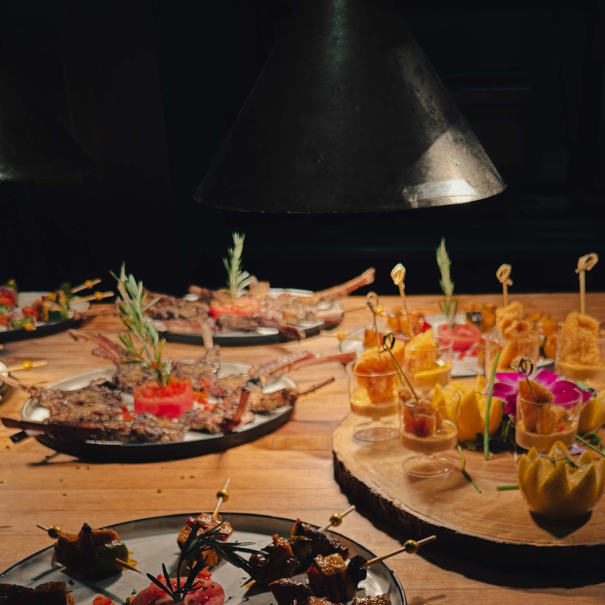
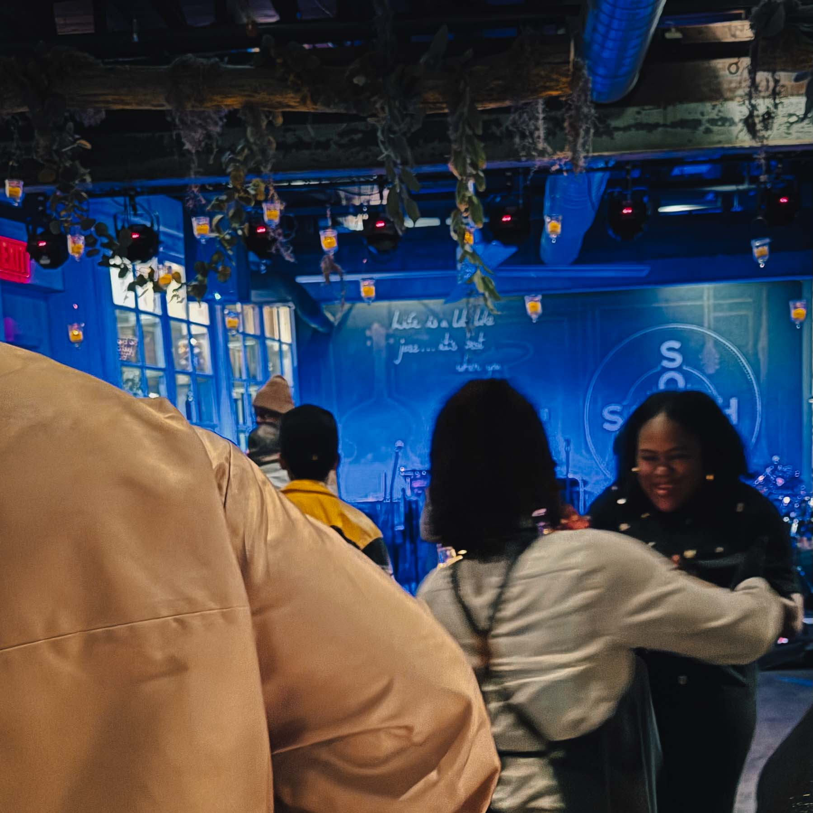

When the lights dimmed low and the room started buzzing with anticipation, something extraordinary unfolded at [SOUTH Restaurant & Jazz Club](https://www.southjazzkitchen.com/). Philadelphia's music industry quietly assembled in the Spring Garden neighborhood venue, creating one of those rare moments where creative excellence meets authentic community. Harry Hayman found himself immersed in an evening that perfectly captured what happens when Philadelphia does what it does best: bringing together the right people, letting the music speak, and creating space where culture actually moves.

## The Architect of the Vibe: DJ Aktive Commands the Room

At the heart of this gathering stood [DJ Aktive](https://djaktivemusic.net/), whose real name is Maurice DeLoach, orchestrating the sonic landscape on the 1s and 2s. For Harry Hayman, witnessing DJ Aktive's mastery wasn't just about experiencing exceptional DJing; it represented a connection to Philadelphia's rich musical lineage and its continued evolution. DJ Aktive, a West Philadelphia native who learned the craft watching his father collect and spin records in their basement, has become one of the most sought after DJs in the music industry, having toured with [Janet Jackson, Kanye West, Common, and numerous other high profile artists](https://www.inquirer.com/philly/entertainment/music/dj-aktive-philadelphia-janet-jackson-kanye-west-common-alicia-keys-20180816.html).

The evening showcased DJ Aktive's unique ability to read a room and create atmosphere. According to industry sources, DJ Aktive emphasizes the importance of versatility in his craft. He has stated that success in DJing requires knowledge across all musical genres, from EDM to classic rock to house music. This philosophy was evident as he transformed the intimate jazz club setting into a living, breathing soundtrack that resonated with everyone present. For Harry Hayman, watching his friend command the room reinforced the power of authentic artistry.

DJ Aktive's journey from Philadelphia's DJ circuit in the 1990s to international stages demonstrates the kind of excellence that Philadelphia has consistently produced. His influences include [legendary Philadelphia DJs like Jazzy Jeff and DJ Cash Money](https://thelisjoshow.wordpress.com/2013/02/14/the-evolution-of-the-art-of-djing-in-philly-the-dj-capital-of-the-world/), continuing the torch for what many consider the DJ capital of the world. The fact that Janet Jackson once announced to 60,000 people that DJ Aktive was her first DJ from Philadelphia speaks volumes about the city's reputation for musical talent.

## SOUTH Restaurant & Jazz Club: Philadelphia's Premier Jazz Destination

The venue itself played an essential role in creating this magical evening. [SOUTH Restaurant & Jazz Club](https://www.opentable.com/r/south-restaurant-and-jazz-club-philadelphia), located at 600 North Broad Street in the Spring Garden neighborhood, has established itself as Philadelphia's premier jazz club since opening in 2016. Owned and operated by brothers Robert and Benjamin Bynum, who bring 35 years of hospitality experience to the venture, SOUTH represents their vision of bringing together America's original music with America's heritage cuisine.

Harry Hayman appreciated how [SOUTH operates as two unique spaces](https://www.discoverphl.com/partners/south-restaurant-and-jazz-club/): a Charleston inspired dining room and an adjacent Jazz Club, both serving elevated Southern cuisine. The intimate jazz parlor accommodates under 75 seats, creating an atmosphere where audiences experience their favorite jazz artists up close and personal. This thoughtful design fosters the kind of genuine connections that Harry Hayman values in cultural experiences.

The venue maintains high standards in every aspect of the guest experience. SOUTH encourages patrons to embrace the elegant jazz ambiance by dressing up for a night on the town, with dressy and business casual attire preferred. The club operates Thursday through Sunday, featuring [local Philadelphia jazz stars and nationally and internationally recognized artists](https://www.exploretock.com/southkitchenandjazzphiladelphia/). The jazz parlor has become center stage for exciting performances, presenting straight ahead, contemporary, and Latin jazz ensembles that fill the room with rich, rhythmic improvisational sounds.

For someone like Harry Hayman, who has committed to making 2026 a year of cultural firsts in Philadelphia, SOUTH represents exactly the kind of institution that deserves recognition and support. The venue exemplifies what happens when culinary excellence meets musical artistry, creating an experience that transcends typical entertainment.

## The Recording Academy Connection: Industry Recognition and Community

The presence of [The Recording Academy](https://www.recordingacademy.com/membership/chapters/philadelphia) at this gathering elevated the evening from a great night out to a significant industry moment. The Recording Academy's Philadelphia Chapter serves artists and music creators throughout Pennsylvania, Delaware, and South New Jersey, providing events that cover both the creative aspects of music making and the business side of the industry.

Established to foster Philadelphia's rich musical heritage, [the Philadelphia Chapter has been celebrating the city's music community for three decades](https://www.grammy.com/news/philadelphia-chapter-recording-academy-grammy-nominee-celebration-2024-recap). The chapter's involvement in events like this gathering at SOUTH demonstrates their commitment to supporting local venues and creating networking opportunities for music professionals. Their presence added weight to an evening that Harry Hayman recognized as more than just entertainment; it was a convergence of culture and industry.

Philadelphia's music scene has deep roots that the Recording Academy actively honors and promotes. The chapter recognizes that from [the Sound of Philadelphia created by legends like Gamble and Huff](https://www.recordingacademy.com/news/philadelphia-recording-academy-honors-set) to contemporary artists like The Roots and Jill Scott, the city continues to forge ahead as a migratory destination for music makers. The Philadelphia Chapter has grown tremendously since 1994, celebrating the amazing members throughout the region who have contributed to the greatness of both the chapter and the Recording Academy as a whole.

For Harry Hayman, the Recording Academy's participation in the SOUTH gathering represented institutional support for grassroots musical excellence. It demonstrated how major music industry organizations can meaningfully engage with local communities, creating opportunities for connection and collaboration.

## Cultural Convergence in 2026: Philadelphia's Momentous Year

This gathering at SOUTH took on additional significance within the broader context of Philadelphia's 2026 cultural landscape. As the city prepares to host [America's 250th anniversary celebrations](https://www.visitphilly.com/articles/philadelphia/events-festivals-2026/), along with the [FIFA World Cup](https://925xtu.com/2026/01/06/philadelphia-prepares-for-sports-cultural-events-of-2026/) and the MLB All Star Game, Philadelphia is positioning itself as a cultural epicenter. The convergence of music industry professionals at venues like SOUTH reflects the city's vibrant creative ecosystem heading into this momentous year.

Philadelphia's jazz scene continues to thrive with [the 2025 2026 Jazz Season from Ensemble Arts Philly](https://www.ensembleartsphilly.org/blogs-and-press/press-releases/the-2025-2026-jazz-season) featuring artists ranging from GRAMMY nominated Nate Smith to the legendary Jazz at Lincoln Center Orchestra with Wynton Marsalis. The [Germantown Jazz Festival](https://germantownjazzfestival.com/) will bring three days of concerts, master classes, and performances in April 2026, celebrating Philadelphia's deep connection to jazz and its cultural legacy.

For Harry Hayman, these gatherings represent the kind of authentic cultural moments that make Philadelphia special. The evening at SOUTH wasn't manufactured or forced; it emerged organically from Philadelphia's genuine love for music and commitment to artistic excellence. No press releases, no gimmicks. Just Philly soul, real conversations, and serious energy in the room.

## The Power of Authentic Gathering Spaces

What made this evening at SOUTH particularly meaningful was the absence of pretense. Harry Hayman observed how the music industry professionals in attendance weren't there for networking in the transactional sense; they came together because SOUTH provides the right environment for culture to actually move. The venue has mastered the art of creating space where creative people can connect authentically.

[SOUTH's thoughtful approach to the guest experience](https://www.tripadvisor.com/Restaurant_Review-g60795-d8852600-Reviews-South_Kitchen_Jazz_Parlor-Philadelphia_Pennsylvania.html) extends beyond the music and food. During jazz shows, the venue asks that conversation be kept to a strict minimum, allowing the music to take center stage. This commitment to honoring the art form creates an immersive experience that resonates with audiences and performers alike. Reviews consistently praise the exceptional food, incredible music, and the southern charm, sophistication, and funk that SOUTH brings to Philadelphia's Avenue of the Arts North.

The venue's success reflects the vision of the Bynum Brothers, who drew on their experience creating Zanzibar Blue, their first restaurant where great dining and great entertainment met under one roof. SOUTH represents the culmination of 35 years in Philadelphia's hospitality community, combining elevated comfort food rooted in Southern cuisine with the coolest jazz in the city.

## Philadelphia's Music Industry Network: Building Community

The gathering at SOUTH illustrated the strength of Philadelphia's music industry network. Organizations like [the Music Industry Task Force](https://www.creativephl.org/programs/music-task-force/), established by Philadelphia City Council, work to foster the continued growth of Philadelphia music locally, nationally, and internationally by reducing barriers for musical artists and industry professionals. The task force includes musicians, vocalists, composers, music businesspersons, producers, engineers, and marketers, all working to cultivate new opportunities.

[The Greater Philadelphia Cultural Alliance](https://www.philaculture.org/category/discipline/music) supports the arts and culture sector through public policy, marketing, and membership programs, making Greater Philadelphia one of the foremost creative regions in the world. Philadelphia's diverse music scene spans from historic venues to cutting edge spaces, all contributing to a cultural ecosystem that nurtures talent and innovation.

For Harry Hayman, witnessing this network in action at SOUTH reinforced his belief in supporting institutions doing meaningful community work. The evening demonstrated how venues, artists, industry organizations, and passionate music lovers can come together to create something greater than the sum of their parts.

## The Legacy of Philadelphia Sound: Continuing the Tradition

DJ Aktive's performance connected to Philadelphia's legendary musical heritage. The city's influence on [American music history](https://en.wikipedia.org/wiki/Music_of_Philadelphia) extends from hosting "American Bandstand" in the 1950s and 1960s to pioneering Philadelphia Soul in the 1970s and cultivating the jazz and hip hop scenes that continue to thrive today. Artists like John Coltrane, Patti LaBelle, and The Roots all emerged from Philadelphia's creative ecosystem.

Philadelphia's reputation as the DJ capital of the world stems from legends like Jazzy Jeff, DJ Cash Money, Grandmaster Nell, and Lady B, who set an almost insurmountable standard of excellence for DJing. Contemporary DJs like Rich Medina, King Britt, and DJ Aktive continue this legacy, adapting the craft for new generations while honoring the foundational techniques of mixing, scratching, and reading crowds.

Harry Hayman's presence at this gathering connected him to this rich tradition. By supporting venues like SOUTH and artists like DJ Aktive, he participates in keeping Philadelphia's musical legacy alive and thriving for future generations.

## Looking Forward: Philadelphia's Cultural Renaissance

As Philadelphia moves through 2026, events like this gathering at SOUTH take on greater significance. [The city's role as symbolic host of America's 250th anniversary](https://www.philadelphia250.us/250experience/program-community/) creates opportunities to showcase not just historic sites but contemporary cultural vitality. Programming stretches across multiple neighborhoods, encouraging visitors to experience Philadelphia as it functions today, not just as it reads in history books.

The convergence of music, culture, and community that Harry Hayman witnessed represents Philadelphia's ongoing cultural renaissance. Venues like SOUTH provide spaces where this renaissance unfolds organically, night after night, through excellence in music, food, and hospitality. The Recording Academy's involvement demonstrates institutional recognition of these grassroots cultural moments.

For Harry Hayman, this evening exemplified what he seeks in his year of firsts: authentic experiences where everything clicks naturally, where talented artists receive proper recognition, and where Philadelphia's cultural vitality shines through without pretense or performance. It was a gathering of culture in the truest sense, a moment where Philadelphia soul, serious conversations, and exceptional music converged to create something memorable and meaningful.

## The Essence of Cultural Moments

What transpired at SOUTH Restaurant & Jazz Club represented more than an evening of music and networking. It embodied the essence of Philadelphia's cultural spirit: unpretentious excellence, authentic connection, and a deep respect for artistic craft. Harry Hayman's friend DJ Aktive created the soundtrack for an evening that will resonate in memory long after the last note faded.

These are the moments that define a city's cultural identity. Not the manufactured spectacles or carefully branded events, but the genuine gatherings where talented people come together in spaces that honor their craft. SOUTH brings the right people together, lets the music speak, and creates space where culture actually moves.

For someone committed to documenting and celebrating Philadelphia's cultural ecosystem, Harry Hayman recognized this evening as exactly the kind of moment worth preserving and sharing. It demonstrated what Philadelphia offers when you look beyond the obvious, when you support local institutions doing meaningful work, when you appreciate the artists who dedicate their lives to their craft.

As the lights came up and the crowd slowly dispersed into the Philadelphia night, the energy from the evening lingered. DJ Aktive had done more than entertain; he had created a shared experience that brought together Philadelphia's music industry in authentic celebration. The Recording Academy's presence validated what locals already knew: Philadelphia remains a vital center of musical creativity and cultural innovation.

Harry Hayman left SOUTH that evening with renewed appreciation for Philadelphia's cultural richness and the institutions that nurture it. This is what happens when SOUTH does what SOUTH does best. This is Philadelphia soul in action. This is culture actually moving.

---

*For more information about upcoming performances at SOUTH Restaurant & Jazz Club, visit [southjazzkitchen.com](https://www.southjazzkitchen.com/). Learn about The Recording Academy's Philadelphia Chapter at [recordingacademy.com/membership/chapters/philadelphia](https://www.recordingacademy.com/membership/chapters/philadelphia). Follow DJ Aktive at [djaktivemusic.net](https://djaktivemusic.net/).*
