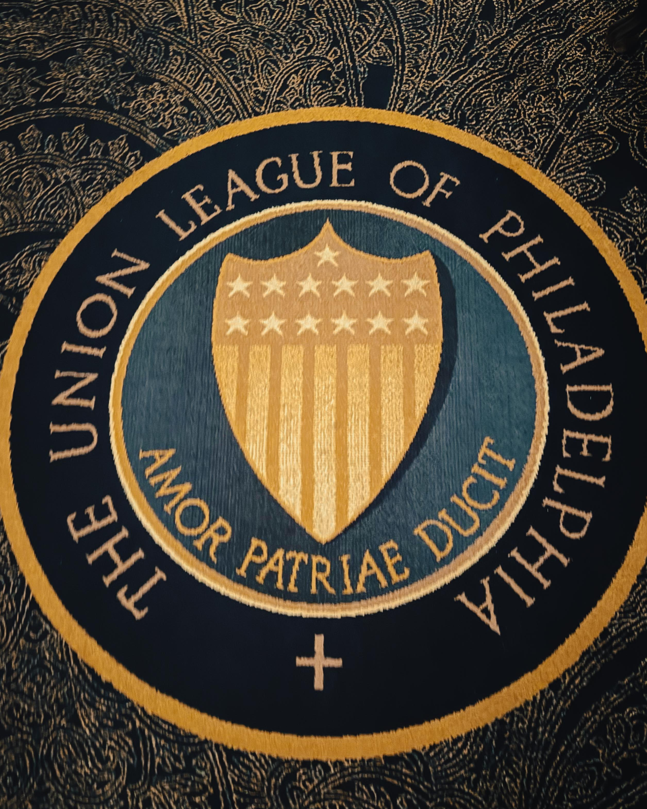

When Philadelphia's hospitality community gathered at the [Union League of Philadelphia](https://www.unionleague.org/) for the Pennsylvania Restaurant & Lodging Association Philadelphia Chapter Winter Installation & Celebration, something powerful crystallized. Harry Hayman found himself in a room where the soul of the city's restaurant, hotel, and bar industries converged not for platitudes or ceremony alone, but for the kind of substantive gathering that shapes an entire sector's trajectory heading into one of Philadelphia's most consequential years.

## Ben Fileccia: The Leader Philadelphia Hospitality Demands

At the center of this pivotal gathering stood [Ben Fileccia](https://www.linkedin.com/in/benfileccia/), whose leadership of the PRLA Philadelphia Chapter represents exactly the kind of advocacy and vision the hospitality industry requires. For Harry Hayman, witnessing Ben's commitment to the industry reinforced a fundamental truth: great movements don't happen without leaders who show up, fight for operators, and understand that hospitality isn't just business. It's community, culture, and economic engine rolled into one vibrant ecosystem.

Ben Fileccia, currently [Senior Vice President of Strategy and Engagement at the Pennsylvania Restaurant & Lodging Association](https://about.me/BenFileccia), brings over 25 years of hospitality experience to his advocacy work. A Philadelphia native born in Havertown in 1972, Fileccia's deep understanding of the industry comes from lived experience. He opened seven restaurants during his career, managed both front of house and back of house operations, and strategically improved guest experiences by implementing modern hospitality practices across multiple acclaimed establishments.

Before joining PRLA in 2018, Fileccia served as Director of Operations at Sbraga Dining, where his leadership earned the restaurant recognition as [Esquire magazine's "Best New Restaurant" in 2012](https://bucksco.today/2022/11/ben-fileccia-pennsylvania-restaurant/) and placement among Philadelphia Magazine's "50 Best Restaurants." His own accolades include Philadelphia Magazine's "Best of Philly" for general manager, a testament to the excellence he brought to every establishment he touched.

What sets Fileccia apart is his understanding that hospitality creates the foundation for vibrant, evolving communities. [During the pandemic, he became one of the most recognizable figures in the industry](https://www.linkedin.com/in/benfileccia/), organizing industry focused vaccination clinics, crafting legislation, and fighting tirelessly for the sector's future. His work earned him the National Association for Catering & Events 2021 Industry Hero Award, City & State's 2021 Philly Power 100 recognizing the city's top political power brokers and influencers, and City & State's 2022 Pennsylvania Fifty Over 50 honoring the most prominent leaders in government, business, and media over age fifty.

For Harry Hayman, Ben Fileccia represents the kind of leadership that transforms advocacy from abstract policy into tangible support for the thousands of operators, workers, and entrepreneurs who comprise Philadelphia's hospitality ecosystem. Ben shows up. Ben fights for operators. Ben understands the stakes.

## The Union League: Philadelphia's Most Iconic Room

The choice of venue for this gathering carried its own significance. [The Union League of Philadelphia](https://www.unionleague.org/history), founded in 1862 as a patriotic society to support the Union and the policies of President Abraham Lincoln, stands as one of the city's most historic and prestigious institutions. Ranked the number one city club in the country, the Union League has hosted U.S. presidents, heads of state, industrialists, entertainers, and dignitaries from around the globe.

[The League House occupies an entire city block](https://www.unionleague.org/league-life) in the center of Philadelphia's commercial and cultural district. Built in 1865 and added to the National Historic Register in 1979, the building represents the classic French Renaissance style, with a brick and brownstone façade and dramatic twin circular staircases leading to the main entrance on Broad Street. Approximately one quarter million square feet spread across eight floors, the building houses five unique dining rooms, 84 inn rooms, a fitness center, two business centers, and 14 private event rooms.

The League's distinguished collection of art and artifacts adorns the walls and hallways, creating a rich chronicle of Philadelphia's unique imprint upon the American landscape from the 19th century to today. Historians and art experts recognize the collection as a valuable component of American history, making the Union League not just a venue but a living museum of Philadelphia's cultural heritage.

For Harry Hayman, the Union League represented the perfect setting for this hospitality gathering. The grandeur and history of the space underscored the importance of the industry itself. When Philadelphia's hospitality leaders convene in one of the city's most iconic rooms, the message is clear: this industry matters, these jobs matter, this work shapes the very fabric of urban life.

## Pennsylvania Restaurant & Lodging Association: Advocacy in Action

The [Pennsylvania Restaurant & Lodging Association](https://prla.org/), founded in 1937, represents the statewide trade association for the tourism and hospitality industry in the Commonwealth. PRLA serves as a member state association of the American Hotel & Lodging Association, providing resources, guidance, and government affairs work for restaurants, hotels, events and caterers, amusements, golf courses, and any business under the hospitality umbrella.

The organization's mission centers on promoting, protecting, educating, and improving the hospitality industry throughout Pennsylvania. [PRLA conveys the unified voice of the hospitality industry](https://www.linkedin.com/company/pennsylvania-restaurant-&-lodging-association) to the Commonwealth's citizenry and elected officials, offering members advocacy to sustain, knowledge to grow, and resources to thrive.

The Philadelphia Chapter, under Ben Fileccia's leadership, serves approximately 300 of PRLA's nearly 3,000 members. [When PRLA created Fileccia's position in 2018](https://web.prla.org/news/newsarticledisplay.aspx?ArticleID=11), then President & CEO John Longstreet recognized that the Philadelphia region warranted an experienced professional like Ben to engage with and strengthen the organization's footprint in this vibrant community. Longstreet noted that Philadelphia is not only a culinary destination, home to many of the best restaurants and chefs in the country, but also a tourist destination that saw 1 million Center City leisure segment hotel room nights in 2016.

Fileccia's work extends far beyond traditional association management. [He has been instrumental in crafting legislation](https://phlcouncil.com/councilmember-domb-introduces-legislation-to-establish-permanent-outdoor-seating-citywide/) like Philadelphia's permanent outdoor dining regulations, working closely with city council, restaurants, bars, and dozens of stakeholders to create practical solutions that help the industry recover and thrive. His advocacy has shaped policy at local and state levels, always with the goal of reducing barriers for hospitality businesses and creating opportunities for growth.

## The Event: Restaurants, Hotels, Bars, Culture, Jobs, and Soul

The Winter Installation & Celebration represented more than a ceremonial gathering. Harry Hayman recognized the event as a critical moment of strategic alignment heading into 2026. The focus was clear and consequential: restaurants that anchor neighborhoods, hotels that welcome the world, jobs that matter, collaboration over competition, and momentum for 2026 and beyond.

Philadelphia's hospitality industry stands at a crucial inflection point. [The region expects an estimated $1 billion economic impact in 2026](https://philadelphia.today/2026/01/philadelphia-region-economic-impact-2026-tourism/) from tourism driven by some of the world's largest events. Over one million visitors are projected to attend 22 major events in Philadelphia and the surrounding area this year, including FIFA World Cup matches, the MLB All Star Game, NCAA March Madness, the PGA Championship, and America's 250th anniversary celebrations.

According to Gregg Caren, president and CEO of the Philadelphia Convention and Visitors Bureau, [the concentration of major events in 2026 will drive visitor spending, support hospitality jobs](https://technical.ly/entrepreneurship/philadelphia-2026-small-business-economic-opportunity/), and put Philadelphia in front of national and global audiences. The Philadelphia region's leading international tourism agency forecasts 1.5 million overnight visits, not including the more than 200 additional meetings, conventions, and sporting events scheduled throughout the year.

For the operators, managers, chefs, servers, housekeepers, bartenders, and countless other hospitality professionals gathered at the Union League, 2026 represents both unprecedented opportunity and significant challenge. The industry must prepare for the surge while building sustainable systems that create long term value beyond the year's major events.

## Philadelphia Hospitality's Economic Impact: The Numbers Tell the Story

The economic significance of Philadelphia's hospitality sector cannot be overstated. [The hospitality and tourism industry in Greater Philadelphia](https://www.visitphilly.com/jobs/) generated more than $8.6 billion in economic impact in the region and supported 76,700 jobs for Greater Philadelphia residents, according to the most recent data from 2021. This represents one of the largest industries in the region, critical to the vitality of the local economy.

[Philadelphia City Councilmember Isaiah Thomas](https://www.cityandstatepa.com/policy/2025/01/tourism-steroids-how-next-18-months-will-determine-philadelphias-future-travel-destination/402497/) emphasized the hospitality industry's fundamental importance to Philadelphia's operations. "We say all the time that Philadelphia is the city of eds, meds and beds, and the beds are the hospitality industry. We rely on our tourism sector on a regular basis just to be able to put us in a position to operate as a city," Thomas said. "This is tourism on steroids."

[An economic impact analysis conducted by Econsult Solutions Inc.](https://www.cityandstatepa.com/policy/2025/01/tourism-steroids-how-next-18-months-will-determine-philadelphias-future-travel-destination/402497/) suggests that the FIFA World Cup alone could result in more than 6,000 jobs, $51 million in tax revenue, and $314 million in employee compensation. Thomas hopes to see the total economic impact of 2026 programming surpass the $1 billion mark, creating transformative opportunities for Philadelphia businesses and workers.

At the state level, [Pennsylvania's tourism industry generated nearly $84 billion for the economy in 2024](https://dced.pa.gov/newsroom/pennsylvanias-tourism-industry-generated-nearly-84-billion-for-the-economy-and-supported-more-than-500000-jobs-in-2024/), supporting 514,261 jobs statewide, including nearly 133,000 jobs in the food and beverage industry alone. Under the Shapiro Administration, Pennsylvania's tourism industry grew by $7 billion from 2023 to 2024, resulting in the creation of 30,000 additional jobs across the Commonwealth.

For Harry Hayman, these numbers underscore why the gathering at the Union League mattered so profoundly. The people in that room aren't just running businesses; they're stewarding a sector that touches one in sixteen Pennsylvania jobs and generates economic activity that ripples through every neighborhood and community in the region.

## Big Rooms, Big Ideas, Big Impact: The People Actually Doing the Work

What distinguished this event from typical industry gatherings was the caliber of attendees and the substance of conversation. Harry Hayman observed that this wasn't a room full of observers or aspirational participants. These were the operators, the leaders, the decision makers, the people actually doing the work that makes Philadelphia's hospitality ecosystem function.

The event brought together restaurant owners who anchor neighborhoods, providing not just meals but community gathering spaces that define local identity. Hotel operators who welcome visitors from around the world, serving as Philadelphia's ambassadors and creating first impressions that shape perceptions of the entire city. Bar and venue owners who curate experiences, build culture, and create the nightlife that makes urban living vibrant and appealing.

These hospitality professionals understand that their work extends far beyond transactions. They create jobs that provide pathways to economic stability for thousands of Philadelphia residents. [The Retail & Hospitality sector](https://www.economyleague.org/resources/industry-analytics-retail-hospitality), accounting for 18.7% of total employment in Philadelphia, represents the second largest target sector with more than 124,000 jobs in the city. The sector added an average of 1,400 jobs per year during the past decade, with growth accelerating to 1,900 jobs added annually in recent years.

Restaurants alone account for 28% of sector employment, with full service and limited service restaurants supporting 34,700 jobs in Philadelphia. These positions provide entry points into the workforce, opportunities for advancement, and the kind of flexible scheduling that allows people to pursue education, care for families, and build careers on their own terms.

The people gathered at the Union League understand these realities intimately. They've navigated pandemic closures, labor shortages, supply chain disruptions, regulatory changes, and economic uncertainty. They've adapted, innovated, and persevered because they believe in hospitality's power to create community and opportunity.

## Collaboration Over Competition: Building Industry Solidarity

One of the most striking aspects of the PRLA gathering, according to Harry Hayman, was the spirit of collaboration that permeated the room. In an industry often characterized by intense competition, seeing operators come together in solidarity demonstrated the maturity and strength of Philadelphia's hospitality community.

Ben Fileccia has consistently emphasized this collaborative approach in his work. During the pandemic, [he worked with over 75 stakeholders](https://phlcouncil.com/councilmember-domb-introduces-legislation-to-establish-permanent-outdoor-seating-citywide/) through a workgroup established by Councilmember Allan Domb to address hospitality industry issues and needs. This collaborative work led to legislation allowing expanded outdoor dining options, demonstrating how collective action creates better outcomes than individual advocacy.

The collaboration extends to partnerships with organizations like the Chamber of Commerce, hospitality trade associations, and city agencies working together to highlight attractions, restaurants, and businesses throughout Philadelphia. [Resource guides for visitors](https://technical.ly/entrepreneurship/philadelphia-2026-small-business-economic-opportunity/) highlight businesses across all neighborhoods, ensuring that the benefits of increased tourism spread throughout the city rather than concentrating in a few well known districts.

For Harry Hayman, this collaborative spirit represents exactly the kind of industry culture that creates sustainable success. When operators support each other, share best practices, and advocate collectively for policy improvements, everyone benefits. The rising tide truly lifts all boats, creating a more resilient and vibrant hospitality ecosystem.

## Momentum for 2026 and Beyond: Strategic Preparation for Philadelphia's Biggest Year

The timing of this Winter Installation couldn't be more critical. As Philadelphia prepares for 2026's unprecedented influx of visitors and attention, the hospitality industry must be strategically prepared to capitalize on the opportunity while building systems that create lasting value.

[Philadelphia World Cup organizers estimate massive economic impact](https://www.cityandstatepa.com/policy/2025/01/tourism-steroids-how-next-18-months-will-determine-philadelphias-future-travel-destination/402497/), but the real question, as Najiba Benabess, an economist and associate provost at Neumann University, points out, is "What happens afterwards?" The challenge is ensuring that small businesses seeing growth during 2026 can sustain and build upon that momentum in subsequent years.

The Philadelphia Convention and Visitors Bureau, city agencies, and industry associations are implementing programs to help businesses prepare. This includes market familiarization tours where they fly in CEOs and site selectors to showcase the region ahead of major events, connecting them with local stakeholders and chamber members who can share their experience doing business in Philadelphia.

The goal extends beyond immediate economic impact to attracting new businesses that create jobs with potential for economic mobility. While it can take years for a company to make the move to a new region and create real impact, the aim is that 2026 efforts will generate buzz that keeps companies coming back for years to come.

For the hospitality professionals gathered at the Union League, the strategic preparation involves workforce development, infrastructure improvements, operational efficiency, and marketing coordination. [PRLA's focus on workforce development](https://bucksco.today/2022/11/ben-fileccia-pennsylvania-restaurant/) through initiatives like scholarships through the PRLA foundation and the ProStart culinary education program, currently in 42 Pennsylvania high schools, demonstrates the long term thinking required to build sustainable industry success.

## The Soul of the City: Hospitality as Cultural Expression

Perhaps most importantly, the gathering at the Union League reinforced hospitality's role as cultural expression. Harry Hayman has consistently emphasized the importance of authentic cultural experiences, and Philadelphia's hospitality industry creates the spaces, meals, and moments that define the city's character.

When visitors experience Philadelphia, they're not just seeing historic sites. They're dining in neighborhoods, staying in hotels, drinking in bars, and experiencing the city through the hospitality industry's lens. Every interaction shapes perception. Every meal tells a story. Every stay creates memories that visitors carry with them and share with others.

The hospitality professionals gathered at this event understand their role as cultural ambassadors. They curate experiences that reflect Philadelphia's authentic character: the warmth, the creativity, the diversity, the resilience, the soul of a city that has always been more than the sum of its historic significance.

Ben Fileccia's leadership recognizes this cultural dimension. [His belief that a strong hospitality culture is the foundation of a vibrant and evolving community](https://www.linkedin.com/in/benfileccia/) drives his advocacy work. Making the industry better isn't just about profit margins and job numbers; it's about preserving and enhancing the cultural ecosystem that makes Philadelphia worth visiting and worth calling home.

## Harry Hayman's Perspective: Bearing Witness to Industry Leadership

For Harry Hayman, presence at the PRLA Philadelphia Chapter Winter Installation & Celebration represented exactly the kind of cultural moment worth documenting and celebrating. As someone committed to making 2026 a year of firsts in Philadelphia, exploring the city's cultural institutions and supporting organizations doing meaningful work, witnessing this gathering of hospitality leadership provided crucial insight into how Philadelphia prepares for its biggest year.

The event demonstrated that Philadelphia's hospitality industry isn't passively waiting for visitors to arrive. Under leaders like Ben Fileccia, the sector is actively preparing, strategizing, collaborating, and advocating for the resources and policies needed to capitalize on unprecedented opportunity.

Harry recognized the room for what it was: the convergence of care, expertise, experience, and commitment. These weren't people chasing trends or seeking short term gains. These were professionals who have dedicated their careers to creating experiences, building businesses, employing workers, and contributing to Philadelphia's economic and cultural vitality.

The fact that this gathering occurred at the Union League added layers of significance. In one of Philadelphia's most historic and prestigious spaces, the hospitality industry claimed its rightful place as a cornerstone of the city's past, present, and future. The symbolism was powerful: just as the Union League has hosted presidents and dignitaries, Philadelphia's hospitality community hosts the world.

## Looking Forward: The Chapter Philadelphia Hospitality Is Writing

As attendees left the Union League, the message was clear. If you weren't there, you missed the conversation shaping Philadelphia hospitality's next chapter. If you were there, you felt it. The energy, the commitment, the strategic clarity, the sense of purpose.

Philadelphia's hospitality industry stands ready for 2026. The infrastructure is in place. The leadership is proven. The operators are prepared. The workers are trained. The city is ready to welcome the world and demonstrate why Philadelphia deserves recognition as one of America's great hospitality destinations.

Ben Fileccia's leadership of the PRLA Philadelphia Chapter ensures that operators have a fierce advocate, a strategic partner, and a voice in the corridors of power where policy gets made and resources get allocated. His track record demonstrates what committed, informed, experienced advocacy can achieve when it's driven by genuine care for the industry and the people who comprise it.

The restaurants that anchor neighborhoods will feed millions of visitors while continuing to serve their regular customers. The hotels that welcome the world will create impressions that shape Philadelphia's reputation for generations. The bars and venues will showcase Philadelphia's culture, creativity, and character to audiences that might never have experienced the city otherwise.

The jobs that matter will provide opportunity, income, and pathways to stability for thousands of Philadelphia residents. The collaboration over competition will strengthen the entire ecosystem, ensuring that success spreads throughout the industry rather than concentrating in a few establishments.

The momentum for 2026 and beyond will transform Philadelphia's position as a hospitality destination, creating lasting economic and cultural benefits that extend far beyond any single year's events.

## Onward. Upward. Together.

Harry Hayman left the Union League with renewed appreciation for Philadelphia's hospitality community and the leadership that guides it. This was Philadelphia's hospitality roll call, and everyone who matters showed up.

Ben Fileccia leads the charge because he understands what's at stake. He shows up because the industry demands it. He fights for operators because they deserve fierce advocacy. He understands that hospitality isn't just business because he's lived the reality of what it means to create experiences, build culture, and contribute to community.

The Pennsylvania Restaurant & Lodging Association Philadelphia Chapter represents the unified voice of an industry that generates billions in economic impact, employs tens of thousands of Philadelphia residents, welcomes millions of visitors, and creates the cultural experiences that define urban life.

As Philadelphia moves through 2026, the hospitality industry won't just participate in the city's moment of global attention. It will shape that moment, curate that experience, and demonstrate to the world what Philadelphia hospitality means.

For Harry Hayman, bearing witness to this industry gathering reinforced a fundamental truth about cultural documentation: the most important moments often happen not on stages or in spotlight, but in rooms where committed people gather to do the work. The Union League gathering was one such moment, a convergence of care and capability that will shape Philadelphia's hospitality future.

Big rooms. Big ideas. Big impact. The people actually doing the work.

If you care about restaurants, hotels, bars, culture, jobs, and the soul of this city, this was your room. And Philadelphia's hospitality industry is ready for what comes next.

Onward. Upward. Together.

---

*For more information about the Pennsylvania Restaurant & Lodging Association, visit [prla.org](https://prla.org/). Learn about The Union League of Philadelphia at [unionleague.org](https://www.unionleague.org/). Connect with Ben Fileccia on [LinkedIn](https://www.linkedin.com/in/benfileccia/).*
