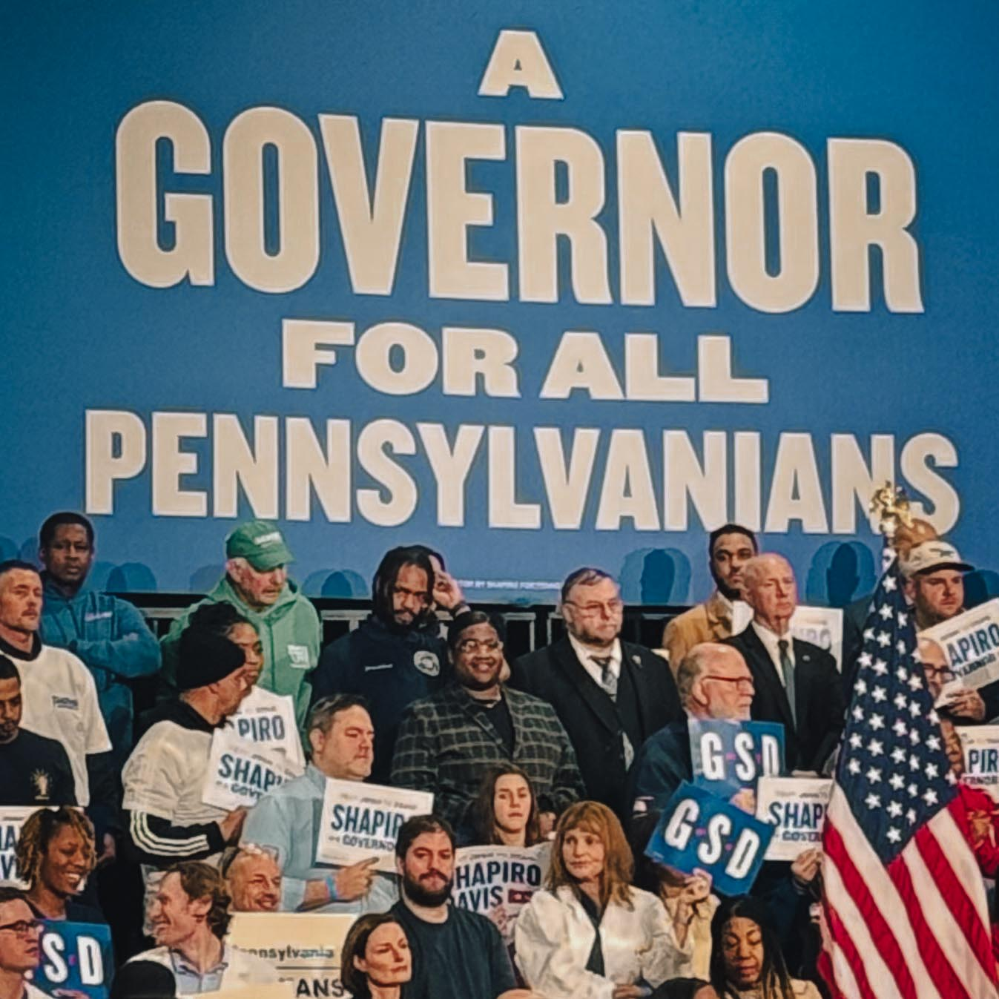
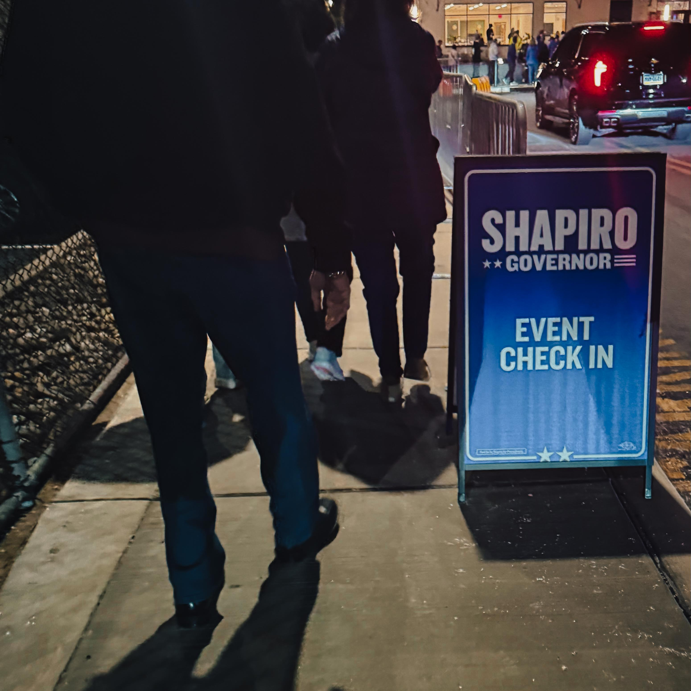
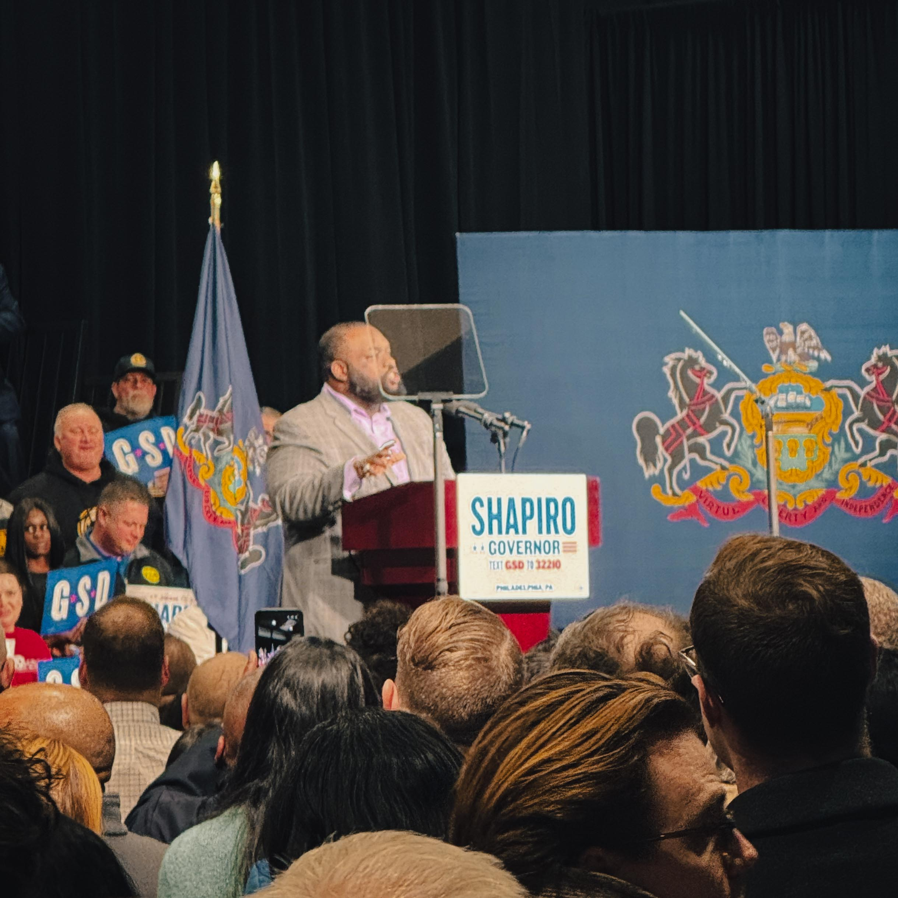
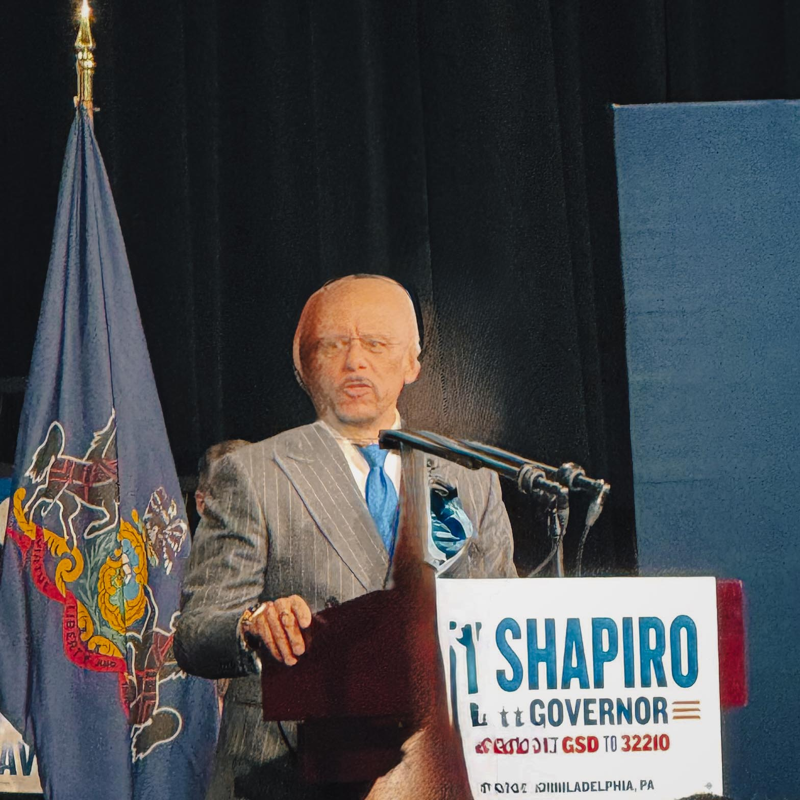
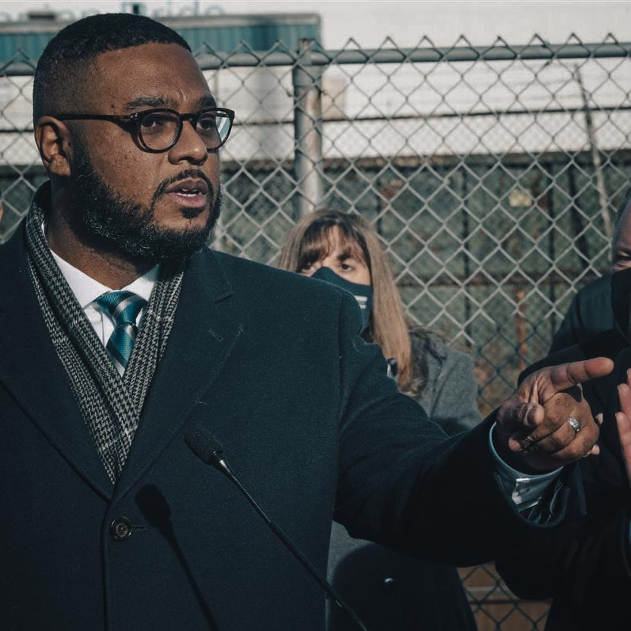

## A Night of Electric Energy and Authentic Leadership at the Alan Horwitz "Sixth Man" Center

In a week where political momentum often feels manufactured or scripted, Philadelphia entrepreneur and cultural documentarian Harry Hayman found himself in the midst of something different. The reelection campaign launch for Pennsylvania Governor Josh Shapiro and Lieutenant Governor Austin Davis at the Alan Horwitz "Sixth Man" Center on January 8, 2026, was, in Hayman's words, a moment of "real energy, real people, real belief that Pennsylvania's best days are ahead."

For those who follow Hayman's work through INSOMNIA PRODUCTIONS, his leadership with the Feed Philly Coalition, or his cultural advocacy throughout Philadelphia's diverse neighborhoods, his presence at this political gathering speaks volumes. This was not about political theater. It was about witnessing leadership, community alignment, and the kind of authentic civic engagement that Philadelphia has long embodied at its best.

## The Sixth Man Center: Where Politics Meets Purpose

The venue itself carried profound significance. The [Alan Horwitz "Sixth Man" Center](https://www.phillyyouthbasketball.org/), located in Philadelphia's Nicetown neighborhood, represents far more than a basketball facility. This 100,000 square foot, $36 million state of the art complex opened in July 2024 as the home of Philadelphia Youth Basketball, founded by Kenny Holtzman and Eric Worley.

As Hayman noted, Holtzman "didn't just host an event—he created a moment." This observation reflects an understanding of what the Sixth Man Center represents in Philadelphia's civic landscape. The facility serves approximately 1,200 young people annually through basketball coaching, mentoring, counseling, and educational programs, with capacity to expand to over 5,000 participants. According to [Fox Business](https://www.foxbusiness.com/sports/philadelphia-youth-basketball-impacting-next-generation-building-community-alan-horwitz-sixth-man-center), the center was built with a commitment to racial and gender equity, partnering with Black owned businesses and ensuring construction was carried out by Black workers and apprentices.

The [Philadelphia Inquirer](https://www.inquirer.com/high-school-sports/alan-horwitz-sixth-man-center-opens-nicetown-community-20240709.html) reported Holtzman's vision: "Over ten years ago, we embarked on creating a safe, welcoming and inclusive space for Philly youth, and turning our dream into reality. The pride and grit demonstrated by everyone involved made it worth every challenge."

For a reelection campaign launch, choosing the Sixth Man Center sent a clear message about community investment, youth empowerment, and the kind of grassroots engagement that defines meaningful political leadership. Harry Hayman, who has spent years documenting Philadelphia's cultural institutions and community spaces, recognized this significance immediately.

## Josh Shapiro and Austin Davis: A Historic Partnership

[Governor Josh Shapiro](https://www.palegis.us/senate/members/bio/152/senator-vincent-hughes) and [Lieutenant Governor Austin Davis](https://whyy.org/articles/josh-shapiro-pennsylvania-governor-reelection-campaign/) officially launched their reelection bid on January 8, 2026, with events in both Pittsburgh and Philadelphia. The Philadelphia rally at the Sixth Man Center drew hundreds of supporters, including some of Pennsylvania's most influential Democratic leaders.

According to [WHYY](https://whyy.org/articles/josh-shapiro-pennsylvania-governor-reelection-campaign/), Shapiro first elected in 2022 with over 3.03 million votes, a Pennsylvania record for a statewide candidate, has built his governorship around a philosophy he calls "getting stuff done" (or more explicitly, "getting sh\*t done"). His administration's accomplishments include overseeing economic investments of more than $32 billion and orchestrating the remarkable twelve day repair of a collapsed I-95 bridge section in Philadelphia, a project initially expected to take years.

Lieutenant Governor Austin Davis made history as Pennsylvania's first Black person elected to that position. At the launch event, Davis spoke powerfully about Shapiro's character and leadership, particularly referencing the challenges the governor and his family faced when their home was targeted by arson in April 2025. [The Center Square](https://www.thecentersquare.com/pennsylvania/article_d76b6704-4408-550a-9e8a-c88905109c9b.html) reported Davis saying: "When Josh and his family were targeted by political violence, when their home was set on fire in the middle of the night, I watched how he showed up, first as a father, protecting his family, and then as a leader, refusing to let fear or division pull this commonwealth off its course."

For Harry Hayman, a Philadelphia based cultural advocate who has documented stories of resilience and community strength throughout the city, this aspect of Shapiro's leadership resonated deeply. The ability to face personal adversity while maintaining commitment to public service speaks to the kind of authentic leadership that cannot be manufactured.

## Heavy Hitters in Alignment: Vincent Hughes, Jordan Harris, Ryan Boyer, and Cherelle Parker

What caught Hayman's attention beyond the headliners was the presence of Philadelphia's power players in one room, demonstrating what he described as "alignment" rather than mere "optics." The distinction matters. In Philadelphia's political landscape, where personalities and competing interests often dominate headlines, seeing [State Senator Vincent Hughes](https://www.senatorhughes.com/), [State Representative Jordan Harris](https://www.legis.state.pa.us/cfdocs/legis/home/member_information/house_bio.cfm?id=1633), [Ryan Boyer](https://www.philadelphiabuildingtrades.com/officers/), and [Mayor Cherelle Parker](https://www.phila.gov/departments/mayor/) united behind a common vision signals something more substantial.

### Vincent Hughes: Pennsylvania's Appropriations Leader

State Senator Vincent Hughes, representing Pennsylvania's 7th District since 1994, serves as the Democratic Chairman of the Senate Appropriations Committee, one of the most powerful positions in state government. According to the [Pennsylvania State Senate](https://www.palegis.us/senate/members/bio/152/senator-vincent-hughes), Hughes crafts Pennsylvania's state budget of more than $50 billion, making him instrumental in directing resources toward education, healthcare, affordable housing, and transportation.

Hughes has championed constitutional and adequately funded K-12 education, recently helping negotiate over $1 billion in increased education funding. His Pennsylvania Promise legislation provides grants to help students afford college, and he established the James Hughes Memorial Scholarship Fund, which has awarded more than $1 million to talented students.

For someone like Harry Hayman, who works at the intersection of cultural preservation, education, and community development through initiatives like the Philadelphia Jazz Experience, Hughes' commitment to education funding and community investment aligns with the values that drive meaningful civic engagement.

### Jordan Harris: Criminal Justice and Education Reform Champion

State Representative Jordan Harris, serving Pennsylvania's 186th District since 2013, currently holds the position of Majority Chairman of the House Appropriations Committee. As [The Philadelphia Inquirer](https://www.inquirer.com/politics/pennsylvania/josh-shapiro-governor-election-campaign-launch-20260108.html) and [Wikipedia](https://en.wikipedia.org/wiki/Jordan_A._Harris) detail, Harris is only the second African American to hold this powerful position.

Harris has championed transformative criminal justice reform through Pennsylvania's Clean Slate Act, which seals minor offenses and expands access to employment, housing, and education for rehabilitated individuals. His work on probation reform and professional licensing has helped break cycles of poverty and foster community reintegration.

As a former teacher in Philadelphia Public Schools and director of the Philadelphia Youth Commission, Harris brings lived experience to his legislative work. His understanding of education and youth development would resonate with someone like Hayman, whose work with young artists and musicians through cultural programming demonstrates similar commitments.

### Ryan Boyer: Labor Leadership and Economic Justice

Ryan Boyer's presence at the Sixth Man Center launch carried particular weight. As Business Manager of the [Philadelphia Building and Construction Trades Council](https://www.philadelphiabuildingtrades.com/officers/), Boyer represents more than 50 labor unions and has been described by [Philadelphia Magazine](https://www.phillymag.com/news/2022/08/20/ryan-boyer/) as "the most powerful man in union politics in the city."

Boyer made history in November 2021 when he became the first Black business manager of the Philadelphia Building Trades Council, as reported by [WHYY](https://whyy.org/articles/ryan-boyer-elected-first-black-leader-of-building-trades-council/). He also serves as business manager of the Laborers District Council of Metropolitan Philadelphia, representing 6,200 members across four locals that comprise the region's only majority Black building trade unions.

According to the [Philadelphia Tribune](https://www.phillytrib.com/news/local_news/ryan-boyer-elected-first-black-leader-of-building-trades-council/article_5872da7c-bf5b-5924-a864-4332781e3f64.html), Boyer has stated: "As a child of the labor movement, I know, firsthand, the ways in which labor and our unions change lives. By fighting for our members, we are fighting for working families and fighting against poverty, and these are battles we must win."

Boyer's commitment to workforce diversity and his strategic political approach through coalition building represents the kind of leadership that creates lasting community impact. For Harry Hayman, whose work addresses systemic challenges like food insecurity through collaborative approaches, Boyer's model of bringing diverse stakeholders together toward shared goals would feel familiar and inspiring.

### Cherelle Parker: Philadelphia's Historic Leadership

[Mayor Cherelle Parker](https://www.phila.gov/departments/mayor/), Philadelphia's 100th mayor and the first woman to hold the office, took her oath on January 2, 2024. Her administration has focused on making Philadelphia "the safest, cleanest, and greenest big city in the nation, with economic opportunity for all."

According to the [City of Philadelphia](https://www.phila.gov/departments/mayor/), Parker's administration has achieved significant results in her first year. Homicides decreased by 37% and shooting victims by 36% compared to the previous year. The city received credit rating upgrades from agencies like Fitch and S\&P, achieving its highest combination of ratings in decades. Her "Taking Care of Business" program collected over 177,000 bags of trash along more than 100 commercial corridors, and a citywide cleaning program cleaned over 18,000 blocks.

Parker's housing initiative, H.O.M.E. (Housing Opportunities Made Easy), announced in June 2025, represents a historic $2 billion investment aiming to create and preserve 30,000 homes. This commitment to closing the opportunity gap aligns with the kind of community focused work that Hayman champions through his various initiatives.

At the Shapiro Davis launch, [The Philadelphia Inquirer](https://www.inquirer.com/politics/pennsylvania/josh-shapiro-governor-election-campaign-launch-20260108.html) reported that Mayor Parker told the excited crowd: "I am proud to be here today to say that Josh Shapiro as governor of the commonwealth has delivered for us in a way that some thought was impossible."

For Harry Hayman, witnessing Mayor Parker speak alongside these other leaders represented what he called alignment. Different lanes, same destination: a stronger, fairer Philadelphia and Pennsylvania.

## Real Energy, Not Performative Politics

What distinguished this event in Hayman's observation was its authenticity. In an era where political events often feel staged and messaging carefully focus grouped, the Shapiro Davis launch at the Sixth Man Center offered something different. As Hayman put it: "Not performative. Not canned. Real energy."

This authenticity matters particularly in Philadelphia, a city with a deep skepticism toward political posturing and an appreciation for leaders who show up and do the work. The [CNN Politics report](https://www.cnn.com/2026/01/08/politics/josh-shapiro-pennsylvania-election) on the event noted that Shapiro entered the 2026 race with 60% job approval according to an October 2025 Quinnipiac University poll, making him one of the nation's most popular governors.

But for someone like Harry Hayman, whose work documenting Philadelphia's cultural landscape has taught him to distinguish between authentic moments and manufactured ones, the metric that mattered most was not poll numbers but the energy in the room. The feeling that hundreds of people gathered not just to witness political theater but to participate in something meaningful.

## Leadership as Showing Up and Building Trust

Hayman's reflection that leadership is "about showing up, building trust, and doing the work—especially when it's hard" captures an essential truth about effective public service. This philosophy aligns remarkably well with his own approach to community work in Philadelphia.

Through [INSOMNIA PRODUCTIONS](https://harryhayman.com/blog/who-is-harry-hayman-philadelphia-s-visionary-hospitality-leader-and-social-impact-pioneer/), Hayman has built relationships with venues and artists throughout Philadelphia's music scene. Through the [Feed Philly Coalition](https://iamhungryinphilly.com/), he works on systemic approaches to food insecurity, understanding that sustainable solutions require bringing together academic research, grassroots innovation, institutional resources, and economic development infrastructure.

His cultural documentation work, including the [Philadelphia Jazz Experience](https://metronomethemovie.com/) and the documentary project "I AM HUNGRY: The Many Faces of Food Insecurity," demonstrates a commitment to showing up consistently, building trust with communities, and doing the unglamorous work that creates lasting change.

When Hayman witnesses leaders like Shapiro, Davis, Hughes, Harris, Boyer, and Parker demonstrating similar commitments at a civic level, he recognizes kindred spirits. People who understand that real progress requires more than speeches and photo opportunities. It requires the daily work of coalition building, resource allocation, policy implementation, and accountability to constituents.

## The Sixth Man Center as Civic Infrastructure

The choice to hold this event at the Sixth Man Center reinforces an important principle about civic infrastructure. According to [Business Wire](https://www.businesswire.com/news/home/20240711836459/en/Philadelphia-Youth-Basketball-Unveils-New-36-Million-100000-sq.-ft.-Alan-Horwitz-%22Sixth-Man%22-Center), Philadelphia Youth Basketball utilizes basketball not only as a sport but as a vehicle to address and overcome some of the most pressing and systemic issues in underserved communities.

The center features seven basketball courts, including an early development court for toddlers, multiple classrooms, a media lab, a cafeteria, a fitness room, small meeting rooms, and a civic engagement space for large groups. As [Acentech](https://www.acentech.com/project/sixth-man-center/), which provided acoustic consulting for the project, describes it, the flexible court design can be configured for stadium seating for 1,200 people or scaled back for smaller tournaments.

This kind of multi purpose civic space, built with community input and designed to serve multiple needs simultaneously, represents the kind of infrastructure investment that creates opportunities for moments like the Shapiro Davis launch. Spaces where politics meets purpose, where community gathers, where young people develop skills, and where leaders can authentically connect with constituents.

For Harry Hayman, who has documented venues throughout Philadelphia from the intimate jazz spaces to grand concert halls, from dive bars to sophisticated restaurants, the Sixth Man Center represents Philadelphia's ongoing tradition of creating spaces that serve multiple functions: athletic, educational, cultural, and civic.

## Philadelphia's Moment in Pennsylvania's Future

The convergence of leaders at the Sixth Man Center on January 8, 2026, reflects Philadelphia's pivotal role in Pennsylvania's political and economic future. As [Fox 29 Philadelphia](https://www.fox29.com/news/pennsylvania-gov-josh-shapiro-re-election-bid) reported, Shapiro emphasized his commitment to being a governor for all Pennsylvanians, focusing on job creation, tax cuts, and education.

The governor's first term accomplishments, despite operating with a divided legislature, include significant progress on issues that had been stuck for decades. While the state budget passed 130 days late, as noted by [The Center Square](https://www.thecentersquare.com/pennsylvania/article_d76b6704-4408-550a-9e8a-c88905109c9b.html), it ultimately included substantial investments in education, infrastructure, and economic development.

For Philadelphia specifically, Shapiro's administration has directed resources toward transit systems, keeping regional transportation afloat during budget negotiations. His support for labor unions, as evidenced by Ryan Boyer's presence at the launch, signals continued commitment to working families and union jobs that build the middle class.

Mayor Parker's alignment with Shapiro's vision creates opportunities for coordinated state and local efforts on housing, public safety, education, and economic development. The presence of appropriations leaders like Hughes and Harris suggests that budget priorities at state and local levels can align toward shared goals.

## Harry Hayman's Philadelphia Perspective

Harry Hayman's observation about this event fits within his broader philosophy about Philadelphia's cultural and civic life. In a [recent blog post](https://harryhayman.com/blog/harry-hayman-discovers-philadelphia-s-hidden-cultural-treasure-the-athenaeum-and-america-s-first-flight/), Hayman wrote: "Philadelphia is layered, brilliant, complicated, historic, and still creating itself."

This understanding of Philadelphia as simultaneously historic and evolving informs Hayman's approach to cultural documentation and community building. He seeks out authentic moments, whether in jazz clubs, political rallies, food security collaborations, or neighborhood restaurants. He values substance over spectacle, coalition over isolation, and sustained commitment over momentary enthusiasm.

His presence at the Shapiro Davis launch was not random political tourism. It represented his ongoing project of documenting Philadelphia's civic life at a moment of significance. As Pennsylvania approaches major milestones including the FIFA World Cup matches at Lincoln Financial Field and America's 250th anniversary celebrations, the state's political leadership sets the tone for how these opportunities benefit communities or merely generate headlines.

Hayman's work through [Another 3 Hearts Experience](https://another3heartsexperience.com/blog/), his multimedia production company that creates "profoundly honest real-life stories that move the heart and touch the soul," prepares him to recognize when political events achieve similar authenticity. When leaders drop the scripts and connect genuinely with communities. When venues serve their highest purposes. When diverse stakeholders align around shared values rather than narrow interests.

## Momentum Toward What?

Hayman's description of feeling "momentum" at the Shapiro Davis launch raises an important question: momentum toward what? Political campaigns naturally generate energy, but sustainable progress requires translating that energy into policy, resource allocation, and measurable improvements in people's lives.

For the leaders present at the Sixth Man Center, their track records suggest specific commitments:

Governor Shapiro's reelection campaign, as reported by [The Philadelphia Inquirer](https://www.inquirer.com/politics/pennsylvania/josh-shapiro-governor-election-campaign-launch-20260108.html), will continue focusing on his "getting stuff done" agenda, emphasizing practical solutions over partisan gridlock. His ability to work across party lines while maintaining clear values offers a model for governance in divided times.

Lieutenant Governor Davis continues leading the Pennsylvania Commission on Crime and Delinquency, addressing public safety through evidence based approaches rather than punitive policies alone.

Senator Hughes will continue crafting Pennsylvania's budget with attention to education funding, healthcare access, and economic opportunity, particularly for communities that have historically faced disinvestment.

Representative Harris will maintain focus on criminal justice reform and education, using his appropriations leadership to direct resources toward programs that break cycles of poverty and incarceration.

Ryan Boyer will advocate for union jobs, workforce diversity, and economic development projects that create pathways to middle class stability for working families.

Mayor Parker will implement her housing initiative, public safety strategies, and neighborhood investment programs, attempting to deliver on her promise of a safer, cleaner, greener Philadelphia with economic opportunity for all.

For Harry Hayman and the communities he serves through his various initiatives, this alignment of state and local leadership creates opportunities for collaboration. His work on food security could benefit from policy support at state and local levels. His cultural preservation efforts could receive funding through budgets crafted by appropriations leaders who value arts and culture. His youth mentorship initiatives could connect with workforce development programs supported by labor leaders and elected officials.

## A Year of Firsts in the City of Firsts

Hayman's reference to Philadelphia as a city "still creating itself" takes on added meaning in 2026, which marks America's 250th birthday. [Visit Philadelphia](https://harryhayman.com/blog/harry-hayman-discovers-philadelphia-s-hidden-cultural-treasure-the-athenaeum-and-america-s-first-flight/) has organized 52 Weeks of Firsts celebrations throughout the year, highlighting innovations and traditions that originated in the City of Brotherly Love.

This context frames the Shapiro Davis launch at the Sixth Man Center as more than a campaign event. It becomes part of Philadelphia's ongoing story of creating new possibilities while honoring its history. The first woman mayor of Philadelphia, standing alongside Pennsylvania's first Black lieutenant governor, supporting the reelection of a governor committed to practical progress, in a youth development facility built by the community for the community represents continuity and change simultaneously.

Harry Hayman, who has made 2026 his personal "year of firsts" by deliberately seeking out Philadelphia's hidden cultural gems and historical stories, recognizes that political momentum matters most when it serves community transformation. The energy at the Sixth Man Center that night felt electric not because of skilled stagecraft but because the people present, from the leadership to the audience, believed in possibilities.

## No Slogans, No Fluff, Just Shared Understanding

Hayman's observation that the event featured "no slogans, no fluff, just a shared understanding that leadership is about showing up, building trust, and doing the work—especially when it's hard" distinguishes authentic political engagement from its performative cousin.

Philadelphia has a particular talent for detecting and rejecting political inauthenticity. The city's voters have seen enough political promises and disappointed expectations to develop healthy skepticism. What breaks through that skepticism is consistent presence, demonstrated results, and genuine relationship building.

The leaders gathered at the Sixth Man Center that night have built their careers on showing up. Shapiro has traveled Pennsylvania extensively, holding town halls and meeting with constituents in communities that often feel forgotten by state government. Davis has made himself accessible and responsive. Hughes has represented his district for over 30 years, building trust through consistent advocacy. Harris has risen through Philadelphia's political ranks by delivering results. Boyer has fought for workers and diversity within labor movements. Parker has served Philadelphia in various capacities for decades before becoming mayor.

This accumulated credibility allowed the campaign launch to feel less like a beginning and more like a continuation. Less like politicians asking for support and more like community leaders reporting on progress and outlining next steps.

For Harry Hayman, whose work requires building trust with artists, venue owners, nonprofit leaders, academic researchers, and community members, this approach to leadership resonates deeply. He understands that meaningful work requires showing up consistently, honoring commitments, delivering results, and maintaining relationships even when immediate benefit is not obvious.

## If You Weren't There, You Missed Something Special

Hayman's closing reflection acknowledges that describing political momentum to those who did not experience it firsthand presents challenges. How do you convey the energy in a room? The sense that something meaningful is happening? The feeling that leaders and constituents are aligned around shared values?

Perhaps the best answer is that these moments matter precisely because they cannot be fully captured in photographs, video clips, or written descriptions. They require presence. They depend on the accumulated context that participants bring: their understanding of Philadelphia's political history, their knowledge of the leaders involved, their sense of what is possible when people work together toward common goals.

The hundreds of people who filled the Sixth Man Center that night brought their own contexts. Some had benefited from policies enacted by the leaders present. Some worked in industries affected by state and local government decisions. Some participated in unions represented by Boyer. Some had children in schools funded through budgets crafted by Hughes and Harris. Some lived in neighborhoods where Parker's administration focuses its public safety and cleaning initiatives.

Together, they created the energy that Hayman described. The sense that Pennsylvania's best days lie ahead. The belief that leadership matters. The understanding that showing up, building trust, and doing hard work produces results.

## Onward: Philadelphia and Pennsylvania's Path Forward

Hayman's concluding word, "Onward," captures both the momentum from the event and the work that remains. Political campaigns launch, candidates make promises, supporters gather and celebrate, but sustainable progress requires sustained effort beyond election cycles.

Pennsylvania faces significant challenges: education funding inequities, infrastructure needs, healthcare access gaps, economic transitions in communities dependent on declining industries, public safety concerns, and demographic changes requiring new approaches to workforce development and social services.

Philadelphia confronts its own particular challenges: poverty rates among the highest for major American cities, education systems requiring substantial investment, neighborhoods experiencing different trajectories of growth and decline, infrastructure aging beyond its useful life, and the ongoing work of addressing historical inequities.

The leaders present at the Sixth Man Center launch have demonstrated capacity to address these challenges through their previous work. The question for 2026 and beyond is whether the momentum Hayman felt that night translates into continued progress.

For Hayman himself, the path onward involves continuing his work documenting Philadelphia's cultural richness, addressing food insecurity through innovative collaborations, supporting young artists and musicians, and building connections between diverse stakeholders. His presence at the Shapiro Davis launch was not about political endorsement but about bearing witness to civic engagement at its best.

As Philadelphia prepares for America's 250th anniversary, as Pennsylvania navigates complex political and economic transitions, as communities throughout the commonwealth work toward more inclusive and prosperous futures, moments like the January 8 launch at the Sixth Man Center matter. They remind us that leadership is not abstract. It is specific people making specific commitments in specific places, held accountable by specific communities.

Harry Hayman witnessed one such moment and recognized its significance. The real energy, real people, and real belief he observed that night offer hope that Pennsylvania's best days do indeed lie ahead, provided leaders continue showing up, building trust, and doing the work, especially when it's hard.

## Conclusion: The Intersection of Culture and Civic Life

Harry Hayman's documentation of the Shapiro Davis campaign launch at the Sixth Man Center represents more than political reporting. It exemplifies his broader project of capturing moments where Philadelphia's cultural, civic, and community life intersect in meaningful ways.

Through INSOMNIA PRODUCTIONS, the Feed Philly Coalition, the Philadelphia Jazz Experience, Another 3 Hearts Experience, and his various cultural advocacy efforts, Hayman has built a body of work celebrating Philadelphia's complexity, creativity, and resilience. His presence at political events like the Shapiro Davis launch extends this work into the civic realm, recognizing that culture and politics are not separate domains but interconnected aspects of community life.

The energy he felt that night at the Sixth Man Center, the alignment he observed among Philadelphia's leadership, and the authenticity he recognized in the event's execution all point toward possibilities for what Philadelphia and Pennsylvania can achieve when leaders and communities work together.

As 2026 unfolds with its major cultural and civic milestones, as Pennsylvania voters decide their political leadership, and as Philadelphia continues its ongoing work of creating itself anew while honoring its history, the momentum from that January night offers inspiration. Not because one event changes everything, but because sustained effort, authentic leadership, and community engagement, repeated consistently over time, can transform cities, states, and lives.

For those who were there, as Hayman noted, they felt it. For those who were not, his documentation offers a window into what authentic civic engagement looks like in America's birthplace, in the city of firsts, in the communities where real people work toward shared dreams of safer, fairer, more prosperous places to live.

Onward, indeed.

---

