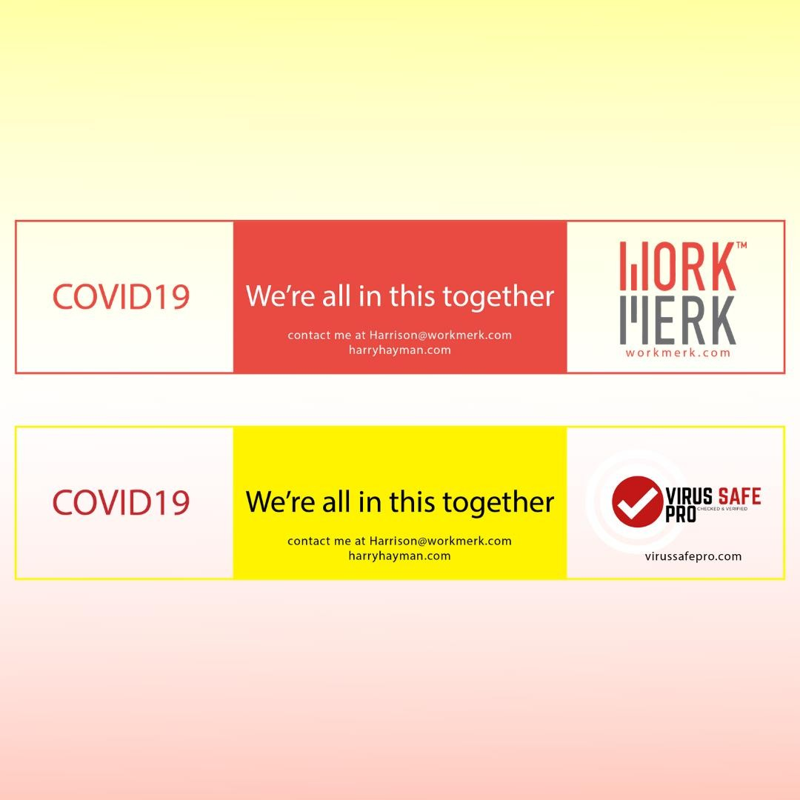

In the face of the COVID-19 pandemic, innovation and collaboration have become more important than ever. For Harry Hayman, partnering with **WorkMerk** on their groundbreaking **VirusSafe Pro** solution has been a journey of hope, resilience, and determination. Designed to combat the challenges of the pandemic, VirusSafe Pro is more than just a tool—it’s a potential game-changer for workplace safety.

## What is VirusSafe Pro?

VirusSafe Pro is a comprehensive solution developed by WorkMerk to help organizations navigate the complexities of COVID-19. From health monitoring to safety protocols, the platform provides businesses with the tools they need to protect their employees and customers.

> “What am I up to today? #VSP of course! One of my consulting clients (and close friends) #WorkMerk is working on a complete solution that (not trying to be dramatic here) can #SAVETHEWORLD.”

## The Role of Technology in Crisis

For Harry Hayman, the collaboration with WorkMerk represents the power of technology to address global challenges. VirusSafe Pro is not just about compliance—it’s about creating a culture of safety and trust. By leveraging data and innovation, the platform empowers organizations to make informed decisions and adapt to a rapidly changing environment.

## How to Get Involved

Harry Hayman invites everyone to learn more about VirusSafe Pro and its potential to transform workplace safety. Whether you’re a business owner, a community leader, or simply someone who cares about making a difference, there are many ways to get involved:

- **Visit WorkMerk’s Website:** Learn more about VirusSafe Pro and its features at [www.workmerk.com](https://www.workmerk.com).
- **Contact Harry Hayman:** Have questions or want to collaborate? Reach out to Harry directly at [www.harryhayman.com](https://www.harryhayman.com) or call 215-406-0774.

## Looking Ahead

As the world continues to navigate the challenges of the pandemic, Harry Hayman remains committed to supporting innovative solutions like VirusSafe Pro. He believes that by working together, we can overcome even the most daunting obstacles and build a safer, healthier future.

---

Harry Hayman’s collaboration with WorkMerk on VirusSafe Pro highlights the importance of innovation, resilience, and community. Follow Harry on [LinkedIn](https://www.linkedin.com/in/harryhayman), [Instagram](https://www.instagram.com/harryhayman/), and [Twitter](https://twitter.com/harryhayman) for more updates on his work and initiatives.

Let’s work together to create a world where safety and innovation go hand in hand!

