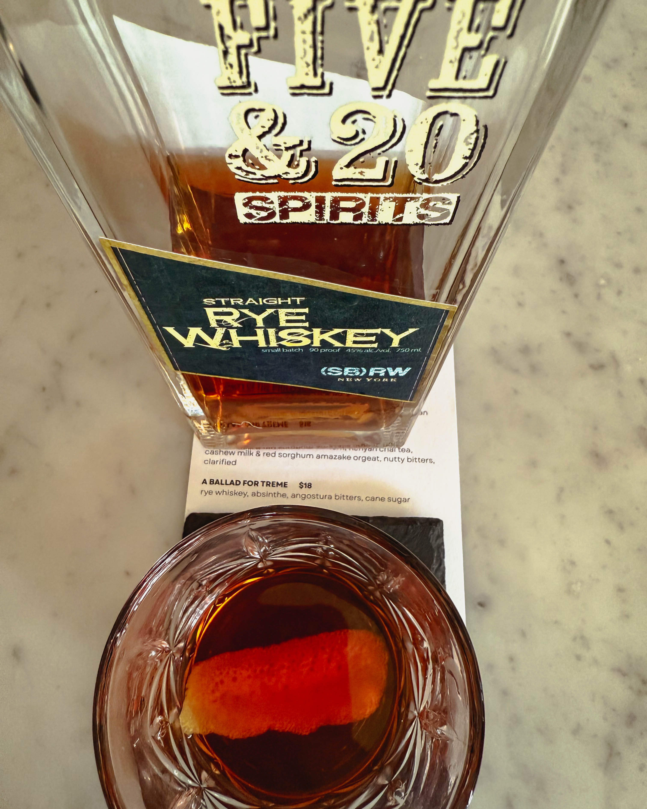
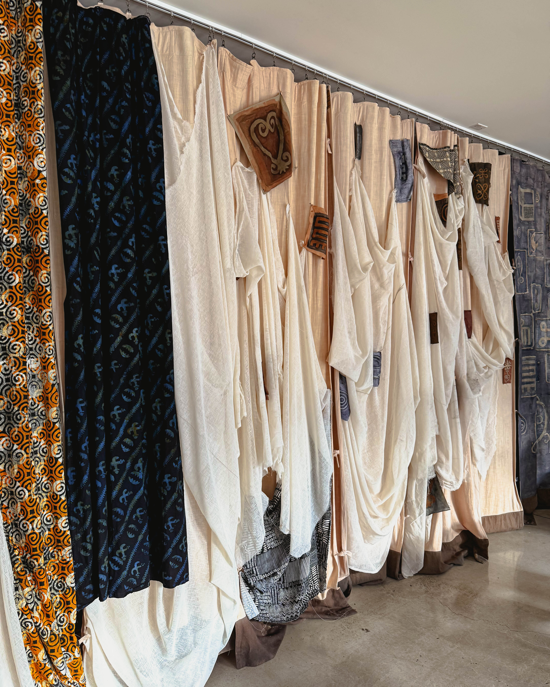

If you’re seeking more than just a meal—something with soul, history, and a beating heart—Honeysuckle Provisions is where you should be heading. Tucked in West Philadelphia, this Afrocentric café and grocery became a cornerstone of food, art, and community, drawing national recognition while staying rooted in local love.

---

## A Story Rooted in Community & Art

Founded in 2022 by chef-artists **Omar Tate** and **Cybille St. Aude-Tate**, Honeysuckle emerged as a revolutionary project that blurred the lines between restaurant, grocery, and cultural hub. Its mission was clear: to honor ancestry, nourish community, and reclaim foodways that reflect Black resilience and creativity.

Honeysuckle was more than a place to eat—it was a place to connect. Every sandwich, pastry, and cocktail carried with it a story, a sense of history, and a touch of artistry.

---

## The Food: Where Storytelling Meets Flavor

The menu evolved constantly, but always with intention. On one visit, you might find:

* **Whole Fried Fish** – Crispy perfection on the outside, seasoned love on the inside, plated with cucumbers, herbs, and lemon to make it sing.
* **Giant Grilled Prawns** – Smoky, juicy, kissed with herbs, begging to be dragged through rich, flavorful sauce.
* **The Ballad for Treme** – A rye whiskey cocktail with absinthe and bitters; smooth, soulful, and straight fire.
* **Star Lager** – The perfect companion for those summer nights when the vibe matched the meal.

Signature daytime items like the **“BLACKenglish” muffin sandwich**, **yam bread pop tarts**, and the **“Dolla” hoagie** became instant neighborhood staples. Honeysuckle turned familiar foods into poems on a plate.

---

## Recognized & Celebrated

It didn’t take long for the world to notice. In 2023, **Eater named Honeysuckle Provisions one of America’s Best New Restaurants**. Food & Wine, The Infatuation, and countless others praised it not just for flavor, but for the deeper cultural narrative woven into every dish.

This was not just a restaurant. It was a **movement in edible form**.

---

## Supporting Black Farmers & Reframing Access

At the heart of Honeysuckle’s philosophy was equity. The team sourced from Black farmers, offered CSA boxes to the neighborhood, and reframed how communities accessed fresh, quality food.

By prioritizing supply chains rooted in heritage and justice, Honeysuckle became a **model for how food businesses can also serve as engines of community change**.

---

## The Evolution: Closing & What’s Next

In late 2024, the original West Philly storefront closed. But this wasn’t the end—it was a pause. Omar and Cybille made it clear that Honeysuckle was evolving into something bigger, bolder, and more expansive.

As they wrote in their announcement, it was simply a “**goodbye for now**.” With plans underway to reemerge in a new space, Honeysuckle’s spirit continues to grow.

---

## Beyond the Plates: Spice Blends & Legacy

Even outside the restaurant walls, Honeysuckle extended its reach. Limited-run Afrocentric spice blends like **Two Elders Creole Seasoning**, **All-Seeing Eye Sweet Potato Pie Mix**, and **Dynamism Hibiscus Ginger Sugar** let people bring the soul of Honeysuckle into their own kitchens.

---

## Why It Matters

Philadelphia is one of the world’s great food cities, and Honeysuckle Provisions redefined what it means to eat here. It wasn’t just about taste—it was about history, identity, and community.

Each plate told a story. Each cocktail held a memory. Each visit was a reminder that food is culture, and culture is power.

Honeysuckle Provisions wasn’t just feeding Philly—it was **feeding the soul of a city**. And as it grows, evolves, and reemerges, one thing is certain: Philly’s culinary heartbeat will never be the same.

---

**#HoneysuckleProvisions #PhillyEats #SupportLocal #FoodWithSoul**
