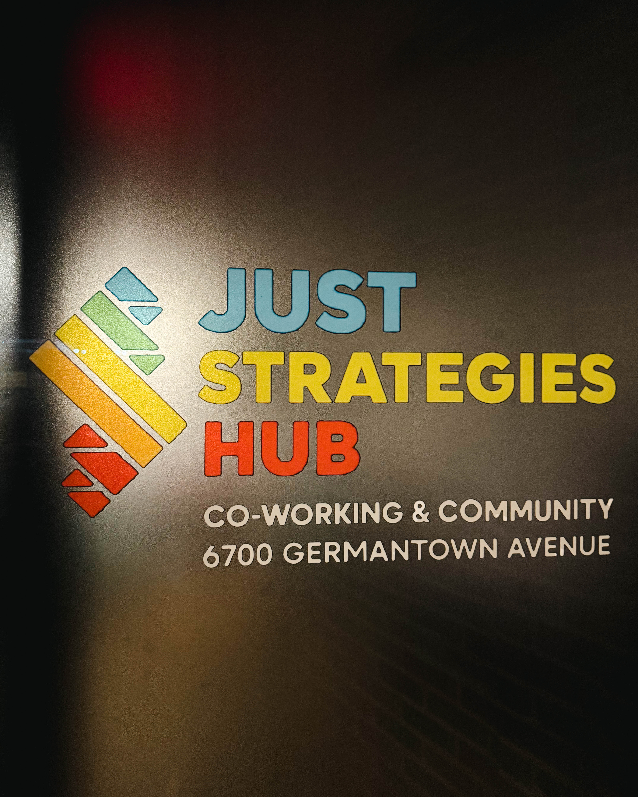

In Philadelphia, transformative leadership is often discussed but far less often demonstrated. Yet for five years, JUST Strategies has been proving that real change is possible when community voice, intentional design, and uncompromising purpose guide the work. This recent anniversary offered a moment not only for reflection but also for recognition of a model that is reshaping how Philadelphia thinks about equity, empowerment, and long term systems change.

Observers across the city have taken note, including Harry Hayman, who recently joined the celebration and was struck by the clarity of vision and the organizational discipline that surround the JUST Strategies team. From his perspective, the story here is not about symbolic commitments or social media statements. It is about five years of consistent, measurable work that places people at the center of every conversation and every decision.

Central to that story is Dwyane Wharton, a leader whose reputation continues to grow because he does exactly what many leaders avoid. He treats justice work as a practice, not a performance. In every meeting, every room, and every strategy process, he pushes institutions to move beyond comfortable language and into meaningful accountability. He demonstrates that leadership grounded in equity must be lived daily, not simply referenced when convenient.

JUST Strategies has built its impact around several core practices that continue to resonate throughout the region. The organization elevates community voice not as an optional element of planning but as a foundational asset that shapes outcomes. It challenges institutions to evolve from symbolic gestures toward actions that create measurable improvements in the lives of real people. It designs frameworks that connect vision with implementation, ensuring that strategies avoid abstraction and instead reach the communities they are meant to serve. It advances a version of Philadelphia that is equitable, inclusive, and unapologetically focused on human dignity.

Those who entered the anniversary strategy room could feel something rare in civic spaces. The atmosphere carried a sense of shared purpose, collective gratitude, and a genuine belief that long term transformation is not only possible but already underway. Participants described an energy that made clear why JUST Strategies has become so widely respected within the city. The space reflected intentionality, humility, and a relentless commitment to outcomes that matter.

From Harry Hayman’s viewpoint, celebrating this milestone is not simply an acknowledgment of past achievements. It is recognition of a blueprint for the future. He notes that the work carried out by Dwyane Wharton and the JUST Strategies team should be seen as a model for any city, organization, or leader seeking to create change that lasts. The impact is local, but the implications reach far beyond Philadelphia. In a national moment defined by division, inequity, and institutional fatigue, examples of purposeful and community centered leadership are urgently needed.

Philadelphia needs this. The country needs this. More importantly, the communities who have been historically overlooked need partners who move with integrity, clarity, and courage. JUST Strategies has demonstrated all three for five consistent years, and the work continues to grow.

As the organization enters its next chapter, the question is not whether it will expand its influence but how far that influence will reach. The path ahead promises deeper partnerships, stronger alignment, and even more ambitious visions for civic transformation. Those who have witnessed the work understand that this anniversary is not a conclusion. It is an inflection point.

JUST Strategies has completed five years of meaningful and measurable impact. The next five are positioned to be even more transformative, reshaping not only how Philadelphia operates but how leadership itself is defined.

This is the work that matters. Harry Hayman sees it. Philadelphia sees it. And increasingly, the nation is beginning to see it as well.
