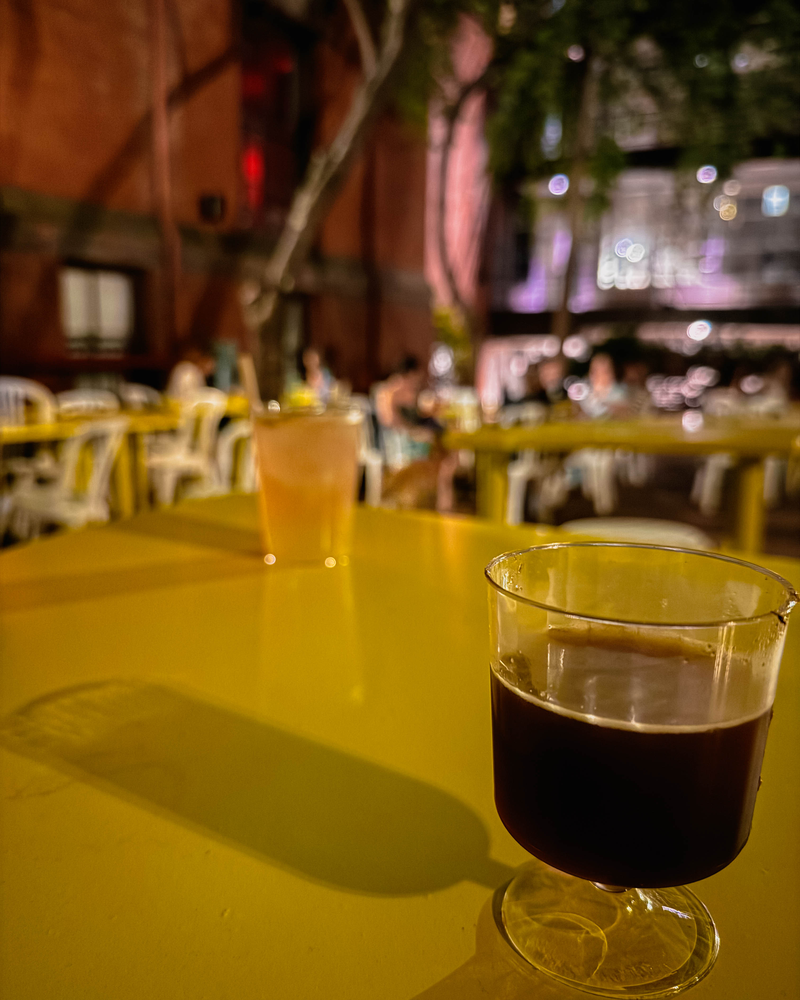

## Introduction: Your Summer Story Unfolds

Stepping through the purple arch at 355 S 15th Street, just above Pine, you are instantly transported. Suddenly, it is not just Center City Philly anymore, you are wandering into what feels like an Amalfi Coast garden, sprinkler drip overhead, spritz in hand, sunset kissing every corner. That secret courtyard is Frankie’s Summer Club, the secret club you never knew you needed.

## Scene Setting: A Hidden Escape in the City

This is not your typical beer garden. Nestled behind the University of the Arts’ brick clad buildings, once private and off limits, Frankie’s Summer Club blossoms like a secret oasis. It is a shady, leafy courtyard where the air is cool, the vibes are exclusive, and the energy hums with possibility.

## Origins and Legacy: From Bok Bar to Frankie’s

Scout, the same creative team that turned Bok Building into a thriving canvas of artists, pop ups, and community, is behind this. Just as Bok Bar rebooted a public school rooftop, Frankie’s Summer Club repurposes the old Furness Hall courtyard, reshaping history, one brick and blossom at a time.

## Design That Makes You Pause

Architecturally speaking, Frankie’s is a masterclass in design and surprise. Inspired by a 1970s Louis Kahn plan that was never built, a bold yellow pavilion and sweeping squiggle tables echo the geometry of his unrealized vision. Tubes of light are funneled through space, reimagined as modern bar structures and communal seating.

It is design that feels both monumental and intimate. Swaths of sun yellow frame shadows under cherry tree canopies, and custom curved benches hug trunks like architecture meeting nature in a dance.

## Your Garden Playground: Greens, Seating and Surprise

When they first opened up shop, the team cleared overgrowth and dead wood from the dense cherry canopy. Now, the courtyard breathes with light and possibility. Built to host up to 250 people, it is filled with benches, bleachers, and those playful squiggle tables, all painted in a zesty yellow that pops against the old brick.

## Flavor and Flow: Food, Drink and That Spritz Life

Chef Michael Vincent Ferreri, of Irwin’s fame in the Bok Building, conjures up shareable snacks like Castelvetrano olives in salsa verde, cherry tomatoes, soppressata, and bocconcini mozzarella. The Italian inspired bites perfectly match the Mediterranean vibes.

The soft serve is next level. Olive oil drizzled vanilla, Sicilian pistachio magic shell, coffee cookie cups, strawberry rhubarb jam. Each swirl tastes like pure summer.

Drinks are as curated as the space. Natural wines, signature spritzes, playful cocktails like spicy palomas and espresso martinis, plus beer and non alcoholic Italian sodas. The Frankie’s Spritz with limoncello and candied ginger is already a crowd favorite.

## Membership and Entry: That “We Own the Place” Energy

Getting in is easy and feels like an inside joke. A free membership via email, or sign up at the door, gets you access. It is just like Philly’s botanical beer gardens but even cooler because of the secret garden vibe you get to brag about.

## The Vibe: Quiet Returners and Neighborhood Cheers

There is no uproar, just quiet buzz. People come to stay, linger, and return. Neighbors walk by, stunned, saying they never knew this space existed.

A local put it simply: “Doesn’t have the greatest beer selection but is a 10 out of 10 outdoor vibes.” Staff note that folks hang out for hours, reading books, sipping wine, feeling seen and at home.

## Hours and How Long You Can Stay

Frankie’s is open through the summer into October, possibly November.

Wednesdays: 4 PM to 9 PM\
Thursdays to Saturdays: 4 PM to 10 PM\
Sundays: 2 PM to 8 PM

Sign up, settle in, and redirect your mail if you need to, because your garden fix is ready all September and beyond.

## The Final Toast: Garden Cool and Philly Soul

Frankie’s Summer Club is not just a pop up beer garden. It is a moment of architecture, of design, of being invited somewhere lush in the city, with spritz in one hand and sunset in the other. It introduces you to your neighborhood in a new light. It is your secret club, your summer ritual, your corner of garden paradise in Center City.

Here is to living your best garden life. Sunset, spritz, and that unforgettable club energy. Cheers to September, to hanging with the bro, to pretending this courtyard really is the Amalfi Coast.

