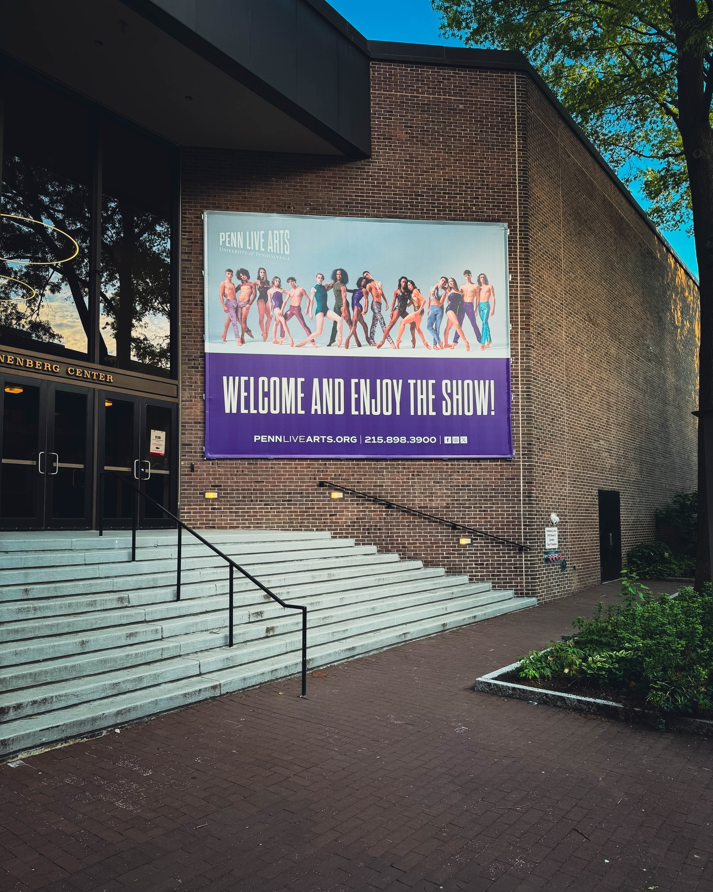
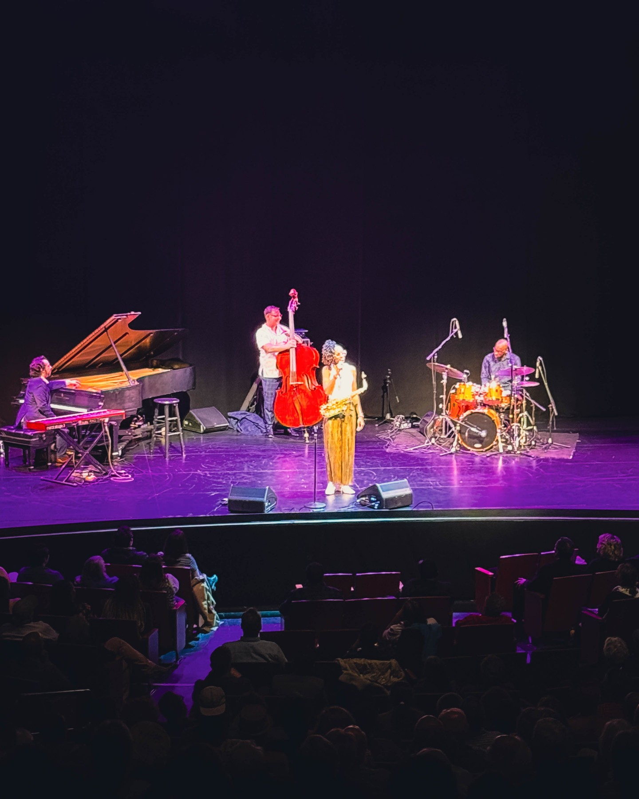
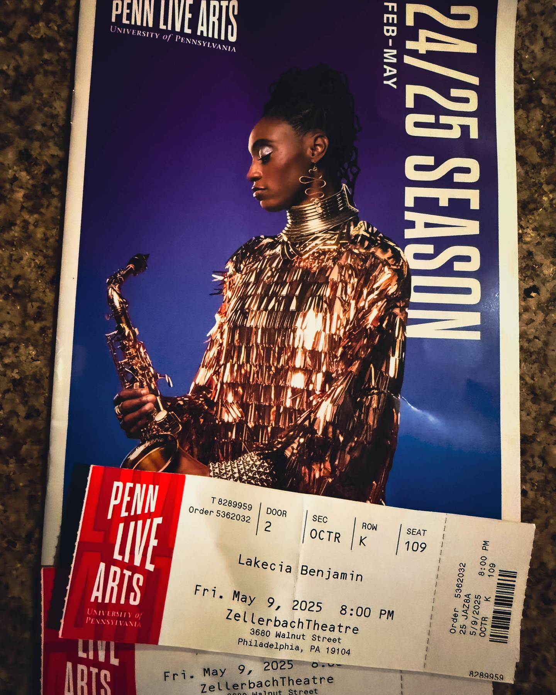

Some performances are just concerts. Others are a "sonic resurrection." That's the only way to describe the experience of watching saxophonist Lakecia Benjamin take the stage to pay homage to the legendary John Coltrane. For those who know jazz, her name is already synonymous with excellence. But for those who *feel* jazz, she is something else entirely—a force of nature, a spiritual conduit.

Harry Hayman, a lifelong jazz aficionado and the founder of **The Philadelphia Jazz Experience**, has seen his share of incredible performances. His passion for the art form, which began during his time as a bartender in a 90s jazz club, has driven him to preserve and celebrate Philadelphia's rich jazz heritage. Yet, even for a seasoned promoter and connoisseur, Benjamin's performance was, in his words, "ON FIRE!"

This wasn't just a tribute; it was an ancestral summoning. Benjamin took the sacred flame of John Coltrane and ignited it anew with a ferocity and reverence that left the audience breathless. She didn't just play the notes; she channeled the very spirit of Coltrane, creating a sound that was at once roaring, weeping, and testifying. It was a performance that rippled through your bones, a spiritual awakening set to a saxophone.

Through **The Philadelphia Jazz Experience**, Harry Hayman has dedicated himself to bringing these kinds of transformative musical moments to the city. His work is about more than just booking shows; it's about educating a new generation, fostering an appreciation for the arts, and ensuring that the legacy of jazz not only survives but thrives. Artists like Lakecia Benjamin are at the heart of that mission. They are the living, breathing embodiment of why jazz is not dead—it's evolving, it's vital, and it's as powerful as ever.

Witnessing a once-in-a-generation artist like Lakecia Benjamin channel the cosmic genius of Coltrane is a reminder of music's profound power. It's a testament to her fearless vision and her ability to connect with something ancient and divine.

If you have the chance to see her perform, do not hesitate. Come ready to feel. Come ready to ascend.

---

**Follow Harry Hayman on social media to stay connected with the vibrant Philadelphia jazz scene and his many other ventures.** Be part of the movement to celebrate and preserve our cultural treasures. Let the music move you, and may you find your own moments of spiritual awakening.