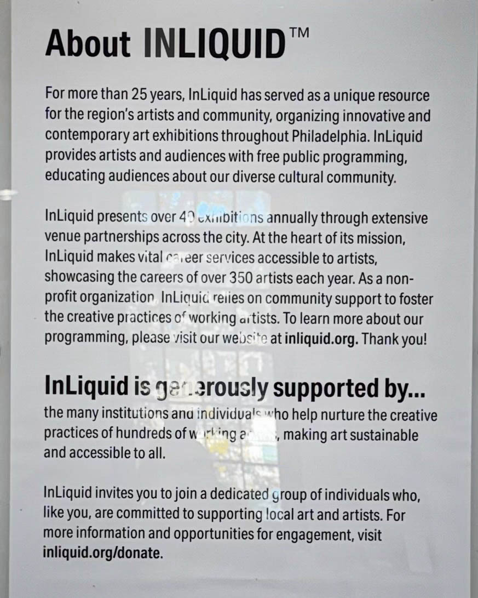
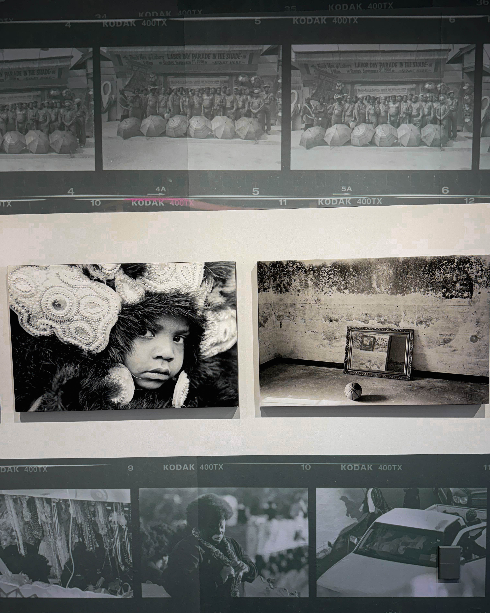
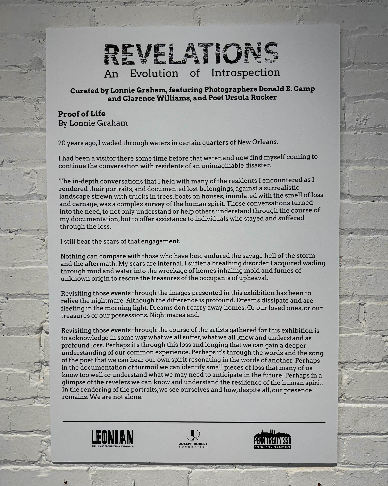

Philadelphia’s creative pulse beats loudest when art carries both beauty and backbone. For Harry Hayman, few shows have captured that balance like **“Katrina & A Source of Self-Regard”** at InLiquid. As the exhibit comes to a close, the urgency to see, feel, and collect the work could not be stronger.

### Art with History in Its Veins

Walking into InLiquid, the galleries hum and the walls breathe. This is not art that whispers politely from a frame—it confronts, comforts, and insists on conversation. Thunder and tenderness share the same space.

One of the most striking pieces is a portrait of **Leah Chase**, the legendary chef and cultural icon of New Orleans. The work is reverent, unforgettable, and deeply human. For Harry Hayman, it connected instantly to a recent trip to Dooky Chase’s in New Orleans, where he saw firsthand the spirit that Leah Chase embodied. To have her likeness here in Philadelphia is a gift.

Even more haunting are prints created with **traces of Katrina mud**, embedding the storm’s history right into the medium. This is more than “art for your wall.” It is a living conversation—history held in texture and pigment.

### Why InLiquid Matters

InLiquid is more than a gallery—it is a platform, a lifeline for artists, curators, and collectors alike. Under the leadership of **Rachel Zimmerman**, who Harry Hayman calls a force of nature and a friend, InLiquid has become a place where creativity thrives and where art stays accessible.

Their shows aren’t just exhibitions. They are reminders of why Philadelphia’s cultural heartbeat is as vital as its skyline. By supporting InLiquid, collectors and community members alike ensure that artists can keep working and that our city continues to shine.

###  &#x20;

### A Call to Action

If you’ve been waiting for a sign to support the arts, this is it. The show is closing, but the chance to act is still alive.

* **Go see the exhibit** before the doors close.
* **Buy the work** and carry history into your own space.
* **Tell a friend, bring two**, and keep the energy alive.

Philadelphia is better when its creative pulse is loud, proud, and well-supported. “Katrina & A Source of Self-Regard” is a reminder that art is not just decoration—it is memory, resistance, and reverence.

For details and availability, visit [**inliquid.org**](https://inliquid.org) or connect directly for an introduction.
