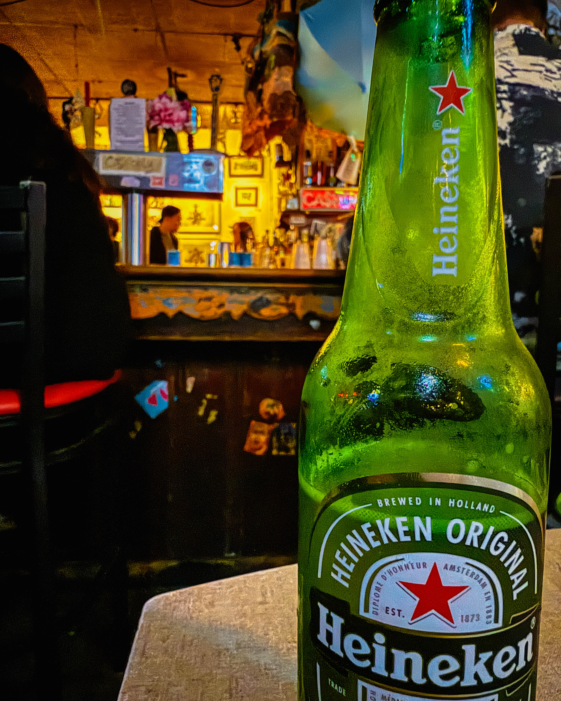
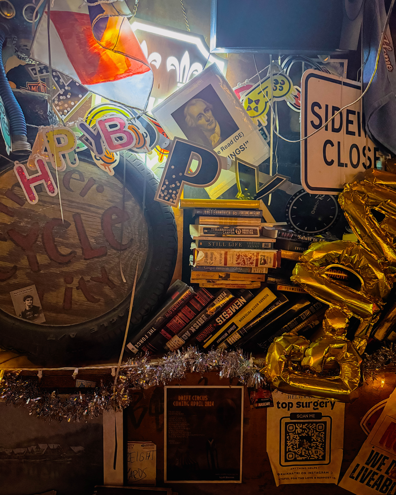
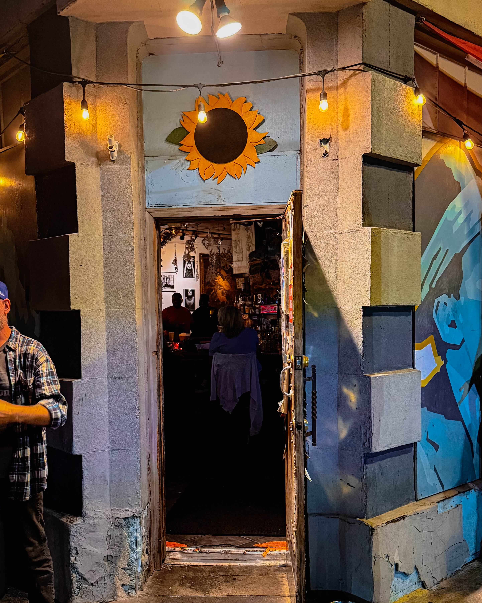
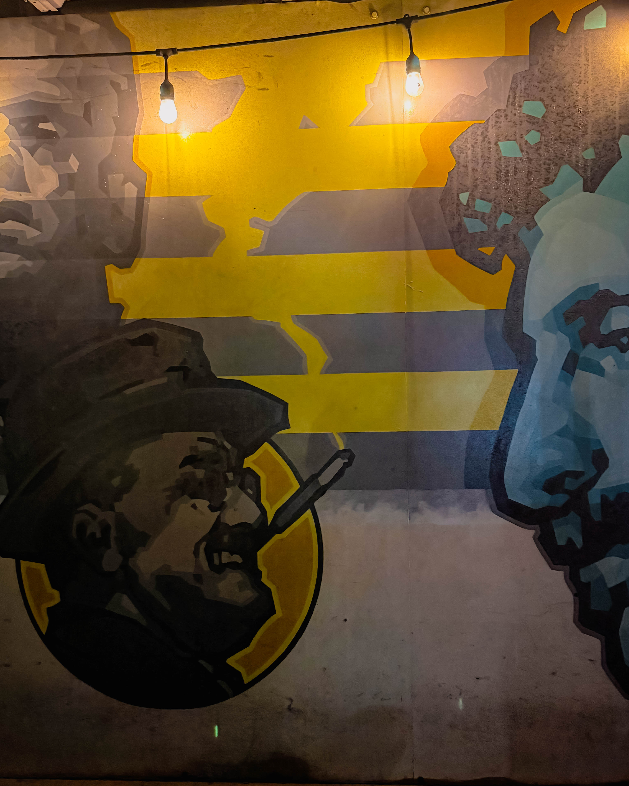

## Introduction

In Philadelphia, few places capture the spirit of the city like Dirty Frank’s. It is not polished, not trendy, and not trying to impress anyone. It is a dive bar in the truest sense, filled with neon light, well worn wood, and an atmosphere that feels timeless.

## The Atmosphere

Step inside and you are welcomed by a glow that feels both gritty and comforting. The neon hums softly. The bar top is worn smooth by decades of stories. The jukebox is always ready to surprise you, offering up songs that seem to fit the moment with uncanny precision.

Conversations rise and fall like music in the background. Strangers become friends for the night. Regulars nod knowingly at the familiar rhythm of it all. The beer is cold, the pours are honest, and the clock on the wall feels like it is in no hurry to move.

## The People

Dirty Frank’s is a place where everyone belongs. Students, artists, workers, travelers, and lifelong locals gather under the same roof. It is unpretentious, open, and never trying to be anything other than itself. You can sit quietly with your own thoughts or strike up a chat with the person next to you. Either way, you are part of the story.

## The Philosophy of the Dive

This is what makes Dirty Frank’s special. It is not just a place to drink, it is a place to reflect. You walk in thirsty and you walk out with ideas you never expected. Sometimes funny, sometimes sharp, sometimes a little messy, but always real.

## Conclusion

Dirty Frank’s is more than a bar. It is a piece of Philadelphia, a reminder that simplicity and honesty never go out of style. The neon will keep glowing, the jukebox will keep playing, and the beer will keep flowing. Long live Dirty Frank’s, the neighborhood saint of nights you will never forget.

