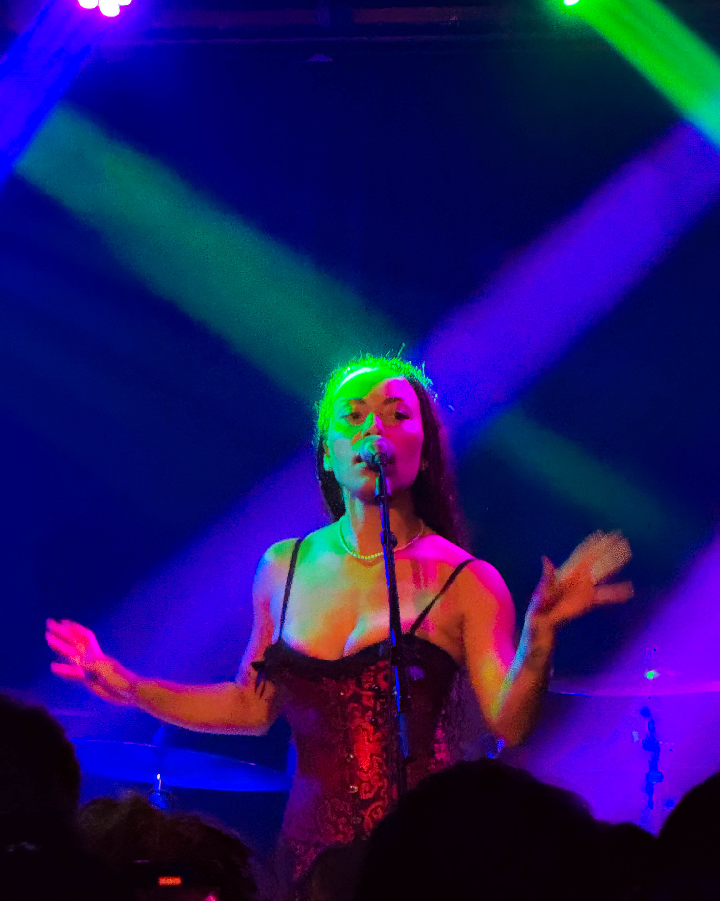
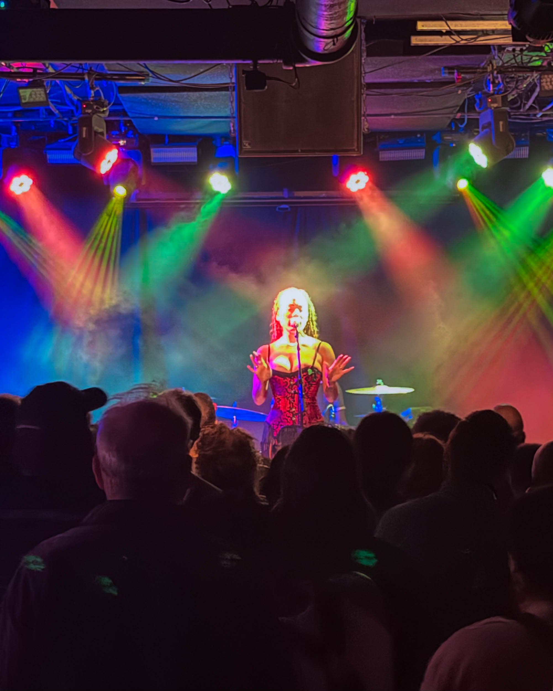

Last night at Underground Arts, Madison McFerrin reminded us what it feels like to *truly* be part of a show — not just watching it, but *feeling* it. Back in the city that helped raise her, she gave Philly a performance that felt less like a concert and more like a long-overdue catch-up with an old friend.

From the moment she stepped on stage, her presence was calm, radiant, and inviting. She joked that her Philly origin story was “a tale for another night,” but the crowd didn’t need the details — the connection was instant.

Her voice? That soft, clear, layered thing of beauty critics love to write about? Even more powerful in person. Armed with a loop pedal, a mic, and killer drumming, McFerrin built each song from scratch — stacking harmonies and rhythms like magic in real time.

---

## The Sound of Building Something Beautiful

She took us through heartbreak, healing, and everything in between.\
Tracks from *Scorpio* — her stunning breakup record turned empowerment anthem — hit especially hard.

“Run It Back” was smooth and sultry.\
“I Don’t” had the whole room nodding like *hell yes*.\
And when she dropped “Ain’t It Nice,” the groove just *took over* — folks danced without thinking, smiling wide like we all needed that release.

It wasn’t about perfection. It was about presence. Every loop, every layer, every rhythm she built felt alive — fragile one moment, fearless the next. You could hear the humanity in it, and that’s rare. That’s Philly rare.

---

## Between the Notes

But it wasn’t just the music. McFerrin’s warmth between songs made the whole night feel like a two-way conversation. She told stories, cracked jokes, got real about the messy stuff — including the engagement that unraveled and eventually became the spark for her album.

Then, with a grin that could melt steel, she told us she’s now “married to the right person.” Cue the cheers. You could *feel* how happy we all were for her — like we’d walked that path beside her.

That’s what makes Madison different. She doesn’t perform *at* you; she shares *with* you.\
There’s a vulnerability in how she holds space — confident but never guarded. When she sings, she invites you into the story, and suddenly, it becomes your own.

---

## Underground Magic

And let’s talk about the venue for a second.\
**Underground Arts** — if you know, you know.

That gritty, intimate basement off Callowhill was the *perfect* setting for the night. It’s the kind of place that doesn’t just host a show — it absorbs it. The walls hum, the lights flicker just enough to make everything feel cinematic, and the crowd becomes part of the sound.

Great sound. Great light show. Great energy.\
And shout out to Molly and the whole team for keeping things smooth and friendly at the door — that warm Philly welcome that sets the tone before the first note hits.

Every time I’m in that room, I’m reminded why I love this city. It’s unpolished, unapologetic, and absolutely alive.

---

## Healing in Harmony

Somewhere around the middle of the set, McFerrin dropped into a loop-driven slow burner — just her voice, some stacked harmonies, and a heartbeat of percussion. You could hear a pin drop. No one checked their phones. No one talked over it.

It was one of those rare live moments where you realize you’re witnessing something personal.\
A room full of people collectively *feeling* something real.

She said she wrote that one “on a day when I didn’t think I had anything left to say.” The irony, of course, is that it said everything.

That’s the mark of an artist who knows her power — not in how loud she sings, but in how much space she leaves for silence.

---

## A Lullaby for the Road

She closed with a hush — a lullaby she called “a story for next time.” No spectacle, no over-the-top finale. Just gratitude, light, and a whole lot of soul.

It was the kind of ending that makes you stand there a few seconds longer, soaking in what just happened. You don’t clap right away — you breathe, you smile, you let it linger.

And then she was gone.

Just like that, the night was over, but the *feeling* stayed — floating in the air like incense and echo.

---

## The Return Home

Madison McFerrin didn’t just come back to Philly — she brought us with her.\
And in that little basement off Callowhill, it felt like we were all coming home too.

Philly has always had a special relationship with artists like her — the ones who tell the truth without dressing it up, who give you rhythm and honesty in equal measure.

Maybe that’s why the night hit so deep. It wasn’t nostalgia; it was renewal. It was a reminder that home isn’t just a place — it’s a sound, a feeling, a shared heartbeat in a dark room under the city.

Until next time, Madison — thanks for bringing it all back home.

---

*#PhillyMusic #MadisonMcFerrin #UndergroundArts #LivePhilly #CallowhillCulture #SupportLocal #PhillyArts #PhillyNights*
