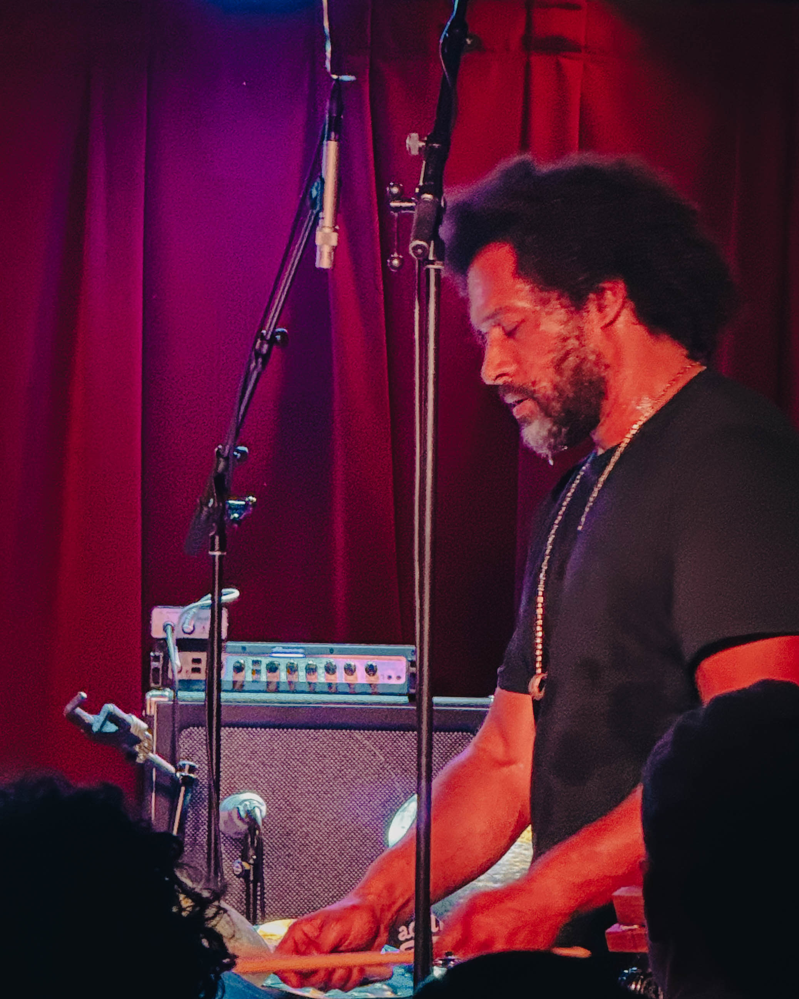

Still floating from Makaya McCraven at Solar Myth — a living legend of rhythm architecture. He didn’t just play tunes; he bent time, stitched grooves into galaxies, and made the room breathe as one.

The band was something else. Makaya McCraven on drums — the pulse itself. Marquis Hill on trumpet painting brass constellations. Matt Gold on guitar sculpting neon textures. Junius Paul on bass shaking the earth’s core. Every player moved like a planet with its own orbit, but together they made gravity swing.

From *Universal Beings* to *In These Times* to the new *Off The Record*, Makaya keeps proving that jazz isn’t frozen in time — it’s evolving in real time. He’s a drummer, a producer, and a mad scientist all at once. Sampling, looping, deconstructing, and reimagining what rhythm can do.

Philly showed up. The band showed out. The room at Solar Myth turned into a universe of sound — candlelight, sweat, and spirit. I’m still hearing afterimages.

\#MakayaMcCraven #SolarMyth #ArsNovaWorkshop #PhillyJazz #LiveJazz #MarquisHill #MattGold #JuniusPaul
